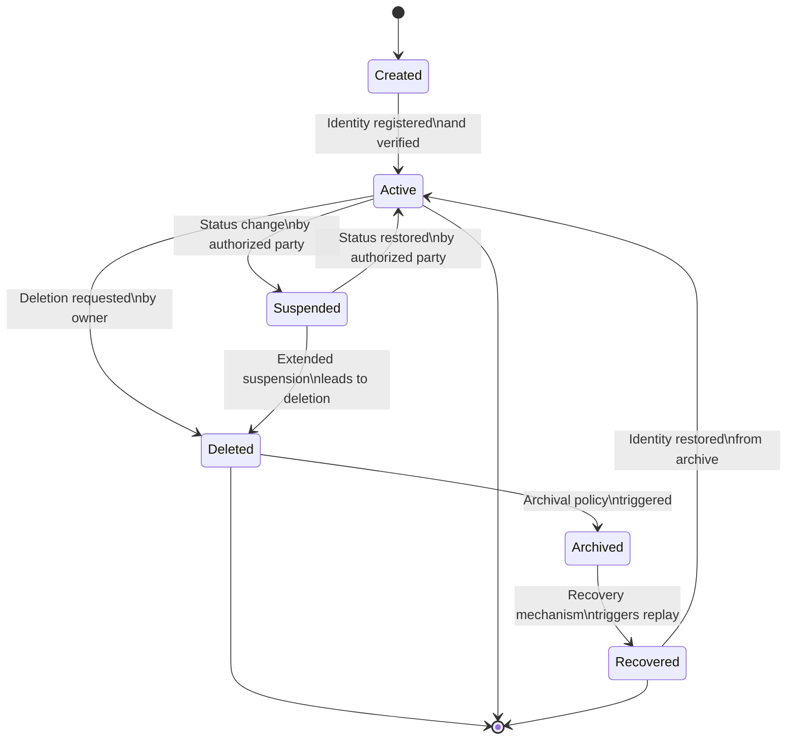
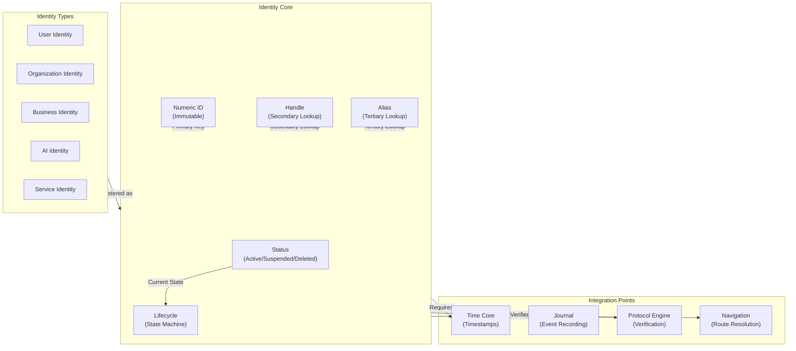

# 31. SO8FI Identity Core Standard

**Status:** Constitutional Engineering Standard  
**Version:** 1.0  
**Owner:** SO8FI Architecture  
**Classification:** Immutable Platform Specification  
**Effective Date:** 2026-07-04  
**Scope:** Platform-wide identity architecture  

---

## 1. Purpose

### 1.1 Why Identity Core Exists

Identity Core is the immutable foundation of the SO8FI Operating System. It exists because every platform participant—user, organization, business, AI, or service—must have a verifiable, continuous, persistent digital identity that cannot be disputed, duplicated, or confused.

Identity Core is **not a user database, authentication service, or access control system**. It is the authoritative digital identity registry that all other platform capabilities depend upon.

### 1.2 Why Identity is Constitutional

The entire SO8FI Operating System is built on a principle: **Identity Before Permissions**.

This means:

- Identity exists first.
- Permissions are derived from identity.
- All platform operations are traced to an identity.
- All audit trails are rooted in identity.
- All governance decisions reference identity.

Without a constitutional Identity Core, the platform cannot be:

- Auditable (who did what?)
- Governed (who has authority?)
- Recoverable (whose state belongs to whom?)
- Trustworthy (can we verify who is who?)
- Legal (can we prove consent?)

Identity Core makes all of these possible.

### 1.3 Scope and Independence

Identity Core defines:

- How identities are created, recognized, and verified.
- How digital identity persists across time and platform evolution.
- How identity relates to continuity, ownership, and trust.
- How identity integrates with every other platform capability.

Identity Core does NOT define:

- Business roles or permissions.
- Access control rules.
- User preferences or configuration.
- UI representations or personalization.
- Marketplace participation or transactions.

Identity Core is independent from business modules. Business modules depend on Identity Core; Identity Core does not depend on business modules.

---

## 2. Responsibilities

Identity Core is responsible for:

### 2.1 Identity Registration

Identity Core creates and registers identities. Registration:

- Creates a unique, immutable digital identity.
- Assigns a numeric ID that never changes.
- Records the registration timestamp.
- Journals the registration event as a legal event.
- Establishes the identity's initial status.

**Scope:** One-time, immutable identity creation.

### 2.2 Identity Recognition

Identity Core recognizes and retrieves identities by:

- Numeric ID (primary lookup).
- Handle (secondary lookup).
- Alias (tertiary lookup).
- All lookups are deterministic and produce same result.

**Scope:** Identity discovery and verification.

### 2.3 Identity Verification

Identity Core verifies that an identity:

- Exists in the registry.
- Is in valid status.
- Has not been deleted or suspended.
- Matches the provided identifier.

**Scope:** Identity validation for all platform operations.

### 2.4 Digital Identity Persistence

Identity Core preserves identity across:

- Time (the identity persists from registration forward).
- State changes (status transitions do not change the numeric ID).
- Module evolution (identity remains the same across platform versions).
- Recovery scenarios (identity is restored from journal).

**Scope:** Continuous identity continuity and immutability of identity ID.

### 2.5 Authentication Foundation

Identity Core provides the foundation for authentication:

- It stores identity attributes used for recognition.
- It does NOT store passwords, keys, or secrets.
- It provides identity for authentication services to verify against.

**Scope:** Identity-based authentication foundation (not the authentication mechanism itself).

### 2.6 Authorization Foundation

Identity Core provides the foundation for authorization:

- It stores identity kind (user, organization, business, AI, service).
- It stores identity ownership relationships.
- Authorization policies use identity to make access decisions.

**Scope:** Identity-based authorization foundation (not the authorization mechanism itself).

### 2.7 Trust Establishment

Identity Core establishes initial trust:

- Identity is created and verified once.
- The numeric ID becomes a trust anchor.
- All subsequent operations reference this immutable ID.
- Trust is built on identity continuity.

**Scope:** Identity as the root of trust relationships.

### 2.8 Identity Lifecycle Management

Identity Core manages the complete identity lifecycle:

- Registered: newly created
- Active: available for operations
- Suspended: temporarily unavailable
- Deleted: removed from active use
- Recovered: restored from archive
- Archived: historical preservation

**Scope:** Identity state transitions and journaling.

### 2.9 Identity Event Recording

Identity Core records all identity events:

- Registration events (legal classification).
- Status transition events (audit classification).
- Verification events (operational classification).
- Recovery events (system classification).

**Scope:** Immutable audit trail of identity operations.

### 2.10 Identity Ownership

Identity Core maintains identity ownership:

- Every identity has an owner (the identity itself or a delegated entity).
- Ownership is immutable for certain event types.
- Ownership changes are journaled.
- Ownership is the basis for personal domain (User Cabinet, Organization Cabinet, etc.).

**Scope:** Identity ownership relationships and delegation.

---

## 3. Immutable Laws

The following laws are immutable and constitute the architectural law of the SO8FI Identity Core. No implementation, administrator, or external system may violate these laws.

### 3.1 Law of Singular Identity

**Law:** One numeric ID = one unique digital identity.

**Invariant:** Every registered identity has exactly one numeric ID that never changes. Multiple lookups by handle, alias, or email return the same numeric ID. Duplicate identities are forbidden.

**Consequence:** If a numeric ID is duplicated, identity coherence is lost and recovery is required.

### 3.2 Law of Identity Immutability

**Law:** Identity numeric ID is immutable.

**Invariant:** Once an identity is created with a numeric ID, that ID cannot be changed, reused, or reassigned. The numeric ID persists for the lifetime of the identity (including after deletion or archival).

**Consequence:** If an identity ID changes, the identity has been destroyed and replaced with a different identity.

### 3.3 Law of Identity Persistence

**Law:** Identity persists across state transitions.

**Invariant:** An identity's numeric ID remains the same when the identity changes status (active, suspended, deleted). Status is a separate attribute; it never changes identity.

**Consequence:** Status changes are transparent to identity verification; the identity remains the same.

### 3.4 Law of Identity Continuity

**Law:** Identity provides continuity across time and recovery.

**Invariant:** An identity is the same at time T1 and time T2, even if the platform was shut down, recovered, or migrated. Recovery reconstructs identity from the journal; identity is not invented or recreated.

**Consequence:** Replayed identities are identical to the original identities; recovery preserves identity coherence.

### 3.5 Law of Single Registration

**Law:** An identity is registered exactly once.

**Invariant:** An identity cannot be registered twice. An identity cannot be re-created if deleted. Once registered, the registration is permanent and immutable.

**Consequence:** If an identity is re-created or registered twice, the platform has violated the law.

### 3.6 Law of Identity Authority

**Law:** Only Identity Core may create, modify, or delete identities.

**Invariant:** Business modules, external systems, or administrator tools cannot create identities directly. All identity operations flow through Identity Core. There is no mechanism to bypass Identity Core for identity operations.

**Consequence:** If an identity is created outside of Identity Core, it is not a valid platform identity.

### 3.7 Law of Identity Authenticity

**Law:** Identity cannot be spoofed or impersonated.

**Invariant:** The numeric ID is the only authoritative way to reference an identity. Handles and aliases are secondary; they always resolve to the same numeric ID. An identity cannot claim to be a different numeric ID.

**Consequence:** If an identity can be spoofed, trust is destroyed and recovery is required.

### 3.8 Law of Administrative Immutability

**Law:** Administrators cannot override identity laws.

**Invariant:** The following operations are forbidden for all roles (administrators, operators, owners):

- Deleting identity numeric IDs.
- Changing identity numeric IDs.
- Creating duplicate identities.
- Bypassing Identity Core registration.
- Manually editing identity records.

**Consequence:** If identity laws are overridden, identity coherence is destroyed.

### 3.9 Law of Identity Traceability

**Law:** Every identity event is traced and journaled.

**Invariant:** Every identity operation (registration, status change, verification) is recorded in the journal with a timestamp and legal classification. Identity events cannot be deleted or modified.

**Consequence:** Identity operations are auditable and verifiable forever.

### 3.10 Law of Identity Ownership

**Law:** Every identity has an owner.

**Invariant:** Every identity has a documented owner (the identity itself, a delegated administrator, or a parent organization). Ownership changes are journaled. Ownership is used to determine governance authority.

**Consequence:** If ownership is unclear, governance breaks down.

---

## 4. Identity Lifecycle

Every digital identity follows a defined lifecycle managed by Identity Core.



### 4.1 Stage: Created

**Condition:** Identity registration request is accepted.

**Actions:**
- Numeric ID is assigned.
- Registration timestamp is recorded.
- Identity kind is established (user, organization, business, AI, service).
- Initial status is set to "created".
- Registration event is journaled as legal event.

**Responsibility:** Identity Core

**Duration:** Instantaneous

**Next Stage:** Active

### 4.2 Stage: Active

**Condition:** Identity is registered and verified.

**Actions:**
- Identity becomes available for platform operations.
- Authentication and authorization checks can proceed.
- Identity can participate in transactions and relationships.
- Status is marked as "active".

**Responsibility:** Identity Core

**Duration:** From registration forward

**Transition:** To Suspended or Deleted

### 4.3 Stage: Suspended

**Condition:** Authorized party requests status suspension.

**Actions:**
- Identity remains in registry but becomes unavailable.
- Operations referencing this identity are rejected.
- Status is marked as "suspended".
- Suspension event is journaled as audit event.

**Responsibility:** Identity Core + Authorization

**Duration:** Until restoration or deletion

**Next Stage:** Active (if restored) or Deleted (if extended)

### 4.4 Stage: Deleted

**Condition:** Authorized party requests identity deletion.

**Actions:**
- Identity is marked as deleted.
- Identity remains in registry for audit purposes.
- New operations cannot reference deleted identity.
- Deletion event is journaled as legal event.
- Identity moves to archive policy queue.

**Responsibility:** Identity Core

**Duration:** Until archival or recovery

**Next Stage:** Archived

### 4.5 Stage: Archived

**Condition:** Retention policy expires for active use.

**Actions:**
- Identity is moved to archive storage.
- Identity remains searchable for audit purposes.
- Identity can be recovered if required.
- Archive event is journaled.

**Responsibility:** Archive system

**Duration:** Per retention policy

**Next Stage:** Recovered or [End]

### 4.6 Stage: Recovered

**Condition:** Recovery mechanism replays archived identity.

**Actions:**
- Identity is restored from archive.
- Numeric ID remains the same.
- Status is restored to pre-deletion state.
- Recovery event is journaled.

**Responsibility:** Recovery system

**Duration:** During recovery process

**Next Stage:** Active

---

## 5. Digital Identity

### 5.1 Identity Attributes

Every identity has:

- **Numeric ID:** Immutable, unique numeric identifier
- **Handle:** Unique text identifier (e.g., "so8fi", "alice", "acme-corp")
- **Alias:** Display name or common reference (e.g., "architect", "co-founder")
- **Kind:** Classification (user, organization, business, AI, service)
- **Registered At:** ISO 8601 timestamp of registration (immutable)
- **Status:** Current state (created, active, suspended, deleted, archived, recovered)
- **Owner:** Delegated authority (may be the identity itself)

### 5.2 Identity Types

| Type | Definition | Example |
|---|---|---|
| **User Identity** | Individual human participant | Person with name, email, phone |
| **Organization Identity** | Group, institution, collective | Non-profit, NGO, company |
| **Business Identity** | Economic participant or legal entity | Sole proprietor, business |
| **AI Identity** | Intelligent capability or agent | Bot, automated service |
| **Service Identity** | Platform service or capability | System service, module service |

### 5.3 Identity Relationships

Identities can have relationships:

- Parent-child (Organization owns User)
- Delegation (User delegates to another User)
- Trust (Identity trusts another Identity)
- Ownership (Identity owns Entity)

All relationships are journaled.

---

## 6. Authentication

Identity Core provides the foundation for authentication. Authentication services (not Identity Core itself) verify identities using methods such as:

- Passkey verification
- Multi-factor authentication
- OAuth federation
- Certificate-based authentication
- Recovery key verification

**Principle:** Identity Core stores identity; authentication services verify identity.

---

## 7. Authorization

Identity Core provides the foundation for authorization. Authorization services (not Identity Core itself) make access decisions based on:

- Identity numeric ID
- Identity kind
- Identity ownership
- Delegated authority
- Policy rules

**Principle:** Identity Core stores who; authorization stores what they can do.

---

## 8. Trust Model

### 8.1 Identity as Trust Anchor

Trust in SO8FI is built on identity:

1. Identity is created once and verified.
2. Numeric ID becomes a trust anchor.
3. All subsequent operations reference this ID.
4. All events are journaled with identity reference.
5. Trust is built on identity continuity and auditability.

### 8.2 Trust Relationships

Identities establish trust relationships:

- User trusts Organization
- Organization trusts Service
- Service trusts AI

Trust relationships are:

- Explicit and documented
- Journaled as legal events
- Auditable and verifiable
- Revocable with notice

---

## 9. Risk Model

### 9.1 Identity Risks

Risks to identity include:

- **Spoofing:** Claiming to be a different identity
- **Replay:** Reusing past identity operations
- **Impersonation:** Acting on behalf of another identity
- **Duplication:** Creating duplicate identities
- **Loss:** Identity becomes unavailable

### 9.2 Risk Mitigations

Mitigations include:

- Immutable numeric IDs (prevent spoofing)
- Timestamp verification (prevent replay)
- Ownership verification (prevent impersonation)
- Uniqueness constraints (prevent duplication)
- Recovery procedures (restore lost identities)

---

## 10. Identity Status

### 10.1 Status Values

| Status | Meaning | Operations Allowed |
|---|---|---|
| **created** | Newly registered | Registration only |
| **active** | Available for operations | All operations |
| **suspended** | Temporarily unavailable | Read-only queries only |
| **deleted** | Marked for removal | Archive operations only |
| **archived** | Historical record | Search and audit only |
| **recovered** | Restored from archive | Transition to active |

### 10.2 Status Transitions

```
created → active
active → suspended → active
active → deleted → archived
archived → recovered → active
suspended → deleted (if extended)
```

---

## 11. Identity Events

All identity operations generate events classified as:

- **Legal Events:** Registration, deletion, ownership changes
- **Audit Events:** Status changes, suspension, recovery
- **Operational Events:** Verification queries, lookups

All events are journaled with:

- Identity numeric ID
- Event timestamp
- Event type
- Actor (who initiated)
- Result (success/failure)

---

## 12. Identity Security

### 12.1 Forbidden Operations

❌ Creating duplicate identities  
❌ Changing identity numeric IDs  
❌ Deleting identity numeric IDs  
❌ Bypassing Identity Core registration  
❌ Manually editing identity records  
❌ Spoofing identity numeric IDs  
❌ Reordering identity events  
❌ Creating identities outside Identity Core  

### 12.2 Access Control

Only the following components may directly invoke Identity Core:

- Protocol Engine (for verification)
- Authorization system (for decision making)
- Journal (for recording)
- Recovery system (for restoration)

---

## 13. Identity Recovery

Recovery reconstructs identity state after interruption:

1. Load latest snapshot (includes registered identities)
2. Replay identity events from snapshot forward
3. Restore identity statuses and relationships
4. Verify identity numeric IDs match pre-failure state
5. Mark recovery complete

Recovery guarantees:

- Identity numeric IDs are unchanged
- Identities have same status as pre-failure
- All relationships are restored
- Journal is consistent

---

## 14. Immutable Identity Rules

The following rules are mandatory and cannot be circumvented:

**Rule 1:** Every identity has exactly one numeric ID  
**Rule 2:** Identity numeric IDs never change  
**Rule 3:** Identity numeric IDs are never reused  
**Rule 4:** Identities are created exactly once  
**Rule 5:** Identity creation is permanent and immutable  
**Rule 6:** Only Identity Core creates identities  
**Rule 7:** All identity events are journaled  
**Rule 8:** Identity events cannot be deleted or modified  
**Rule 9:** Identity recovery uses journal; never manual recreation  
**Rule 10:** No human role may bypass identity laws  

---

## 15. Identity Interfaces

Identity Core exposes the following interfaces:

### 15.1 Identity Registry Interface

```
interface IdentityRegistry {
    register(
        kind: IdentityKind,
        handle: string,
        alias: string
    ): Identity
    
    resolveById(numericId: NumericId): Identity | undefined
    
    resolveByHandle(handle: string): Identity | undefined
    
    resolveByAlias(alias: string): Identity | undefined
    
    list(): Identity[]
}
```

### 15.2 Identity Verification Interface

```
interface IdentityVerifier {
    verify(numericId: NumericId): boolean
    
    isActive(numericId: NumericId): boolean
    
    getStatus(numericId: NumericId): IdentityStatus
    
    compareIdentities(id1: NumericId, id2: NumericId): boolean
}
```

### 15.3 Identity Lifecycle Interface

```
interface IdentityLifecycleManager {
    suspend(numericId: NumericId, reason: string): void
    
    restore(numericId: NumericId): void
    
    delete(numericId: NumericId, reason: string): void
    
    getLifecycleHistory(numericId: NumericId): IdentityEvent[]
}
```

### 15.4 Identity Recovery Interface

```
interface IdentityRecovery {
    snapshot(): IdentitySnapshot
    
    restoreFromSnapshot(snapshot: IdentitySnapshot): void
    
    verifyIntegrity(): IdentityVerificationReport
}
```

---

## 16. Architecture Diagram



---

## 17. Integration Requirements

Identity Core integrates with:

### 17.1 Time Core Integration

- Identity registration receives timestamp from Time Core
- All identity events are timestamped
- Identity lifecycle transitions are ordered by Time Core
- Recovery uses Time Core timestamps

### 17.2 Journal Integration

- All identity events are journaled
- Journal records are immutable and permanent
- Identity recovery uses journal as source of truth
- Audit trail is complete and auditable

### 17.3 Protocol Engine Integration

- Protocol Engine verifies identity before allowing operations
- Authentication/authorization use Identity Core verification
- Policy decisions reference identity numeric IDs

### 17.4 Navigation Integration

- Navigation routes reference identity numeric IDs
- User Cabinet and Organization Cabinet are keyed by identity
- Navigation context includes identity reference

### 17.5 Numeric Language Integration

- Numeric IDs are stable across platform lifetime
- Identity references use numeric IDs, not handles
- Identity is addressable by its numeric ID in all communications

---

## 18. Governance

### 18.1 Standard Classification

- **Status:** Constitutional Engineering Standard
- **Version:** 1.0
- **Effective Date:** 2026-07-04
- **Owner:** SO8FI Architecture

### 18.2 Compliance

**Every implementation of Identity Core must conform to this standard exactly.**

Non-conforming implementations are architecture violations.

---

## 19. Conclusion

Identity Core is the constitutional foundation of the SO8FI Operating System. Every platform participant must have a verifiable, continuous, persistent digital identity. Every platform operation must be traced to an identity. Every governance decision must reference identity.

The Identity Core Standard establishes the immutable laws that make identity coherent, auditable, and trustworthy across the entire platform.

---

**End of SO8FI Identity Core Standard, Version 1.0**
