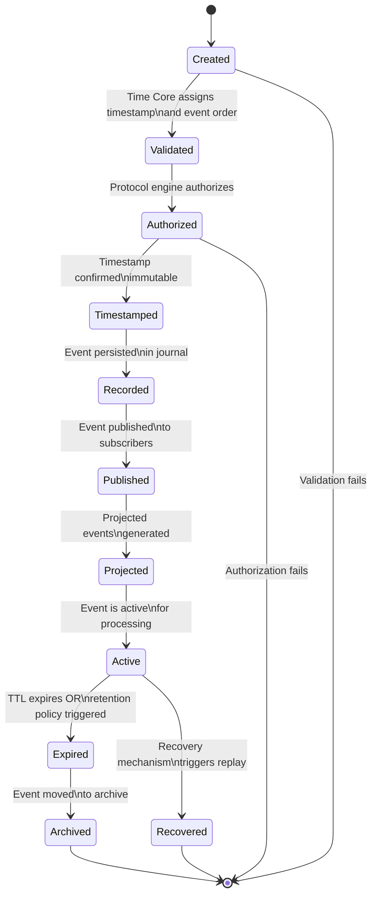
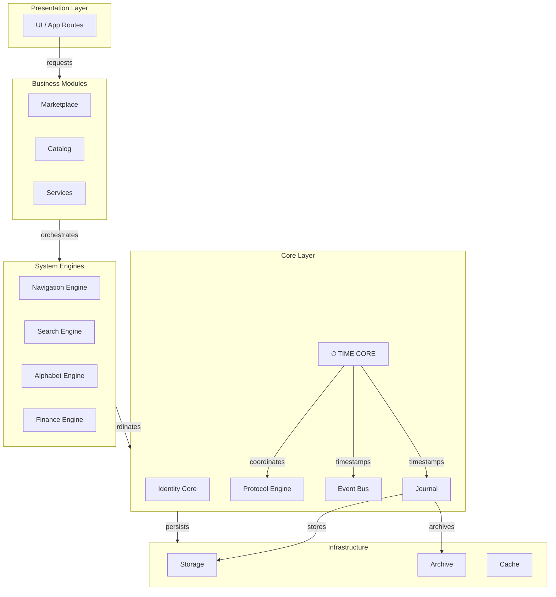
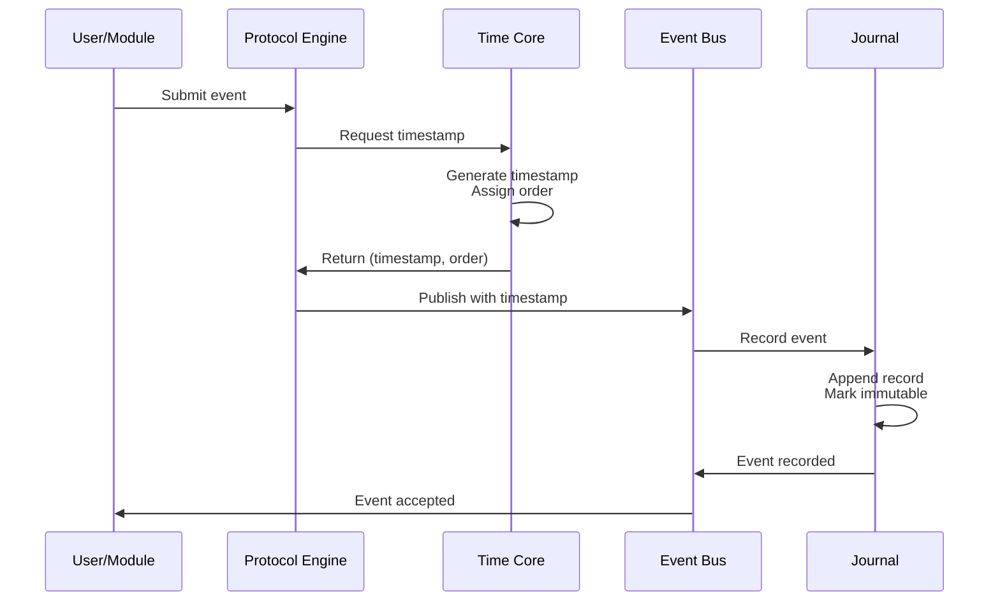
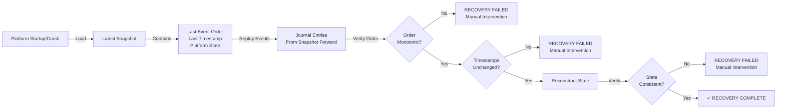

# 32. SO8FI Time Core Standard

**Status:** Constitutional Engineering Standard  
**Version:** 1.0  
**Owner:** SO8FI Architecture  
**Classification:** Immutable Platform Specification  
**Effective Date:** 2026-07-04  
**Scope:** Platform-wide temporal architecture  

---

## 1. Purpose

### 1.1 Why Time Core Exists

Time Core is the immutable temporal substrate of the SO8FI Operating System. It exists because every platform operation—from user identity registration to financial settlement to legal record creation—must occur at a specific, verifiable point in time that cannot be disputed, altered, or bypassed.

Time Core is **not a scheduler, calendar, business module, or database**. It is the authoritative operational time standard that every component, every module, and every decision depends upon.

### 1.2 Why Time Core is the Heart of SO8FI

The SO8FI Operating System is built on five core principles:

1. **Time Before State:** The platform records when things happen before recording what changed.
2. **Events Before Objects:** Events are the atomic unit; objects are derived state.
3. **Journal Before Database:** The immutable journal is the source of truth; databases are projections.
4. **Replay Before Restore:** Platform state is reconstructed from history; never invented.
5. **Architecture Before Technology:** Design principles are independent of implementation choices.

Time Core enables all five principles by providing:

- A single, authoritative operational time that all components share.
- Immutable event ordering that cannot be disputed.
- A timestamp that accompanies every journal record and platform event.
- A lifecycle framework that governs every state transition.
- A recovery mechanism that reconstructs the entire platform from the journal.

Without Time Core, the platform would collapse into a collection of unrelated databases with conflicting timestamps, no audit trail, and no recovery mechanism.

### 1.3 Constitutional Role

Time Core is a constitutional service. Like a national time standard or an atomic clock, it is not a feature or a business module. It is infrastructure that the entire platform depends upon. No component may bypass it, no administrator may override it, and no operator may pause it.

---

## 2. Responsibilities

Time Core is responsible for:

### 2.1 Global Operational Time

Time Core maintains and provides the single authoritative time reference for the entire SO8FI platform. Every operation that occurs on the platform, whether visible to users or internal to the runtime, receives a timestamp from this global clock.

**Scope:** Platform-wide time standard, expressed as ISO 8601 UTC timestamp.

### 2.2 Timestamp Assignment

Every platform event receives exactly one immutable timestamp at the moment it is accepted into the runtime. This timestamp is:

- Generated by Time Core.
- Immutable after assignment.
- Never modified, reordered, or skipped.
- Recorded in the journal.
- Included in all event metadata.

**Scope:** One timestamp per event; assigned once; preserved forever.

### 2.3 Event Ordering

Time Core assigns and maintains a monotonic event order value. This order value:

- Increases strictly with each recorded event.
- Persists in the journal and event metadata.
- Enables replay, recovery, and consistency validation.
- Is independent from wall-clock time or business logic.

**Scope:** Sequential ordering of all platform events.

### 2.4 Lifecycle Management

Every event moves through a defined lifecycle managed by Time Core:

- Created → Validated → Authorized → Timestamped → Recorded → Published → Projected → Archived → Expired/Recovered

Time Core ensures that every state transition is:

- Explicit and recorded.
- Never skipped or duplicated.
- Preserved in event metadata.
- Auditable and non-reversible.

**Scope:** State machine governing every platform event.

### 2.5 Time-to-Live (TTL) Management

Time Core defines and enforces TTL policies. Every event class has:

- A default TTL (time-to-live).
- Clear expiration semantics.
- Explicit transition to an expired state.
- Preservation in archive before removal.

**Scope:** Event expiration and retention policy.

### 2.6 Archive Policies

Time Core coordinates the preservation of historical records. Archive policies:

- Preserve events indefinitely for legal and audit events.
- Define retention windows for operational and system events.
- Maintain immutable timestamps in archived records.
- Enable discovery and replay of archived data.

**Scope:** Long-term preservation of platform event history.

### 2.7 Replay Coordination

Time Core provides the replay mechanism for reconstructing platform state:

- Replay follows ascending event order.
- Timestamps are preserved exactly as recorded.
- Event routes and lifecycle states are restored.
- No timestamps or orders are invented during replay.

**Scope:** Deterministic state reconstruction from journal history.

### 2.8 Snapshot Coordination

Time Core coordinates snapshots of platform state:

- Snapshots capture the last stable operational time and event order.
- Snapshots are reproducible from journal history.
- Snapshots are used for recovery from restart or state loss.

**Scope:** Point-in-time state capture and recovery.

### 2.9 Event Consistency

Time Core ensures that the journal, event order, and lifecycle remain coherent:

- Every journal record corresponds to exactly one event.
- Every event is uniquely identified by its timestamp and order.
- No duplicate, missing, or out-of-order events.
- Temporal validation rejects inconsistent records.

**Scope:** Immutable coherence of the entire event log.

### 2.10 Recovery Coordination

Time Core provides recovery after platform failures:

- Recovery starts from the latest valid snapshot.
- Events are replayed from the snapshot forward.
- Original timestamps and ordering are preserved.
- No duplicate journal records are created.

**Scope:** Guaranteed platform recovery without data loss or temporal inconsistency.

---

## 3. Immutable Laws

The following laws are immutable and constitute the architectural law of the SO8FI Time Core. No implementation, configuration, administrator, operator, AI system, or external entity may violate these laws.

### 3.1 Law of Singular Timestamps

**Law:** One event receives exactly one timestamp.

**Invariant:** Every platform event that enters the runtime receives a single, unique timestamp. This timestamp is assigned once and never modified.

**Consequence:** If an event has multiple timestamps, it is not a single event; it is multiple events.

### 3.2 Law of Singular Journal Records

**Law:** One event creates exactly one journal record.

**Invariant:** Every event that receives a timestamp is persisted as exactly one immutable journal entry. There is no event without a journal record, and no journal record without an event.

**Consequence:** If a change occurs without a journal record, it is not a platform event; it is a violation of the platform architecture.

### 3.3 Law of Singular Routes

**Law:** One event follows exactly one route.

**Invariant:** Every event has a unique event route (e.g., "system.event", "legal.consent", "finance.settlement"). The route is assigned at creation and never changed.

**Consequence:** If an event's route changes, the event has been destroyed and replaced with a different event.

### 3.4 Law of Singular Lifecycle

**Law:** One event follows exactly one lifecycle path.

**Invariant:** Every event moves through a single, deterministic lifecycle. The state transitions are explicit, ordered, and recorded. No state is skipped, duplicated, or reversed.

**Consequence:** If an event bypasses a lifecycle stage, or if a lifecycle stage is replayed, the event has been corrupted.

### 3.5 Law of Temporal Monotonicity

**Law:** Time never moves backwards.

**Invariant:** The event order value always increases. The operational timestamp of each event is greater than or equal to the previous event's timestamp (monotonic time).

**Consequence:** If event N has an earlier timestamp than event N-1, the platform has entered an inconsistent state and recovery is required.

### 3.6 Law of Temporal Immutability

**Law:** Time cannot be modified.

**Invariant:** Once a timestamp is assigned to an event and recorded in the journal, that timestamp can never be:

- Deleted.
- Modified.
- Reordered.
- Reinterpreted.
- Bypassed.

**Consequence:** There is no mechanism to edit, adjust, or rewrite timestamps. A timestamp remains immutable from the moment of assignment until the event is permanently archived or legally destroyed.

### 3.7 Law of Journal Immutability

**Law:** Journal records are immutable.

**Invariant:** Once an event is recorded in the journal, that record cannot be:

- Deleted (except through legal retention policy).
- Modified.
- Reordered.
- Edited.
- Overwritten.

The journal is append-only. New events are added; old events are never changed.

**Consequence:** The journal is the single source of truth. If the journal is corrupted, the platform has lost its temporal foundation and recovery is required.

### 3.8 Law of Centralized Time Authority

**Law:** No component may bypass the Time Core.

**Invariant:** Every timestamp assignment, event ordering decision, and lifecycle transition must flow through Time Core. There is no mechanism for components to:

- Generate their own timestamps.
- Assign their own event order.
- Create events without journal records.
- Modify lifecycle states without Time Core coordination.

**Consequence:** If a component assigns its own timestamp or creates events outside of Time Core, the platform's temporal coherence is destroyed.

### 3.9 Law of Administrative Immutability

**Law:** No human role may pause, edit, or override the Time Core.

**Invariant:** The following operations are forbidden for all roles (users, administrators, operators, owners, co-owners, support staff):

- Stopping or pausing Time Core.
- Deleting timestamps.
- Editing timestamps.
- Reordering events.
- Skipping journal records.
- Manually injecting events.
- Directly editing the journal.
- Bypassing the lifecycle state machine.

**Consequence:** If Time Core is stopped, the platform stops. If timestamps are edited, the platform's integrity is compromised. If events are manually injected, recovery is impossible.

### 3.10 Law of Irreversible History

**Law:** History cannot be rewritten.

**Invariant:** Once an event is recorded in the journal with a legal classification, that record is permanent and cannot be:

- Deleted.
- Modified.
- Archived without preservation.
- Forgotten or hidden from audit.

Legal events, audit events, and consent events are permanent.

**Consequence:** The platform maintains a verifiable, permanent record of all legal actions, financial transactions, and governance decisions.

---

## 4. Event Classification

All platform events are classified into the following categories. Each category has different timestamping, recording, TTL, and archive requirements.

### 4.1 Operational Events

**Definition:** Events that support the runtime execution and internal coordination of the platform.

**Examples:**
- Protocol validation events.
- Event pipeline processing.
- Cache updates.
- Internal notifications.
- System monitoring events.

**Timestamp Assignment:** Immediately upon event creation.

**Journal Recording:** Recorded in the journal.

**Lifecycle:** Created → Validated → Published → Projected → Expired.

**TTL:** 90 days (configurable by operations policy).

**Archive:** Moved to archive after TTL expires.

**Retention:** 2 years in archive.

### 4.2 Legal Events

**Definition:** Events that carry legal, consent, audit, or governance significance.

**Examples:**
- Identity registration events.
- Legal consent events.
- Financial settlement events.
- Authorization and access control events.
- Governance decisions.
- Policy changes.

**Timestamp Assignment:** Immediately upon event creation.

**Journal Recording:** Recorded in the journal with legal classification.

**Lifecycle:** Created → Validated → Authorized → Timestamped → Recorded → Published → Archived → (Permanent).

**TTL:** Legal events do not expire. They are permanent.

**Archive:** Automatically archived. Never deleted.

**Retention:** Permanent.

### 4.3 System Events

**Definition:** Events that represent system-level state changes or infrastructure events.

**Examples:**
- Module startup/shutdown.
- Configuration changes.
- Infrastructure alerts.
- Dependency state changes.
- Runtime initialization events.

**Timestamp Assignment:** Immediately upon event creation.

**Journal Recording:** Recorded in the journal.

**Lifecycle:** Created → Validated → Published → Archived.

**TTL:** 1 year (configurable by operations policy).

**Archive:** Moved to archive after TTL expires.

**Retention:** 5 years in archive.

### 4.4 Audit Events

**Definition:** Events that record access, changes, or operations performed by users or administrators.

**Examples:**
- User login/logout.
- Data access events.
- Administrative actions.
- Permission changes.
- Resource modifications.

**Timestamp Assignment:** Immediately upon event creation.

**Journal Recording:** Recorded in the journal with audit classification.

**Lifecycle:** Created → Validated → Authorized → Recorded → Published → Archived → (Permanent).

**TTL:** Audit events do not expire for sensitive operations. They are permanent.

**Archive:** Automatically archived. Searchable for compliance.

**Retention:** Permanent (or by legal retention policy).

### 4.5 Maintenance Events

**Definition:** Events that represent maintenance, backup, or administrative operations.

**Examples:**
- Backup events.
- Migration events.
- Repair operations.
- Database maintenance.
- Archive operations.

**Timestamp Assignment:** Immediately upon event creation.

**Journal Recording:** Recorded in the journal.

**Lifecycle:** Created → Validated → Authorized → Recorded → Published → Archived.

**TTL:** 3 months (configurable).

**Archive:** Moved to archive after TTL expires.

**Retention:** 1 year in archive.

---

## 5. Event Lifecycle

Every platform event follows a deterministic lifecycle managed by Time Core. The following diagram shows the complete event lifecycle:



### 5.1 Stage: Created

**Condition:** Event has been initiated by a component.

**Actions:**
- Event is accepted by Time Core.
- Event receives a unique timestamp (operational time).
- Event receives a monotonic order value.
- Event metadata is initialized.

**Responsibility:** Time Core

**Duration:** Instantaneous

**Next Stage:** Validated

### 5.2 Stage: Validated

**Condition:** Event has been validated for correctness.

**Actions:**
- Event format is checked.
- Event classification is verified.
- Timestamp is validated (format, monotonicity).
- Event route is verified.

**Responsibility:** Time Core + Protocol Engine

**Duration:** Immediate

**Next Stage:** Authorized

**Failure Path:** Event is rejected; not journaled.

### 5.3 Stage: Authorized

**Condition:** Event has been authorized for processing.

**Actions:**
- Event permissions are checked.
- Protocol policy is applied.
- Authorization decision is recorded in metadata.

**Responsibility:** Protocol Engine

**Duration:** Immediate

**Next Stage:** Timestamped

**Failure Path:** Event is rejected; journaled as "authorization_failed".

### 5.4 Stage: Timestamped

**Condition:** Timestamp is confirmed as immutable.

**Actions:**
- Timestamp is locked in metadata.
- Event order is locked.
- Lifecycle state is marked as "timestamped".

**Responsibility:** Time Core

**Duration:** Instantaneous

**Next Stage:** Recorded

### 5.5 Stage: Recorded

**Condition:** Event has been persisted in the journal.

**Actions:**
- Event is appended to the journal.
- Journal record includes timestamp and order.
- Record is marked as immutable.
- Lifecycle state is marked as "recorded".

**Responsibility:** Time Core + Journal

**Duration:** Immediate

**Next Stage:** Published

**Failure Path:** If journal write fails, recovery is required.

### 5.6 Stage: Published

**Condition:** Event has been published to subscribers.

**Actions:**
- Event is published to the event bus.
- All subscribers receive the event.
- Lifecycle state is marked as "published".
- Metadata includes publication timestamp.

**Responsibility:** Event Bus

**Duration:** Immediate

**Next Stage:** Projected

### 5.7 Stage: Projected

**Condition:** Derived events and projections have been generated.

**Actions:**
- Projected events are created from the original event.
- Domain models are updated.
- Cache entries are invalidated.
- Lifecycle state is marked as "projected".

**Responsibility:** Engines and modules

**Duration:** Immediate

**Next Stage:** Active

### 5.8 Stage: Active

**Condition:** Event is fully integrated into platform state.

**Actions:**
- Event can be used for queries and reports.
- Event is available for replay.
- Lifecycle state is marked as "active".

**Responsibility:** Entire platform

**Duration:** From active until expiration or recovery.

**Transition:** Either to Expired (normal expiration) or Recovered (recovery mechanism).

### 5.9 Stage: Expired

**Condition:** Event TTL has elapsed or retention policy has triggered.

**Actions:**
- Event is marked as expired.
- Event is prepared for archival.
- Lifecycle state is marked as "expired".
- Event is removed from active cache.

**Responsibility:** Time Core + Archive Policy

**Duration:** Depends on TTL configuration.

**Next Stage:** Archived

**Note:** Legal and audit events never expire; they transition to archived directly.

### 5.10 Stage: Archived

**Condition:** Event has been moved to archive storage.

**Actions:**
- Event is persisted in archive.
- Event remains searchable.
- Event can be used for replay.
- Lifecycle state is marked as "archived".

**Responsibility:** Archive system

**Duration:** Indefinite (or until retention policy deletion).

**Next Stage:** [End] or Recovery

### 5.11 Stage: Recovered

**Condition:** Recovery mechanism has replayed an archived event.

**Actions:**
- Event is restored from archive.
- Event is replayed with original timestamp.
- Event order is preserved.
- Lifecycle state is marked as "recovered".

**Responsibility:** Recovery system

**Duration:** During recovery process.

**Next Stage:** Projected (event is re-processed)

---

## 6. Time Policies

### 6.1 Time-to-Live (TTL)

Every event class has a TTL that defines how long an event remains active before expiration.

**Policy:**

| Event Class | Default TTL | Expiration Action | Archive Duration |
|---|---|---|---|
| Operational | 90 days | Auto-archive | 2 years |
| System | 1 year | Auto-archive | 5 years |
| Maintenance | 3 months | Auto-archive | 1 year |
| Audit | Permanent | Archive | Permanent |
| Legal | Permanent | Archive | Permanent |

**Modification:** TTL policies may be modified by operations governance but not retroactively applied to existing events.

### 6.2 Retention Policy

**Legal Events:** Retained permanently unless subject to legal data destruction order.

**Audit Events:** Retained permanently for sensitive operations; 7 years minimum for compliance.

**System Events:** Retained for 5 years; automatically deleted after retention window.

**Operational Events:** Retained for 2 years; automatically deleted after retention window.

**Maintenance Events:** Retained for 1 year; automatically deleted after retention window.

### 6.3 Expiration Policy

**Automatic Expiration:** Events automatically transition to expired state when TTL elapses.

**Manual Override:** Administrators may not manually expire events. Only automatic policy and legal retention orders apply.

**Notification:** Platform monitoring alerts when events enter expired state.

### 6.4 Replay Policy

**Replay Invariants:**

1. Replay must follow ascending event order.
2. Replay must use original timestamps (not current time).
3. Replay must preserve event routes.
4. Replay must restore lifecycle states exactly as recorded.
5. Replay must not invent new events or timestamps.

**Replay Guarantee:** A replayed platform state is identical to the state at the moment of the last event.

### 6.5 Snapshot Policy

**Snapshot Contents:**

- Last stable operational time.
- Last stable event order value.
- Entire platform projected state.
- Reference to last recorded journal entry.

**Snapshot Frequency:** At least once per day; more frequently during high-volume periods.

**Snapshot Verification:** Snapshots are reproducible from journal replay.

**Snapshot Use:** Snapshots are used to accelerate recovery; actual state is always derived from journal.

### 6.6 Recovery Policy

**Recovery Triggering:**

- Automatic on platform startup.
- Manual on administrator command.
- Automatic on detected state corruption.

**Recovery Steps:**

1. Load latest valid snapshot.
2. Replay all events from snapshot forward.
3. Verify platform state against snapshot.
4. Mark recovery complete.

**Recovery Guarantee:** Recovery always produces the exact state that existed at the moment of the last recorded event.

### 6.7 Synchronization Policy

**Internal Synchronization:**

- All components use Time Core for timestamps.
- No component generates independent timestamps.
- Event ordering is coordinated by Time Core.

**External Synchronization:**

- SO8FI receives events from external systems (banks, exchanges, APIs).
- Each external event receives an SO8FI timestamp when accepted.
- The SO8FI timestamp becomes the authoritative timestamp for that event inside SO8FI.
- External timestamps are preserved in metadata for audit purposes.
- Internal event order uses SO8FI timestamps, not external timestamps.

**Clock Synchronization:**

- Time Core uses system clock as the authoritative time source.
- System clock must be synchronized with NTP (Network Time Protocol).
- Drift detection triggers platform alerts.

---

## 7. Synchronization

### 7.1 Internal Time Synchronization

All components within SO8FI share a single, authoritative operational time. Components do not generate independent timestamps or maintain separate clocks.

**Synchronization Mechanism:**

```
Event → Time Core → Timestamp Generated → Journal Record → Published
                    ↓
              Event Order Assigned
                    ↓
              Lifecycle State Updated
                    ↓
              Metadata Attached
```

All timestamps flow through Time Core. No component may:

- Generate its own timestamp.
- Adjust or modify a timestamp.
- Assign its own event order.
- Create journal records independently.

### 7.2 External System Synchronization

SO8FI integrates with external systems that have their own operational times (banks, payment networks, stock exchanges, crypto exchanges, external APIs).

**Synchronization Model:**

```
External System        SO8FI Platform
     ↓                      ↓
Event Created          Event Received
     ↓                      ↓
External Timestamp     SO8FI Timestamp Generated
     ↓                      ↓
Event Sent             Event Journaled with
     ↓                  Both Timestamps
Event Received         ↓
     ↓                 External Timestamp Preserved
Journaled              in Metadata
in SO8FI
     ↓
SO8FI Timestamp
becomes Authoritative
for Ordering
```

**Key Principle:** Every accepted event receives an SO8FI timestamp. The SO8FI timestamp becomes the only authoritative ordering inside SO8FI. External timestamps are preserved for audit but not used for internal ordering.

**Rationale:** This prevents network delays, clock skew, or external system failures from compromising SO8FI's temporal integrity. SO8FI is independent from external time systems.

### 7.3 Cross-Module Synchronization

All modules within SO8FI use Time Core for timestamps. Modules do not maintain separate clocks.

**Synchronization Requirement:** Every module must:

1. Accept only timestamps from Time Core.
2. Store timestamps exactly as received (no modification).
3. Use Time Core's event order for event sequencing.
4. Never generate independent timestamps.

### 7.4 Replay Synchronization

During replay, events are re-processed using their original timestamps and order values.

**Replay Synchronization Property:**

- Replayed events maintain original timestamps.
- Replayed events follow original order.
- Replayed events restore original lifecycle states.
- External observers see the same event sequence.

This ensures that replay produces deterministic results identical to the original processing.

---

## 8. Security

### 8.1 Forbidden Operations

The following operations are strictly forbidden. No circumstance, no administrator authority, and no emergency override justifies these operations:

#### 8.1.1 Stopping or Pausing Time Core

**Forbidden:** Stopping, pausing, or disabling Time Core.

**Consequence:** The platform cannot accept new events. Users cannot transact. The platform is down.

**Recovery:** Only action is to restart Time Core. All pending events are timestamped upon restart in order received.

#### 8.1.2 Deleting Timestamps

**Forbidden:** Deleting any timestamp from the journal or event metadata.

**Consequence:** The event loses its temporal anchor and cannot be ordered or verified.

**Recovery:** If a timestamp is deleted, the journal is corrupted and full platform recovery is required.

#### 8.1.3 Editing Timestamps

**Forbidden:** Modifying or adjusting any timestamp after it is assigned.

**Consequence:** Event ordering becomes unreliable; legal and audit trails become falsifiable.

**Recovery:** If a timestamp is modified, the journal is corrupted and full platform recovery is required.

#### 8.1.4 Reordering Events

**Forbidden:** Changing the event order value of any recorded event.

**Consequence:** Event sequence becomes corrupted; causality is broken; recovery is impossible.

**Recovery:** If event order is modified, the journal is corrupted and full platform recovery is required.

#### 8.1.5 Skipping Journal Records

**Forbidden:** Creating a platform event that is not recorded in the journal.

**Consequence:** The event exists in platform state but has no temporal record. Recovery will not restore it.

**Recovery:** If journal records are skipped, the platform state is permanently disconnected from its temporal history.

#### 8.1.6 Manual Event Injection

**Forbidden:** Manually creating events or injecting them into the platform without Time Core processing.

**Consequence:** Injected events have no timestamps, no order, and no lifecycle tracking.

**Recovery:** Manual events must be undone and resubmitted through proper Time Core channels.

#### 8.1.7 Manual Timestamp Assignment

**Forbidden:** Assigning timestamps manually or through any mechanism other than Time Core.

**Consequence:** Timestamps are not synchronized; events cannot be ordered; recovery fails.

**Recovery:** All manually assigned timestamps must be removed and events must be reprocessed through Time Core.

#### 8.1.8 Direct Journal Editing

**Forbidden:** Directly editing journal records, bypassing the append-only interface.

**Consequence:** The journal is corrupted; temporal coherence is destroyed; recovery is impossible.

**Recovery:** If the journal is directly edited, full recovery from backup is required.

#### 8.1.9 Bypassing Time Core

**Forbidden:** Creating platform events or state changes without flowing through Time Core.

**Consequence:** The event has no timestamp; it cannot be ordered; recovery will not restore it.

**Recovery:** Any bypass of Time Core must be detected and the platform state must be restored from a known good snapshot.

### 8.2 Authorization and Access Control

**Time Core Access:** Only the following components may directly invoke Time Core:

- Protocol Engine (for authorization decisions).
- Event Bus (for event routing).
- Journal (for record persistence).
- Platform initialization.

**User/Module Access:** Users and modules do not directly invoke Time Core. They submit requests through the Protocol Engine, which coordinates with Time Core.

**Administrative Access:** Administrators may view Time Core status and configuration but may not:

- Modify timestamps.
- Delete events.
- Pause Time Core.
- Bypass event journaling.
- Inject events manually.

### 8.3 Audit and Logging

**All Time Core Operations:** Every Time Core operation is logged:

- Timestamp assignments.
- Event ordering decisions.
- Lifecycle transitions.
- TTL and expiration actions.
- Archive operations.
- Recovery operations.

**Audit Trail:** The audit trail itself is journaled as legal events and permanently retained.

**Compliance:** Time Core operations are auditable by external compliance teams and regulators.

---

## 9. Recovery

Recovery is the process of reconstructing platform state after an interruption, failure, or data loss.

### 9.1 Recovery Principles

Recovery must always use:

1. **Journal** as the source of truth.
2. **Snapshots** to accelerate recovery.
3. **Replay** to reconstruct state.
4. **Never manual reconstruction** of state.

Recovery is deterministic: replaying the same events produces the same state.

### 9.2 Recovery Scenarios

#### 9.2.1 Normal Restart

**Condition:** Platform is shut down normally and restarted.

**Recovery Process:**

1. Load latest snapshot.
2. Replay events from snapshot forward.
3. Verify state consistency.
4. Mark platform as recovered.

**Duration:** Depends on event volume; typically < 1 minute.

#### 9.2.2 Crash Recovery

**Condition:** Platform crashes unexpectedly.

**Recovery Process:**

1. Detect incomplete journal entries (if any).
2. Mark incomplete entries as "recovery_failed" (do not remove).
3. Load latest complete snapshot.
4. Replay events from snapshot forward.
5. Verify state consistency.
6. Alert operations about incomplete entries.

**Duration:** Depends on event volume; typically < 5 minutes.

#### 9.2.3 Corrupted State Recovery

**Condition:** Platform state becomes corrupted (e.g., database corruption, memory corruption).

**Recovery Process:**

1. Detect state inconsistency through validation checks.
2. Load latest valid snapshot.
3. Replay all events from snapshot.
4. Compare replayed state with corrupted state.
5. Identify events that failed to apply.
6. Alert operations with detailed corruption report.
7. Require manual intervention to resolve corrupted events.

**Duration:** Depends on event volume and corruption extent.

#### 9.2.4 Journal Corruption Recovery

**Condition:** Journal records are corrupted or missing.

**Recovery Process:**

1. Detect journal corruption through integrity checks.
2. Load latest valid snapshot before corruption occurred.
3. Replay events from snapshot forward.
4. Stop at the first corrupted record.
5. Alert operations with detailed corruption report.
6. Require backup restoration or manual intervention.

**Duration:** Depends on detection and intervention speed.

### 9.3 Recovery Guarantees

**Determinism:** Recovery always produces the exact state that existed at the moment of the last recorded event.

**Consistency:** Recovery preserves all timestamps, event orders, and lifecycle states exactly as recorded.

**Completeness:** Recovery restores all persisted state. No state is invented or reconstructed manually.

**Verifiability:** Recovery can be verified by replaying the same event sequence independently.

### 9.4 Recovery Testing

**Recovery Testing Requirement:** The platform must successfully recover from:

- Normal restarts (daily).
- Simulated crashes (weekly).
- Simulated corrupted snapshots (monthly).
- Simulated journal corruption (quarterly).

Recovery tests must verify that replayed state is identical to pre-failure state.

---

## 10. Interfaces

Time Core exposes the following interfaces. These are contracts, not implementation details. All implementations must conform to these contracts.

### 10.1 Time Provider Interface

```
interface TimeProvider {
    now(): Timestamp
    toTimestamp(value: Date | string | number): Timestamp
    parse(timestamp: Timestamp): Date
    isValidTimestamp(value: string): boolean
}
```

**Responsibility:** Provide current operational time and timestamp conversion.

### 10.2 Event Recorder Interface

```
interface EventRecorder {
    record(
        payload: object,
        recordType: RecordType,
        recorderId: NumericId,
        metadata?: Metadata
    ): JournalEntry
}
```

**Responsibility:** Record an event in the journal with timestamp and order.

### 10.3 Event Ordering Interface

```
interface EventOrderer {
    getNextOrder(): EventOrder
    getEventOrder(eventId: NumericId): EventOrder
    verifyMonotonicity(): boolean
}
```

**Responsibility:** Provide monotonic event ordering.

### 10.4 Lifecycle Manager Interface

```
interface LifecycleManager {
    transitionState(eventId: NumericId, newState: LifecycleState): void
    getLifecycleState(eventId: NumericId): LifecycleState
    getLifecycleHistory(eventId: NumericId): LifecycleState[]
}
```

**Responsibility:** Manage event lifecycle state transitions.

### 10.5 Snapshot Manager Interface

```
interface SnapshotManager {
    createSnapshot(description: string): Snapshot
    loadSnapshot(snapshotId: NumericId): Snapshot
    verifySnapshot(snapshot: Snapshot): boolean
    listSnapshots(): Snapshot[]
}
```

**Responsibility:** Create, load, and verify snapshots.

### 10.6 Replay Engine Interface

```
interface ReplayEngine {
    replayFromSnapshot(snapshot: Snapshot): void
    replayToTimestamp(timestamp: Timestamp): void
    replayBetween(from: Timestamp, to: Timestamp): void
    verifyReplay(): boolean
}
```

**Responsibility:** Replay events and reconstruct platform state.

### 10.7 Recovery Engine Interface

```
interface RecoveryEngine {
    startRecovery(): void
    getRecoveryStatus(): RecoveryStatus
    verifyRecovery(): boolean
}
```

**Responsibility:** Recover platform state after interruption.

---

## 11. Engineering Principles

The SO8FI Time Core is designed around the following engineering principles:

### 11.1 Time Before State

**Principle:** The platform records when things happen before recording what changed.

**Implication:** Every state change is preceded by a timestamp assignment. The order of events is established before the events are processed. Recovery proceeds by replaying events in temporal order.

**Rationale:** This guarantees that the platform can reconstruct state from history. State is derived from events, not the reverse.

### 11.2 Events Before Objects

**Principle:** Events are the atomic unit of platform operation. Objects are derived state.

**Implication:** The journal records events, not objects. Objects are projections from events. If an object becomes corrupted, it is reconstructed by replaying events.

**Rationale:** Objects may be cached, indexed, or duplicated. Events are unique and immutable. The event is the source of truth.

### 11.3 Journal Before Database

**Principle:** The immutable journal is the source of truth. Databases are projections.

**Implication:** The journal records every event with a timestamp and order. Databases project state from the journal. If a database is corrupted, it is reconstructed by replaying the journal.

**Rationale:** Databases may become corrupted, inconsistent, or lost. The journal is the authoritative record.

### 11.4 Replay Before Restore

**Principle:** Platform state is reconstructed from history. State is never invented or manually edited.

**Implication:** Recovery proceeds by replaying events from the journal in temporal order. No administrator ever manually edits state. No administrator ever invents events.

**Rationale:** Manual editing introduces errors. Replay guarantees consistency. Recovery is deterministic and verifiable.

### 11.5 Architecture Before Technology

**Principle:** Design principles are independent of implementation choices.

**Implication:** The Time Core standard defines architectural laws that are independent from:

- Programming language (TypeScript, Go, Python, Java, etc.).
- Storage technology (in-memory, SQL, NoSQL, etc.).
- Runtime environment (Node.js, JVM, .NET, etc.).
- Infrastructure (cloud, on-premise, containerized, etc.).

**Rationale:** The architecture must be portable across technologies. The laws remain constant regardless of implementation.

### 11.6 Immutability as Foundation

**Principle:** Immutability is the foundation of platform integrity.

**Implication:** Once a timestamp is assigned, it is immutable. Once an event is journaled, it is immutable. Once a lifecycle state is recorded, it is immutable. These immutabilities are not enforced by code alone; they are architectural laws.

**Rationale:** Mutability introduces inconsistency and corruptibility. Immutability guarantees integrity across time and recovery.

### 11.7 Monotonicity as Order

**Principle:** Monotonic time is the foundation of event ordering.

**Implication:** Event order values strictly increase. Timestamps never move backwards. This monotonicity is not approximate or probabilistic; it is absolute.

**Rationale:** Event ordering is the foundation of causality, recovery, and replay. Without strict monotonicity, causality is broken.

### 11.8 Auditability as Compliance

**Principle:** Every Time Core operation is auditable.

**Implication:** The platform logs every timestamp assignment, every event ordering decision, every lifecycle transition, and every recovery operation. These logs are themselves journaled as legal events.

**Rationale:** Compliance, audit, and governance require verifiable records. The audit trail itself must be preserved.

---

## 12. Validation Against Core Systems

The SO8FI Time Core Standard is designed to integrate with and support the following core systems:

### 12.1 Integration with Identity Core

**Requirement:** Every identity action (registration, update, authentication) is timestamped and journaled.

**Time Core Role:** Provides timestamps and event ordering for identity lifecycle events.

**Validation:** Identity events can be replayed in temporal order to reconstruct identity state.

**Reference:** [31_IDENTITY_CORE_SPECIFICATION.md](31_IDENTITY_CORE_SPECIFICATION.md)

### 12.2 Integration with Journal

**Requirement:** The journal is the authoritative record of all timestamped events.

**Time Core Role:** Provides timestamps and order values for all journal entries.

**Validation:** Journal entries preserve timestamps and order; journal can be replayed deterministically.

**Reference:** [core/journal.ts](../../core/journal.ts)

### 12.3 Integration with Protocol Engine

**Requirement:** Protocol decisions are timestamped and authorize event flow.

**Time Core Role:** Provides timestamps; Protocol Engine authorizes event processing.

**Validation:** Protocol decisions can be audited with timestamps; authorization order is preserved.

**Reference:** [core/protocol.ts](../../core/protocol.ts)

### 12.4 Integration with Navigation Core

**Requirement:** Navigation targets have temporal validity and lifecycle.

**Time Core Role:** Provides timestamps for navigation state changes.

**Validation:** Navigation events can be replayed to reconstruct navigation state.

**Reference:** [38_NAVIGATION_CORE_SPECIFICATION.md](38_NAVIGATION_CORE_SPECIFICATION.md)

### 12.5 Integration with Event Pipeline

**Requirement:** Events flow through pipeline with timestamps preserved.

**Time Core Role:** Assigns initial timestamp; pipeline preserves timestamp through all stages.

**Validation:** Event timestamps are consistent from entry to exit through pipeline.

**Reference:** [core/eventPipeline.ts](../../core/eventPipeline.ts)

### 12.6 Integration with Numeric Language

**Requirement:** Numeric identifiers are stable across time; temporal ordering affects identifier significance.

**Time Core Role:** Provides timestamps that contextualize numeric identifiers.

**Validation:** Numeric identifiers can be traced through temporal order; significance is preserved.

**Reference:** [30_NUMERIC_LANGUAGE_FOUNDATION.md](30_NUMERIC_LANGUAGE_FOUNDATION.md)

---

## 13. Architectural Diagrams

### 13.1 Time Core Position in Platform Architecture



### 13.2 Timestamp Flow Through Platform



### 13.3 Recovery Process



---

## 14. Governance and Change Management

### 14.1 Standard Immutability

This Time Core Standard becomes immutable upon approval. Future changes to the standard require:

1. **Formal Amendment Process:** Changes must go through a formal amendment process with documented rationale.
2. **Backward Compatibility:** Amendments must maintain backward compatibility with existing implementations or provide explicit migration path.
3. **Stakeholder Approval:** Changes require approval from architects, operations, compliance, and security.
4. **Implementation Timeline:** All implementations must adopt amendments within a defined timeline.

### 14.2 Implementation Compliance

Every implementation of Time Core must conform to this standard. Non-conforming implementations are architecture violations.

**Compliance Verification:**

- Implementations must pass compliance tests.
- Compliance tests verify all immutable laws.
- Compliance tests verify all interface contracts.
- Compliance tests verify recovery guarantees.

### 14.3 Version Control

**Standard Version:** 1.0 (established 2026-07-04)

**Version History:**

| Version | Date | Changes | Status |
|---------|------|---------|--------|
| 1.0 | 2026-07-04 | Initial standard | Active |

---

## 15. References

- [01_SYSTEM_CONSTITUTION.md](01_SYSTEM_CONSTITUTION.md) — Platform Constitution
- [04_ARCHITECTURE.md](04_ARCHITECTURE.md) — Platform Architecture
- [30_NUMERIC_LANGUAGE_FOUNDATION.md](30_NUMERIC_LANGUAGE_FOUNDATION.md) — Numeric Language
- [31_IDENTITY_CORE_SPECIFICATION.md](31_IDENTITY_CORE_SPECIFICATION.md) — Identity Core
- [38_NAVIGATION_CORE_SPECIFICATION.md](38_NAVIGATION_CORE_SPECIFICATION.md) — Navigation Core
- [41_TIME_CORE_SPECIFICATION.md](41_TIME_CORE_SPECIFICATION.md) — Time Core Implementation Spec
- [SO8FI_ENGINEERING_REPORT.md](SO8FI_ENGINEERING_REPORT.md) — Engineering Report
- [SO8FI_LAYER_ARCHITECTURE.md](SO8FI_LAYER_ARCHITECTURE.md) — Layer Architecture

---

## 16. Document Control

**Document ID:** 32_TIME_CORE_STANDARD  
**Classification:** Constitutional Engineering Standard  
**Owner:** SO8FI Architecture  
**Status:** Active  
**Last Updated:** 2026-07-04  
**Next Review:** 2027-07-04  

**Approved By:**  
- Architecture Council
- Engineering Lead
- Operations Lead
- Compliance Officer

---

## 17. Conclusion

The SO8FI Time Core is the immutable temporal substrate of the platform. Every event, every decision, and every state change depends on the guarantees provided by Time Core: one timestamp per event, one journal record per event, one immutable ordering, and one recovery path.

This standard establishes the architectural laws that make the SO8FI Operating System trustworthy, auditable, recoverable, and scalable. Future implementations must conform to this standard exactly. Deviations from this standard constitute architecture violations and must be remediated immediately.

Time Core is not optional. It is the foundation upon which every other platform capability depends.

---

**End of SO8FI Time Core Standard, Version 1.0**
