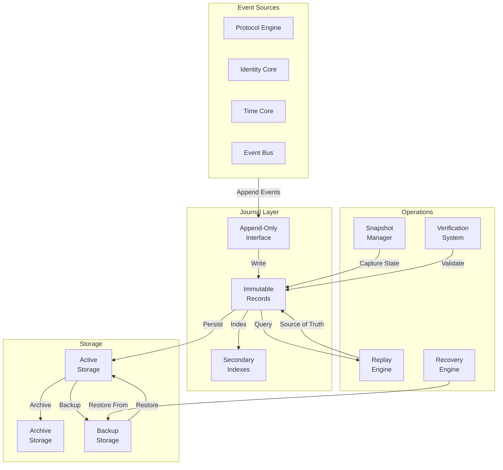

# 33. SO8FI Journal Standard

**Status:** Constitutional Engineering Standard  
**Version:** 1.0  
**Owner:** SO8FI Architecture  
**Classification:** Immutable Platform Specification  
**Effective Date:** 2026-07-04  
**Scope:** Platform-wide immutable event recording  

---

## 1. Purpose

### 1.1 Why the Journal Exists

The SO8FI Journal is the immutable source of truth for the entire platform. It exists because every operation, transaction, decision, and state change must be recorded in a way that cannot be disputed, rewritten, or lost.

The Journal is **not a database, log file, or business archive**. It is the authoritative record of every platform event that makes recovery, audit, replay, and governance possible.

### 1.2 Why the Journal is Foundational

The SO8FI Operating System is built on a principle: **Journal Before Database**.

This means:

- The Journal records what happened.
- Databases project state from what happened.
- If a database is corrupted, it is reconstructed from the Journal.
- If the Journal is lost, the platform loses its memory.

Without the Journal:

- The platform cannot be recovered.
- Events cannot be replayed.
- Audit trails cannot be verified.
- Governance decisions cannot be traced.
- Legal compliance cannot be demonstrated.

The Journal makes all of these possible.

### 1.3 Scope and Independence

The Journal defines:

- How events are recorded.
- How records are preserved.
- How records are organized.
- How records are retrieved.
- How records are archived.
- How records are recovered.

The Journal does NOT define:

- What events mean (interpretation).
- How state is derived (business logic).
- How records are indexed (performance optimization).
- UI presentation of records.

The Journal is independent. All other platform components depend on the Journal; the Journal depends on no other components.

---

## 2. Responsibilities

The Journal is responsible for:

### 2.1 Event Recording

The Journal records every platform event:

- Exactly as it occurred.
- With complete context.
- With time ordering.
- Without modification or interpretation.

**Scope:** Complete, unmodified event recording.

### 2.2 Immutable Persistence

The Journal persists recorded events:

- Permanently.
- Without modification.
- Without deletion.
- Without reordering.

**Scope:** Append-only persistence.

### 2.3 Append-Only Operation

The Journal operates as append-only:

- New events are appended.
- Existing events are never modified.
- Existing events are never deleted.
- Existing events are never reordered.

**Scope:** Strict append-only semantics.

### 2.4 Record Classification

The Journal classifies records by type:

- Legal records (permanent)
- Operational records (timed retention)
- System records (timed retention)
- Audit records (permanent)
- Maintenance records (timed retention)

**Scope:** Record type management and retention policy.

### 2.5 Retention Policy Enforcement

The Journal enforces retention policies:

- Legal records are retained permanently.
- Audit records are retained per compliance policy.
- Other records are retained per operational policy.
- Retention windows are enforced automatically.

**Scope:** Policy-based retention and archival.

### 2.6 Archive Management

The Journal archives expired records:

- Records are moved to archive storage.
- Archived records remain searchable.
- Archived records can be replayed.
- Archived records are preserved indefinitely if legal/audit.

**Scope:** Archive lifecycle management.

### 2.7 Consistency Maintenance

The Journal maintains consistency:

- Record order is preserved.
- Record timestamps are immutable.
- Record counts are verified.
- Gaps or corruption are detected.

**Scope:** Integrity and consistency verification.

### 2.8 Replay Support

The Journal supports event replay:

- Records are retrieved in order.
- Timestamps are preserved.
- Causality is maintained.
- Full state reconstruction is possible.

**Scope:** Deterministic event replay.

### 2.9 Snapshot Coordination

The Journal coordinates snapshots:

- Snapshots capture journal state.
- Snapshots include last record reference.
- Snapshots are reproducible from journal.
- Snapshots enable recovery.

**Scope:** Snapshot creation and verification.

### 2.10 Recovery Coordination

The Journal supports recovery:

- Recovery starts from latest snapshot.
- Events are replayed from snapshot forward.
- Journal is the source of truth for recovery.
- Recovery is deterministic and verifiable.

**Scope:** Recovery facilitation and coordination.

---

## 3. Immutable Journal Laws

The following laws are immutable and constitute the architectural law of the SO8FI Journal. No implementation, administrator, or external system may violate these laws.

### 3.1 Law of Append-Only

**Law:** The Journal is append-only.

**Invariant:** Events are appended to the Journal in order. Existing events are never:

- Modified.
- Deleted.
- Reordered.
- Overwritten.

**Consequence:** If an event is modified, deleted, or reordered, the Journal is corrupted and recovery is required.

### 3.2 Law of One Record Per Event

**Law:** One event creates exactly one Journal record.

**Invariant:** Every platform event that is accepted into the system creates exactly one immutable Journal record. There is no event without a record; there is no record without an event.

**Consequence:** If an event has no record, it never occurred (from the Journal's perspective). If there is a record without an event, it is orphaned data.

### 3.3 Law of Immutable Recording

**Law:** Journal records are immutable after recording.

**Invariant:** Once a record is written to the Journal, it cannot be:

- Changed.
- Deleted.
- Reinterpreted.
- Edited.

Recording is permanent.

**Consequence:** If a record is modified, the Journal has been violated.

### 3.4 Law of Permanent History

**Law:** History is permanent.

**Invariant:** Legal records, audit records, and consent records are preserved permanently. They cannot be deleted, hidden, or forgotten, even if no longer actively referenced.

**Consequence:** The platform maintains a verifiable, permanent record of all significant events.

### 3.5 Law of Temporal Order

**Law:** Record order is immutable.

**Invariant:** The order in which records are appended is the immutable ordering. Records are never reordered. Order values are strictly increasing.

**Consequence:** If records are reordered, causality is broken and recovery is required.

### 3.6 Law of Timestamp Preservation

**Law:** Record timestamps are immutable and preserved.

**Invariant:** The timestamp assigned to a record at creation time is:

- Never modified.
- Never reinterpreted.
- Preserved through archival and recovery.
- Used for all temporal reasoning.

**Consequence:** If a timestamp is modified, the temporal foundation of the Journal is destroyed.

### 3.7 Law of Complete Audit Trail

**Law:** The Journal maintains complete audit trail.

**Invariant:** Every platform event that affects state, identity, governance, or legal matters is recorded in the Journal. There is no way to bypass the Journal. The audit trail is complete.

**Consequence:** If an event is not journaled, it did not happen (from governance perspective).

### 3.8 Law of Centralized Journal Authority

**Law:** Only the Journal may record events into the Journal.

**Invariant:** No component, module, or external system may directly write to the Journal except through the Journal's official append interface. There is no bypass mechanism for journal recording.

**Consequence:** If an event is recorded outside the official interface, it is not a valid Journal record.

### 3.9 Law of No Direct Journal Editing

**Law:** Direct Journal editing is forbidden.

**Invariant:** The following operations are forbidden for all roles (administrators, operators, engineers, support staff):

- Deleting records from the Journal.
- Modifying records in the Journal.
- Reordering records in the Journal.
- Directly accessing and editing Journal storage.
- Injecting records into the Journal.

Direct Journal editing is not just discouraged; it is architecturally forbidden.

**Consequence:** If the Journal is directly edited, it is corrupted and recovery is required.

### 3.10 Law of Journal Restoration

**Law:** Journal restoration uses Journal as source of truth.

**Invariant:** If the Journal is lost or corrupted, it is restored from backups. It is never reconstructed manually or invented. Recovery always uses the Journal as the source of truth; state is never manually edified.

**Consequence:** Manual Journal reconstruction is forbidden; only backup restoration is permitted.

---

## 4. Journal Structure

### 4.1 Journal Entry Format

Every Journal entry contains:

```
{
    id: NumericId,                    // Unique record ID
    createdAt: Timestamp,             // ISO 8601 timestamp
    recorderId: NumericId,            // Identity of component that recorded
    recordType: RecordType,           // Type classification (legal, audit, operational, system, maintenance)
    payload: object,                  // The complete event data
    metadata: {
        operationalTime: Timestamp,   // Time Core timestamp
        eventOrder: NumericId,        // Monotonic ordering
        eventRoute: string,           // Event classification
        lifecycle: {
            state: string,            // Lifecycle stage
            status: string,           // Active/Archived/Recovered
            startedAt: Timestamp      // Lifecycle start time
        }
    }
}
```

### 4.2 Record Organization

Records are organized:

- By record type (legal, audit, operational, system, maintenance)
- By timestamp (temporal ordering)
- By recorder ID (component identity)
- By event route (event classification)

All organization is secondary to immutable append-only ordering.

---

## 5. Record Types

### 5.1 Legal Records

**Classification:** Permanent retention

**Examples:**
- Identity registration
- Consent events
- Legal agreements
- Ownership transfers
- Compliance actions

**Retention:** Permanent

**Deletion:** Forbidden

**Archival:** Automatic; preserved indefinitely

### 5.2 Operational Records

**Classification:** Timed retention

**Examples:**
- API requests
- Event processing
- Cache operations
- State projections
- System events

**Retention:** 90 days (configurable)

**Deletion:** Automatic after retention window

**Archival:** Moved to archive after TTL

### 5.3 System Records

**Classification:** Timed retention

**Examples:**
- Module startup/shutdown
- Configuration changes
- Infrastructure events
- Runtime initialization
- Dependency changes

**Retention:** 1 year (configurable)

**Deletion:** Automatic after retention window

**Archival:** Moved to archive after TTL

### 5.4 Audit Records

**Classification:** Permanent retention

**Examples:**
- User authentication
- Administrative actions
- Authorization changes
- Access events
- Permission modifications

**Retention:** Permanent

**Deletion:** Forbidden (or per legal retention policy)

**Archival:** Automatic; preserved indefinitely

### 5.5 Maintenance Records

**Classification:** Timed retention

**Examples:**
- Backup operations
- Migration events
- Repair operations
- Database maintenance
- Archive operations

**Retention:** 3 months (configurable)

**Deletion:** Automatic after retention window

**Archival:** Moved to archive after TTL

---

## 6. Retention Policies

### 6.1 Legal Records

| Policy | Value |
|--------|-------|
| Default TTL | Permanent |
| Deletion | Forbidden |
| Manual Override | Forbidden |
| Archival | Automatic |
| Archive Duration | Permanent |

### 6.2 Audit Records

| Policy | Value |
|--------|-------|
| Default TTL | Permanent (or 7 years minimum) |
| Deletion | Forbidden (unless legal order) |
| Manual Override | Forbidden |
| Archival | Automatic |
| Archive Duration | Permanent (or per legal policy) |

### 6.3 System Records

| Policy | Value |
|--------|-------|
| Default TTL | 1 year |
| Deletion | Automatic after TTL |
| Manual Override | Forbidden |
| Archival | Moved after TTL |
| Archive Duration | 5 years |

### 6.4 Operational Records

| Policy | Value |
|--------|-------|
| Default TTL | 90 days |
| Deletion | Automatic after TTL |
| Manual Override | Forbidden |
| Archival | Moved after TTL |
| Archive Duration | 2 years |

### 6.5 Maintenance Records

| Policy | Value |
|--------|-------|
| Default TTL | 3 months |
| Deletion | Automatic after TTL |
| Manual Override | Forbidden |
| Archival | Moved after TTL |
| Archive Duration | 1 year |

---

## 7. Archive Policies

### 7.1 Archive Triggering

Records are moved to archive when:

- TTL expires
- Retention window is reached
- Manual archive request is made (for legal/audit)
- Regulatory requirement is met

### 7.2 Archive Preservation

Archived records:

- Are persisted in archive storage
- Remain searchable and queryable
- Can be retrieved for replay
- Cannot be deleted (unless legal destruction order)
- Maintain immutable timestamps and ordering

### 7.3 Archive Retention

| Record Type | Archive Duration |
|---|---|
| Legal | Permanent |
| Audit | Permanent |
| System | 5 years |
| Operational | 2 years |
| Maintenance | 1 year |

---

## 8. Replay

### 8.1 Replay Principles

Replay reconstructs platform state from Journal records:

1. Load snapshot (or start from beginning)
2. Process records in timestamp order
3. Preserve all metadata and timestamps
4. Reconstruct derived state
5. Verify consistency

### 8.2 Replay Guarantees

Replay guarantees:

- Records are processed in immutable order
- Timestamps are preserved exactly
- Causality is maintained
- Replayed state is identical to original
- Replay is deterministic and verifiable

### 8.3 Replay Use Cases

Replay is used for:

- Recovery after failures
- Auditing past events
- Reconstructing lost state
- Verifying platform consistency
- Training/testing new components

---

## 9. Snapshots

### 9.1 Snapshot Contents

A snapshot contains:

- Last Journal entry reference (record ID and timestamp)
- Last Time Core event order
- Complete platform state at snapshot time
- Metadata about snapshot creation time

### 9.2 Snapshot Creation

Snapshots are created:

- At least once per day
- More frequently during high-volume periods
- When requested by operations
- Before major migrations

### 9.3 Snapshot Verification

Snapshots are verified:

- By replaying from snapshot forward
- By comparing replayed state to snapshot state
- By checking for gaps or inconsistencies
- Regular verification testing

### 9.4 Snapshot Use

Snapshots are used for:

- Accelerating recovery
- Reducing replay time
- Verification testing
- Long-term archival

---

## 10. Consistency

### 10.1 Consistency Checks

The Journal maintains consistency through:

- Record ordering verification
- Timestamp monotonicity verification
- Record completeness checks
- Corruption detection

### 10.2 Consistency Verification

Consistency is verified:

- On every append operation
- Periodically during normal operation
- On recovery operations
- Before snapshot creation

### 10.3 Consistency Guarantees

The Journal guarantees:

- No gaps in record sequence
- No duplicate records
- No reordered records
- Monotonic timestamps
- Complete audit trails

---

## 11. Integrity

### 11.1 Integrity Checks

Journal integrity is maintained through:

- Checksum verification
- Hash chain verification
- Record count validation
- Timestamp validation

### 11.2 Corruption Detection

Corruption is detected:

- Automatically on integrity checks
- During replay operations
- During recovery operations
- During consistency verification

### 11.3 Corruption Response

When corruption is detected:

- Operations alert administrators
- Recovery procedure is initiated
- Journal is restored from backup
- Platform recovery is attempted

---

## 12. Recovery

### 12.1 Recovery Scenarios

#### Normal Restart

1. Load latest snapshot
2. Verify snapshot integrity
3. Replay records from snapshot forward
4. Mark recovery complete

#### Corrupted Records

1. Detect corruption during consistency check
2. Load latest valid snapshot before corruption
3. Replay from snapshot forward to corruption point
4. Alert operations; require manual intervention

#### Lost Records

1. Detect gaps in record sequence
2. Restore from backup
3. Replay from backup point forward
4. Verify consistency

#### Complete Journal Loss

1. Restore Journal from backup system
2. Restore from latest snapshot
3. Replay from snapshot forward
4. Verify completeness

### 12.2 Recovery Guarantees

Recovery guarantees:

- All records are preserved
- All timestamps are preserved
- All ordering is preserved
- Recovered state is identical to pre-failure state
- Recovery is deterministic and verifiable

---

## 13. Forbidden Operations

The following operations are strictly forbidden. No circumstance, no authority, and no emergency override justifies these operations:

❌ Deleting Journal records  
❌ Modifying Journal records  
❌ Reordering Journal records  
❌ Directly editing Journal storage  
❌ Bypassing the Journal append interface  
❌ Creating events without Journal records  
❌ Manual Journal record injection  
❌ Removing timestamps from records  
❌ Changing record timestamps  
❌ Skipping journal recording  

---

## 14. Journal Interfaces

The Journal exposes the following interfaces:

### 14.1 Journal Writer Interface

```
interface JournalWriter {
    append(entry: JournalEntryInput): JournalEntry
}
```

**Scope:** Append-only writing.

### 14.2 Journal Reader Interface

```
interface JournalReader {
    readAll(): JournalEntry[]
    readById(id: NumericId): JournalEntry | undefined
    query(filter: JournalQuery): JournalEntry[]
}
```

**Scope:** Read-only access to records.

### 14.3 Journal Verification Interface

```
interface JournalVerifier {
    verify(): VerificationResult
    checkConsistency(): ConsistencyReport
    checkIntegrity(): IntegrityReport
}
```

**Scope:** Verification and consistency checks.

### 14.4 Archive Interface

```
interface ArchiveManager {
    archiveRecords(filter: ArchiveFilter): void
    restoreFromArchive(filter: ArchiveFilter): void
    listArchived(): ArchiveMetadata[]
}
```

**Scope:** Archive management operations.

---

## 15. Architecture Diagram



---

## 16. Integration Requirements

### 16.1 Time Core Integration

- Every record receives a timestamp from Time Core
- Records are ordered by Time Core event order
- Timestamps are preserved through archival and recovery

### 16.2 Identity Core Integration

- Every record is associated with an identity (recorderId)
- Identity verification uses Journal for audit trail
- Identity recovery uses Journal as source of truth

### 16.3 Protocol Engine Integration

- Protocol Engine decides what gets journaled
- Protocol Engine classifies record types
- Protocol Engine verifies journaling success

### 16.4 Event Bus Integration

- Events are journaled immediately before publishing
- Event Bus receives published events after journaling
- Event ordering is coordinated with Time Core

---

## 17. Governance

### 17.1 Standard Classification

- **Status:** Constitutional Engineering Standard
- **Version:** 1.0
- **Effective Date:** 2026-07-04
- **Owner:** SO8FI Architecture

### 17.2 Compliance

**Every implementation of the Journal must conform to this standard exactly.**

Non-conforming implementations are architecture violations.

---

## 18. Conclusion

The SO8FI Journal is the immutable source of truth for the entire platform. Every event is recorded. Every record is permanent. Every operation is traceable.

The Journal Standard establishes the immutable laws that make recovery, audit, replay, and governance possible.

---

**End of SO8FI Journal Standard, Version 1.0**
