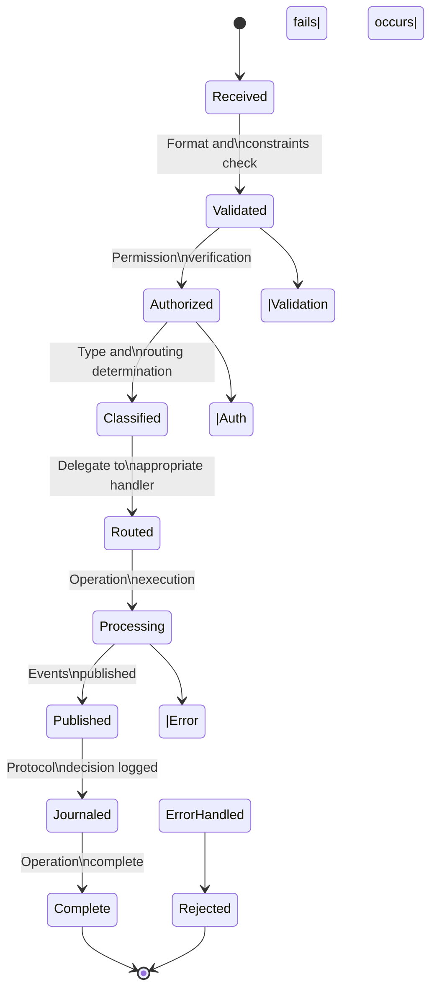
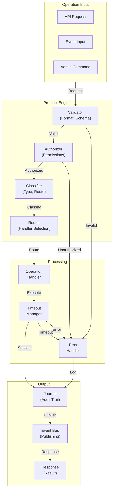

# 34. SO8FI Protocol Engine Standard

**Status:** Constitutional Engineering Standard  
**Version:** 1.0  
**Owner:** SO8FI Architecture  
**Classification:** Immutable Platform Specification  
**Effective Date:** 2026-07-04  
**Scope:** Platform-wide protocol coordination  

---

## 1. Purpose

### 1.1 Why the Protocol Engine Exists

The SO8FI Protocol Engine is the immutable behavioral coordinator of the platform. It exists because every operation—from user requests to system events to recovery procedures—must be validated, authorized, and classified before it affects platform state.

The Protocol Engine is **not a web server, API handler, or business logic engine**. It is the authoritative protocol coordinator that validates, authorizes, and routes every operation on the platform.

### 1.2 Why Protocols Matter

The SO8FI Operating System is built on a principle: **Protocols Before Logic**.

This means:

- Protocol validation happens first.
- Authorization happens before state changes.
- Operations are classified before routing.
- Timeouts and retries are enforced uniformly.
- Errors are handled consistently.

Without the Protocol Engine:

- Invalid operations would be accepted.
- Unauthorized operations would be processed.
- Operations would bypass security checks.
- Failures would be handled inconsistently.
- The platform would be chaotic and unsafe.

The Protocol Engine makes the platform safe, predictable, and consistent.

### 1.3 Scope and Independence

The Protocol Engine defines:

- How operations are validated.
- How operations are authorized.
- How operations are classified.
- How operations are routed.
- How failures are handled.
- How timeouts are enforced.
- How retries are coordinated.

The Protocol Engine does NOT define:

- Business logic or workflows.
- Data models or storage.
- UI behavior or presentation.
- Marketplace rules or transactions.

The Protocol Engine is independent. Business modules depend on Protocol Engine; Protocol Engine does not depend on business modules.

---

## 2. Responsibilities

The Protocol Engine is responsible for:

### 2.1 Protocol Validation

Protocol Engine validates every operation:

- Request format is valid.
- Required fields are present.
- Data types are correct.
- Constraints are satisfied.
- Invalid requests are rejected immediately.

**Scope:** Complete request validation before processing.

### 2.2 Authorization

Protocol Engine authorizes operations:

- Identity is verified.
- Permissions are checked.
- Policies are enforced.
- Unauthorized operations are rejected.
- Authorization decisions are journaled.

**Scope:** Authorization enforcement for all operations.

### 2.3 Operation Classification

Protocol Engine classifies operations:

- Determines operation type (read, write, delete, etc.)
- Classifies as business or system operation
- Identifies affected resources
- Determines journal record type

**Scope:** Operation routing and classification.

### 2.4 Protocol Lifecycle Management

Protocol Engine manages protocol lifecycle:

- Validates protocol format
- Authorizes protocol execution
- Classifies protocol type
- Routes to appropriate handler
- Confirms completion

**Scope:** Complete protocol processing lifecycle.

### 2.5 Business Protocol Handling

Protocol Engine handles business protocols:

- User requests
- Transaction operations
- Workflow initiation
- Data modifications
- Business decisions

**Scope:** Business operation coordination (not execution).

### 2.6 System Protocol Handling

Protocol Engine handles system protocols:

- Initialization events
- Recovery operations
- Snapshot operations
- Migration operations
- Administrative commands

**Scope:** System operation coordination.

### 2.7 Error Handling

Protocol Engine handles errors uniformly:

- Validation errors are caught.
- Authorization errors are caught.
- Processing errors are logged.
- Errors are returned consistently.
- Error handling is journaled.

**Scope:** Uniform error handling across all operations.

### 2.8 Timeout Enforcement

Protocol Engine enforces timeouts:

- Operations have defined timeout windows.
- Timeouts are enforced uniformly.
- Timed-out operations are aborted.
- Timeout events are journaled.

**Scope:** Timeout management and enforcement.

### 2.9 Retry Coordination

Protocol Engine coordinates retries:

- Retry policies are defined per operation type.
- Retries are logged and tracked.
- Exponential backoff is applied.
- Max retries are enforced.

**Scope:** Retry orchestration and enforcement.

### 2.10 Event Publishing

Protocol Engine publishes events:

- Validated operations generate events.
- Events are classified and journaled.
- Events are published to subscribers.
- Success is confirmed and journaled.

**Scope:** Event publication and confirmation.

---

## 3. Immutable Protocol Laws

The following laws are immutable and constitute the architectural law of the SO8FI Protocol Engine. No implementation, administrator, or external system may violate these laws.

### 3.1 Law of Validation First

**Law:** Validation happens before authorization.

**Invariant:** Every operation is validated for correctness before any authorization decision is made. Invalid requests are rejected immediately; they never reach authorization or processing stages.

**Consequence:** If an invalid operation is processed, the protocol has been violated.

### 3.2 Law of Authorization Gate

**Law:** Authorization is mandatory and happens before processing.

**Invariant:** Every operation that affects state, identity, or data must pass authorization before it is processed. There is no bypass. Unauthorized operations are rejected.

**Consequence:** If an unauthorized operation is processed, the protocol has been violated.

### 3.3 Law of Operation Classification

**Law:** Every operation is classified.

**Invariant:** Every validated and authorized operation receives a classification (business protocol, system protocol, read operation, write operation, etc.). Classification determines routing and handling.

**Consequence:** If an operation has no classification, it has not entered the protocol lifecycle.

### 3.4 Law of Uniform Error Handling

**Law:** All errors are handled uniformly.

**Invariant:** Validation errors, authorization errors, processing errors, and system errors are all caught and handled consistently. Error responses are standardized. Errors are journaled.

**Consequence:** If errors are handled inconsistently, debugging and recovery are compromised.

### 3.5 Law of Timeout Enforcement

**Law:** Timeouts are enforced for all operations.

**Invariant:** Every operation has a defined timeout. If the operation exceeds the timeout, it is terminated. Timeout violations are journaled. Timeouts are never bypassed.

**Consequence:** If timeouts are not enforced, resource exhaustion and cascading failures can occur.

### 3.6 Law of Journaled Decisions

**Law:** Protocol decisions are journaled.

**Invariant:** Every protocol decision (validation pass/fail, authorization pass/fail, classification, routing decision) is recorded in the Journal. Authorization decisions are journaled as audit events.

**Consequence:** If protocol decisions are not journaled, auditing and compliance are compromised.

### 3.7 Law of Immutable Protocol

**Law:** Protocols do not execute business logic.

**Invariant:** The Protocol Engine validates, authorizes, classifies, and routes operations. It does not:

- Execute business workflows.
- Modify business data directly.
- Calculate business results.
- Make business decisions.

Business logic is delegated to business modules.

**Consequence:** If the Protocol Engine executes business logic, business and platform concerns become entangled.

### 3.8 Law of Protocol Independence

**Law:** Protocols are independent from business modules.

**Invariant:** The Protocol Engine operates independent from business concerns. Business modules invoke Protocol Engine; Protocol Engine does not invoke business modules.

**Consequence:** If Protocol Engine depends on business modules, platform stability is compromised.

### 3.9 Law of Centralized Protocol Authority

**Law:** Only Protocol Engine enforces protocols.

**Invariant:** Protocol validation, authorization, classification, and routing flow through Protocol Engine. There is no bypass mechanism. No component may bypass Protocol Engine for protocol decisions.

**Consequence:** If protocol enforcement is bypassed, security and consistency are compromised.

### 3.10 Law of No Business Data Ownership

**Law:** Protocol Engine does not own business data.

**Invariant:** The Protocol Engine:

- Does not persist business state.
- Does not store business data.
- Does not calculate business results.
- Routes operations to appropriate handlers.

Business data is owned by business modules and Identity Core; Protocol Engine is stateless.

**Consequence:** If Protocol Engine stores business data, separation of concerns is violated.

---

## 4. Protocol Lifecycle

Every operation flows through a defined protocol lifecycle.



### 4.1 Stage: Received

**Condition:** Operation is received by Protocol Engine.

**Actions:**
- Operation is captured.
- Initial context is established.
- Validation preparation begins.

**Responsibility:** Protocol Engine entry point

**Duration:** Instantaneous

**Next Stage:** Validated

### 4.2 Stage: Validated

**Condition:** Operation is validated for correctness.

**Actions:**
- Request format is checked.
- Required fields are verified.
- Data types are validated.
- Constraints are checked.

**Responsibility:** Protocol Engine validator

**Duration:** Immediate

**Next Stage:** Authorized

**Failure Path:** Rejected; error is logged and journaled

### 4.3 Stage: Authorized

**Condition:** Operation is authorized for execution.

**Actions:**
- Identity is verified.
- Permissions are checked.
- Policies are enforced.
- Authorization decision is made.

**Responsibility:** Protocol Engine + Authorization system

**Duration:** Immediate

**Next Stage:** Classified

**Failure Path:** Rejected; authorization failure is journaled as audit event

### 4.4 Stage: Classified

**Condition:** Operation type and routing are determined.

**Actions:**
- Operation type is classified.
- Resource type is identified.
- Appropriate handler is selected.
- Routing decision is made.

**Responsibility:** Protocol Engine classifier

**Duration:** Immediate

**Next Stage:** Routed

### 4.5 Stage: Routed

**Condition:** Operation is routed to appropriate handler.

**Actions:**
- Operation is delegated to handler.
- Handler processes operation.
- Handler reports result.

**Responsibility:** Protocol Engine router

**Duration:** Depends on operation

**Next Stage:** Processing

### 4.6 Stage: Processing

**Condition:** Handler processes the operation.

**Actions:**
- Business logic executes (if applicable).
- State is modified (if applicable).
- Results are generated.
- Errors are caught.

**Responsibility:** Operation handler

**Duration:** Operation-dependent

**Next Stage:** Published

**Error Path:** ErrorHandled

### 4.7 Stage: Published

**Condition:** Operation results are published as events.

**Actions:**
- Success/failure event is created.
- Event is classified.
- Event is published to subscribers.
- Event confirmations are received.

**Responsibility:** Event Bus

**Duration:** Immediate

**Next Stage:** Journaled

### 4.8 Stage: Journaled

**Condition:** Protocol decision is journaled.

**Actions:**
- Protocol decision is recorded.
- Authorization decision is logged.
- Operation classification is stored.
- Complete audit trail is preserved.

**Responsibility:** Journal

**Duration:** Immediate

**Next Stage:** Complete

### 4.9 Stage: Complete

**Condition:** Protocol processing is complete.

**Actions:**
- Response is returned to requester.
- Operation is marked complete.
- Cleanup (if needed) proceeds.

**Responsibility:** Protocol Engine

**Duration:** Instantaneous

**Next Stage:** [End]

---

## 5. Protocol Validation

### 5.1 Validation Rules

Every operation is validated against:

- Schema constraints
- Type requirements
- Cardinality rules
- Dependency rules
- Business constraints

### 5.2 Validation Errors

Validation errors include:

- Missing required fields
- Incorrect data types
- Constraint violations
- Malformed requests
- Out-of-range values

### 5.3 Validation Response

When validation fails:

- Operation is rejected immediately.
- Error details are returned.
- Rejection is logged.
- Rejection is journaled.

---

## 6. Authorization

### 6.1 Authorization Rules

Authorization is determined by:

- Identity verification (Who are you?)
- Permission checking (What can you do?)
- Policy enforcement (Are you allowed?)
- Delegation verification (Is this delegated to you?)

### 6.2 Authorization Decisions

Authorization makes binary decisions:

- Authorized: operation proceeds.
- Unauthorized: operation is rejected.
- Ambiguous: operation is rejected (default deny).

### 6.3 Authorization Journaling

Authorization decisions are:

- Always journaled.
- Classified as audit events.
- Preserved permanently.
- Auditable for compliance.

---

## 7. Operation Classification

### 7.1 Business Protocols

Business protocols are operations initiated by business modules:

- User requests
- Transaction operations
- Data modifications
- Workflow initiation
- Report generation

### 7.2 System Protocols

System protocols are operations initiated by platform infrastructure:

- Initialization events
- Recovery operations
- Snapshot operations
- Migration operations
- Administrative commands

### 7.3 Protocol Types

| Protocol Type | Source | Processing |
|---|---|---|
| **Read** | User/System | Query data; no state change |
| **Write** | User/System | Modify data; journaled |
| **Delete** | User/System | Remove data; journaled |
| **Admin** | Admin only | Administrative action; journaled |
| **System** | Internal only | System operation; journaled |

---

## 8. Error Handling

### 8.1 Error Classification

Errors are classified as:

- **Validation Error:** Request format is invalid.
- **Authorization Error:** Operation is not permitted.
- **Processing Error:** Operation execution fails.
- **Timeout Error:** Operation exceeds timeout.
- **System Error:** Platform error occurs.

### 8.2 Error Handling

All errors are:

- Caught and logged.
- Classified and tracked.
- Journaled with context.
- Returned to requester with safe message.
- Never exposed with internal details.

### 8.3 Error Recovery

Error recovery:

- Retry logic is applied if appropriate.
- Backoff strategy is enforced.
- Manual intervention may be required.
- All recovery attempts are journaled.

---

## 9. Timeout Rules

### 9.1 Timeout Policies

| Operation Type | Default Timeout | Max Retries |
|---|---|---|
| Read | 5 seconds | 3 |
| Write | 10 seconds | 2 |
| Delete | 15 seconds | 1 |
| Admin | 30 seconds | 1 |
| System | 60 seconds | 1 |

### 9.2 Timeout Handling

When timeout occurs:

- Operation is terminated.
- Timeout event is logged.
- Rollback is initiated (if applicable).
- Timeout is journaled.
- Requester is notified.

### 9.3 Timeout Enforcement

Timeouts are:

- Enforced uniformly across all operations.
- Never bypassed.
- Configurable per operation type.
- Strict (no grace periods).

---

## 10. Retry Rules

### 10.1 Retry Policies

Retries are applied:

- On transient failures (network, timeout).
- Not on permanent failures (authorization, validation).
- With exponential backoff.
- With maximum retry limits.

### 10.2 Retry Strategy

```
Initial Delay: 100ms
Backoff Factor: 2
Max Backoff: 10 seconds
Max Retries: 3
```

### 10.3 Retry Limits

| Retry Type | Max Attempts |
|---|---|
| Transient failure | 3 |
| Timeout | 2 |
| Conflict | 3 |
| System error | 1 |

---

## 11. Protocol Events

### 11.1 Protocol Events

Protocol operations generate events:

- **Validation Passed:** Operation is valid.
- **Validation Failed:** Operation is invalid.
- **Authorization Passed:** Operation is authorized.
- **Authorization Failed:** Operation is unauthorized.
- **Operation Started:** Processing begins.
- **Operation Completed:** Processing succeeds.
- **Operation Failed:** Processing fails.
- **Operation Timeout:** Operation exceeds timeout.
- **Operation Retried:** Retry is attempted.

### 11.2 Event Classification

Protocol events are classified as:

- **Audit Events:** Authorization decisions, administrative actions.
- **Operational Events:** Read/write operations, normal processing.
- **System Events:** Timeouts, retries, errors.

All protocol events are journaled.

---

## 12. Protocol Interfaces

### 12.1 Protocol Validator Interface

```
interface ProtocolValidator {
    validate(request: ProtocolRequest): ValidationResult
    addRule(rule: ValidationRule): void
    removeRule(ruleId: string): void
}
```

**Scope:** Request validation.

### 12.2 Protocol Authorizer Interface

```
interface ProtocolAuthorizer {
    authorize(
        identity: NumericId,
        operation: string,
        resource: string
    ): AuthorizationResult
    
    addPolicy(policy: AuthPolicy): void
    removePolicy(policyId: string): void
}
```

**Scope:** Authorization decisions.

### 12.3 Protocol Router Interface

```
interface ProtocolRouter {
    route(
        operation: ProtocolOperation
    ): ProtocolHandler
    
    register(operationType: string, handler: ProtocolHandler): void
}
```

**Scope:** Operation routing and classification.

### 12.4 Protocol Engine Interface

```
interface ProtocolEngine {
    execute(request: ProtocolRequest): ProtocolResponse
    
    addValidator(validator: ProtocolValidator): void
    addAuthorizer(authorizer: ProtocolAuthorizer): void
    addRouter(router: ProtocolRouter): void
}
```

**Scope:** Complete protocol orchestration.

---

## 13. Protocol Security

### 13.1 Forbidden Operations

❌ Bypassing validation  
❌ Bypassing authorization  
❌ Modifying protocol decisions  
❌ Skipping timeout enforcement  
❌ Ignoring errors  
❌ Unlogged operations  
❌ Unjouraled protocol decisions  
❌ Direct state modification without protocol  

### 13.2 Security Principles

- **Validate First:** All operations are validated before processing.
- **Authorize Always:** All operations are authorized before processing.
- **Journal Completely:** All protocol decisions are journaled.
- **Handle Errors:** All errors are caught and handled uniformly.
- **Enforce Timeouts:** All timeouts are enforced without exception.

---

## 14. Architecture Diagram



---

## 15. Integration Requirements

### 15.1 Time Core Integration

- Protocol operations are timestamped by Time Core.
- Protocol decisions are ordered by Time Core.
- Timeout enforcement uses Time Core timing.

### 15.2 Identity Core Integration

- Protocol verifies identity before authorization.
- Authorization is linked to identity numeric ID.
- Protocol decisions are traced to identity.

### 15.3 Journal Integration

- All protocol decisions are journaled.
- Authorization decisions are journaled as audit events.
- Protocol lifecycle is tracked in journal.

### 15.4 Event Bus Integration

- Protocol publishes operation events.
- Events are classified and routed.
- Event publishing confirms operation completion.

---

## 16. Governance

### 16.1 Standard Classification

- **Status:** Constitutional Engineering Standard
- **Version:** 1.0
- **Effective Date:** 2026-07-04
- **Owner:** SO8FI Architecture

### 16.2 Compliance

**Every implementation of the Protocol Engine must conform to this standard exactly.**

Non-conforming implementations are architecture violations.

---

## 17. Conclusion

The SO8FI Protocol Engine is the immutable behavioral coordinator of the platform. Every operation is validated, authorized, classified, and routed. Every protocol decision is journaled. Every error is handled uniformly.

The Protocol Engine Standard establishes the immutable laws that make the platform safe, predictable, and auditable.

---

**End of SO8FI Protocol Engine Standard, Version 1.0**
