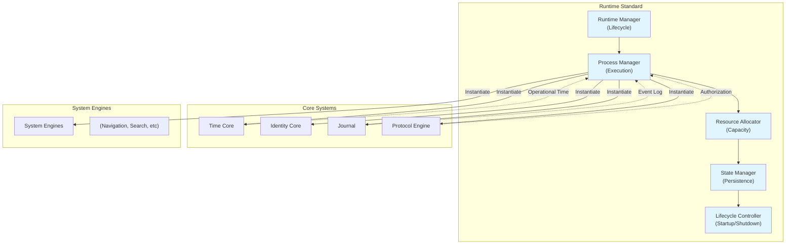

# 42. RUNTIME STANDARD

**Version:** 1.0  
**Status:** ✓ APPROVED  
**Date:** 2026-07-04  
**Type:** Operating System Foundation Pack III  
**Classification:** Constitutional Standard

## PURPOSE

The Runtime Standard establishes the immutable laws, architectural contracts, and governance procedures for the SO8FI Runtime Environment. The runtime is the execution substrate that instantiates all Core Systems, System Engines, and Business Modules. It manages process lifecycle, resource allocation, concurrency control, and operational state—without permitting business logic or domain-specific state to be embedded within runtime infrastructure.

The runtime is fundamentally a **platform orchestrator**, not a business executor.

## ARCHITECTURE



## RESPONSIBILITIES

### Runtime Manager
- Supervise the entire runtime lifecycle: initialization, operation, degradation, shutdown
- Maintain runtime invariants (no business logic, no domain state)
- Coordinate with Time Core for operational time
- Dispatch lifecycle events through Journal
- Monitor process health and resource utilization
- Enforce contract boundaries between Core Systems, System Engines, and Business Modules

### Process Manager
- Instantiate and manage Core System processes
- Instantiate and manage System Engine processes
- Instantiate and manage Business Module processes
- Maintain process registries and metadata
- Execute startup and shutdown procedures
- Enforce initialization order (Time Core → Identity Core → Journal → Protocol Engine → Engines → Modules)
- Implement graceful degradation on failure

### Resource Allocator
- Track available computational resources (CPU, memory, I/O, network)
- Allocate resources to processes based on declared requirements
- Implement resource quota enforcement
- Prevent resource starvation
- Support dynamic reallocation and backpressure
- Report resource utilization metrics to Monitoring

### State Manager
- Provide durable persistence for operational state
- Replay state from Journal on startup
- Coordinate checkpoint and recovery procedures
- Implement snapshot management and compaction
- Support deterministic state reconstruction
- Enforce immutability of persisted state
- Manage state versioning and compatibility

### Lifecycle Controller
- Execute startup procedures in correct order
- Verify dependencies are satisfied before process instantiation
- Execute shutdown procedures in reverse order
- Implement graceful degradation strategies
- Handle emergency shutdown scenarios
- Coordinate with Protocol Engine for authorization
- Log all lifecycle transitions through Journal

## IMMUTABLE LAWS

1. **Law of Platform Neutrality:** The runtime shall contain no business logic, domain-specific state, or application-specific decisions. The runtime is a platform orchestrator, not a business executor.

2. **Law of Core System Priority:** The runtime shall instantiate Core Systems (Time Core, Identity Core, Journal, Protocol Engine) before any System Engine or Business Module.

3. **Law of Time Coordination:** All runtime operations shall respect operational time from Time Core. No real-time dependencies or wall-clock assumptions permitted in runtime orchestration.

4. **Law of Event Recording:** All runtime lifecycle events (startup, shutdown, process creation, resource allocation, state transitions) shall be recorded immutably through Journal before becoming effective.

5. **Law of Authorization Enforcement:** No process instantiation, resource allocation, or lifecycle transition shall occur without explicit authorization from Protocol Engine.

6. **Law of Process Isolation:** Each Core System, System Engine, and Business Module shall operate in a distinct process context with isolated state. No shared mutable state permitted at runtime level.

7. **Law of Deterministic Recovery:** The runtime state shall be reconstructible deterministically from Journal events without any ephemeral state. All recovery must be repeatable and verifiable.

8. **Law of Contract Boundary:** The runtime shall enforce strict separation between platform infrastructure (Core Systems, System Engines) and business logic (Business Modules). No blurring of these boundaries permitted.

9. **Law of Explicit Dependency:** Process dependencies shall be declared explicitly. No implicit dependencies, dynamic dependency discovery, or circular dependencies permitted in runtime.

10. **Law of Graceful Degradation:** When process failure occurs, the runtime shall degrade gracefully (preserve operational state, continue critical services, log failure context) rather than cascading into complete system failure.

## INTERFACE CONTRACTS

### Interface 1: RuntimeManager

```typescript
interface RuntimeManager {
  // Initialization
  initialize(config: RuntimeConfig): Promise<void>;
  
  // Lifecycle management
  startupSequence(): Promise<ProcessRegistry>;
  shutdownSequence(): Promise<void>;
  
  // Health and status
  getStatus(): RuntimeStatus;
  getProcessRegistry(): ProcessRegistry;
  
  // Event coordination
  publishLifecycleEvent(event: LifecycleEvent): Promise<void>;
  subscribeToLifecycleEvents(handler: LifecycleEventHandler): void;
  
  // Error handling
  handleProcessFailure(processId: string, error: Error): Promise<RecoveryStrategy>;
  initiateEmergencyShutdown(): Promise<void>;
}
```

### Interface 2: ProcessManager

```typescript
interface ProcessManager {
  // Process instantiation
  instantiateProcess(
    processType: ProcessType,
    config: ProcessConfig,
    dependencies: ProcessDependency[]
  ): Promise<ProcessInstance>;
  
  // Process lifecycle
  startProcess(processId: string): Promise<void>;
  stopProcess(processId: string): Promise<void>;
  restartProcess(processId: string): Promise<void>;
  
  // Process registry
  getProcess(processId: string): ProcessInstance | null;
  getAllProcesses(): ProcessInstance[];
  getProcessesByType(type: ProcessType): ProcessInstance[];
  
  // Process communication (contract-based only)
  invokeProcessContract(
    sourceProcessId: string,
    targetProcessId: string,
    contract: ContractInvocation
  ): Promise<ContractResponse>;
}
```

### Interface 3: ResourceAllocator

```typescript
interface ResourceAllocator {
  // Resource allocation
  allocateResources(
    processId: string,
    requirements: ResourceRequirements
  ): Promise<ResourceAllocation>;
  
  // Resource monitoring
  getAvailableResources(): ResourceStatus;
  getProcessResourceUsage(processId: string): ResourceMetrics;
  getAllResourceUsage(): Map<string, ResourceMetrics>;
  
  // Resource enforcement
  enforceQuota(processId: string): Promise<void>;
  applyBackpressure(processId: string): Promise<void>;
  
  // Dynamic reallocation
  reallocateResources(redistributionPlan: ResourceRedistribution): Promise<void>;
}
```

### Interface 4: StateManager

```typescript
interface StateManager {
  // State persistence
  persistState(processId: string, state: OperationalState): Promise<void>;
  retrieveState(processId: string): Promise<OperationalState>;
  
  // Snapshots and recovery
  createSnapshot(processId: string, label: string): Promise<SnapshotMetadata>;
  restoreFromSnapshot(processId: string, snapshotId: string): Promise<void>;
  compactSnapshots(processId: string): Promise<void>;
  
  // State verification
  verifyStateIntegrity(processId: string): Promise<IntegrityReport>;
  reconstructFromJournal(processId: string): Promise<OperationalState>;
  
  // Versioning
  getStateVersion(processId: string): string;
  migrateStateVersion(processId: string, targetVersion: string): Promise<void>;
}
```

### Interface 5: LifecycleController

```typescript
interface LifecycleController {
  // Startup
  executeStartupProcedure(
    startupPlan: StartupPlan
  ): Promise<StartupResult>;
  verifyDependencies(processes: ProcessInstance[]): Promise<boolean>;
  
  // Shutdown
  executeShutdownProcedure(
    shutdownMode: ShutdownMode
  ): Promise<ShutdownResult>;
  
  // Degradation
  initiateDegradedMode(): Promise<void>;
  exitDegradedMode(): Promise<void>;
  
  // Monitoring
  getLifecycleStatus(): LifecycleStatus;
  subscribeToLifecycleTransitions(handler: TransitionHandler): void;
}
```

## SECURITY RULES

### Forbidden Operations

- **NO business logic in runtime** — Only platform orchestration permitted
- **NO direct state modification** — All state changes must be journal-recorded
- **NO process bypassing Protocol Engine** — All authorizations must be verified
- **NO implicit dependencies** — All dependencies must be declared explicitly
- **NO circular process dependencies** — Dependency graph must be acyclic
- **NO shared mutable state at runtime level** — Each process has isolated state
- **NO runtime-level business decisions** — All decisions delegated to Platform or Business Modules
- **NO external persistence without Journal** — State must be journal-recorded before persisted
- **NO unauthenticated process operations** — Identity Core verification required
- **NO timeout-based decisions** — All time-based decisions through Time Core

### Security Contracts

- All process instantiation logged through Journal with initiator identity
- All resource allocations verified against Process-level permission contracts
- All process communications validated against Protocol Engine authorization
- All state transitions verified for integrity with cryptographic checksums
- All recovery procedures verified for determinism and repeatability

## DEPENDENCIES

### Required Core Systems
- **Time Core:** Operational time for all lifecycle decisions
- **Identity Core:** Process identity and authentication
- **Journal:** Immutable recording of all lifecycle events
- **Protocol Engine:** Authorization for all process operations

### Required System Engines
- **Monitoring Engine:** Real-time observability of runtime health
- **Backup Engine:** State persistence and recovery
- **Deployment Engine:** Runtime instantiation and updates

### Platform Services
- Resource management infrastructure
- Process isolation mechanisms
- State persistence infrastructure

## RECOVERY

### Process Failure Recovery
1. Log failure through Journal with failure context
2. Consult Protocol Engine for failure response authorization
3. Attempt graceful shutdown of failed process
4. Trigger backpressure on dependent processes
5. Optionally restart process based on recovery policy
6. Notify operators through Notification Engine

### State Recovery
1. Reconstruct operational state from Journal events
2. Verify state integrity with checksums
3. Apply snapshot if available for efficiency
4. Validate recovered state against contracts
5. Resume process with recovered state

### Cascading Failure Recovery
1. Identify process failure pattern
2. Degrade non-critical services
3. Preserve Core Systems (Time, Identity, Journal, Protocol)
4. Initiate controlled shutdown if unrecoverable
5. Prepare for disaster recovery procedures

## VALIDATION

### Immutable Law Verification
- Automated tests verify no business logic in runtime code
- Architecture analysis confirms process isolation enforcement
- Dependency graph analysis confirms acyclic dependencies
- Journal audit confirms all lifecycle events recorded

### Contract Verification
- Runtime Manager contract implementation verified
- Process Manager process ordering verified
- Resource Allocator quota enforcement verified
- State Manager deterministic recovery verified
- Lifecycle Controller startup/shutdown sequencing verified

### Performance Validation
- Process startup time < 1 second per Core System
- Process startup time < 500ms per System Engine
- Resource allocation time < 100ms
- State persistence latency < 50ms
- Recovery time < 5 seconds for standard failures

### Security Validation
- Protocol Engine authorization required for all privileged operations
- No business state stored at runtime level
- All state changes journal-recorded
- All process identities verified through Identity Core

## GOVERNANCE

### Approval Authority
**Runtime Governance Council** (Architecture + Operations + Security)

### Change Management
- All runtime changes require full council approval
- Changes must preserve all immutable laws
- Changes must maintain backward compatibility with persisted state
- Changes must include comprehensive recovery testing

### Monitoring and Compliance
- Continuous monitoring of runtime law compliance
- Weekly process health reports
- Monthly resource utilization analysis
- Quarterly disaster recovery drills

### Incident Response
- Critical runtime failures escalated to Governance Council
- Failure post-mortems mandatory within 48 hours
- All incidents documented in permanent record
- Recovery procedures updated based on incident analysis

---

**Document ID:** 42  
**Classification:** Constitutional Standard  
**Immutable Laws:** 10  
**Interface Contracts:** 5  
**Approved by:** SO8FI Governance Council  
**Effective Date:** 2026-07-04
