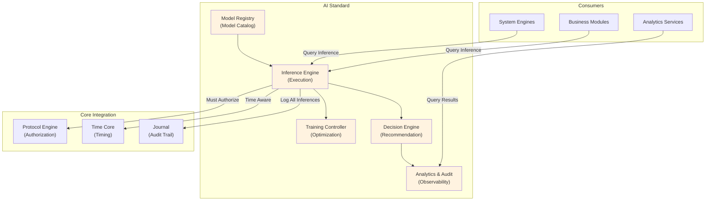

# 43. AI STANDARD

**Version:** 1.0  
**Status:** ✓ APPROVED  
**Date:** 2026-07-04  
**Type:** Operating System Foundation Pack III  
**Classification:** Constitutional Standard

## PURPOSE

The AI Standard establishes the immutable laws, architectural contracts, and governance procedures for AI and Machine Learning integration within the SO8FI Operating System. AI systems provide intelligent capabilities (inference, natural language processing, decision support) to all platform layers—Core Systems, System Engines, Business Modules—while maintaining strict adherence to contract boundaries, governance rules, and explainability requirements.

AI is a **capability layer**, not a decision layer. All AI outputs are recommendations subject to platform governance.

## ARCHITECTURE



## RESPONSIBILITIES

### Model Registry
- Maintain catalog of approved AI models with versions
- Track model lineage, training data, and validation metrics
- Enforce model approval workflow before deployment
- Store model metadata, performance baselines, and constraints
- Support model versioning and rollback
- Record model creation, updates, and deployments through Journal

### Inference Engine
- Execute approved models on input data
- Ensure all inferences are authorized by Protocol Engine
- Record all inferences with input, output, model version, and confidence
- Support batch and real-time inference modes
- Implement inference result caching with time-based invalidation
- Provide inference explainability (feature attribution, decision paths)
- Enforce inference quotas and rate limiting per consumer

### Training Controller
- Orchestrate model training on authorized datasets
- Verify training data has proper consent and retention
- Record all training operations through Journal
- Implement model validation before promotion to production
- Support model A/B testing and gradual rollout
- Enforce training job isolation (no data leakage between jobs)
- Report training metrics and model performance evolution

### Decision Engine
- Convert AI model outputs into platform recommendations
- Apply business rules and governance policies to AI outputs
- Rank multiple recommendations by confidence and business priority
- Provide justification and audit trail for each recommendation
- Support human review and override of recommendations
- Integrate with approval workflows through Protocol Engine
- Publish decisions through Platform Event System

### Analytics & Audit
- Collect comprehensive metrics on all AI operations
- Track model performance in production
- Detect model drift and performance degradation
- Maintain audit trail of all inferences for compliance
- Generate AI usage reports and cost analysis
- Monitor for bias and fairness issues
- Support root cause analysis on failed inferences

## IMMUTABLE LAWS

1. **Law of Model Governance:** All AI models must be explicitly registered, approved, and versioned through Model Registry. No unregistered, unapproved, or unversioned models permitted in production.

2. **Law of Inference Authorization:** Every AI inference must be authorized by Protocol Engine before execution. No inferences can bypass authorization framework.

3. **Law of Explainability:** All AI inferences must provide explicit justification and confidence metrics. No "black box" inferences permitted that cannot be explained to human operators.

4. **Law of Complete Audit:** All AI operations (inference, training, model updates, decisions) must be recorded immutably through Journal. Complete audit trail mandatory for compliance and debugging.

5. **Law of Data Consent:** No AI model can use personal data without explicit consent record verified through Identity Core. Training data must have valid retention policy.

6. **Law of Time Awareness:** All AI operations (inference, training, scheduling) must respect operational time from Time Core. No wall-clock dependencies permitted.

7. **Law of Non-Determinism Isolation:** Non-deterministic AI outputs (probabilistic models) must be isolated from deterministic platform systems. All non-determinism must be explicitly marked and audited.

8. **Law of Recommendation vs. Decision:** AI systems generate recommendations only. All final decisions must pass through Protocol Engine and governance approval. AI cannot directly make platform decisions.

9. **Law of Fairness Enforcement:** All AI models must be tested for bias, fairness, and discrimination. Fairness violations must be detected automatically and escalated to governance.

10. **Law of Model Drift Detection:** Production models must be continuously monitored for performance degradation. Model drift must be detected and escalated before decisions based on degraded models.

## INTERFACE CONTRACTS

### Interface 1: ModelRegistry

```typescript
interface ModelRegistry {
  // Model registration
  registerModel(
    modelMetadata: ModelMetadata,
    modelData: Buffer,
    trainingData: DatasetReference
  ): Promise<ModelVersion>;
  
  // Model approval
  submitForApproval(modelVersion: ModelVersion): Promise<void>;
  approveModel(modelVersion: ModelVersion, approval: ApprovalDecision): Promise<void>;
  deployToProduction(modelVersion: ModelVersion): Promise<void>;
  
  // Model retrieval
  getModel(modelId: string, version?: string): Promise<Model>;
  listModels(): Promise<ModelVersion[]>;
  getModelLineage(modelId: string): Promise<ModelLineage>;
  
  // Model versioning
  rollbackModel(modelId: string, targetVersion: string): Promise<void>;
  deprecateModel(modelId: string): Promise<void>;
  
  // Audit
  getModelAuditTrail(modelId: string): Promise<AuditEvent[]>;
}
```

### Interface 2: InferenceEngine

```typescript
interface InferenceEngine {
  // Inference execution
  executeInference(
    modelId: string,
    input: InferenceInput,
    context: ExecutionContext
  ): Promise<InferenceResult>;
  
  // Batch inference
  executeBatchInference(
    modelId: string,
    inputs: InferenceInput[],
    context: ExecutionContext
  ): Promise<InferenceResult[]>;
  
  // Result management
  getInferenceResult(inferenceId: string): Promise<InferenceResult>;
  getInferenceHistory(modelId: string, limit: number): Promise<InferenceResult[]>;
  
  // Explainability
  getInferenceExplanation(inferenceId: string): Promise<ExplanationReport>;
  getFeatureAttribution(inferenceId: string): Promise<FeatureAttributionMap>;
  
  // Caching and optimization
  getCachedInference(inputHash: string): Promise<InferenceResult | null>;
  precomputeFrequentInferences(): Promise<void>;
}
```

### Interface 3: TrainingController

```typescript
interface TrainingController {
  // Training orchestration
  submitTrainingJob(
    trainingSpec: TrainingSpecification,
    datasetRef: DatasetReference,
    approver: Identity
  ): Promise<TrainingJobId>;
  
  // Job management
  getTrainingJobStatus(jobId: TrainingJobId): Promise<TrainingJobStatus>;
  cancelTrainingJob(jobId: TrainingJobId): Promise<void>;
  
  // Validation and promotion
  validateModel(trainedModel: Model): Promise<ValidationReport>;
  promoteModelVersion(
    trainedModel: Model,
    targetEnvironment: string
  ): Promise<ModelVersion>;
  
  // A/B testing
  initiateABTest(
    controlModel: ModelVersion,
    candidateModel: ModelVersion,
    testConfig: ABTestConfig
  ): Promise<ABTestId>;
  getABTestResults(testId: ABTestId): Promise<ABTestResults>;
  
  // Audit
  getTrainingAuditTrail(jobId: TrainingJobId): Promise<AuditEvent[]>;
}
```

### Interface 4: DecisionEngine

```typescript
interface DecisionEngine {
  // Decision generation
  generateDecision(
    recommendations: AIRecommendation[],
    businessContext: BusinessContext,
    policies: GovernancePolicy[]
  ): Promise<PlatformDecision>;
  
  // Decision ranking
  rankRecommendations(
    recommendations: AIRecommendation[],
    criteria: RankingCriteria
  ): Promise<RankedRecommendations>;
  
  // Decision justification
  getDecisionJustification(decisionId: string): Promise<DecisionJustification>;
  explainDecision(decisionId: string): Promise<ExplanationReport>;
  
  // Approval workflow
  submitForApproval(decision: PlatformDecision): Promise<void>;
  approveDecision(decisionId: string, approval: ApprovalContext): Promise<void>;
  rejectDecision(decisionId: string, reason: string): Promise<void>;
  
  // Override management
  overrideDecision(
    decisionId: string,
    override: DecisionOverride
  ): Promise<void>;
}
```

### Interface 5: Analytics & Audit

```typescript
interface AnalyticsAndAudit {
  // Metrics collection
  recordInferenceMetric(metric: InferenceMetric): Promise<void>;
  recordTrainingMetric(metric: TrainingMetric): Promise<void>;
  
  // Performance analysis
  getModelPerformanceReport(
    modelId: string,
    period: TimePeriod
  ): Promise<PerformanceReport>;
  
  // Drift detection
  detectModelDrift(modelId: string): Promise<DriftReport>;
  getModelDriftHistory(modelId: string): Promise<DriftEvent[]>;
  
  // Fairness analysis
  analyzeFairness(
    modelId: string,
    demographics: DemographicGroups
  ): Promise<FairnessReport>;
  
  // Audit and compliance
  generateAuditReport(
    startDate: DateTime,
    endDate: DateTime
  ): Promise<AuditReport>;
  
  // Anomaly detection
  detectAnomalies(
    modelId: string,
    threshold: number
  ): Promise<AnomalyReport>;
}
```

## SECURITY RULES

### Forbidden Operations

- **NO unregistered models** — All models must be in Model Registry
- **NO unapproved model deployments** — Approval workflow mandatory
- **NO inference without authorization** — Protocol Engine verification required
- **NO black box inferences** — All inferences must be explainable
- **NO data without consent verification** — Consent audit trail required
- **NO business decisions by AI directly** — All AI outputs are recommendations only
- **NO data leakage between training jobs** — Job isolation enforced
- **NO model drift in production undetected** — Continuous monitoring mandatory
- **NO fairness violations unpunished** — Bias detection automated
- **NO inference without audit trail** — Journal recording mandatory

### Security Contracts

- All model registration requires governance approval
- All training data must have valid consent records
- All inferences authorized by Protocol Engine before execution
- All results include confidence metrics and explainability
- All drift detection automated with escalation thresholds
- All fairness analysis reported to governance council

## DEPENDENCIES

### Required Core Systems
- **Time Core:** Operational time for all AI scheduling
- **Identity Core:** Data subject identity and consent verification
- **Journal:** Complete audit trail of all AI operations
- **Protocol Engine:** Authorization for all inferences and decisions

### Required System Engines
- **Search Engine:** Model discovery and retrieval
- **Monitoring Engine:** AI performance tracking
- **Notification Engine:** Alerts on model drift and fairness violations

### Infrastructure
- Model storage and versioning system
- Training compute infrastructure
- Inference acceleration hardware (optional)
- Analytics data warehouse

## RECOVERY

### Model Failure Recovery
1. Log inference failure through Journal
2. Alert Model Registry and governance council
3. Quarantine failed model from production
4. Initiate rollback to previous validated version
5. Execute retraining if systematic failure detected
6. Verify recovered model performance before resuming production

### Training Failure Recovery
1. Record training job failure with complete context
2. Preserve partial training state for diagnostics
3. Alert governance council of failure
4. Implement automatic retry with backoff
5. Preserve training data integrity (no data loss)
6. Allow manual investigation and restart

### Drift-Based Recovery
1. Detect model performance degradation
2. Alert operators through Monitoring Engine
3. Reduce inference confidence scores
4. Route low-confidence inferences to human review
5. Trigger retraining and validation
6. Resume full automation after validation

## VALIDATION

### Immutable Law Verification
- Automated scanning confirms all models registered and approved
- Audit analysis verifies all inferences authorized
- Fairness testing confirms bias detection working
- Explainability testing verifies all inferences have justification
- Consent verification confirms data usage authorization

### Contract Verification
- Model Registry stores all models with metadata
- Inference Engine enforces authorization requirement
- Training Controller isolates training jobs
- Decision Engine converts recommendations to decisions
- Analytics system captures all metrics

### Performance Validation
- Inference latency < 100ms (p99) for real-time models
- Batch inference throughput > 1000 inferences/second
- Training job startup < 5 minutes
- Model validation < 2 hours
- Drift detection latency < 1 hour

### Fairness and Bias Validation
- All models tested against protected characteristics
- Fairness metrics reported for all demographics
- Discrimination threshold violations escalated
- Bias detection accuracy > 95%
- False positive rate < 5%

## GOVERNANCE

### Approval Authority
**AI Governance Council** (Data Science + Ethics + Legal + Operations)

### Model Lifecycle Governance
- **Registration:** Technical review + governance approval
- **Training:** Data consent verification + oversight
- **Validation:** Fairness testing + performance validation
- **Deployment:** Final council approval + phased rollout
- **Monitoring:** Continuous drift and fairness monitoring
- **Retirement:** Controlled deprecation with archives

### Change Management
- All model changes require full council approval
- No production model updates without validation
- Rolling deployment mandatory (no big bang changes)
- Automatic rollback on fairness violations
- Complete audit trail of all model versions

### Monitoring and Compliance
- Daily fairness and bias reports
- Weekly model performance analysis
- Monthly comprehensive AI audit
- Quarterly governance council reviews
- Annual fairness certification required

### Incident Response
- Model drift incidents escalated immediately
- Fairness violations result in automatic quarantine
- Root cause analysis mandatory within 24 hours
- All incidents reviewed by governance council
- Public disclosure of fairness/bias incidents per regulations

---

**Document ID:** 43  
**Classification:** Constitutional Standard  
**Immutable Laws:** 10  
**Interface Contracts:** 5  
**Approved by:** SO8FI Governance Council  
**Effective Date:** 2026-07-04
