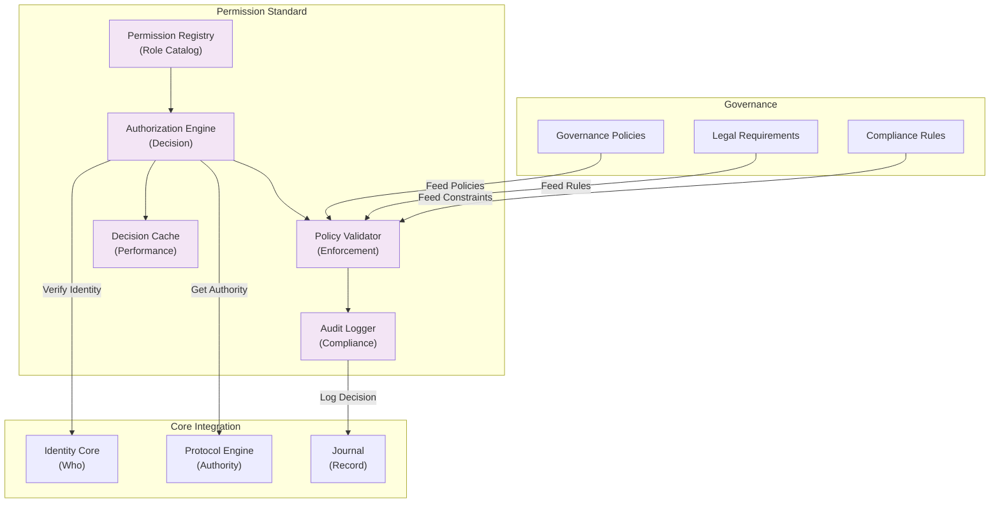

# 44. PERMISSION STANDARD

**Version:** 1.0  
**Status:** ✓ APPROVED  
**Date:** 2026-07-04  
**Type:** Operating System Foundation Pack III  
**Classification:** Constitutional Standard

## PURPOSE

The Permission Standard establishes the immutable laws, architectural contracts, and governance procedures for authorization and access control across the SO8FI Operating System. It enforces role-based access control (RBAC), permission verification, policy application, and comprehensive audit logging. Permissions provide the enforcement layer for governance policies—translating business rules and legal requirements into concrete, verifiable access decisions.

Permissions are the **bridge between governance policy and technical enforcement**.

## ARCHITECTURE



## RESPONSIBILITIES

### Permission Registry
- Maintain authoritative catalog of all roles, permissions, and capabilities
- Define role hierarchies and inheritance rules
- Support fine-grained permissions (object-level, attribute-level, operation-level)
- Track permission assignments to identities and roles
- Record all permission changes with audit trail
- Support dynamic role assignment with temporal validity
- Provide permission queries and discovery

### Authorization Engine
- Evaluate access requests against permissions and policies
- Verify identity through Identity Core
- Apply role-based access control rules
- Consider temporal constraints (valid from/until dates)
- Support delegation of authority with audit
- Cache authorization decisions with time-based expiration
- Log all authorization decisions through Journal

### Policy Validator
- Interpret business policies into enforcement rules
- Apply legal and compliance constraints
- Enforce data residency requirements
- Validate resource access against quotas
- Check for policy conflicts and inconsistencies
- Support policy versioning and rollback
- Provide policy change impact analysis

### Audit Logger
- Record all authorization decisions immutably
- Capture request context (who, what, when, where, why)
- Implement tamper-proof audit trail
- Support audit queries and reporting
- Generate compliance reports for regulators
- Detect suspicious access patterns
- Preserve audit trail for legal holds

### Decision Cache
- Cache authorization decisions with time-based expiration
- Invalidate cache on policy changes
- Support cache warm-up for common decisions
- Track cache hit/miss ratios for optimization
- Prevent cache poisoning attacks
- Provide cache statistics and analytics

## IMMUTABLE LAWS

1. **Law of Identity Verification:** Every authorization decision must verify the requesting identity through Identity Core. No anonymous access or assumed identity permitted.

2. **Law of Explicit Permission:** No access is permitted without explicit authorization. Default deny principle enforced universally.

3. **Law of Policy Supremacy:** Governance policies, legal requirements, and compliance rules always take precedence over role permissions. Policies override roles.

4. **Law of Temporal Validity:** All permissions must respect temporal constraints. Permissions have explicit validity periods, auto-expiring when appropriate.

5. **Law of Audit Completeness:** All authorization decisions (grant, deny, cache hit, policy violation) must be recorded immutably through Journal. Complete audit trail mandatory.

6. **Law of Delegation Accountability:** When authority is delegated, the delegator remains accountable for delegatee actions. Delegation chain must be traceable.

7. **Law of Separation of Duties:** Critical operations require multiple independent authorization decisions. No single person can authorize sensitive operations.

8. **Law of Revocation Immediacy:** When a permission is revoked, the revocation takes effect immediately. No grace periods for critical permissions.

9. **Law of Conflict Detection:** Policy and role conflicts must be detected automatically and escalated. Ambiguous authorization states forbidden.

10. **Law of Least Privilege:** Permissions granted must be minimal for the operation. Overly broad permissions automatically flagged for review.

## INTERFACE CONTRACTS

### Interface 1: PermissionRegistry

```typescript
interface PermissionRegistry {
  // Role management
  createRole(roleDef: RoleDefinition): Promise<RoleId>;
  getRoleDefinition(roleId: RoleId): Promise<RoleDefinition>;
  updateRole(roleId: RoleId, updates: RoleUpdates): Promise<void>;
  deleteRole(roleId: RoleId): Promise<void>;
  
  // Permission assignment
  assignRoleToIdentity(
    identity: Identity,
    roleId: RoleId,
    validFrom: DateTime,
    validUntil: DateTime
  ): Promise<void>;
  revokeRoleFromIdentity(identity: Identity, roleId: RoleId): Promise<void>;
  grantPermission(
    identity: Identity,
    permission: Permission,
    validFrom: DateTime,
    validUntil: DateTime
  ): Promise<void>;
  revokePermission(identity: Identity, permission: Permission): Promise<void>;
  
  // Permission queries
  getIdentityRoles(identity: Identity): Promise<RoleId[]>;
  getIdentityPermissions(identity: Identity): Promise<Permission[]>;
  getRolePermissions(roleId: RoleId): Promise<Permission[]>;
  
  // Role hierarchy
  getRoleHierarchy(): Promise<RoleHierarchy>;
  validateHierarchyConsistency(): Promise<ConsistencyReport>;
  
  // Audit
  getPermissionAuditTrail(identity: Identity): Promise<AuditEvent[]>;
}
```

### Interface 2: AuthorizationEngine

```typescript
interface AuthorizationEngine {
  // Access decisions
  authorizeAccess(
    identity: Identity,
    resource: Resource,
    operation: Operation,
    context: AccessContext
  ): Promise<AuthorizationDecision>;
  
  // Batch authorization
  authorizeBatch(
    requests: AuthorizationRequest[]
  ): Promise<AuthorizationDecision[]>;
  
  // Delegation
  delegateAuthority(
    delegatingIdentity: Identity,
    delegatedIdentity: Identity,
    authorities: Permission[],
    validUntil: DateTime
  ): Promise<DelegationToken>;
  
  // Delegation verification
  verifyDelegation(delegationToken: DelegationToken): Promise<boolean>;
  revokeDelegation(delegationToken: DelegationToken): Promise<void>;
  
  // Decision tracking
  getAuthorizationDecision(decisionId: string): Promise<AuthorizationDecision>;
  getIdentityAccessLog(identity: Identity, limit: number): Promise<AccessLogEntry[]>;
  
  // Cache management
  invalidateDecisionCache(): Promise<void>;
  getCacheStatistics(): Promise<CacheStats>;
}
```

### Interface 3: PolicyValidator

```typescript
interface PolicyValidator {
  // Policy interpretation
  interpretPolicy(policy: GovernancePolicy): Promise<EnforcementRule[]>;
  
  // Policy application
  validateAgainstPolicies(
    request: AuthorizationRequest,
    applicablePolicies: GovernancePolicy[]
  ): Promise<PolicyValidationResult>;
  
  // Conflict detection
  detectPolicyConflicts(
    policies: GovernancePolicy[]
  ): Promise<ConflictReport>;
  
  // Constraint validation
  validateDataResidency(
    resource: Resource,
    requestOrigin: Location
  ): Promise<ResidencyValidation>;
  
  validateResourceQuota(
    identity: Identity,
    resourceType: ResourceType,
    quantity: number
  ): Promise<QuotaValidation>;
  
  // Policy versioning
  applyPolicyVersion(policyId: string, version: number): Promise<void>;
  rollbackPolicy(policyId: string, targetVersion: number): Promise<void>;
  
  // Impact analysis
  analyzePolicyChangeImpact(
    policyChange: PolicyUpdate
  ): Promise<ImpactAnalysis>;
}
```

### Interface 4: AuditLogger

```typescript
interface AuditLogger {
  // Authorization audit
  logAuthorizationDecision(
    decision: AuthorizationDecision,
    context: AuditContext
  ): Promise<AuditRecordId>;
  
  // Access audit
  logResourceAccess(
    identity: Identity,
    resource: Resource,
    operation: Operation,
    result: AccessResult
  ): Promise<AuditRecordId>;
  
  // Sensitive operation audit
  logSensitiveOperation(
    operation: SensitiveOperation,
    operator: Identity,
    context: OperationContext
  ): Promise<AuditRecordId>;
  
  // Audit queries
  queryAuditLog(
    criteria: AuditQueryCriteria
  ): Promise<AuditRecord[]>;
  
  // Compliance reporting
  generateComplianceReport(
    period: TimePeriod,
    regulations: Regulation[]
  ): Promise<ComplianceReport>;
  
  // Anomaly detection
  detectAnomalies(
    timeWindow: TimePeriod
  ): Promise<AnomalyReport>;
  
  // Legal holds
  applyLegalHold(criteria: HoldCriteria): Promise<void>;
  queryLegalHold(): Promise<AuditRecord[]>;
}
```

### Interface 5: DecisionCache

```typescript
interface DecisionCache {
  // Cache operations
  cacheDecision(
    key: CacheKey,
    decision: AuthorizationDecision,
    ttl: Duration
  ): Promise<void>;
  
  getCachedDecision(key: CacheKey): Promise<AuthorizationDecision | null>;
  
  // Cache invalidation
  invalidateDecision(key: CacheKey): Promise<void>;
  invalidateByPattern(pattern: CachePattern): Promise<number>;
  invalidateByIdentity(identity: Identity): Promise<number>;
  invalidateByPolicy(policyId: string): Promise<number>;
  
  // Cache warming
  precomputeFrequentDecisions(
    commonRequests: AuthorizationRequest[]
  ): Promise<void>;
  
  // Cache analytics
  getHitRate(): Promise<number>;
  getMissRate(): Promise<number>;
  getCacheSize(): Promise<number>;
  getEvictionStatistics(): Promise<EvictionStats>;
}
```

## SECURITY RULES

### Forbidden Operations

- **NO anonymous authorization** — Identity verification always required
- **NO implicit permissions** — Only explicit grants permitted
- **NO permission without audit** — All decisions must be logged
- **NO temporal constraint bypass** — Time validity enforced
- **NO separation of duties violation** — Multi-person approval enforced
- **NO policy override** — Policies always override roles
- **NO cache poisoning** — Cache decisions verified before use
- **NO overly broad permissions** — Least privilege validated
- **NO revocation delay on critical permissions** — Immediate effect required
- **NO undetected conflicts** — Policy conflicts escalated immediately

### Security Contracts

- All authorization decisions verified by Protocol Engine
- All identity verification performed through Identity Core
- All audit records immutably stored through Journal
- All policy changes validated for conflicts
- All cache decisions invalidated on policy changes
- All separation of duties requirements enforced
- All delegation authority auditable and revocable

## DEPENDENCIES

### Required Core Systems
- **Identity Core:** Identity verification for all decisions
- **Protocol Engine:** Authority verification for privileged operations
- **Journal:** Immutable audit trail recording
- **Time Core:** Temporal constraint evaluation

### Required System Engines
- **Monitoring Engine:** Permission usage analytics
- **Notification Engine:** Policy violation alerts
- **Audit Engine:** Compliance reporting

### Infrastructure
- Policy storage and versioning system
- Audit trail storage (immutable)
- Cache infrastructure with TTL support
- Compliance reporting system

## RECOVERY

### Authorization Failure Recovery
1. Log authorization failure through Journal
2. Alert security team if suspicious patterns detected
3. Preserve full context for investigation
4. Optionally retry with fresh Policy Validator
5. Escalate to Governance Council if pattern continues
6. Implement compensating controls if needed

### Policy Conflict Recovery
1. Detect and log policy conflict
2. Escalate to Governance Council immediately
3. Fall back to most restrictive policy while conflict resolved
4. Prevent contradictory authorization decisions
5. Notify all affected stakeholders
6. Implement resolution plan

### Cache Corruption Recovery
1. Invalidate entire cache on corruption detected
2. Log corruption event through Journal
3. Alert operations team
4. Force fresh authorization decisions
5. Investigate cache corruption cause
6. Restore cache with fresh computations

## VALIDATION

### Immutable Law Verification
- Automated scanning confirms all decisions audited
- Testing verifies identity verification required
- Policy conflict detection validated
- Temporal constraints verified enforced
- Least privilege validation automated

### Contract Verification
- Permission Registry stores all roles and permissions
- Authorization Engine enforces default deny
- Policy Validator applies all governance policies
- Audit Logger captures all decisions
- Decision Cache invalidates on changes

### Performance Validation
- Authorization decision latency < 50ms (p99)
- Cache hit rate > 80% for common operations
- Batch authorization throughput > 10K decisions/second
- Audit log write latency < 10ms
- Policy evaluation < 100ms

### Compliance Validation
- 100% audit coverage of authorization decisions
- All temporal constraints verified
- All policy conflicts detected
- Separation of duties enforced
- Legal holds preserved

## GOVERNANCE

### Approval Authority
**Authorization Governance Council** (Security + Compliance + Operations + Legal)

### Permission Lifecycle Governance
- **Creation:** Business justification + security review
- **Assignment:** Approval by identity owner + manager
- **Modification:** Change impact analysis + council approval
- **Audit:** Continuous compliance monitoring
- **Revocation:** Immediate on role termination

### Change Management
- All role changes require council approval
- All policy changes require legal and compliance review
- Policy conflicts must be resolved before implementation
- Rolling deployment of permission changes
- Automatic rollback on access denial failures

### Monitoring and Compliance
- Daily authorization denial analysis
- Weekly permission assignment audits
- Monthly policy compliance reports
- Quarterly governance council reviews
- Annual permission access review (Segregation of Duties)

### Incident Response
- Unauthorized access attempts logged and escalated
- Policy violation incidents reviewed immediately
- Suspicious access patterns investigated
- Root cause analysis mandatory within 24 hours
- All incidents documented in permanent record

---

**Document ID:** 44  
**Classification:** Constitutional Standard  
**Immutable Laws:** 10  
**Interface Contracts:** 5  
**Approved by:** SO8FI Governance Council  
**Effective Date:** 2026-07-04
