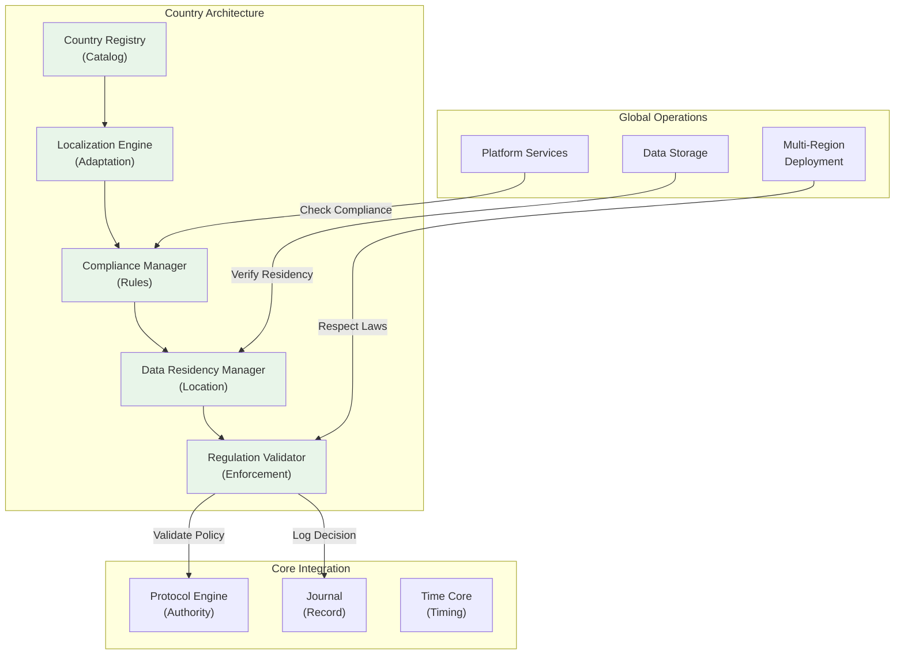

# 45. COUNTRY ARCHITECTURE STANDARD

**Version:** 1.0  
**Status:** ✓ APPROVED  
**Date:** 2026-07-04  
**Type:** Operating System Foundation Pack III  
**Classification:** Constitutional Standard

## PURPOSE

The Country Architecture Standard establishes the immutable laws, architectural contracts, and governance procedures for multi-country, multi-region deployment of the SO8FI Operating System. It enforces country-specific regulations, data residency requirements, compliance frameworks, and operational governance. Country Architecture provides the **geographic and legal context** for all platform operations, ensuring every system interaction respects local laws, regulations, and cultural requirements.

Country Architecture is the **bridge between global platform and local regulations**.

## ARCHITECTURE



## RESPONSIBILITIES

### Country Registry
- Maintain authoritative catalog of all countries and regions
- Track country-specific attributes (name, code, timezone, currency, languages)
- Define country groupings (EU, APAC, Americas, etc.)
- Record country-specific laws and regulations
- Track country joining dates and legal effective dates
- Support country dependencies and hierarchies
- Record all country metadata changes through Journal

### Localization Engine
- Translate all platform content to country-specific languages
- Adapt UI/UX to country cultural norms and preferences
- Convert amounts to local currencies
- Format dates, times, and numbers per country standards
- Implement right-to-left (RTL) text support where needed
- Support country-specific legal document templates
- Provide localization caching with invalidation

### Compliance Manager
- Interpret country-specific legal regulations
- Translate regulations into enforceability rules
- Apply industry-specific compliance frameworks (GDPR, HIPAA, etc.)
- Track compliance certifications and expiration dates
- Detect compliance violations and escalate
- Support compliance audits and reporting
- Maintain compliance documentation per regulations

### Data Residency Manager
- Track data subject location and origin
- Enforce country-specific data storage requirements
- Manage data transfer across country boundaries (with explicit approval)
- Verify data location matches residency requirements
- Support data localization (keep personal data in-country)
- Implement data sovereignty enforcement
- Report data location status and compliance

### Regulation Validator
- Evaluate operations against country-specific regulations
- Apply regulation enforcement rules to all operations
- Detect regulation violations automatically
- Escalate violations to governance council
- Support regulation versioning and updates
- Provide regulation impact analysis
- Audit all regulation-related decisions

## IMMUTABLE LAWS

1. **Law of Country Sovereignty:** Each country's laws and regulations take precedence within that country's jurisdiction. No exceptions permitted.

2. **Law of Data Localization:** Personal data shall be stored in the country where the subject resides or has consented. Cross-border data transfers prohibited without explicit consent.

3. **Law of Language Support:** Every country must have platform content available in its official language(s). No country left with unsupported language.

4. **Law of Regulatory Compliance:** All operations must comply with applicable country regulations. Compliance violations are blocking.

5. **Law of Transparent Consent:** All country-specific rules, data usage, and transfers must be disclosed transparently to users. Informed consent required.

6. **Law of Regulation Versioning:** Country regulations change over time. All regulation versions must be tracked and archived, with effective dates recorded.

7. **Law of Cross-Border Governance:** Data transfers across country boundaries require explicit authorization from sending country authority, receiving country authority, and user consent.

8. **Law of Cultural Respect:** Platform operations must respect country-specific cultural norms. Cultural violations detected and escalated.

9. **Law of Audit Trail:** All country-level decisions (data residency, compliance checks, regulation violations) must be recorded immutably through Journal.

10. **Law of Regulatory Alignment:** New country operations cannot launch until all regulatory requirements are met and certified by governance council.

## INTERFACE CONTRACTS

### Interface 1: CountryRegistry

```typescript
interface CountryRegistry {
  // Country management
  registerCountry(countryDef: CountryDefinition): Promise<CountryId>;
  getCountryDefinition(countryId: CountryId): Promise<CountryDefinition>;
  updateCountryMetadata(countryId: CountryId, updates: CountryUpdates): Promise<void>;
  
  // Country attributes
  getCountriesInRegion(regionId: RegionId): Promise<CountryId[]>;
  getCountriesByLanguage(language: Language): Promise<CountryId[]>;
  getCountriesByCurrency(currency: Currency): Promise<CountryId[]>;
  
  // Regulations
  addCountryRegulation(
    countryId: CountryId,
    regulation: Regulation,
    effectiveDate: DateTime
  ): Promise<void>;
  getActiveRegulations(countryId: CountryId): Promise<Regulation[]>;
  getRegulationHistory(countryId: CountryId): Promise<RegulationVersion[]>;
  
  // Queries
  findCountry(criteria: SearchCriteria): Promise<CountryId[]>;
  getCountryHierarchy(): Promise<CountryHierarchy>;
}
```

### Interface 2: LocalizationEngine

```typescript
interface LocalizationEngine {
  // Content localization
  getLocalizedContent(
    contentId: string,
    countryId: CountryId,
    language?: Language
  ): Promise<LocalizedContent>;
  
  // Translation management
  translateContent(
    content: Content,
    targetLanguage: Language,
    countryContext: CountryId
  ): Promise<LocalizedContent>;
  
  // Formatting
  formatCurrency(amount: number, countryId: CountryId): Promise<string>;
  formatDate(date: DateTime, countryId: CountryId): Promise<string>;
  formatNumber(number: number, countryId: CountryId): Promise<string>;
  
  // Cultural adaptation
  adaptUIForCountry(ui: UIDefinition, countryId: CountryId): Promise<AdaptedUI>;
  getCountryCulturalPreferences(countryId: CountryId): Promise<CulturalPreferences>;
  
  // Cache management
  preloadCountryLocalization(countryId: CountryId): Promise<void>;
  invalidateLocalizationCache(countryId: CountryId): Promise<void>;
}
```

### Interface 3: ComplianceManager

```typescript
interface ComplianceManager {
  // Compliance interpretation
  interpretRegulation(
    regulation: Regulation,
    context: ComplianceContext
  ): Promise<ComplianceRule[]>;
  
  // Compliance checking
  checkCompliance(
    operation: Operation,
    countryId: CountryId
  ): Promise<ComplianceCheckResult>;
  
  // Compliance certification
  getCertification(countryId: CountryId): Promise<CertificationStatus>;
  updateCertification(
    countryId: CountryId,
    certification: CertificationUpdate
  ): Promise<void>;
  
  // Compliance auditing
  auditCompliance(
    countryId: CountryId,
    auditScope: AuditScope,
    period: TimePeriod
  ): Promise<ComplianceAuditReport>;
  
  // Compliance documentation
  generateComplianceDocumentation(
    countryId: CountryId,
    documentType: DocumentType
  ): Promise<Document>;
}
```

### Interface 4: DataResidencyManager

```typescript
interface DataResidencyManager {
  // Data residency enforcement
  validateDataResidency(
    dataSubject: Identity,
    resource: Resource,
    storageLocation: Location
  ): Promise<ResidencyValidation>;
  
  // Data location tracking
  getDataLocation(
    dataId: string
  ): Promise<LocationInfo>;
  
  // Cross-border transfers
  requestCrossBorderTransfer(
    data: DataReference,
    sourceCountry: CountryId,
    targetCountry: CountryId,
    justification: string
  ): Promise<TransferRequest>;
  
  approveCrossBorderTransfer(
    requestId: string,
    approval: TransferApproval
  ): Promise<void>;
  
  denyCrossBorderTransfer(
    requestId: string,
    reason: string
  ): Promise<void>;
  
  // Data localization
  localizeDataToCountry(
    data: DataReference,
    targetCountry: CountryId
  ): Promise<void>;
}
```

### Interface 5: RegulationValidator

```typescript
interface RegulationValidator {
  // Regulation compliance
  validateOperationCompliance(
    operation: Operation,
    applicableRegulations: Regulation[]
  ): Promise<ValidationResult>;
  
  // Regulation enforcement
  enforceRegulation(
    regulation: Regulation,
    context: OperationContext
  ): Promise<EnforcementDecision>;
  
  // Violation detection
  detectRegulationViolation(
    operation: Operation,
    countryId: CountryId
  ): Promise<ViolationReport>;
  
  // Impact analysis
  analyzeRegulationImpact(
    newRegulation: Regulation,
    affectedCountries: CountryId[]
  ): Promise<ImpactAnalysis>;
  
  // Regulatory updates
  applyRegulatoryUpdate(
    regulation: Regulation,
    effectiveDate: DateTime
  ): Promise<void>;
  
  // Audit trail
  getRegulationDecisionLog(
    countryId: CountryId,
    period: TimePeriod
  ): Promise<DecisionLogEntry[]>;
}
```

## SECURITY RULES

### Forbidden Operations

- **NO data transfer across borders without consent** — Cross-border transfers blocked
- **NO unlocalized content in unsupported language** — All languages must be served
- **NO compliance violation permitted** — Violations are blocking
- **NO regulation ignored** — All applicable regulations enforced
- **NO unsupported country operation** — Certification required before launch
- **NO data residency violation** — Data location must match requirements
- **NO regulation bypass** — Sovereignty always enforced
- **NO cultural violation undetected** — Cultural violations escalated
- **NO unconsented data transfer** — Explicit user consent required
- **NO regulation change unimplemented** — Updates applied by effective date

### Security Contracts

- All country operations authorized by country authority
- All data residency verified before persistence
- All regulation violations escalated to governance
- All compliance certifications validated annually
- All cross-border transfers audited and approved
- All regulatory changes implemented on schedule

## DEPENDENCIES

### Required Core Systems
- **Protocol Engine:** Authority verification for country operations
- **Journal:** Audit trail of all country decisions
- **Identity Core:** Data subject country identification
- **Time Core:** Regulation effective date tracking

### Required System Engines
- **Translation Engine:** Content localization
- **Monitoring Engine:** Compliance monitoring
- **Notification Engine:** Regulation change alerts

### Infrastructure
- Country metadata storage
- Localization database
- Regulation repository
- Data location tracking system

## RECOVERY

### Compliance Violation Recovery
1. Log violation through Journal immediately
2. Block non-compliant operation
3. Alert governance council and legal team
4. Investigate violation cause
5. Implement remediation plan
6. Verify compliance restoration before resuming operations

### Data Residency Violation Recovery
1. Detect and log data residency violation
2. Immediately flag violating data
3. Alert data protection officer and governance
4. Initiate data repatriation procedures
5. Verify data returned to compliant location
6. Complete compliance audit before operations resume

### Regulatory Update Recovery
1. Detect regulation change requirement
2. Implement regulation update on schedule
3. Verify all operations comply with new rules
4. Test compliance with new regulation
5. Document implementation completeness
6. Audit compliance during transition period

## VALIDATION

### Immutable Law Verification
- Automated scanning confirms all operations respect country laws
- Data location verification confirms residency enforcement
- Language support verification confirms all countries have translations
- Regulation version tracking confirmed
- Compliance status verified for all countries

### Contract Verification
- Country Registry stores all country definitions
- Localization Engine provides all language translations
- Compliance Manager enforces all regulations
- Data Residency Manager tracks all data locations
- Regulation Validator checks all operations

### Performance Validation
- Localization lookup < 50ms (p99)
- Compliance check < 100ms
- Data residency verification < 50ms
- Regulation validation < 100ms
- Cross-border transfer < 24 hours

### Compliance Validation
- 100% audit coverage of country decisions
- All regulations implemented on schedule
- All data located in compliant country
- All language content available and current
- All cross-border transfers approved

## GOVERNANCE

### Approval Authority
**Country Architecture Council** (Legal + Compliance + Regional Leads + Operations)

### Country Launch Governance
- **Registration:** Country metadata and regulations documented
- **Certification:** All regulations understood and implemented
- **Testing:** Full compliance testing before launch
- **Approval:** Council approval required before go-live
- **Monitoring:** Continuous compliance monitoring post-launch
- **Updates:** Regulatory updates implemented on schedule

### Change Management
- All country regulation changes require legal review
- All compliance framework changes require council approval
- Regulatory updates implemented before effective date
- No operations permitted in non-compliant state
- Automatic blocking of non-compliant operations

### Monitoring and Compliance
- Daily compliance status dashboard
- Weekly regulation update tracking
- Monthly country audit reports
- Quarterly council reviews
- Annual full compliance certification

### Incident Response
- Compliance violations result in immediate blocking
- Regulatory violations escalated to governance immediately
- Legal review of all violations
- Root cause analysis mandatory within 48 hours
- Remediation plan required before operations resume

---

**Document ID:** 45  
**Classification:** Constitutional Standard  
**Immutable Laws:** 10  
**Interface Contracts:** 5  
**Approved by:** SO8FI Governance Council  
**Effective Date:** 2026-07-04
