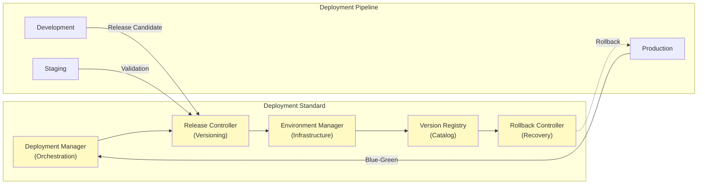

# 46. DEPLOYMENT STANDARD

**Version:** 1.0  
**Status:** ✓ APPROVED  
**Date:** 2026-07-04  
**Type:** Operating System Foundation Pack III  
**Classification:** Constitutional Standard

## PURPOSE

The Deployment Standard establishes the immutable laws, architectural contracts, and governance procedures for deploying, releasing, and managing versions of the SO8FI Operating System across environments. It enforces version control, environment management, blue-green deployments, release procedures, and rollback mechanisms. Deployment is the **bridge between software development and operational systems**, ensuring controlled, auditable transitions through environments.

Deployment is a **governance procedure**, not an operational task.

## ARCHITECTURE



## RESPONSIBILITIES

### Deployment Manager
- Orchestrate deployment process across environments
- Coordinate blue-green deployments with zero downtime
- Manage deployment timing and schedule
- Verify environment readiness before deployment
- Execute pre-deployment and post-deployment procedures
- Monitor deployment progress and health
- Trigger automatic rollback on deployment failure

### Release Controller
- Manage software version lifecycle
- Define release boundaries (major, minor, patch, hotfix)
- Coordinate release testing and validation
- Support release notes generation
- Track release dependencies and compatibility
- Manage release candidate promotion
- Record all release decisions through Journal

### Environment Manager
- Maintain all deployment environments (dev, staging, production)
- Manage environment configurations
- Provision infrastructure for new deployments
- Scale infrastructure based on load
- Monitor environment resource utilization
- Support environment cloning for testing
- Manage environment lifecycle (creation, updates, decommissioning)

### Version Registry
- Catalog all released versions with metadata
- Track version dependencies and compatibility
- Support semantic versioning
- Record version creation, testing, and release dates
- Maintain version-specific configurations
- Support version queries and discovery
- Archive version history for compliance

### Rollback Controller
- Plan rollback procedures for each deployment
- Test rollback procedures before production deployment
- Execute rapid rollback on deployment failure
- Verify system health after rollback
- Provide rollback status and progress tracking
- Support canary rollbacks and gradual transitions
- Document all rollback operations

## IMMUTABLE LAWS

1. **Law of Versioned Releases:** All deployments must reference a specific, unique version. No unversioned deployments permitted.

2. **Law of Environment Separation:** Development, staging, and production environments must be strictly isolated. No shared resources permitted.

3. **Law of Zero-Downtime Deployment:** Production deployments must use blue-green or canary procedures to maintain continuous availability. No maintenance windows permitted.

4. **Law of Rollback Capability:** Every deployment must have a tested, documented rollback procedure. Rollback-incapable deployments forbidden.

5. **Law of Pre-Deployment Validation:** All deployments must pass automated validation (tests, security scans, compatibility checks) before environment transition.

6. **Law of Deployment Approval:** Production deployments require explicit governance approval before execution.

7. **Law of Audit Recording:** All deployment operations (release, deployment, rollback) must be recorded immutably through Journal.

8. **Law of Configuration Versioning:** All environment configurations must be versioned and tracked. Configuration changes must be approved and audited.

9. **Law of Compatibility Verification:** Version compatibility must be verified before deployment. Incompatible version combinations forbidden.

10. **Law of Graceful Transition:** Deployments must provide graceful transition for connected clients. No abrupt disconnections permitted during deployment.

## INTERFACE CONTRACTS

### Interface 1: DeploymentManager

```typescript
interface DeploymentManager {
  // Deployment orchestration
  planDeployment(
    version: Version,
    targetEnvironment: Environment,
    deploymentPlan: DeploymentPlan
  ): Promise<DeploymentId>;
  
  // Blue-green deployment
  executeBlueGreenDeployment(
    deploymentId: DeploymentId,
    blueEnv: EnvironmentInstance,
    greenEnv: EnvironmentInstance
  ): Promise<DeploymentResult>;
  
  // Canary deployment
  executeCanaryDeployment(
    deploymentId: DeploymentId,
    canaryPercentage: number,
    successCriteria: SuccessCriteria
  ): Promise<DeploymentResult>;
  
  // Deployment status
  getDeploymentStatus(deploymentId: DeploymentId): Promise<DeploymentStatus>;
  getDeploymentLog(deploymentId: DeploymentId): Promise<DeploymentLogEntry[]>;
  
  // Health monitoring
  verifyEnvironmentReadiness(environment: Environment): Promise<ReadinessReport>;
  monitorPostDeploymentHealth(deploymentId: DeploymentId): Promise<HealthReport>;
}
```

### Interface 2: ReleaseController

```typescript
interface ReleaseController {
  // Release management
  createRelease(
    releaseSpec: ReleaseSpecification,
    changes: ChangeLog
  ): Promise<ReleaseId>;
  
  // Release promotion
  promoteToCandidate(releaseId: ReleaseId): Promise<void>;
  promoteToStaging(releaseId: ReleaseId): Promise<void>;
  promoteToProduction(releaseId: ReleaseId): Promise<void>;
  
  // Release queries
  getRelease(releaseId: ReleaseId): Promise<ReleaseInfo>;
  getReleaseHistory(limit: number): Promise<ReleaseInfo[]>;
  compareReleases(releaseId1: ReleaseId, releaseId2: ReleaseId): Promise<ComparisonReport>;
  
  // Release notes
  generateReleaseNotes(releaseId: ReleaseId): Promise<ReleaseNotes>;
  
  // Dependency management
  getReleaseDependencies(releaseId: ReleaseId): Promise<Dependency[]>;
  verifyCompatibility(releaseId: ReleaseId, targetEnv: Environment): Promise<CompatibilityReport>;
}
```

### Interface 3: EnvironmentManager

```typescript
interface EnvironmentManager {
  // Environment management
  createEnvironment(
    environmentDef: EnvironmentDefinition
  ): Promise<EnvironmentId>;
  
  getEnvironmentConfiguration(environmentId: EnvironmentId): Promise<EnvironmentConfig>;
  updateEnvironmentConfiguration(
    environmentId: EnvironmentId,
    configUpdates: ConfigUpdates
  ): Promise<void>;
  
  // Environment queries
  getEnvironmentStatus(environmentId: EnvironmentId): Promise<EnvironmentStatus>;
  listEnvironments(): Promise<EnvironmentInfo[]>;
  
  // Infrastructure management
  scaleEnvironment(
    environmentId: EnvironmentId,
    scalingPlan: ScalingPlan
  ): Promise<void>;
  
  // Environment cloning
  cloneEnvironment(
    sourceEnv: EnvironmentId,
    targetEnv: EnvironmentId
  ): Promise<void>;
  
  // Cleanup
  decommissionEnvironment(environmentId: EnvironmentId): Promise<void>;
}
```

### Interface 4: VersionRegistry

```typescript
interface VersionRegistry {
  // Version management
  registerVersion(
    versionMetadata: VersionMetadata,
    versionArtifacts: Artifact[]
  ): Promise<VersionId>;
  
  // Version retrieval
  getVersion(versionId: VersionId): Promise<VersionInfo>;
  getVersionArtifacts(versionId: VersionId): Promise<Artifact[]>;
  listVersions(filter?: VersionFilter): Promise<VersionInfo[]>;
  
  // Versioning
  getLatestVersion(): Promise<VersionInfo>;
  getLatestMajorVersion(major: number): Promise<VersionInfo>;
  findCompatibleVersions(
    constraints: VersionConstraints
  ): Promise<VersionInfo[]>;
  
  // Version metadata
  getVersionDependencies(versionId: VersionId): Promise<Dependency[]>;
  getVersionConfiguration(versionId: VersionId): Promise<VersionConfig>;
  
  // Version history
  getVersionHistory(limit: number): Promise<VersionInfo[]>;
  compareVersions(v1: VersionId, v2: VersionId): Promise<ComparisonReport>;
}
```

### Interface 5: RollbackController

```typescript
interface RollbackController {
  // Rollback planning
  planRollback(
    deploymentId: DeploymentId,
    rollbackTarget: Version
  ): Promise<RollbackPlan>;
  
  // Rollback execution
  executeRollback(
    deploymentId: DeploymentId,
    rollbackPlan: RollbackPlan
  ): Promise<RollbackResult>;
  
  // Canary rollback
  executeCanaryRollback(
    deploymentId: DeploymentId,
    canaryPercentage: number,
    successCriteria: SuccessCriteria
  ): Promise<RollbackResult>;
  
  // Rollback verification
  verifyRollbackSuccess(deploymentId: DeploymentId): Promise<VerificationReport>;
  getHealthAfterRollback(deploymentId: DeploymentId): Promise<HealthReport>;
  
  // Rollback history
  getRollbackLog(deploymentId: DeploymentId): Promise<RollbackLogEntry[]>;
  getRollbackHistory(limit: number): Promise<RollbackInfo[]>;
}
```

## SECURITY RULES

### Forbidden Operations

- **NO unversioned deployments** — All deployments must reference a version
- **NO shared resources between environments** — Environment isolation enforced
- **NO unapproved production deployments** — Governance approval required
- **NO deployment without rollback plan** — Rollback capability mandatory
- **NO skipped validation steps** — All validation required before deployment
- **NO incompatible version combinations** — Compatibility verified
- **NO deployment without testing** — Test success required
- **NO audit trail gap in deployments** — All operations logged
- **NO environmental configuration drift** — Configurations versioned
- **NO gradual transition without monitoring** — Health monitoring required

### Security Contracts

- All deployments approved by governance council
- All rollback procedures tested before production use
- All version compatibility verified before deployment
- All deployment operations audited through Journal
- All environment changes tracked and versioned

## DEPENDENCIES

### Required Core Systems
- **Time Core:** Deployment scheduling and timing
- **Journal:** Audit trail of all deployments
- **Identity Core:** Approval verification for deployments
- **Protocol Engine:** Authorization for deployment operations

### Required System Engines
- **Monitoring Engine:** Deployment and post-deployment health
- **Backup Engine:** Environment state backup before deployment
- **Notification Engine:** Deployment notifications and alerts

### Infrastructure
- Version control system
- Artifact repository
- Environment provisioning system
- Health monitoring system

## RECOVERY

### Deployment Failure Recovery
1. Log deployment failure through Journal
2. Alert governance and operations teams
3. Trigger automatic rollback to previous version
4. Verify rollback success
5. Investigate failure cause
6. Document failure analysis
7. Implement corrective actions before retry

### Rollback Failure Recovery
1. Log rollback failure immediately
2. Alert emergency response team
3. Initiate manual recovery procedures
4. Preserve full system state for investigation
5. Notify all stakeholders of critical status
6. Engage Disaster Recovery procedures
7. Execute post-incident review

### Environment Recovery
1. Detect environment health degradation
2. Isolate degraded environment from production
3. Alert operations team
4. Restore environment from backup (if available)
5. Verify environment readiness
6. Resume operations gradually
7. Complete health verification

## VALIDATION

### Immutable Law Verification
- Automated scanning confirms all deployments versioned
- Test automation verifies all validations run before deployment
- Approval audit confirms governance approval obtained
- Rollback testing verifies all deployments can rollback
- Environment audit confirms isolation maintained

### Contract Verification
- Deployment Manager orchestrates blue-green deployments
- Release Controller manages version lifecycle
- Environment Manager maintains environments
- Version Registry catalogs all versions
- Rollback Controller executes tested rollbacks

### Performance Validation
- Deployment execution time < 15 minutes
- Blue-green transition time < 5 minutes
- Rollback execution time < 5 minutes
- Environment provisioning < 30 minutes
- Version validation < 2 minutes

### Reliability Validation
- Zero-downtime deployment achieved
- 100% rollback success rate for tested procedures
- 100% environment isolation verified
- Zero deployment-caused data loss
- All deployments fully auditable

## GOVERNANCE

### Approval Authority
**Release Management Council** (Architecture + Operations + Product + Legal)

### Deployment Governance
- **Planning:** Deployment plan reviewed and approved
- **Validation:** All tests and checks pass
- **Approval:** Council approval before production deployment
- **Execution:** Controlled, monitored deployment
- **Verification:** Post-deployment health verification

### Change Management
- All deployment procedures require governance approval
- No deployments during critical business periods
- Automatic rollback on health check failure
- No deployments without rollback procedure
- Communication required for all deployments

### Monitoring and Compliance
- Real-time deployment progress monitoring
- Post-deployment health monitoring for 24 hours
- Weekly deployment success rate reporting
- Monthly deployment retrospectives
- Quarterly deployment procedure reviews

### Incident Response
- Deployment failures trigger automatic rollback
- Rollback failures escalate to emergency response
- All deployment incidents documented
- Root cause analysis mandatory within 24 hours
- Preventive measures implemented before next deployment

---

**Document ID:** 46  
**Classification:** Constitutional Standard  
**Immutable Laws:** 10  
**Interface Contracts:** 5  
**Approved by:** SO8FI Governance Council  
**Effective Date:** 2026-07-04
