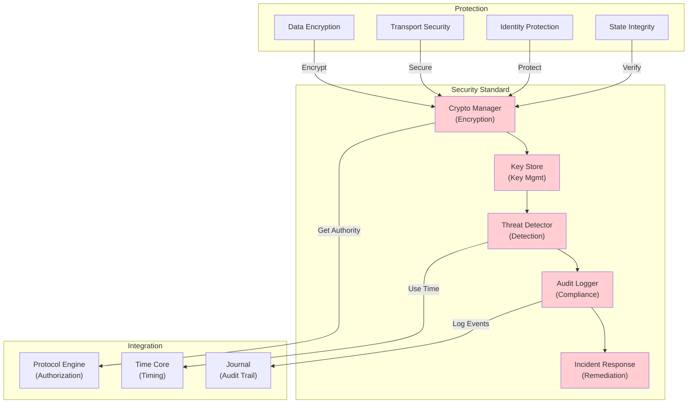

# 47. SECURITY STANDARD

**Version:** 1.0  
**Status:** ✓ APPROVED  
**Date:** 2026-07-04  
**Type:** Operating System Foundation Pack III  
**Classification:** Constitutional Standard

## PURPOSE

The Security Standard establishes the immutable laws, architectural contracts, and governance procedures for cryptography, key management, threat detection, vulnerability management, and audit trails across the SO8FI Operating System. Security enforces confidentiality, integrity, and availability principles while maintaining transparency and auditability. Security is the **enforcement layer for trust**, providing cryptographic evidence that systems are operating according to protocol.

Security is **defense + transparency**, not secrecy + opacity.

## ARCHITECTURE



## RESPONSIBILITIES

### Crypto Manager
- Provide encryption/decryption for data at rest and in transit
- Support multiple encryption algorithms (AES, RSA, ECC)
- Manage cryptographic key lifecycle (generation, rotation, retirement)
- Provide cryptographic hashing for integrity verification
- Support digital signatures for authenticity
- Implement cryptographic randomness generation
- Maintain audit trail of all crypto operations

### Key Store
- Securely store cryptographic keys
- Enforce key access controls through Permission Standard
- Support key rotation policies
- Implement key escrow for regulatory compliance
- Provide key recovery procedures
- Support hardware security module (HSM) integration
- Maintain audit trail of all key operations

### Threat Detector
- Monitor system for security threats in real-time
- Detect intrusion attempts and suspicious patterns
- Identify vulnerability exploitation attempts
- Monitor for data exfiltration
- Detect brute force attacks and credential stuffing
- Alert on anomalous access patterns
- Escalate critical threats immediately

### Audit Logger
- Record all security-relevant events
- Maintain tamper-proof security audit trail
- Support security event queries and investigation
- Generate security incident reports
- Enable forensic analysis of security events
- Support compliance reporting (SOC 2, ISO 27001, etc.)
- Preserve security audit trail indefinitely

### Incident Response
- Respond to security incidents automatically
- Implement containment procedures on threat detection
- Coordinate incident investigation
- Support incident remediation
- Document incident analysis and lessons learned
- Implement preventive measures
- Support regulatory reporting of security incidents

## IMMUTABLE LAWS

1. **Law of Encryption Everywhere:** All sensitive data must be encrypted in storage and transmission. No unencrypted sensitive data permitted.

2. **Law of Key Separation:** Data encryption keys must be separate from key encryption keys. No single key encrypts itself.

3. **Law of Regular Rotation:** Cryptographic keys must be rotated regularly. Key age must not exceed policy limits.

4. **Law of Threat Monitoring:** All systems must be continuously monitored for security threats. Threat detection automatic and always-on.

5. **Law of Immutable Audit:** All security events must be recorded immutably. Security audit trail cannot be deleted or modified.

6. **Law of Incident Recording:** All security incidents must be recorded with full context. Incident analysis mandatory before resolution.

7. **Law of Transparency:** All security decisions and procedures must be transparent and auditable. No hidden security operations permitted.

8. **Law of Least Privilege:** All crypto and security operations must use least privilege. No overly powerful credentials or permissions.

9. **Law of Zero Trust:** All systems must be verified even if previously trusted. Trust is not assumed, only verified.

10. **Law of Regulatory Compliance:** All security practices must comply with applicable regulations (GDPR, HIPAA, SOC 2, etc.). Compliance is non-negotiable.

## INTERFACE CONTRACTS

### Interface 1: CryptoManager

```typescript
interface CryptoManager {
  // Encryption
  encryptData(
    data: Buffer,
    keyId: string,
    algorithm?: CryptoAlgorithm
  ): Promise<EncryptedData>;
  
  decryptData(
    encryptedData: EncryptedData,
    keyId: string
  ): Promise<Buffer>;
  
  // Hashing
  hashData(
    data: Buffer,
    algorithm?: HashAlgorithm
  ): Promise<Hash>;
  
  verifyHash(
    data: Buffer,
    hash: Hash,
    algorithm?: HashAlgorithm
  ): Promise<boolean>;
  
  // Digital signatures
  signData(
    data: Buffer,
    keyId: string,
    algorithm?: SignatureAlgorithm
  ): Promise<Signature>;
  
  verifySignature(
    data: Buffer,
    signature: Signature,
    keyId: string
  ): Promise<boolean>;
  
  // Randomness
  generateRandomBytes(length: number): Promise<Buffer>;
}
```

### Interface 2: KeyStore

```typescript
interface KeyStore {
  // Key management
  generateKey(
    keySpec: KeySpecification,
    metadata: KeyMetadata
  ): Promise<KeyId>;
  
  getKey(keyId: string): Promise<PublicKey>;
  deleteKey(keyId: string): Promise<void>;
  
  // Key rotation
  rotateKey(keyId: string): Promise<NewKeyId>;
  scheduleKeyRotation(
    keyId: string,
    rotationSchedule: RotationSchedule
  ): Promise<void>;
  
  // Key recovery
  recoveryKey(
    keyId: string,
    recoveryContext: RecoveryContext
  ): Promise<Key>;
  
  // Key access control
  authorizeKeyAccess(
    keyId: string,
    identity: Identity,
    permissions: KeyPermission[]
  ): Promise<void>;
  
  // Key queries
  listKeys(filter?: KeyFilter): Promise<KeyInfo[]>;
  getKeyMetadata(keyId: string): Promise<KeyMetadata>;
}
```

### Interface 3: ThreatDetector

```typescript
interface ThreatDetector {
  // Threat monitoring
  monitorForThreats(): Promise<void>;
  
  // Threat detection
  detectThreat(
    eventPattern: SecurityEvent[]
  ): Promise<ThreatAssessment>;
  
  // Anomaly detection
  detectAnomalies(
    timeWindow: TimePeriod
  ): Promise<AnomalyReport>;
  
  // Vulnerability scanning
  scanForVulnerabilities(
    system: SystemComponent
  ): Promise<VulnerabilityReport>;
  
  // Threat assessment
  assessThreatSeverity(
    threat: Threat
  ): Promise<SeverityAssessment>;
  
  // Threat alerting
  getThreatAlerts(
    timeWindow?: TimePeriod
  ): Promise<ThreatAlert[]>;
  
  // Threat patterns
  identifyThreatPatterns(
    historicalEvents: SecurityEvent[]
  ): Promise<ThreatPattern[]>;
}
```

### Interface 4: AuditLogger

```typescript
interface AuditLogger {
  // Security event logging
  logSecurityEvent(
    event: SecurityEvent,
    context: EventContext
  ): Promise<AuditRecordId>;
  
  // Compliance logging
  logComplianceEvent(
    event: ComplianceEvent,
    context: EventContext
  ): Promise<AuditRecordId>;
  
  // Incident logging
  logIncident(
    incident: SecurityIncident,
    analysis: IncidentAnalysis
  ): Promise<IncidentRecordId>;
  
  // Audit queries
  queryAuditLog(
    criteria: AuditQueryCriteria
  ): Promise<AuditRecord[]>;
  
  // Audit reports
  generateAuditReport(
    period: TimePeriod,
    scope: ReportScope
  ): Promise<AuditReport>;
  
  // Compliance certification
  generateComplianceCertification(
    framework: ComplianceFramework,
    period: TimePeriod
  ): Promise<CertificationReport>;
  
  // Forensic analysis
  beginForensicAnalysis(
    incidentId: string
  ): Promise<ForensicSession>;
}
```

### Interface 5: IncidentResponse

```typescript
interface IncidentResponse {
  // Incident detection
  detectIncident(threat: Threat): Promise<IncidentId>;
  
  // Incident containment
  initiateContainment(
    incidentId: string,
    containmentPlan: ContainmentPlan
  ): Promise<void>;
  
  // Incident investigation
  investigateIncident(
    incidentId: string,
    investigationScope: InvestigationScope
  ): Promise<InvestigationReport>;
  
  // Incident remediation
  remediateIncident(
    incidentId: string,
    remediationPlan: RemediationPlan
  ): Promise<void>;
  
  // Incident documentation
  documentIncident(
    incidentId: string,
    documentation: IncidentDocumentation
  ): Promise<void>;
  
  // Preventive measures
  implementPreventiveMeasures(
    incidentId: string,
    measures: PreventiveMeasure[]
  ): Promise<void>;
  
  // Incident reporting
  reportIncident(
    incidentId: string,
    reportType: ReportType
  ): Promise<IncidentReport>;
}
```

## SECURITY RULES

### Forbidden Operations

- **NO unencrypted sensitive data** — All sensitive data must be encrypted
- **NO single key** — Encryption and key encryption keys separated
- **NO stale keys** — Keys must be rotated within policy limits
- **NO blind security** — Threat detection mandatory
- **NO hidden security events** — All events logged and auditable
- **NO incident without analysis** — Root cause analysis mandatory
- **NO secret security operations** — All security is transparent
- **NO overpowered security credentials** — Least privilege enforced
- **NO unconditional trust** — Zero trust model enforced
- **NO compliance drift** — Regulations always enforced

### Security Contracts

- All encryption performed by Crypto Manager
- All keys stored in secure Key Store
- All threats detected by Threat Detector
- All security events logged through Audit Logger
- All incidents handled by Incident Response
- All operations authorized by Permission Standard

## DEPENDENCIES

### Required Core Systems
- **Identity Core:** Identity verification for key access
- **Protocol Engine:** Authorization for crypto operations
- **Journal:** Immutable audit trail (using Security Audit Logger)
- **Time Core:** Timestamp verification for events

### Required System Engines
- **Monitoring Engine:** Security metrics and alerting
- **Notification Engine:** Security incident notifications
- **Backup Engine:** Secure backup of encryption keys

### Infrastructure
- Cryptographic libraries (OpenSSL, libsodium, etc.)
- Hardware Security Module (HSM) optional
- Secure key storage infrastructure
- Security audit trail storage (immutable)

## RECOVERY

### Crypto Failure Recovery
1. Log cryptographic operation failure
2. Alert security team
3. Verify data integrity with checksums
4. Preserve evidence for investigation
5. Restore from backup if necessary
6. Verify restored data integrity
7. Complete investigation before resuming

### Threat Containment Recovery
1. Detect threat and escalate immediately
2. Implement containment procedures
3. Isolate compromised systems
4. Preserve forensic evidence
5. Investigate threat origin and impact
6. Remediate threat and vulnerabilities
7. Implement preventive measures

### Key Compromise Recovery
1. Detect key compromise (attempted use with invalid password)
2. Immediately revoke compromised key
3. Alert all systems using the key
4. Force key rotation
5. Decrypt data with backup keys if available
6. Re-encrypt with new keys
7. Investigate compromise cause

## VALIDATION

### Immutable Law Verification
- Automated scanning confirms all sensitive data encrypted
- Key audit confirms encryption/key-encryption key separation
- Key rotation audit confirms regular rotation
- Threat detection testing confirms continuous monitoring
- Audit trail testing confirms immutability

### Contract Verification
- Crypto Manager performs all encryption operations
- Key Store securely manages all keys
- Threat Detector monitors all systems
- Audit Logger captures all events
- Incident Response handles all incidents

### Performance Validation
- Encryption/decryption latency < 50ms (p99)
- Key retrieval latency < 10ms
- Threat detection latency < 1 second
- Audit log write latency < 10ms
- Incident response initiation < 5 seconds

### Security Validation
- 100% of sensitive data encrypted
- 100% of security events audited
- Zero undetected threats (detection rate > 99%)
- Zero key compromises (detection time < 1 hour)
- 100% compliance with security policies

## GOVERNANCE

### Approval Authority
**Security Council** (Security + Compliance + Operations + CTO)

### Security Management
- **Encryption:** Crypto policies reviewed annually
- **Keys:** Key management procedures reviewed quarterly
- **Threats:** Security incidents reviewed by council
- **Audit:** Compliance audits performed quarterly
- **Incidents:** All incidents reviewed and documented

### Change Management
- All crypto algorithm changes require security council approval
- All key rotation policy changes require council approval
- All threat response procedures reviewed and approved
- Automatic implementation of detected threats
- No bypassing of security procedures

### Monitoring and Compliance
- Real-time threat monitoring dashboard
- Daily security incident review
- Weekly compliance status reporting
- Monthly security audit analysis
- Quarterly security council reviews
- Annual security certification required

### Incident Response
- Critical threats automatically escalated
- Security incidents documented and analyzed
- Root cause analysis mandatory within 24 hours
- Preventive measures implemented before incident closure
- All incidents reported to relevant regulators

---

**Document ID:** 47  
**Classification:** Constitutional Standard  
**Immutable Laws:** 10  
**Interface Contracts:** 5  
**Approved by:** SO8FI Governance Council  
**Effective Date:** 2026-07-04
