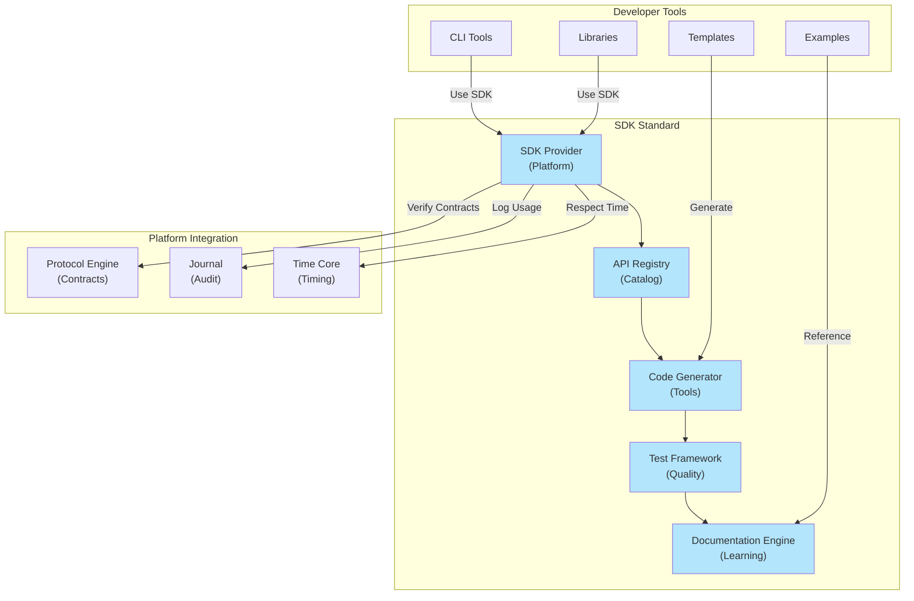

# 48. SDK STANDARD

**Version:** 1.0  
**Status:** ✓ APPROVED  
**Date:** 2026-07-04  
**Type:** Operating System Foundation Pack III  
**Classification:** Constitutional Standard

## PURPOSE

The SDK Standard establishes the immutable laws, architectural contracts, and governance procedures for the SO8FI Software Development Kit (SDK). The SDK enables developers to build extensions, integrations, and applications that respect SO8FI architecture principles. It provides developer tools, API documentation, code generation, testing frameworks, and debugging support—all while enforcing platform contracts and governance rules. The SDK is the **developer interface to the platform**, ensuring developers build compliant, secure extensions.

SDK is **guardrails + power**, enforcing constraints while enabling creativity.

## ARCHITECTURE



## RESPONSIBILITIES

### SDK Provider
- Provide comprehensive SDK platform and tools
- Maintain SDK versions and backwards compatibility
- Support multiple programming languages
- Implement SDK security and validation
- Track SDK usage metrics and adoption
- Provide SDK support and troubleshooting
- Record all SDK operations through Journal

### API Registry
- Catalog all public platform APIs available to developers
- Document API versions and deprecation timelines
- Track API usage patterns and popularity
- Support API discovery and filtering
- Provide API versioning and compatibility matrix
- Record breaking changes and migration guides
- Support API performance baselines and SLAs

### Code Generator
- Generate starter code from API definitions
- Create type definitions and interfaces
- Generate test stubs and mock services
- Support code scaffolding for common patterns
- Validate generated code against standards
- Support multiple language targets
- Maintain code generation templates library

### Test Framework
- Provide comprehensive testing tools for extensions
- Support unit testing, integration testing, contract testing
- Implement test utilities and mock builders
- Enforce test coverage requirements
- Support performance testing and profiling
- Integrate security scanning into test pipeline
- Provide test reporting and analytics

### Documentation Engine
- Maintain comprehensive platform documentation
- Generate API reference documentation
- Provide tutorials and how-to guides
- Create code examples and sample projects
- Support documentation versioning
- Track documentation coverage and gaps
- Enable developer feedback on documentation

## IMMUTABLE LAWS

1. **Law of Contract Enforcement:** All SDK-generated code must verify platform contracts before operation. No contract bypass permitted.

2. **Law of API Versioning:** All platform APIs must be versioned. API changes must follow semantic versioning rules.

3. **Law of Deprecation Timeline:** API deprecation must follow explicit timeline (minimum 2 major versions). No abrupt removals permitted.

4. **Law of Type Safety:** SDK must provide strong type definitions for all APIs. Type violations detected at development time.

5. **Law of Test Requirement:** All SDK projects must pass test suite before deployment to platform. No untested code permitted.

6. **Law of Documentation Completeness:** All public APIs must be documented. Undocumented APIs forbidden.

7. **Law of Security Validation:** All SDK code must pass security scanning. Security issues must be fixed before deployment.

8. **Law of Performance Budgets:** All SDK APIs must have documented performance budgets. Performance violations flagged.

9. **Law of Backwards Compatibility:** Minor and patch versions must maintain backwards compatibility. Breaking changes only in major versions.

10. **Law of Developer Transparency:** All SDK limitations, performance characteristics, and constraints must be documented. No hidden surprises.

## INTERFACE CONTRACTS

### Interface 1: SDKProvider

```typescript
interface SDKProvider {
  // SDK initialization
  initializeSDK(config: SDKConfig): Promise<SDKInstance>;
  
  // Version management
  getSDKVersion(): string;
  getLatestSDKVersion(): Promise<string>;
  upgradeSDK(targetVersion: string): Promise<void>;
  
  // API access
  getAPI<T extends APIContract>(apiName: string): Promise<T>;
  listAvailableAPIs(): Promise<APIInfo[]>;
  
  // Configuration
  configureSDK(options: SDKOptions): Promise<void>;
  getConfiguration(): SDKConfiguration;
  
  // Diagnostics
  validateEnvironment(): Promise<ValidationReport>;
  getDiagnostics(): Promise<DiagnosticsReport>;
  
  // Usage tracking
  getSDKMetrics(): Promise<SDKMetrics>;
}
```

### Interface 2: APIRegistry

```typescript
interface APIRegistry {
  // API discovery
  getAPI(apiName: string, version?: string): Promise<APIDefinition>;
  listAPIs(filter?: APIFilter): Promise<APIInfo[]>;
  searchAPIs(query: string): Promise<APIInfo[]>;
  
  // API versioning
  getAPIVersionHistory(apiName: string): Promise<APIVersion[]>;
  getLatestAPIVersion(apiName: string): Promise<APIVersion>;
  compareAPIVersions(
    apiName: string,
    v1: string,
    v2: string
  ): Promise<ComparisonReport>;
  
  // API documentation
  getAPIDocumentation(apiName: string): Promise<Documentation>;
  getAPIExamples(apiName: string): Promise<Example[]>;
  getAPIPerformanceBaseline(apiName: string): Promise<PerformanceBaseline>;
  
  // Deprecation
  checkDeprecation(apiName: string, version: string): Promise<DeprecationStatus>;
  getMigrationGuide(apiName: string, fromVersion: string, toVersion: string): Promise<MigrationGuide>;
}
```

### Interface 3: CodeGenerator

```typescript
interface CodeGenerator {
  // Code generation
  generateCode(
    spec: GenerationSpec,
    targetLanguage: ProgrammingLanguage
  ): Promise<GeneratedCode>;
  
  // Type definition generation
  generateTypeDefinitions(
    apiContract: APIContract,
    targetLanguage: ProgrammingLanguage
  ): Promise<TypeDefinitions>;
  
  // Test generation
  generateTestStubs(
    apiContract: APIContract,
    testFramework: TestFramework
  ): Promise<TestCode>;
  
  // Scaffold generation
  generateScaffold(
    scaffoldType: ScaffoldType,
    config: ScaffoldConfig
  ): Promise<ScaffoldProject>;
  
  // Template management
  listCodeTemplates(): Promise<TemplateInfo[]>;
  getCodeTemplate(templateId: string): Promise<CodeTemplate>;
  customizeTemplate(
    templateId: string,
    customizations: TemplateCustomization
  ): Promise<CustomizedTemplate>;
  
  // Validation
  validateGeneratedCode(code: string): Promise<ValidationReport>;
}
```

### Interface 4: TestFramework

```typescript
interface TestFramework {
  // Test execution
  runTests(testConfig: TestConfig): Promise<TestResults>;
  runTestsWithCoverage(testConfig: TestConfig): Promise<CoverageReport>;
  
  // Test utilities
  createMockService(apiContract: APIContract): Promise<MockService>;
  createTestContext(): Promise<TestContext>;
  
  // Assertions
  assertContractCompliance(
    code: string,
    contract: APIContract
  ): Promise<AssertionResult>;
  
  // Performance testing
  profileCode(code: string): Promise<ProfileReport>;
  benchmarkOperation(operation: Operation): Promise<BenchmarkResult>;
  
  // Security scanning
  scanCodeForVulnerabilities(code: string): Promise<VulnerabilityReport>;
  checkDependencies(dependencies: Dependency[]): Promise<DependencyReport>;
  
  // Test reporting
  generateTestReport(results: TestResults): Promise<TestReport>;
  getTestMetrics(): Promise<TestMetrics>;
}
```

### Interface 5: DocumentationEngine

```typescript
interface DocumentationEngine {
  // Documentation retrieval
  getDocumentation(
    topic: string,
    language?: Language
  ): Promise<Documentation>;
  
  // API documentation
  getAPIDocumentation(
    apiName: string,
    version?: string
  ): Promise<APIDocumentation>;
  
  // Tutorial and guides
  getTutorial(tutorialId: string): Promise<Tutorial>;
  listTutorials(filter?: TutorialFilter): Promise<TutorialInfo[]>;
  getHowToGuide(guideId: string): Promise<HowToGuide>;
  
  // Examples
  getCodeExample(exampleId: string): Promise<CodeExample>;
  listExamples(apiName?: string): Promise<ExampleInfo[]>;
  
  // Versioning
  getDocumentationVersion(docId: string, version: string): Promise<Documentation>;
  listDocumentationVersions(docId: string): Promise<DocumentationVersion[]>;
  
  // Feedback
  submitDocumentationFeedback(
    docId: string,
    feedback: DocumentationFeedback
  ): Promise<void>;
  getDocumentationGaps(): Promise<GapReport>;
}
```

## SECURITY RULES

### Forbidden Operations

- **NO contract bypass** — All code must verify contracts
- **NO unversioned APIs** — All APIs must have versions
- **NO abrupt API removal** — Deprecation timeline required
- **NO type-unsafe code** — Strong typing enforced
- **NO untested deployment** — Tests mandatory before deployment
- **NO undocumented APIs** — Documentation required
- **NO security vulnerabilities** — Security scanning mandatory
- **NO performance violations** — Performance budgets enforced
- **NO breaking changes in minor versions** — Backwards compatibility required
- **NO hidden constraints** — All limitations documented

### Security Contracts

- All SDK code verified against platform contracts
- All generated code validated for security
- All dependencies scanned for vulnerabilities
- All API access authorized by Protocol Engine
- All SDK usage audited through Journal

## DEPENDENCIES

### Required Core Systems
- **Protocol Engine:** API contract enforcement
- **Journal:** SDK usage tracking
- **Identity Core:** Developer authentication
- **Time Core:** API version timing

### Required System Engines
- **Search Engine:** API discovery
- **Documentation Engine:** SDK documentation
- **Monitoring Engine:** SDK usage analytics

### Infrastructure
- API documentation repository
- Code template library
- Code generation engine
- Testing infrastructure
- Developer portal

## RECOVERY

### SDK Failure Recovery
1. Detect SDK operation failure
2. Check SDK version compatibility
3. Validate development environment
4. Test SDK diagnostics
5. Review SDK usage patterns
6. Update SDK if needed
7. Retry operation with debug logging

### API Compatibility Recovery
1. Detect API incompatibility in generated code
2. Identify API version mismatch
3. Retrieve API migration guide
4. Update code to new API version
5. Re-run tests with new API
6. Verify functionality maintained
7. Deploy updated code

### Test Failure Recovery
1. Analyze test failure
2. Review test assertions and mocks
3. Verify contract compliance
4. Check for breaking changes
5. Update test code if needed
6. Re-run tests
7. Debug until tests pass

## VALIDATION

### Immutable Law Verification
- Automated scanning confirms all code verifies contracts
- Version auditing confirms API versioning
- Deprecation checking confirms timeline enforcement
- Type checking confirms strong typing
- Test requirement enforcement validated
- Documentation completeness verified
- Security scanning verified
- Performance budget checking verified

### Contract Verification
- SDK Provider initializes and configures SDK
- API Registry catalogs and versions all APIs
- Code Generator generates valid, tested code
- Test Framework enforces test requirements
- Documentation Engine provides complete docs

### Performance Validation
- SDK initialization < 5 seconds
- API discovery < 1 second
- Code generation < 30 seconds
- Test execution < 5 minutes
- Documentation retrieval < 500ms

### Quality Validation
- Generated code passes all tests (100% pass rate)
- Generated code complies with contracts
- No unresolved dependencies in generated code
- Zero security vulnerabilities in generated code
- All generated code fully documented

## GOVERNANCE

### Approval Authority
**Developer Experience Council** (Architecture + Developer Advocates + Product)

### SDK Lifecycle Governance
- **Release:** New SDK versions require council approval
- **Deprecation:** API deprecations require 2 major version notice
- **Breaking Changes:** Only permitted in major versions
- **Documentation:** All APIs must be documented before release
- **Tooling:** All SDK tools must be tested and documented

### Change Management
- SDK updates must be backwards compatible (unless major version)
- New APIs must include documentation and examples
- API deprecation must follow published timeline
- SDK tools must pass comprehensive testing
- All changes audited in Journal

### Monitoring and Compliance
- Daily SDK usage analytics
- Weekly SDK adoption metrics
- Monthly API usage reports
- Quarterly documentation audits
- Annual SDK comprehensive review

### Developer Support
- SDK issue tracking and resolution
- Developer community engagement
- Documentation quality monitoring
- Performance and compatibility assurance
- Deprecation guidance and migration support

---

**Document ID:** 48  
**Classification:** Constitutional Standard  
**Immutable Laws:** 10  
**Interface Contracts:** 5  
**Approved by:** SO8FI Governance Council  
**Effective Date:** 2026-07-04
