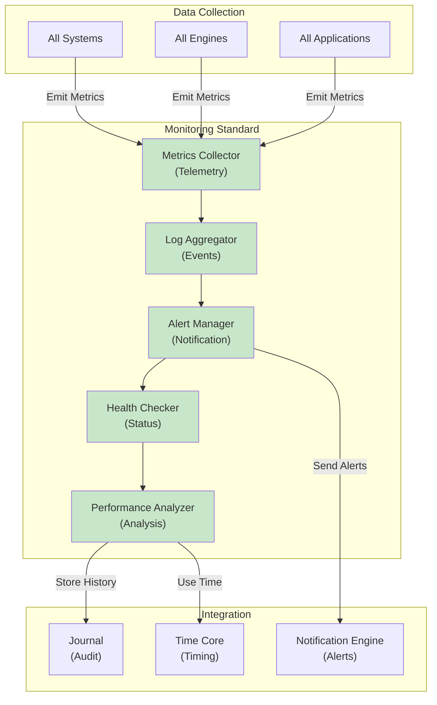

# 49. MONITORING STANDARD

**Version:** 1.0  
**Status:** ✓ APPROVED  
**Date:** 2026-07-04  
**Type:** Operating System Foundation Pack III  
**Classification:** Constitutional Standard

## PURPOSE

The Monitoring Standard establishes the immutable laws, architectural contracts, and governance procedures for operational monitoring, observability, and alerting across the SO8FI Operating System. Monitoring provides **continuous visibility** into system health, performance, and compliance. It enables operators to detect issues, understand behavior, and make informed decisions. Monitoring is not just metrics collection—it's **evidence-based operations**.

Monitoring is **visibility + action**, providing data that enables informed decision-making.

## ARCHITECTURE



## RESPONSIBILITIES

### Metrics Collector
- Collect telemetry from all system components
- Support multiple metric types (counters, gauges, histograms, summaries)
- Implement efficient metric aggregation and buffering
- Support metric filtering and sampling
- Track metric lineage and source
- Provide metric queries and access
- Record metric collection events through Journal

### Log Aggregator
- Aggregate logs from all system sources
- Support structured logging with key-value pairs
- Implement efficient log storage and retrieval
- Support log filtering, searching, and analysis
- Preserve log timestamps and source information
- Implement log retention policies
- Support log export and external integrations

### Alert Manager
- Define alert rules based on metrics and thresholds
- Evaluate alerts in real-time
- Route alerts to appropriate teams and channels
- Implement alert deduplication and correlation
- Support alert escalation procedures
- Track alert acknowledgment and resolution
- Provide alert analytics and trend analysis

### Health Checker
- Monitor system component health status
- Perform periodic health checks
- Detect component degradation early
- Support health aggregation (overall system health)
- Implement health-based routing and failover
- Provide health history and trends
- Alert on health status changes

### Performance Analyzer
- Analyze system performance metrics
- Detect performance regressions
- Provide performance trend analysis
- Support capacity planning analysis
- Identify performance bottlenecks
- Generate performance reports
- Support performance forecasting

## IMMUTABLE LAWS

1. **Law of Complete Visibility:** All operations must emit observability data. No blind spots permitted in monitoring.

2. **Law of Metric Completeness:** All key metrics must be collected continuously. Gaps in metric collection must be detected and escalated.

3. **Law of Log Preservation:** All logs must be preserved according to policy. No logs deleted or modified without authorization.

4. **Law of Alert Reliability:** All alerts must be delivered reliably. No silent alert failures permitted.

5. **Law of Time-Aware Monitoring:** All monitoring decisions must respect operational time from Time Core. No wall-clock dependencies in monitoring.

6. **Law of Audit Trail:** All monitoring operations (data collection, alerting, actions) must be recorded through Journal.

7. **Law of Actionable Alerts:** All alerts must be actionable. Alerts that cannot be acted upon are forbidden.

8. **Law of Performance Transparency:** All system performance characteristics must be observable and reported. No hidden latencies.

9. **Law of Threshold Clarity:** All alert thresholds must be explicitly defined and documented. No implicit or ambiguous thresholds.

10. **Law of Monitoring Evolution:** Monitoring rules must evolve based on observed patterns. Stale monitoring rules must be updated or removed.

## INTERFACE CONTRACTS

### Interface 1: MetricsCollector

```typescript
interface MetricsCollector {
  // Metric emission
  recordCounter(name: string, value: number, tags?: MetricTag[]): Promise<void>;
  recordGauge(name: string, value: number, tags?: MetricTag[]): Promise<void>;
  recordHistogram(name: string, value: number, tags?: MetricTag[]): Promise<void>;
  recordSummary(name: string, value: number, tags?: MetricTag[]): Promise<void>;
  
  // Batch operations
  recordMetrics(metrics: Metric[]): Promise<void>;
  
  // Metric queries
  queryMetrics(
    metricName: string,
    timeRange: TimeRange,
    filters?: MetricFilter[]
  ): Promise<MetricDataPoints[]>;
  
  // Metric aggregation
  aggregateMetrics(
    metrics: string[],
    aggregationType: AggregationType,
    timeRange: TimeRange
  ): Promise<AggregationResult>;
  
  // Metric configuration
  defineMetric(definition: MetricDefinition): Promise<void>;
  getMetricDefinition(metricName: string): Promise<MetricDefinition>;
}
```

### Interface 2: LogAggregator

```typescript
interface LogAggregator {
  // Log emission
  emitLog(logEntry: LogEntry): Promise<void>;
  
  // Batch logging
  emitLogs(logEntries: LogEntry[]): Promise<void>;
  
  // Log queries
  queryLogs(
    query: LogQuery,
    timeRange: TimeRange,
    limit?: number
  ): Promise<LogEntry[]>;
  
  // Log search
  searchLogs(
    searchPattern: string,
    timeRange: TimeRange
  ): Promise<LogEntry[]>;
  
  // Log analysis
  analyzeLogs(
    logEntries: LogEntry[],
    analysisType: AnalysisType
  ): Promise<AnalysisResult>;
  
  // Retention
  setRetentionPolicy(policy: RetentionPolicy): Promise<void>;
  getRetentionPolicy(): Promise<RetentionPolicy>;
  
  // Export
  exportLogs(
    criteria: ExportCriteria
  ): Promise<ExportedLogs>;
}
```

### Interface 3: AlertManager

```typescript
interface AlertManager {
  // Alert rule management
  defineAlertRule(ruleDef: AlertRuleDefinition): Promise<RuleId>;
  updateAlertRule(ruleId: RuleId, updates: AlertRuleUpdates): Promise<void>;
  deleteAlertRule(ruleId: RuleId): Promise<void>;
  
  // Alert routing
  defineAlertRoute(routeDef: AlertRoute): Promise<void>;
  updateAlertRoute(routeId: string, updates: AlertRouteUpdates): Promise<void>;
  
  // Alert management
  triggerAlert(alert: Alert): Promise<AlertId>;
  acknowledgeAlert(alertId: AlertId, acknowledger: Identity): Promise<void>;
  resolveAlert(alertId: AlertId, resolution: AlertResolution): Promise<void>;
  
  // Alert queries
  getAlert(alertId: AlertId): Promise<Alert>;
  queryAlerts(criteria: AlertQueryCriteria): Promise<Alert[]>;
  getAlertHistory(alertId: AlertId): Promise<AlertEvent[]>;
  
  // Alert analytics
  getAlertMetrics(): Promise<AlertMetrics>;
}
```

### Interface 4: HealthChecker

```typescript
interface HealthChecker {
  // Health checks
  checkHealth(component: SystemComponent): Promise<HealthStatus>;
  checkAllHealth(): Promise<Map<string, HealthStatus>>;
  
  // Health monitoring
  startHealthMonitoring(): Promise<void>;
  stopHealthMonitoring(): Promise<void>;
  
  // Component registration
  registerHealthCheck(
    componentId: string,
    healthCheck: HealthCheckProcedure
  ): Promise<void>;
  
  // Health aggregation
  getSystemHealth(): Promise<SystemHealthStatus>;
  getComponentHealth(componentId: string): Promise<HealthStatus>;
  
  // Health history
  getHealthHistory(
    componentId: string,
    timeRange: TimeRange
  ): Promise<HealthStatusHistory>;
  
  // Health-based decisions
  isHealthy(component: SystemComponent): Promise<boolean>;
  getHealthScores(): Promise<Map<string, number>>;
}
```

### Interface 5: PerformanceAnalyzer

```typescript
interface PerformanceAnalyzer {
  // Performance analysis
  analyzePerformance(
    component: SystemComponent,
    timeRange: TimeRange
  ): Promise<PerformanceReport>;
  
  // Trend analysis
  analyzeTrends(
    metrics: string[],
    timeRange: TimeRange
  ): Promise<TrendAnalysis>;
  
  // Regression detection
  detectRegressions(
    baseline: PerformanceBaseline,
    current: PerformanceMetrics
  ): Promise<RegressionReport>;
  
  // Bottleneck identification
  identifyBottlenecks(
    component: SystemComponent
  ): Promise<BottleneckReport>;
  
  // Capacity planning
  predictCapacityNeeds(
    growthRate: number,
    timeHorizon: Duration
  ): Promise<CapacityPrediction>;
  
  // Forecasting
  forecastMetric(
    metricName: string,
    historicalData: MetricDataPoints[],
    forecastPeriod: Duration
  ): Promise<Forecast>;
  
  // Report generation
  generatePerformanceReport(
    component: SystemComponent,
    period: TimePeriod
  ): Promise<PerformanceReport>;
}
```

## SECURITY RULES

### Forbidden Operations

- **NO blind operation** — Complete visibility mandatory
- **NO metric gaps** — Continuous data collection required
- **NO log deletion** — Logs preserved per policy
- **NO silent alert failures** — All alerts must be delivered
- **NO wall-clock monitoring** — Time Core used for all timing
- **NO unaudited operations** — All monitoring logged
- **NO non-actionable alerts** — All alerts require action
- **NO hidden latencies** — Performance transparency enforced
- **NO implicit thresholds** — Thresholds explicitly documented
- **NO stale monitoring** — Rules updated based on patterns

### Security Contracts

- All metrics collected and analyzed
- All logs preserved and searchable
- All alerts delivered and tracked
- All health checks automated
- All performance analyzed systematically
- All monitoring operations audited

## DEPENDENCIES

### Required Core Systems
- **Time Core:** Time-aware monitoring and alerting
- **Journal:** Audit trail of monitoring operations
- **Identity Core:** Alert routing to proper identities
- **Protocol Engine:** Authorization for monitoring operations

### Required System Engines
- **Notification Engine:** Alert delivery
- **Search Engine:** Log search and analysis
- **Analytics Engine:** Performance analysis

### Infrastructure
- Metrics storage (time-series database)
- Log storage (structured log storage)
- Alert routing infrastructure
- Health check infrastructure
- Performance analytics infrastructure

## RECOVERY

### Metric Collection Failure Recovery
1. Detect metric collection gap
2. Alert monitoring team
3. Investigate collection failure
4. Restart metric collection
5. Backfill missing metrics if possible
6. Verify data integrity
7. Document failure cause

### Alert Failure Recovery
1. Detect alert delivery failure
2. Log failure with full context
3. Retry alert delivery
4. Escalate to monitoring team if retry fails
5. Investigate failure cause
6. Implement preventive measures
7. Re-test alert delivery

### Health Check Failure Recovery
1. Detect health check failure
2. Mark component health as unknown
3. Attempt alternate health verification
4. Alert operations team
5. Investigate component health
6. Implement remediation
7. Resume normal health monitoring

## VALIDATION

### Immutable Law Verification
- Automated scanning confirms all operations emit metrics
- Metric completeness audit confirms continuous collection
- Log preservation audit confirms policy enforcement
- Alert reliability testing confirms delivery
- Time Core usage verification for all monitoring

### Contract Verification
- Metrics Collector tracks all metrics
- Log Aggregator stores all logs
- Alert Manager delivers all alerts
- Health Checker monitors all components
- Performance Analyzer analyzes all systems

### Performance Validation
- Metric collection latency < 100ms (p99)
- Log aggregation latency < 500ms
- Alert delivery latency < 1 second
- Health check interval < 5 seconds
- Performance analysis < 30 seconds

### Reliability Validation
- 100% metric collection success rate
- 100% alert delivery success rate
- 99.9% health check reliability
- Zero data loss in log storage
- Complete audit trail of operations

## GOVERNANCE

### Approval Authority
**Monitoring and Observability Council** (Operations + Architecture + Security)

### Monitoring Governance
- **Metrics:** New metrics approved before collection
- **Alerts:** Alert rules reviewed and tested before deployment
- **Retention:** Log retention policies reviewed quarterly
- **Health:** Health check procedures reviewed and updated
- **Performance:** Performance baselines reviewed quarterly

### Change Management
- All alert rule changes require council approval
- All retention policy changes require governance approval
- New metrics must be justified and documented
- Health check procedures must be tested
- Performance baselines must be validated

### Monitoring and Compliance
- Real-time monitoring of monitoring system itself
- Daily alert and metric completeness review
- Weekly performance analysis
- Monthly monitoring effectiveness review
- Quarterly full observability audit

### Incident Response
- Monitoring failures escalated immediately
- Silent alert failures trigger investigation
- Metric gaps documented and analyzed
- Bottlenecks identified and escalated
- Root cause analysis mandatory within 24 hours

---

**Document ID:** 49  
**Classification:** Constitutional Standard  
**Immutable Laws:** 10  
**Interface Contracts:** 5  
**Approved by:** SO8FI Governance Council  
**Effective Date:** 2026-07-04
