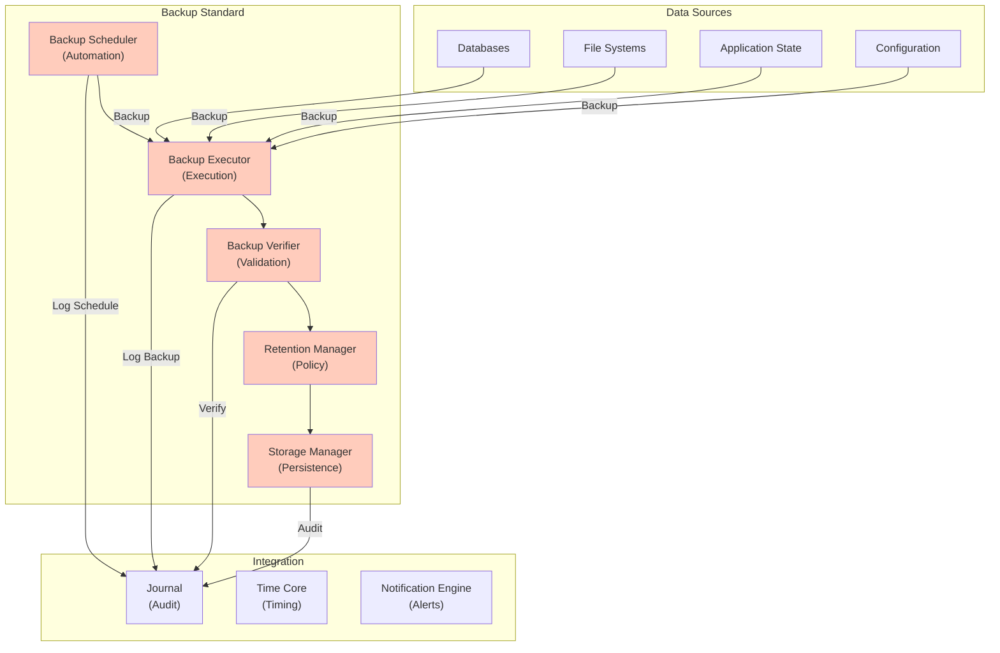

# 50. BACKUP STANDARD

**Version:** 1.0  
**Status:** ✓ APPROVED  
**Date:** 2026-07-04  
**Type:** Operating System Foundation Pack III  
**Classification:** Constitutional Standard

## PURPOSE

The Backup Standard establishes the immutable laws, architectural contracts, and governance procedures for data backup, verification, and long-term preservation within the SO8FI Operating System. Backup ensures **data durability**, protecting against accidental deletion, corruption, or catastrophic failure. Backup is not just copying data—it's **verified protection** with restoration capability. Every backed-up byte must be recoverable and verified.

Backup is **proven protection**, not assumed safety.

## ARCHITECTURE



## RESPONSIBILITIES

### Backup Scheduler
- Define and manage backup schedules
- Support multiple backup strategies (full, incremental, differential)
- Coordinate backup timing to minimize operational impact
- Respect Time Core for scheduling
- Support backup frequency policies (daily, weekly, monthly, etc.)
- Trigger backups on schedule
- Record all backup schedules through Journal

### Backup Executor
- Execute backup operations reliably
- Support parallel backups of different data sources
- Implement data consistency checks during backup
- Handle backup failures gracefully
- Support incremental and differential backup strategies
- Implement compression and deduplication
- Record backup metadata and progress

### Backup Verifier
- Verify all backups are complete and valid
- Test backup integrity with checksums and validation
- Perform periodic restore tests
- Detect bit rot and data corruption
- Alert on verification failures
- Document verification results
- Maintain verification audit trail

### Retention Manager
- Implement data retention policies
- Support regulatory retention requirements
- Track backup age and lifecycle
- Manage backup archival (move to cold storage)
- Implement backup expiration
- Support legal holds on backups
- Document retention decisions

### Storage Manager
- Manage backup storage infrastructure
- Support multiple storage tiers (hot, warm, cold)
- Implement redundant storage
- Support geographic distribution
- Provide secure storage with encryption
- Monitor storage capacity
- Provide storage cost analytics

## IMMUTABLE LAWS

1. **Law of Multiple Copies:** All critical data must have multiple backup copies in different locations. Single backup copy forbidden.

2. **Law of Verification:** All backups must be verified immediately after creation. Unverified backups assumed corrupted.

3. **Law of Restore Testing:** All backup procedures must be regularly tested with actual restore operations. Untested backups are worthless.

4. **Law of Consistent Backup:** Backups must capture consistent state of data. Inconsistent backups forbidden.

5. **Law of Encryption:** All backups must be encrypted in storage and in transit. Unencrypted backups forbidden.

6. **Law of Retention Compliance:** Backups must be retained according to policy. No premature deletion of required backups.

7. **Law of Immutable Backup:** Verified backups must be immutable (write-once). Deletion of backups only after retention period expires.

8. **Law of Audit Recording:** All backup operations (creation, verification, retention decisions, deletion) must be recorded through Journal.

9. **Law of Integrity Verification:** All restored data must be verified for integrity. Corrupted data must be detected before use.

10. **Law of Disaster Capability:** All backups must be restorable in disaster scenarios (infrastructure loss, data center failure). Disaster restorability mandatory.

## INTERFACE CONTRACTS

### Interface 1: BackupScheduler

```typescript
interface BackupScheduler {
  // Schedule management
  defineBackupSchedule(
    dataSource: DataSource,
    schedule: BackupScheduleDefinition
  ): Promise<ScheduleId>;
  
  updateBackupSchedule(
    scheduleId: ScheduleId,
    updates: ScheduleUpdates
  ): Promise<void>;
  
  // Schedule queries
  getBackupSchedule(scheduleId: ScheduleId): Promise<BackupSchedule>;
  listBackupSchedules(): Promise<BackupSchedule[]>;
  
  // Backup triggering
  triggerBackupNow(scheduleId: ScheduleId): Promise<BackupJobId>;
  
  // Scheduling configuration
  setBackupFrequency(dataSource: DataSource, frequency: BackupFrequency): Promise<void>;
  defineBackupStrategy(
    dataSource: DataSource,
    strategy: BackupStrategy
  ): Promise<void>;
}
```

### Interface 2: BackupExecutor

```typescript
interface BackupExecutor {
  // Backup execution
  executeFullBackup(
    dataSource: DataSource,
    destination: BackupDestination
  ): Promise<BackupJobId>;
  
  executeIncrementalBackup(
    dataSource: DataSource,
    destination: BackupDestination
  ): Promise<BackupJobId>;
  
  executeDifferentialBackup(
    dataSource: DataSource,
    destination: BackupDestination
  ): Promise<BackupJobId>;
  
  // Job management
  getBackupJobStatus(jobId: BackupJobId): Promise<BackupJobStatus>;
  getBackupJobLog(jobId: BackupJobId): Promise<BackupLogEntry[]>;
  
  // Data handling
  getBackupMetadata(backupId: string): Promise<BackupMetadata>;
  listBackups(dataSource: DataSource): Promise<BackupInfo[]>;
  
  // Optimization
  enableDeduplication(dataSource: DataSource): Promise<void>;
  enableCompression(dataSource: DataSource): Promise<void>;
}
```

### Interface 3: BackupVerifier

```typescript
interface BackupVerifier {
  // Immediate verification
  verifyBackupIntegrity(backupId: string): Promise<VerificationResult>;
  
  // Periodic verification
  scheduleVerificationTests(
    backupId: string,
    schedule: VerificationSchedule
  ): Promise<void>;
  
  // Restore testing
  performTestRestore(
    backupId: string,
    testEnvironment: Environment
  ): Promise<RestoreTestResult>;
  
  // Corruption detection
  detectCorruption(backupId: string): Promise<CorruptionReport>;
  detectBitRot(backupId: string): Promise<BitRotReport>;
  
  // Verification history
  getVerificationHistory(backupId: string): Promise<VerificationEvent[]>;
  getVerificationMetrics(): Promise<VerificationMetrics>;
  
  // Audit
  generateVerificationReport(
    period: TimePeriod
  ): Promise<VerificationReport>;
}
```

### Interface 4: RetentionManager

```typescript
interface RetentionManager {
  // Retention policies
  defineRetentionPolicy(
    dataSource: DataSource,
    policy: RetentionPolicy
  ): Promise<PolicyId>;
  
  updateRetentionPolicy(
    policyId: PolicyId,
    updates: PolicyUpdates
  ): Promise<void>;
  
  // Retention compliance
  checkRetentionCompliance(backupId: string): Promise<ComplianceStatus>;
  enforceRetentionPolicy(dataSource: DataSource): Promise<void>;
  
  // Legal holds
  applyLegalHold(backupId: string, reason: string): Promise<void>;
  removeLegalHold(backupId: string): Promise<void>;
  
  // Lifecycle management
  archiveBackup(backupId: string, archiveLocation: Location): Promise<void>;
  expireBackup(backupId: string): Promise<void>;
  
  // Queries
  getBackupRetentionStatus(backupId: string): Promise<RetentionStatus>;
  listExpiredBackups(): Promise<BackupInfo[]>;
}
```

### Interface 5: StorageManager

```typescript
interface StorageManager {
  // Storage provisioning
  provideStorage(
    dataSource: DataSource,
    requirements: StorageRequirements
  ): Promise<StorageAllocation>;
  
  // Tiering
  moveToHotStorage(backupId: string): Promise<void>;
  moveToWarmStorage(backupId: string): Promise<void>;
  moveToColdStorage(backupId: string): Promise<void>;
  
  // Redundancy
  replicateBackup(
    backupId: string,
    replicationTargets: Location[]
  ): Promise<void>;
  
  // Security
  encryptBackupAtRest(backupId: string, encryption: EncryptionSpec): Promise<void>;
  
  // Monitoring
  getStorageUtilization(): Promise<StorageMetrics>;
  monitorStorageHealth(): Promise<StorageHealthReport>;
  
  // Cost management
  generateStorageCostReport(period: TimePeriod): Promise<CostReport>;
  optimizeStorageCosts(): Promise<OptimizationPlan>;
}
```

## SECURITY RULES

### Forbidden Operations

- **NO single backup copy** — Multiple copies in different locations required
- **NO unverified backups** — Verification mandatory
- **NO untested backup procedures** — Regular restore testing required
- **NO inconsistent backups** — Data consistency enforced
- **NO unencrypted backups** — Encryption mandatory
- **NO premature backup deletion** — Retention policies enforced
- **NO backup modification after creation** — Immutability enforced
- **NO unaudited backup operations** — All operations logged
- **NO corrupted data restoration** — Integrity checks before use
- **NO single-location backup** — Geographic distribution required

### Security Contracts

- All backups created with verified integrity
- All backups encrypted at rest and in transit
- All backups tested with actual restore operations
- All backups retained per policy
- All backup operations audited through Journal
- Multiple backup copies maintained in different locations

## DEPENDENCIES

### Required Core Systems
- **Time Core:** Backup scheduling and retention timing
- **Journal:** Audit trail of all backup operations
- **Identity Core:** Access control for backup data
- **Protocol Engine:** Authorization for backup operations

### Required System Engines
- **Monitoring Engine:** Backup health and progress monitoring
- **Notification Engine:** Backup failure alerts
- **Security Engine:** Encryption and key management

### Infrastructure
- Backup storage infrastructure (multiple locations)
- Backup scheduling and orchestration
- Verification and restore testing infrastructure
- Encryption key management

## RECOVERY

### Backup Failure Recovery
1. Detect backup failure
2. Alert backup operations team
3. Retry backup operation
4. If retry fails, investigate cause
5. Implement corrective action
6. Resume backup operations
7. Verify backup success

### Verification Failure Recovery
1. Detect verification failure
2. Alert backup team
3. Investigate backup corruption
4. Attempt repair if possible
5. If unreparable, mark backup as corrupted
6. Restore from alternate backup
7. Reexecute backup

### Restore Failure Recovery
1. Detect restore failure
2. Alert disaster recovery team
3. Investigate restore error
4. Attempt alternate backup
5. If all backups fail, escalate to Disaster Recovery
6. Document failure and analysis
7. Implement preventive measures

## VALIDATION

### Immutable Law Verification
- Automated scanning confirms multiple backup copies
- Verification testing confirms integrity
- Restore testing validates backup restorability
- Encryption audit confirms all backups encrypted
- Retention audit confirms policy compliance

### Contract Verification
- Backup Scheduler creates all schedules
- Backup Executor executes backups
- Backup Verifier verifies all backups
- Retention Manager enforces policies
- Storage Manager provides storage

### Performance Validation
- Backup execution time < 4 hours for full backup
- Incremental backup time < 30 minutes
- Verification latency < 2 hours
- Restore time < 1 hour for standard cases
- Storage provisioning < 30 minutes

### Reliability Validation
- 100% backup success rate
- 100% verification success rate
- Zero data loss in restore operations
- Multiple backup copies maintained
- Complete audit trail

## GOVERNANCE

### Approval Authority
**Backup and Recovery Council** (Operations + Architecture + Security + Compliance)

### Backup Governance
- **Policies:** Backup policies reviewed annually
- **Schedules:** Backup schedules approved before implementation
- **Testing:** Restore tests performed quarterly
- **Retention:** Retention policies reviewed quarterly
- **Compliance:** Compliance audits performed annually

### Change Management
- All backup policy changes require council approval
- All backup schedule changes require validation
- Retention policy changes require legal review
- Restore procedures tested before deployment
- All changes audited in Journal

### Monitoring and Compliance
- Real-time backup status monitoring
- Daily backup completion verification
- Weekly verification test execution
- Monthly backup metrics reporting
- Quarterly disaster recovery drills

### Incident Response
- Backup failures escalated to operations team
- Verification failures trigger investigation
- Restore failures escalate to Disaster Recovery
- All incidents documented
- Root cause analysis mandatory

---

**Document ID:** 50  
**Classification:** Constitutional Standard  
**Immutable Laws:** 10  
**Interface Contracts:** 5  
**Approved by:** SO8FI Governance Council  
**Effective Date:** 2026-07-04
