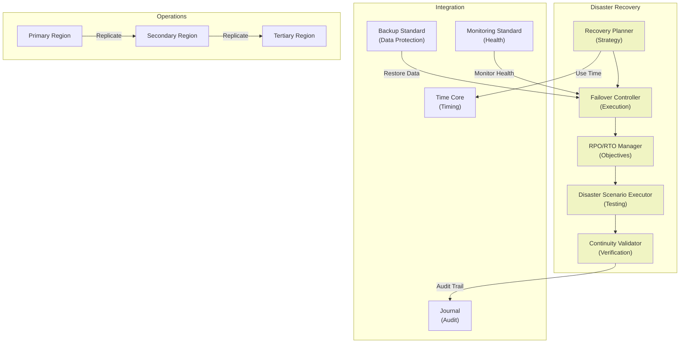

# 51. DISASTER RECOVERY STANDARD

**Version:** 1.0  
**Status:** ✓ APPROVED  
**Date:** 2026-07-04  
**Type:** Operating System Foundation Pack III  
**Classification:** Constitutional Standard

## PURPOSE

The Disaster Recovery Standard establishes the immutable laws, architectural contracts, and governance procedures for disaster recovery, business continuity, and failover within the SO8FI Operating System. Disaster Recovery ensures **operational resilience**, allowing the platform to survive catastrophic failures (data center outages, natural disasters, systemic failures) and recover to operational state. Disaster Recovery is not planning—it's **tested, executable procedures**.

Disaster Recovery is **prepared resilience**, not optimistic hope.

## ARCHITECTURE



## RESPONSIBILITIES

### Recovery Planner
- Define disaster recovery strategies for all components
- Document recovery procedures for each failure scenario
- Identify critical and non-critical systems
- Define recovery priority for component restoration
- Support multi-region failover scenarios
- Plan data recovery sequences
- Record all recovery plans through Journal

### Failover Controller
- Execute automatic failover on primary failure detection
- Coordinate graceful service transition to secondary
- Maintain data consistency during failover
- Support active-active and active-passive failover
- Implement automatic failback to primary
- Track failover execution and status
- Alert on failover initiation and completion

### RPO/RTO Manager
- Define Recovery Point Objectives (RPO) per system
- Define Recovery Time Objectives (RTO) per system
- Monitor RPO and RTO compliance
- Alert on RPO/RTO violations
- Support different RPO/RTO requirements by criticality
- Track recovery performance
- Provide recovery metrics and analytics

### Disaster Scenario Executor
- Execute regular disaster scenario simulations
- Test recovery procedures without affecting production
- Validate failover procedures
- Measure actual recovery times
- Identify bottlenecks and gaps
- Generate disaster recovery test reports
- Implement findings from tests

### Continuity Validator
- Verify business continuity after failover
- Validate data consistency post-failover
- Check service functionality
- Verify SLAs maintained
- Detect service degradation
- Support gradual transition back to primary
- Document recovery success and issues

## IMMUTABLE LAWS

1. **Law of Tested Recovery:** All disaster recovery procedures must be tested regularly. Untested recovery procedures assumed to fail.

2. **Law of Defined Objectives:** All critical systems must have defined RPO and RTO. Undefined objectives forbidden.

3. **Law of Multi-Region Protection:** Critical data and systems must be replicated to geographically distant regions. Single-region systems cannot survive disasters.

4. **Law of Automatic Detection:** Disaster scenarios must be detected automatically. No manual detection permitted for critical scenarios.

5. **Law of Automatic Failover:** Automatic failover must be triggered on primary failure detection. Manual-only failover forbidden for critical systems.

6. **Law of Data Consistency:** Failover must preserve data consistency. Inconsistent failover forbidden.

7. **Law of Verification:** All failovers must be verified successfully before service resumption. Unverified failovers forbidden.

8. **Law of Audit Recording:** All disaster recovery operations (failover, failback, testing) must be recorded through Journal.

9. **Law of Graceful Degradation:** System must degrade gracefully to reduced capacity rather than catastrophic failure. Graceful degradation mandatory.

10. **Law of Continuous Improvement:** Disaster recovery procedures must be updated based on test results and incident analysis. Stale procedures must be updated.

## INTERFACE CONTRACTS

### Interface 1: RecoveryPlanner

```typescript
interface RecoveryPlanner {
  // Recovery planning
  defineRecoveryPlan(
    systemId: string,
    plan: RecoveryPlanDefinition
  ): Promise<PlanId>;
  
  // Scenario definition
  defineDisasterScenario(
    scenario: DisasterScenarioDefinition
  ): Promise<ScenarioId>;
  
  // Plan queries
  getRecoveryPlan(planId: PlanId): Promise<RecoveryPlan>;
  listRecoveryPlans(): Promise<RecoveryPlanInfo[]>;
  
  // Criticality
  defineSystemCriticality(
    systemId: string,
    criticality: CriticalityLevel
  ): Promise<void>;
  
  // Plan updates
  updateRecoveryPlan(planId: PlanId, updates: PlanUpdates): Promise<void>;
  validateRecoveryPlan(planId: PlanId): Promise<ValidationResult>;
}
```

### Interface 2: FailoverController

```typescript
interface FailoverController {
  // Failover execution
  initiateFailover(
    planId: PlanId,
    failoverType: FailoverType
  ): Promise<FailoverExecutionId>;
  
  // Failback execution
  initiateFailback(
    executionId: FailoverExecutionId
  ): Promise<FailbackExecutionId>;
  
  // Failover monitoring
  getFailoverStatus(executionId: FailoverExecutionId): Promise<FailoverStatus>;
  monitorFailoverProgress(executionId: FailoverExecutionId): Promise<ProgressUpdates>;
  
  // Failover validation
  validateFailoverSuccess(
    executionId: FailoverExecutionId
  ): Promise<ValidationResult>;
  
  // Failover history
  getFailoverHistory(): Promise<FailoverEvent[]>;
  getFailoverLog(executionId: FailoverExecutionId): Promise<LogEntry[]>;
  
  // Rollback
  rollbackFailover(executionId: FailoverExecutionId): Promise<void>;
}
```

### Interface 3: RPOManager

```typescript
interface RPOManager {
  // RPO definition
  defineRPO(
    systemId: string,
    rpo: RecoveryPointObjective
  ): Promise<void>;
  
  // RTO definition
  defineRTO(
    systemId: string,
    rto: RecoveryTimeObjective
  ): Promise<void>;
  
  // Compliance monitoring
  checkRPOCompliance(systemId: string): Promise<ComplianceStatus>;
  checkRTOCompliance(systemId: string): Promise<ComplianceStatus>;
  
  // Current status
  getCurrentRecoveryPoint(systemId: string): Promise<RecoveryPointInfo>;
  getRecoveryTimeEstimate(systemId: string): Promise<Duration>;
  
  // Metrics
  getRPOMetrics(): Promise<RPOMetrics>;
  getRTOMetrics(): Promise<RTOMetrics>;
  
  // Alerts
  getRPOAlerts(): Promise<Alert[]>;
  getRTOAlerts(): Promise<Alert[]>;
}
```

### Interface 4: DisasterScenarioExecutor

```typescript
interface DisasterScenarioExecutor {
  // Scenario execution
  executeScenario(
    scenarioId: string,
    testEnvironment: Environment
  ): Promise<SimulationExecutionId>;
  
  // Simulation monitoring
  getSimulationStatus(
    executionId: SimulationExecutionId
  ): Promise<SimulationStatus>;
  
  // Recovery measurement
  measureRecoveryMetrics(
    executionId: SimulationExecutionId
  ): Promise<RecoveryMetrics>;
  
  // Test reporting
  generateSimulationReport(
    executionId: SimulationExecutionId
  ): Promise<SimulationReport>;
  
  // Finding management
  recordFinding(
    executionId: SimulationExecutionId,
    finding: Finding
  ): Promise<void>;
  
  // Remediation tracking
  recordRemediation(
    executionId: SimulationExecutionId,
    remediation: Remediation
  ): Promise<void>;
}
```

### Interface 5: ContinuityValidator

```typescript
interface ContinuityValidator {
  // Post-failover validation
  validateBusinessContinuity(
    failoverExecutionId: FailoverExecutionId
  ): Promise<ContinuityValidationResult>;
  
  // Data consistency
  validateDataConsistency(
    systemId: string
  ): Promise<ConsistencyReport>;
  
  // Service functionality
  validateServiceFunctionality(
    serviceId: string
  ): Promise<FunctionalityReport>;
  
  // SLA compliance
  validateSLACompliance(
    systemId: string
  ): Promise<SLAComplianceReport>;
  
  // Performance validation
  validatePerformance(
    systemId: string
  ): Promise<PerformanceValidationResult>;
  
  // User impact assessment
  assessUserImpact(
    failoverExecutionId: FailoverExecutionId
  ): Promise<UserImpactReport>;
  
  // Transition planning
  planTransitionBackToPrimary(
    failoverExecutionId: FailoverExecutionId
  ): Promise<TransitionPlan>;
}
```

## SECURITY RULES

### Forbidden Operations

- **NO untested recovery procedures** — All procedures tested before production use
- **NO undefined RPO/RTO** — Objectives defined for all critical systems
- **NO single-region protection** — Multi-region replication required
- **NO manual disaster detection** — Automatic detection mandatory
- **NO manual-only failover** — Automatic failover required for critical systems
- **NO inconsistent failover** — Data consistency verified
- **NO unverified failover** — Verification required before service resumption
- **NO unaudited recovery** — All operations logged through Journal
- **NO catastrophic failure** — Graceful degradation enforced
- **NO stale procedures** — Procedures updated after every test

### Security Contracts

- All disaster scenarios tested quarterly
- All failover procedures automated
- All RPO/RTO compliance monitored
- All failovers verified before service resumption
- All recovery operations audited
- Multi-region replication maintained

## DEPENDENCIES

### Required Standards
- **Backup Standard:** Data recovery capability
- **Monitoring Standard:** Failure detection
- **Runtime Standard:** Process recovery
- **Deployment Standard:** Failover procedures

### Required Core Systems
- **Time Core:** Disaster timing and RTO/RPO tracking
- **Journal:** Audit trail of disaster operations
- **Identity Core:** Access control for recovery operations
- **Protocol Engine:** Authorization for failover operations

### Required System Engines
- **Notification Engine:** Disaster alerts
- **Monitoring Engine:** Disaster detection
- **Backup Engine:** Data recovery

### Infrastructure
- Multi-region deployment infrastructure
- Geographic data replication system
- Automatic failover infrastructure
- Disaster recovery testing environment

## RECOVERY

### Failover Failure Recovery
1. Detect failover failure
2. Escalate to disaster recovery team
3. Alert all stakeholders
4. Initiate manual recovery procedures
5. Attempt alternate failover strategy
6. Document failure and analysis
7. Implement preventive measures

### Data Inconsistency Recovery
1. Detect data inconsistency post-failover
2. Alert data recovery team
3. Verify backup integrity
4. Restore from known-good backup
5. Reconcile data from both regions
6. Verify consistency restored
7. Resume normal operations

### Test Failure Recovery
1. Detect disaster recovery test failure
2. Investigate test failure cause
3. Update recovery procedures if needed
4. Retest recovery
5. Document findings
6. Implement remediation

## VALIDATION

### Immutable Law Verification
- All disaster recovery procedures tested quarterly
- All RPO/RTO compliance monitored continuously
- Multi-region replication verified
- Automatic failover tested regularly
- Data consistency verified post-failover

### Contract Verification
- Recovery Planner defines all plans
- Failover Controller executes failovers
- RPO/RTO Manager monitors objectives
- Disaster Scenario Executor tests procedures
- Continuity Validator verifies resumption

### Performance Validation
- Failover time < RTO for all critical systems
- Recovery point < RPO for all critical systems
- Data consistency verified 100% of time
- Failover success rate > 99%
- Service restoration validated

### Reliability Validation
- Zero data loss on failover
- 100% disaster detection reliability
- Automatic failover successful > 99%
- Complete audit trail of all operations
- All procedures tested and validated

## GOVERNANCE

### Approval Authority
**Disaster Recovery Council** (Operations + Architecture + Business + Legal)

### Recovery Governance
- **Plans:** All recovery plans approved before use
- **RPO/RTO:** Objectives defined and approved
- **Testing:** Quarterly disaster recovery tests required
- **Procedures:** All procedures tested and documented
- **Incidents:** All actual disasters reviewed by council

### Change Management
- All recovery plan changes require council approval
- All RPO/RTO changes require business approval
- New disaster scenarios identified and tested
- Test findings implemented before next test
- All changes audited in Journal

### Monitoring and Compliance
- Real-time RPO/RTO monitoring
- Daily failover readiness verification
- Quarterly disaster recovery simulations
- Monthly recovery metrics reporting
- Annual complete disaster recovery audit

### Incident Response
- Disaster detection triggers automatic failover
- Failover failures escalate to emergency response
- All disasters trigger post-incident review
- Root cause analysis mandatory
- Preventive measures implemented before next test

---

**Document ID:** 51  
**Classification:** Constitutional Standard  
**Immutable Laws:** 10  
**Interface Contracts:** 5  
**Approved by:** SO8FI Governance Council  
**Effective Date:** 2026-07-04
