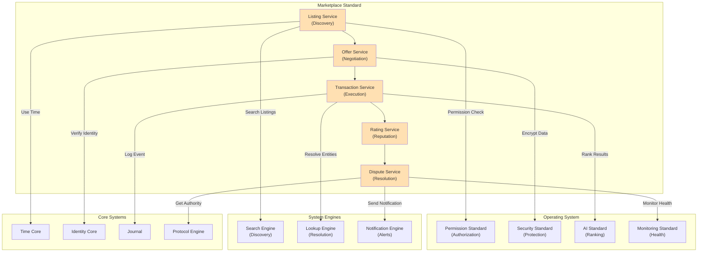

# 52. MARKETPLACE STANDARD

**Version:** 1.0  
**Status:** ✓ APPROVED  
**Date:** 2026-07-04  
**Type:** Business Platform Foundation Pack IV  
**Classification:** Constitutional Standard

## PURPOSE

The Marketplace Standard establishes the immutable laws, architectural contracts, and governance procedures for the SO8FI Marketplace business module. The Marketplace enables peer-to-peer commerce, enabling buyers and sellers to discover, negotiate, and transact with full platform transparency and governance. It leverages all platform infrastructure (Core Systems, System Engines, Operating System standards) while adding business logic only for marketplace-specific operations. The Marketplace is a **governed commerce layer**, not a platform layer.

Marketplace is **commerce with governance**, providing transparency, fairness, and compliance.

## ARCHITECTURE



## RESPONSIBILITIES

### Listing Service
- Provide marketplace listing creation and discovery
- Support product/service catalogs with metadata
- Implement search and filtering
- Manage listing lifecycle (draft, active, expired, removed)
- Support bulk operations and batch uploads
- Implement listing quality scoring
- Enforce marketplace policies on listings

### Offer Service
- Manage buyer-seller negotiation process
- Support structured offer workflow
- Track offer history and evolution
- Implement offer expiration and locking
- Support counter-offers and terms negotiation
- Provide offer analytics and insights
- Audit all offer interactions through Journal

### Transaction Service
- Execute marketplace transactions
- Manage transaction lifecycle and states
- Coordinate payment processing
- Track transaction fulfillment
- Support transaction reversals and refunds
- Implement transaction policies and rules
- Record all transactions immutably through Journal

### Rating Service
- Collect buyer and seller ratings
- Calculate reputation scores
- Support rating verification (only transacted parties)
- Manage rating disputes
- Implement rating decay and history
- Provide seller reputation dashboard
- Enforce rating policies and prevent fraud

### Dispute Service
- Handle buyer-seller disputes
- Manage dispute lifecycle and resolution
- Support evidence collection and analysis
- Implement fair dispute resolution procedures
- Enforce dispute deadlines and escalation
- Support appeals and final resolution
- Provide dispute analytics and trends

## IMMUTABLE LAWS

1. **Law of Fair Pricing:** All pricing information must be transparent and disclosed upfront. Hidden fees forbidden.

2. **Law of Complete Disclosure:** All product/service descriptions must be accurate, complete, and verifiable. Fraudulent descriptions forbidden.

3. **Law of Identity Verification:** All marketplace participants must have verified identities through Identity Core. Anonymous participation forbidden.

4. **Law of Transaction Recording:** All marketplace transactions must be recorded immutably through Journal. Unrecorded transactions forbidden.

5. **Law of Dispute Resolution:** All disputes must be resolvable through defined procedures. Unresolvable disputes must be escalated to governance.

6. **Law of Reputation Integrity:** Reputation scores must be based only on verified transactions. Artificial rating manipulation forbidden.

7. **Law of Fair Competition:** All marketplace participants compete fairly under equal policies. Discrimination forbidden.

8. **Law of Payment Protection:** All payments must be protected and verified. Payment fraud must be detected and prevented.

9. **Law of Policy Enforcement:** All marketplace policies must be enforced consistently. Policy violations must be sanctioned.

10. **Law of Audit Trail:** All marketplace operations (listings, offers, transactions, ratings, disputes) must be auditable. Audit trail gaps forbidden.

## INTERFACE CONTRACTS

### Interface 1: ListingService

```typescript
interface ListingService {
  // Listing management
  createListing(
    seller: Identity,
    listingData: ListingData,
    metadata: ListingMetadata
  ): Promise<ListingId>;
  
  updateListing(
    listingId: ListingId,
    updates: ListingUpdates,
    updater: Identity
  ): Promise<void>;
  
  deactivateListing(
    listingId: ListingId,
    reason: DeactivationReason
  ): Promise<void>;
  
  // Listing retrieval
  getListing(listingId: ListingId): Promise<ListingData>;
  searchListings(criteria: SearchCriteria): Promise<ListingId[]>;
  
  // Listing quality
  scoreListingQuality(listingId: ListingId): Promise<QualityScore>;
  
  // Bulk operations
  bulkCreateListings(listings: ListingData[]): Promise<ListingId[]>;
  bulkUpdateListings(updates: ListingUpdate[]): Promise<void>;
  
  // Analytics
  getListingAnalytics(listingId: ListingId): Promise<Analytics>;
}
```

### Interface 2: OfferService

```typescript
interface OfferService {
  // Offer management
  createOffer(
    buyer: Identity,
    listingId: ListingId,
    offerTerms: OfferTerms
  ): Promise<OfferId>;
  
  respondToOffer(
    offerId: OfferId,
    response: OfferResponse,
    respondent: Identity
  ): Promise<void>;
  
  counterOffer(
    offerId: OfferId,
    counterTerms: OfferTerms,
    offeror: Identity
  ): Promise<OfferId>;
  
  acceptOffer(
    offerId: OfferId,
    acceptor: Identity
  ): Promise<TransactionId>;
  
  // Offer queries
  getOffer(offerId: OfferId): Promise<OfferData>;
  getOfferHistory(listingId: ListingId): Promise<OfferData[]>;
  
  // Offer analytics
  getOfferMetrics(timeRange: TimeRange): Promise<OfferMetrics>;
}
```

### Interface 3: TransactionService

```typescript
interface TransactionService {
  // Transaction execution
  executeTransaction(
    offerId: OfferId,
    buyer: Identity,
    seller: Identity,
    terms: TransactionTerms
  ): Promise<TransactionId>;
  
  // Transaction lifecycle
  getTransactionStatus(transactionId: TransactionId): Promise<TransactionStatus>;
  updateTransactionStatus(
    transactionId: TransactionId,
    newStatus: TransactionStatus
  ): Promise<void>;
  
  // Fulfillment
  recordFulfillment(
    transactionId: TransactionId,
    fulfillmentData: FulfillmentData
  ): Promise<void>;
  
  // Refunds and reversals
  requestRefund(
    transactionId: TransactionId,
    requester: Identity,
    reason: RefundReason
  ): Promise<RefundRequestId>;
  
  processRefund(
    refundRequestId: RefundRequestId,
    approval: RefundApproval
  ): Promise<void>;
  
  // Analytics
  getTransactionAnalytics(
    timeRange: TimeRange
  ): Promise<TransactionAnalytics>;
}
```

### Interface 4: RatingService

```typescript
interface RatingService {
  // Rating submission
  submitRating(
    transactionId: TransactionId,
    rater: Identity,
    rateeType: 'seller' | 'buyer',
    ratingData: RatingData
  ): Promise<RatingId>;
  
  // Rating retrieval
  getRating(ratingId: RatingId): Promise<RatingData>;
  getRatingsForEntity(entityId: string): Promise<RatingData[]>;
  
  // Reputation calculation
  calculateReputation(entityId: string): Promise<ReputationScore>;
  getReputationHistory(entityId: string): Promise<ReputationEvent[]>;
  
  // Rating disputes
  disputeRating(
    ratingId: RatingId,
    disputer: Identity,
    reason: DisputeReason
  ): Promise<RatingDisputeId>;
  
  // Analytics
  getRatingAnalytics(): Promise<RatingAnalytics>;
  getTrendingRatings(): Promise<RatingTrend[]>;
}
```

### Interface 5: DisputeService

```typescript
interface DisputeService {
  // Dispute creation
  createDispute(
    transactionId: TransactionId,
    initiator: Identity,
    reason: DisputeReason,
    evidence: Evidence[]
  ): Promise<DisputeId>;
  
  // Dispute resolution
  addEvidenceToDispute(
    disputeId: DisputeId,
    evidence: Evidence
  ): Promise<void>;
  
  proposeResolution(
    disputeId: DisputeId,
    proposer: Identity,
    resolution: ResolutionProposal
  ): Promise<void>;
  
  // Resolution execution
  acceptResolution(
    disputeId: DisputeId,
    acceptor: Identity,
    resolutionId: string
  ): Promise<void>;
  
  escalateDispute(
    disputeId: DisputeId,
    escalationReason: string
  ): Promise<void>;
  
  // Dispute queries
  getDispute(disputeId: DisputeId): Promise<DisputeData>;
  getDisputesByTransaction(transactionId: string): Promise<DisputeId[]>;
  
  // Analytics
  getDisputeAnalytics(timeRange: TimeRange): Promise<DisputeAnalytics>;
}
```

## SECURITY RULES

### Forbidden Operations

- **NO hidden fees** — All pricing transparent and disclosed upfront
- **NO fraudulent descriptions** — Descriptions must be accurate and verifiable
- **NO anonymous transactions** — Identity verification required
- **NO unrecorded transactions** — All transactions logged through Journal
- **NO unresolvable disputes** — All disputes have defined resolution path
- **NO artificial ratings** — Reputation based only on verified transactions
- **NO discriminatory policies** — All participants treated fairly
- **NO payment fraud** — Payment security verified
- **NO policy violations unpunished** — All violations sanctioned
- **NO audit trail gaps** — Complete audit trail mandatory

### Security Contracts

- All listings verified by marketplace policies
- All transactions authorized by Protocol Engine
- All disputes resolved by defined procedures
- All ratings based on verified transactions
- All operations audited through Journal
- All payments verified and protected

## DEPENDENCIES

### Required Operating System Standards
- **Permission Standard:** Buyer/seller authorization
- **Security Standard:** Data encryption and fraud prevention
- **AI Standard:** Listing ranking and recommendations
- **Monitoring Standard:** Marketplace health and metrics
- **Country Architecture:** Country-specific marketplace policies

### Required System Engines
- **Search Engine:** Listing discovery and search
- **Lookup Engine:** Entity resolution and verification
- **Notification Engine:** Transaction and dispute notifications
- **Translation Engine:** Multi-language listings and support

### Required Core Systems
- **Time Core:** Transaction timing and deadlines
- **Identity Core:** Buyer/seller identity verification
- **Journal:** Immutable transaction recording
- **Protocol Engine:** Transaction authorization

### Infrastructure
- Payment processing system
- Listing database and search indexes
- Rating and reputation system
- Dispute resolution workflows

## RECOVERY

### Transaction Failure Recovery
1. Detect transaction failure
2. Log failure through Journal
3. Alert buyer and seller
4. Assess transaction state
5. Initiate refund or retry
6. Verify recovery completion
7. Close transaction

### Dispute Escalation Recovery
1. Detect dispute impasse
2. Escalate to human review
3. Collect additional evidence
4. Make fair resolution decision
5. Enforce resolution
6. Update both parties
7. Record final resolution

### Reputation Recovery
1. Detect reputation abuse
2. Flag suspicious patterns
3. Investigate transactions
4. Remove fraudulent ratings if confirmed
5. Restore accurate reputation
6. Notify affected parties
7. Document investigation

## VALIDATION

### Immutable Law Verification
- All pricing verified transparent
- All descriptions verified for accuracy
- All transactions verified authorized
- All transactions verified recorded
- All disputes verified resolvable
- All ratings verified from actual transactions
- All participants verified treated fairly
- All payments verified protected

### Contract Verification
- Listing Service creates and manages listings
- Offer Service manages negotiations
- Transaction Service executes transactions
- Rating Service calculates reputation
- Dispute Service resolves disputes

### Performance Validation
- Listing creation < 5 seconds
- Search results < 1 second
- Transaction execution < 10 seconds
- Rating calculation < 5 seconds
- Dispute resolution < 24 hours for standard cases

### Compliance Validation
- 100% transaction audit coverage
- 100% identity verification
- All country policies enforced
- Zero unresolved disputes (escalation enforced)

## GOVERNANCE

### Approval Authority
**Marketplace Governance Council** (Operations + Product + Compliance + Legal)

### Marketplace Lifecycle Governance
- **Policies:** Marketplace policies reviewed quarterly
- **Transactions:** Transaction rules enforced by all services
- **Disputes:** All disputes reviewed by council
- **Ratings:** Rating integrity audited monthly
- **Compliance:** Country-specific policies enforced per Country Architecture

### Change Management
- All marketplace policy changes require council approval
- New marketplaces follow approval process
- Policy changes validated before implementation
- All changes audited in Journal
- Automatic rollback on policy violation

### Monitoring and Compliance
- Real-time marketplace metrics dashboard
- Daily transaction and rating audits
- Weekly fraud detection analysis
- Monthly marketplace health review
- Quarterly council marketplace reviews

### Incident Response
- Fraud detected triggers investigation
- Policy violations result in enforcement
- Disputes escalated if unresolved
- All incidents documented
- Root cause analysis mandatory

---

**Document ID:** 52  
**Classification:** Constitutional Standard (Business Platform)  
**Immutable Laws:** 10  
**Interface Contracts:** 5  
**Approved by:** SO8FI Governance Council  
**Effective Date:** 2026-07-04
