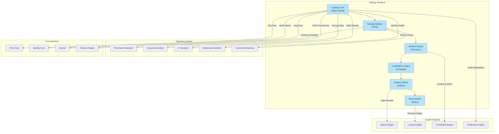
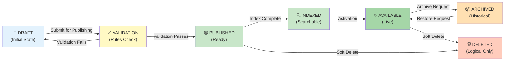

# 53. CATALOG STANDARD

**Version:** 1.0  
**Status:** ✓ APPROVED  
**Date:** 2026-07-04  
**Type:** Business Platform Foundation Pack IV  
**Classification:** Constitutional Standard

## PURPOSE

The Catalog Standard establishes the immutable laws, architectural contracts, and governance procedures for the universal SO8FI Catalog. Everything in SO8FI is a catalog object: products, services, companies, people, real estate, vehicles, jobs, courses, subscriptions, digital assets, documents, and collections. The Catalog provides a **unified object model** that every business module uses, ensuring consistency, searchability, and composability across the entire platform. The Catalog is not a database—it's an **architecture for organizing all platform entities**.

The Catalog is **universal structure + extensible attributes + complete governance**.

## CATALOG PHILOSOPHY

### Everything is a Catalog Object

Every entity in SO8FI inherits the same universal object model:

- **Physical Goods:** Products, vehicles, real estate, equipment
- **Services:** Professional services, labor, consulting, repairs
- **Organizations:** Companies, teams, departments, communities
- **People:** Users, professionals, sellers, service providers
- **Digital Assets:** Documents, videos, audio, software, code
- **Collections:** Categories, lists, aggregations, bundles
- **Intangibles:** Jobs, courses, subscriptions, licenses, permissions

All share:
- ✓ Unique identifier (numeric)
- ✓ Type and classification
- ✓ Owner and permissions
- ✓ Lifecycle and status
- ✓ Extensible attributes
- ✓ Localization support
- ✓ Media attachments
- ✓ Relations to other objects
- ✓ Complete audit trail

**One model. Infinite objects.**

## ARCHITECTURE



## UNIVERSAL CATALOG OBJECT

### Core Structure

Every catalog object contains:

```typescript
interface CatalogObject {
  // Identity
  id: NumericId;                    // Unique numeric identifier
  type: CatalogType;                // Type classification
  handle: Handle;                   // Readable identifier
  
  // Ownership & Control
  ownerId: Identity;                // Object owner
  ownerType: OwnerType;             // Individual, organization, system
  visibility: VisibilityLevel;      // Public, private, restricted
  
  // Lifecycle
  status: ObjectStatus;             // Draft → Published → Archived → Deleted
  createdAt: DateTime;              // Creation timestamp
  publishedAt: DateTime;            // Publication timestamp
  archivedAt: DateTime;             // Archival timestamp
  deletedAt: DateTime;              // Soft deletion timestamp
  
  // Content
  title: LocalizedString;           // Localized title
  description: LocalizedString;     // Localized description
  attributes: AttributeMap;         // Universal + module + country attributes
  media: MediaAttachment[];         // Images, videos, documents
  relations: ObjectRelation[];      // Links to other objects
  
  // Metadata
  permissions: Permission[];        // Access control
  tags: Tag[];                      // Classification and discovery
  categories: Category[];           // Hierarchical organization
  version: number;                  // Object version
  
  // Audit
  createdBy: Identity;              // Who created
  modifiedBy: Identity;             // Last modifier
  modifiedAt: DateTime;             // Last modification
  journalRef: JournalEntryId;       // Journal reference
}
```

## CATALOG LIFECYCLE



### State Descriptions

| State | Description | Action Required |
|-------|-------------|-----------------|
| **DRAFT** | Object created, not complete | Complete and validate |
| **VALIDATION** | Rules and policies checked | Pass validation or fix |
| **PUBLISHED** | Validation complete, ready | Await indexing |
| **INDEXED** | Searchable through Search Engine | Activate for availability |
| **AVAILABLE** | Live and discoverable | Normal operations |
| **ARCHIVED** | Historical record preserved | Can be restored |
| **DELETED** | Logical deletion, data preserved | Cannot be restored |

## ATTRIBUTE MODEL

### Universal Attributes (All Objects)

Common to every catalog object:
- `title` — Object name (localized)
- `description` — Object description (localized)
- `owner` — Object owner identity
- `created_at` — Creation timestamp
- `published_at` — Publication timestamp
- `status` — Current lifecycle status
- `visibility` — Public/private/restricted

### Module Attributes (Module-Specific)

Each module extends with domain-specific attributes:

**Marketplace Module:**
- `price` — Object price
- `currency` — Price currency
- `stock` — Available quantity
- `seller_id` — Seller identity

**Services Module:**
- `service_type` — Service category
- `duration` — Service duration
- `hourly_rate` — Rate if hourly
- `availability` — Availability schedule

**Jobs Module:**
- `job_title` — Position title
- `employment_type` — Full-time, contract, etc.
- `salary_range` — Compensation range
- `location` — Job location

### Country Attributes (Country-Specific)

Rules and attributes that vary by country:
- `tax_id` — Country-specific tax identifier
- `compliance_status` — Country regulatory status
- `restricted_countries` — Countries where unavailable
- `local_regulations` — Country-specific rules

### Optional Attributes

Extensible attributes added as needed:
- Custom fields per module
- Dynamic attributes per use case
- Temporary attributes for campaigns
- Feature flags and A/B testing

### Dynamic Attributes

Real-time calculated attributes:
- `trending_score` — Current popularity score
- `recommendation_score` — AI ranking
- `reputation_score` — Object reputation
- `engagement_metrics` — Usage statistics

## IMMUTABLE LAWS

1. **Law of Unique Identity:** Every catalog object must have a unique numeric identifier. No duplicate IDs permitted.

2. **Law of Complete Audit Trail:** All catalog operations must be recorded immutably through Journal. No unaudited changes permitted.

3. **Law of Ownership Verification:** Every catalog object must have a verified owner through Identity Core. Ownership changes must be authorized.

4. **Law of Lifecycle Integrity:** Catalog objects must follow defined lifecycle states. Invalid state transitions forbidden.

5. **Law of Permission Enforcement:** All catalog access must verify permissions. No unauthorized access permitted.

6. **Law of Localization Completeness:** All catalog objects must support localization. Missing translations must be flagged.

7. **Law of Attribute Extensibility:** Catalog attributes must be extensible without breaking existing objects. Schema evolution must be non-breaking.

8. **Law of Soft Deletion Only:** Catalog objects must never be physically deleted. All deletions must be logical (soft delete).

9. **Law of Immutable Core Identity:** Catalog object core properties (ID, creation metadata) must be immutable. Only allowed updates are to mutable fields.

10. **Law of Search Indexing:** All published objects must be indexed for search. Unindexed published objects must be detected and escalated.

## INTERFACE CONTRACTS

### Interface 1: CatalogCore

```typescript
interface CatalogCore {
  // Object creation
  createObject(
    type: CatalogType,
    owner: Identity,
    data: CatalogObjectData
  ): Promise<CatalogObject>;
  
  // Object retrieval
  getObject(objectId: NumericId): Promise<CatalogObject>;
  getObjectByHandle(handle: Handle): Promise<CatalogObject>;
  getObjectsByType(type: CatalogType): Promise<CatalogObject[]>;
  
  // Object updates (mutable fields only)
  updateObject(
    objectId: NumericId,
    updates: CatalogObjectUpdates,
    updater: Identity
  ): Promise<void>;
  
  // Lifecycle transitions
  transitionState(
    objectId: NumericId,
    targetState: ObjectStatus,
    actor: Identity
  ): Promise<void>;
  
  // Soft deletion
  softDeleteObject(
    objectId: NumericId,
    deleter: Identity
  ): Promise<void>;
}
```

### Interface 2: CatalogValidator

```typescript
interface CatalogValidator {
  // Validation
  validateObject(
    object: CatalogObject,
    validationContext: ValidationContext
  ): Promise<ValidationResult>;
  
  // Rule enforcement
  enforceRules(
    objectId: NumericId,
    rules: ValidationRule[]
  ): Promise<RuleEnforcementResult>;
  
  // Compliance checking
  checkCompliance(
    objectId: NumericId,
    countryId: CountryId
  ): Promise<ComplianceStatus>;
  
  // Schema validation
  validateSchema(
    object: CatalogObject,
    schema: ObjectSchema
  ): Promise<SchemaValidationResult>;
}
```

### Interface 3: AttributeEngine

```typescript
interface AttributeEngine {
  // Attribute management
  setAttribute(
    objectId: NumericId,
    attributeName: string,
    value: AttributeValue
  ): Promise<void>;
  
  getAttribute(
    objectId: NumericId,
    attributeName: string
  ): Promise<AttributeValue>;
  
  // Schema extension
  defineModuleAttributes(
    moduleId: string,
    attributeSchema: AttributeSchema
  ): Promise<void>;
  
  defineCountryAttributes(
    countryId: CountryId,
    attributeSchema: AttributeSchema
  ): Promise<void>;
  
  // Dynamic attributes
  calculateDynamicAttribute(
    objectId: NumericId,
    attributeName: string
  ): Promise<AttributeValue>;
  
  // Attribute validation
  validateAttributes(
    objectId: NumericId
  ): Promise<ValidationReport>;
}
```

### Interface 4: CatalogIndexer

```typescript
interface CatalogIndexer {
  // Indexing
  indexObject(
    objectId: NumericId
  ): Promise<void>;
  
  reindexObject(
    objectId: NumericId
  ): Promise<void>;
  
  bulkIndex(
    objectIds: NumericId[]
  ): Promise<void>;
  
  // Index maintenance
  getIndexStatus(
    objectId: NumericId
  ): Promise<IndexStatus>;
  
  rebuildIndexes(): Promise<void>;
  
  // Verification
  verifyIndexIntegrity(): Promise<IntegrityReport>;
}
```

### Interface 5: ReadModel

```typescript
interface ReadModel {
  // Catalog queries
  queryCatalog(
    query: CatalogQuery
  ): Promise<CatalogObject[]>;
  
  // Aggregation
  aggregateCatalog(
    aggregation: CatalogAggregation
  ): Promise<AggregationResult>;
  
  // Relationships
  getRelatedObjects(
    objectId: NumericId
  ): Promise<CatalogObject[]>;
  
  // Analytics
  getCatalogAnalytics(
    period: TimePeriod
  ): Promise<CatalogAnalytics>;
  
  // Health
  getCatalogHealth(): Promise<HealthStatus>;
}
```

## SECURITY RULES

### Forbidden Operations

- **NO duplicate IDs** — Unique identity required
- **NO unaudited changes** — All changes must be logged
- **NO ownership bypass** — Owner verification mandatory
- **NO invalid state transitions** — Lifecycle integrity enforced
- **NO unauthorized access** — Permissions verified
- **NO missing translations** — Localization complete
- **NO schema breaking** — Evolution must be non-breaking
- **NO physical deletion** — Soft deletion only
- **NO core field modification** — Core identity immutable
- **NO unindexed published objects** — Indexing enforced

### Security Contracts

- All objects owned by verified identity
- All updates recorded through Journal
- All access verified by Permission Standard
- All data encrypted by Security Standard
- All objects indexed for search
- All state transitions audited

## DEPENDENCIES

### Required Operating System Standards
- **Permission Standard:** Object access control
- **Security Standard:** Data encryption and protection
- **AI Standard:** Dynamic attribute calculation
- **Monitoring Standard:** Catalog health metrics
- **Country Architecture:** Country-specific attributes

### Required System Engines
- **Search Engine:** Object indexing and discovery
- **Lookup Engine:** Handle resolution
- **Translation Engine:** Localization support
- **Notification Engine:** Change notifications

### Required Core Systems
- **Time Core:** Lifecycle timing
- **Identity Core:** Owner verification
- **Journal:** Audit trail
- **Protocol Engine:** Authorization

## RECOVERY

### Validation Failure Recovery
1. Detect validation failure
2. Log issue through Journal
3. Notify object owner
4. Provide remediation guidance
5. Block publication until fixed
6. Verify fix before approval

### Index Failure Recovery
1. Detect indexing failure
2. Alert operations team
3. Attempt re-indexing
4. Verify index integrity
5. Manually repair if needed
6. Document failure cause

### Soft Deletion Recovery
1. Detect soft deletion request
2. Verify deletion authorization
3. Record deletion through Journal
4. Mark as deleted (not physical removal)
5. Preserve all data
6. Allow logical restoration

## VALIDATION

### Immutable Law Verification
- All objects have unique IDs
- All changes recorded through Journal
- All owners verified through Identity Core
- All objects follow lifecycle states
- All permissions verified
- All localization complete
- All schema extensions non-breaking
- All deletions logical only
- All core fields immutable
- All published objects indexed

### Contract Verification
- Catalog Core manages object lifecycle
- Catalog Validator enforces rules
- Attribute Engine manages extensions
- Catalog Indexer handles search indexing
- Read Model provides queries

### Performance Validation
- Object creation < 2 seconds
- Object retrieval < 500ms
- Search indexing < 5 seconds
- Bulk operations 1000+ objects/minute
- Query results < 1 second

### Compliance Validation
- 100% audit trail coverage
- 100% ownership verification
- 100% permission checking
- 100% indexing of published objects
- 0% physical deletions

## GOVERNANCE

### Approval Authority
**Catalog Governance Council** (Architecture + Operations + Product + Compliance)

### Catalog Lifecycle Governance
- **Schemas:** Catalog schemas reviewed before deployment
- **Validation:** Validation rules approved by council
- **Lifecycle:** State transitions audited
- **Deletion:** Soft deletion procedures enforced
- **Localization:** Language support verified

### Change Management
- All schema changes require council approval
- New object types require council approval
- Breaking schema changes forbidden
- Non-breaking evolution permitted with approval
- All changes audited in Journal

### Monitoring and Compliance
- Real-time catalog metrics dashboard
- Daily object creation and update audits
- Weekly validation error analysis
- Monthly catalog health review
- Quarterly council catalog reviews

### Incident Response
- Validation failures escalated
- Index failures trigger investigation
- Schema errors documented
- All incidents analyzed for prevention

---

**Document ID:** 53  
**Classification:** Constitutional Standard (Business Platform)  
**Immutable Laws:** 10  
**Interface Contracts:** 5  
**Approved by:** SO8FI Governance Council  
**Effective Date:** 2026-07-04
