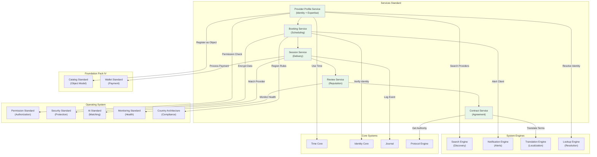

# 54. SERVICES STANDARD

**Version:** 1.0  
**Status:** ✓ APPROVED  
**Date:** 2026-07-04  
**Type:** Business Platform Foundation Pack IV  
**Classification:** Constitutional Standard

## PURPOSE

The Services Standard establishes the immutable laws, architectural contracts, and governance procedures for the SO8FI Services business module. The Services module enables professional services commerce: providers offer their expertise, clients discover and book services, sessions are delivered, and outcomes are verified. Unlike the Marketplace (goods + transactions), Services is about **time, expertise, and delivery of outcomes**.

Services is **expertise commerce with verified outcomes**.

## ARCHITECTURE



## RESPONSIBILITIES

### Provider Profile Service
- Register and verify service providers
- Maintain provider credentials, certifications, specializations
- Manage availability calendars and time zones
- Calculate and expose provider reputation scores
- Enforce provider standards and policy compliance
- Support provider tiers and category classifications
- Index provider profiles through Catalog Standard

### Booking Service
- Accept, validate, and confirm service bookings
- Resolve scheduling conflicts and double-bookings
- Support one-time and recurring session scheduling
- Manage booking lifecycle (pending → confirmed → in-progress → completed → cancelled)
- Enforce booking policies per service category and country
- Notify clients and providers at every lifecycle transition
- Record all booking events through Journal

### Session Service
- Coordinate service session delivery
- Track session start, progress, milestones, and completion
- Support session rescheduling and interruption recovery
- Capture session artifacts (files, recordings, reports) through Catalog Standard
- Verify session completion criteria and outcomes
- Trigger payment release upon verified completion
- Record all session events immutably through Journal

### Review Service
- Collect post-session client reviews and provider self-assessments
- Enforce verified-session-only review policy
- Compute composite provider reputation from review history
- Detect and prevent review fraud
- Support review appeals and moderation workflow
- Publish aggregated ratings to provider profiles
- Audit all review submissions through Journal

### Contract Service
- Generate standardized service contracts from templates
- Capture mutual agreement (e-signature or acceptance event)
- Version-control contract terms per booking
- Store contracts as Catalog objects with full audit trail
- Enforce SLAs, deliverables, and payment conditions
- Manage contract amendments and extensions
- Record all contract events through Journal

## IMMUTABLE LAWS

1. **Law of Credential Verification:** All service providers must have verified identities and credentials through Identity Core. Unverified providers cannot accept bookings.

2. **Law of Availability Honesty:** Provider availability must reflect actual capacity. Intentional overbooking and false availability are forbidden.

3. **Law of Session Recording:** All service sessions must be recorded through Journal at start, completion, and cancellation. Unrecorded sessions are forbidden.

4. **Law of Outcome Verification:** Payments for services are released only upon verified session completion or mutual agreement. Unverified payment release is forbidden.

5. **Law of Contract Supremacy:** All service engagements must be governed by a recorded contract. Verbal-only agreements without a digital contract record are forbidden.

6. **Law of Verified Reviews:** Reviews may only be submitted by clients with completed sessions. Unverified or synthetic reviews are forbidden.

7. **Law of Cancellation Policy:** All service bookings must have a declared cancellation policy. Hidden or retroactive cancellation policies are forbidden.

8. **Law of Time Integrity:** All session times must be recorded through Time Core. Manual timestamp manipulation is forbidden.

9. **Law of Fair Matching:** Provider matching must be based on credentials, availability, and objective criteria. Discriminatory matching is forbidden.

10. **Law of Audit Trail:** All service operations (bookings, sessions, reviews, contracts) must be auditable. Audit trail gaps are forbidden.

## INTERFACE CONTRACTS

### Interface 1: ProviderProfileService

```typescript
interface ProviderProfileService {
  // Registration
  registerProvider(
    identity: Identity,
    profile: ProviderProfileData,
    credentials: Credential[]
  ): Promise<ProviderId>;

  updateProfile(
    providerId: ProviderId,
    updates: ProfileUpdates,
    updater: Identity
  ): Promise<void>;

  verifyCredential(
    providerId: ProviderId,
    credential: Credential
  ): Promise<VerificationResult>;

  // Availability
  setAvailability(
    providerId: ProviderId,
    schedule: AvailabilitySchedule
  ): Promise<void>;

  getAvailability(
    providerId: ProviderId,
    timeRange: TimeRange
  ): Promise<AvailabilitySlot[]>;

  // Discovery
  searchProviders(criteria: ProviderSearchCriteria): Promise<ProviderId[]>;

  getProviderReputation(providerId: ProviderId): Promise<ReputationScore>;
}
```

### Interface 2: BookingService

```typescript
interface BookingService {
  // Booking lifecycle
  createBooking(
    client: Identity,
    providerId: ProviderId,
    serviceType: ServiceType,
    slot: TimeSlot,
    requirements: BookingRequirements
  ): Promise<BookingId>;

  confirmBooking(
    bookingId: BookingId,
    confirmer: Identity
  ): Promise<void>;

  cancelBooking(
    bookingId: BookingId,
    canceller: Identity,
    reason: CancellationReason
  ): Promise<RefundPolicy>;

  rescheduleBooking(
    bookingId: BookingId,
    newSlot: TimeSlot,
    requester: Identity
  ): Promise<void>;

  // Query
  getBooking(bookingId: BookingId): Promise<BookingData>;

  getProviderBookings(
    providerId: ProviderId,
    timeRange: TimeRange
  ): Promise<BookingId[]>;

  getClientBookings(
    clientId: Identity,
    timeRange: TimeRange
  ): Promise<BookingId[]>;
}
```

### Interface 3: SessionService

```typescript
interface SessionService {
  // Session lifecycle
  startSession(
    bookingId: BookingId,
    provider: Identity
  ): Promise<SessionId>;

  recordMilestone(
    sessionId: SessionId,
    milestone: SessionMilestone
  ): Promise<void>;

  attachArtifact(
    sessionId: SessionId,
    artifact: SessionArtifact
  ): Promise<ArtifactId>;

  completeSession(
    sessionId: SessionId,
    provider: Identity,
    outcome: SessionOutcome
  ): Promise<void>;

  // Interruption handling
  pauseSession(
    sessionId: SessionId,
    reason: PauseReason
  ): Promise<void>;

  resumeSession(sessionId: SessionId): Promise<void>;

  // Query
  getSession(sessionId: SessionId): Promise<SessionData>;

  getSessionArtifacts(sessionId: SessionId): Promise<ArtifactId[]>;
}
```

### Interface 4: ReviewService

```typescript
interface ReviewService {
  // Review submission
  submitReview(
    sessionId: SessionId,
    reviewer: Identity,
    review: ReviewData
  ): Promise<ReviewId>;

  submitProviderSelfAssessment(
    sessionId: SessionId,
    provider: Identity,
    assessment: SelfAssessmentData
  ): Promise<void>;

  // Review queries
  getReview(reviewId: ReviewId): Promise<ReviewData>;

  getProviderReviews(
    providerId: ProviderId,
    pagination: Pagination
  ): Promise<ReviewData[]>;

  // Reputation
  computeReputation(providerId: ProviderId): Promise<ReputationScore>;

  // Moderation
  reportReview(
    reviewId: ReviewId,
    reporter: Identity,
    reason: ReportReason
  ): Promise<void>;

  moderateReview(
    reviewId: ReviewId,
    moderator: Identity,
    decision: ModerationDecision
  ): Promise<void>;
}
```

### Interface 5: ContractService

```typescript
interface ContractService {
  // Contract lifecycle
  generateContract(
    bookingId: BookingId,
    terms: ContractTerms
  ): Promise<ContractId>;

  signContract(
    contractId: ContractId,
    signer: Identity,
    signature: DigitalSignature
  ): Promise<void>;

  amendContract(
    contractId: ContractId,
    amendments: ContractAmendments,
    requester: Identity
  ): Promise<ContractId>;

  // Contract queries
  getContract(contractId: ContractId): Promise<ContractData>;

  getContractHistory(contractId: ContractId): Promise<ContractVersion[]>;

  // SLA management
  checkSLACompliance(contractId: ContractId): Promise<SLAStatus>;

  recordDeliverable(
    contractId: ContractId,
    deliverable: Deliverable
  ): Promise<void>;
}
```

## SECURITY RULES

### Forbidden Operations

- **NO unverified providers** — All providers must pass credential verification
- **NO double-booking** — Scheduling conflicts strictly prevented
- **NO unrecorded sessions** — All sessions logged through Journal
- **NO unverified payment release** — Payment only on confirmed completion
- **NO verbal-only contracts** — All agreements require digital record
- **NO unverified reviews** — Reviews require completed session proof
- **NO hidden cancellation fees** — All policies disclosed at booking creation
- **NO manual timestamp manipulation** — Time Core mandatory
- **NO discriminatory matching** — Objective criteria only
- **NO audit trail gaps** — Complete trail mandatory

### Security Contracts

- All provider credentials verified by Identity Core
- All booking authorizations validated by Protocol Engine
- All session events immutably recorded in Journal
- All contracts stored as Catalog objects with version history
- All reviews cryptographically linked to verified sessions
- All operations monitored by Monitoring Standard

## DEPENDENCIES

### Required Foundation Pack IV Standards
- **Catalog Standard:** Provider profiles and contracts as catalog objects
- **Wallet Standard:** Payment holding and release on session completion

### Required Operating System Standards
- **Permission Standard:** Provider and client authorization
- **Security Standard:** Data encryption and fraud prevention
- **AI Standard:** Provider matching and recommendations
- **Monitoring Standard:** Service module health and metrics
- **Country Architecture:** Country-specific service regulations

### Required System Engines
- **Search Engine:** Provider discovery
- **Notification Engine:** Booking and session alerts
- **Translation Engine:** Multi-language contracts and reviews
- **Lookup Engine:** Provider identity resolution

### Required Core Systems
- **Time Core:** Session scheduling and timing
- **Identity Core:** Provider and client verification
- **Journal:** Immutable session and booking recording
- **Protocol Engine:** Booking and contract authorization

## RECOVERY

### Booking Conflict Recovery
1. Detect double-booking event
2. Log conflict through Journal
3. Alert both parties immediately
4. Apply cancellation policy for the overlapping booking
5. Offer affected client priority rescheduling
6. Verify resolved schedule consistency
7. Record resolution in Journal

### Session Interruption Recovery
1. Detect session interruption (network, cancellation, dispute)
2. Persist session state via Journal
3. Alert provider and client
4. Evaluate restart eligibility
5. Resume session or initiate partial completion flow
6. Adjust payment based on completed portion
7. Record recovery outcome in Journal

### Contract Dispute Recovery
1. Detect SLA breach or deliverable dispute
2. Log dispute through Journal
3. Gather evidence (session artifacts, milestones, logs)
4. Apply contract dispute resolution clause
5. Escalate to governance council if unresolved
6. Enforce final resolution
7. Record in Journal with outcome

## VALIDATION

### Immutable Law Verification
- All providers verified through Identity Core ✓
- No double bookings permitted ✓
- All sessions recorded through Journal ✓
- Payments released only on verified completion ✓
- All contracts digitally recorded ✓
- All reviews require verified sessions ✓
- All cancellation policies disclosed upfront ✓
- All times recorded through Time Core ✓
- Matching criteria documented and objective ✓
- Complete audit trail enforced ✓

### Compliance Targets

| Metric | Target |
|--------|--------|
| Provider credential verification | 100% |
| Session recording coverage | 100% |
| Unverified reviews | 0% |
| Contracts without digital record | 0% |
| Audit trail completeness | 100% |

## GOVERNANCE

### Services Governance Council

**Members:**
- Chief Architecture Officer
- Head of Product (Services Module)
- Legal and Compliance Officer
- Operations Security Lead

**Responsibilities:**
- Approve new service categories and provider tiers
- Enforce credential and verification policies
- Review escalated contract disputes
- Quarterly health and compliance review

### Change Management
- New service categories require council approval
- Changes to cancellation policies require impact analysis
- SLA templates reviewed annually
- Provider credential standards reviewed per country

### Monitoring
- Daily: booking failure rate, session completion rate
- Weekly: provider credential expiry review
- Monthly: dispute trends and resolution rates
- Quarterly: council compliance review

---

**Document ID:** 54_SERVICES_STANDARD  
**Classification:** Business Platform Constitutional Standard  
**Approved by:** SO8FI Governance Council  
**Effective Date:** 2026-07-04
