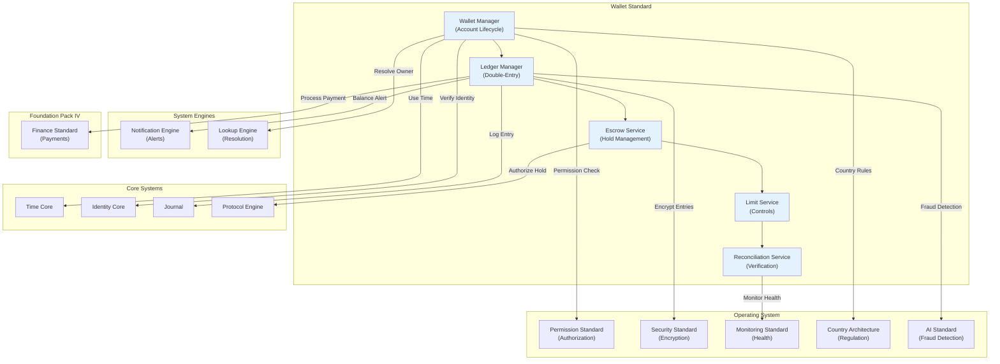

# 55. WALLET STANDARD

**Version:** 1.0  
**Status:** ✓ APPROVED  
**Date:** 2026-07-04  
**Type:** Business Platform Foundation Pack IV  
**Classification:** Constitutional Standard

## PURPOSE

The Wallet Standard establishes the immutable laws, architectural contracts, and governance procedures for the SO8FI Wallet module. The Wallet is the **central financial container** for every identity on the platform: individuals, organizations, merchants, and service providers each maintain one or more wallets. Every monetary movement—deposit, withdrawal, transfer, escrow, fee, refund—passes through the Wallet module, making it the **single source of financial truth** for the entire SO8FI platform.

Wallet is **balance sovereignty with immutable ledger**.

## ARCHITECTURE



## RESPONSIBILITIES

### Wallet Manager
- Create and close wallet accounts for verified identities
- Manage multi-currency wallet configurations
- Support wallet hierarchies (sub-wallets, organization wallets)
- Enforce wallet policies: verification requirements, usage limits
- Maintain wallet status lifecycle (active, suspended, frozen, closed)
- Provide wallet snapshot capability for audits
- Register all wallets through Catalog Standard as Catalog objects

### Ledger Manager
- Record every monetary movement as a double-entry journal entry
- Maintain real-time balance calculation per wallet per currency
- Support multi-currency conversions with recorded exchange rates
- Guarantee ledger balance consistency (sum of debits = sum of credits)
- Prevent negative balance (unless overdraft is explicitly authorized)
- Provide complete transaction history with immutable timestamps
- Record every entry through Journal with cryptographic proof

### Escrow Service
- Create escrow holds for pending transactions (marketplace, services, contracts)
- Release escrow upon verified trigger conditions
- Refund escrow upon cancellation or dispute resolution
- Support partial escrow releases for milestone-based payments
- Enforce escrow expiry: auto-release or auto-refund on timeout
- Provide escrow status to all participating parties
- Record all escrow events through Journal

### Limit Service
- Define and enforce per-wallet transaction limits (daily, monthly, per-transaction)
- Support velocity controls (number of transactions per time window)
- Apply country-specific limits per Country Architecture Standard
- Detect and block transactions exceeding limits
- Support limit escalation workflows (approval-based limit increase)
- Apply risk-based dynamic limits via AI Standard recommendations
- Log all limit events (enforcements and escalations) through Journal

### Reconciliation Service
- Verify that all wallet balances match ledger totals at all times
- Run scheduled reconciliation cycles (hourly, daily, on-demand)
- Detect and escalate discrepancies immediately
- Produce reconciliation reports for compliance and audit
- Support external reconciliation against bank and payment provider statements
- Trigger alerts on any reconciliation failure
- Record all reconciliation results through Journal

## IMMUTABLE LAWS

1. **Law of Double-Entry Ledger:** Every monetary movement must create two balanced ledger entries (debit + credit). Single-entry recording is forbidden.

2. **Law of Immutable Entries:** Ledger entries may never be modified or deleted. Corrections must be made via new offsetting entries only.

3. **Law of Identity Binding:** Every wallet must be permanently bound to a verified identity through Identity Core. Anonymous wallets are forbidden.

4. **Law of Balance Integrity:** The sum of all ledger entries for a wallet must always equal the displayed balance. Balance inconsistencies must be detected and corrected immediately.

5. **Law of Non-Negative Balance:** Wallet balances may not go negative unless an explicit overdraft contract is in place and recorded. Silent overdrafts are forbidden.

6. **Law of Escrow Protection:** Funds held in escrow are frozen and inaccessible to both parties until the defined release or refund condition is met. Premature escrow access is forbidden.

7. **Law of Limit Enforcement:** All transaction limits defined in Limit Service are mandatory. Bypassing limits without authorized escalation is forbidden.

8. **Law of Reconciliation Continuity:** Reconciliation must run continuously. Periods of unreconciled balances exceeding one hour must be escalated.

9. **Law of Cryptographic Proof:** Every ledger entry must carry a cryptographic hash linking it to the previous entry, forming an unbreakable chain of monetary history.

10. **Law of Audit Trail:** All wallet operations (creation, transactions, escrow, limits, reconciliation) must be auditable at any point in time. Audit trail gaps are forbidden.

## INTERFACE CONTRACTS

### Interface 1: WalletManager

```typescript
interface WalletManager {
  // Wallet lifecycle
  createWallet(
    owner: Identity,
    config: WalletConfig
  ): Promise<WalletId>;

  suspendWallet(
    walletId: WalletId,
    reason: SuspensionReason,
    authority: Identity
  ): Promise<void>;

  closeWallet(
    walletId: WalletId,
    closure: WalletClosureData,
    authority: Identity
  ): Promise<void>;

  // Wallet queries
  getWallet(walletId: WalletId): Promise<WalletData>;

  getWalletsByOwner(owner: Identity): Promise<WalletId[]>;

  getWalletBalance(
    walletId: WalletId,
    currency: CurrencyCode
  ): Promise<Balance>;

  // Snapshots
  takeWalletSnapshot(
    walletId: WalletId,
    asOf: DateTime
  ): Promise<WalletSnapshot>;
}
```

### Interface 2: LedgerManager

```typescript
interface LedgerManager {
  // Entry recording
  recordCredit(
    walletId: WalletId,
    amount: MonetaryAmount,
    reference: LedgerReference
  ): Promise<EntryId>;

  recordDebit(
    walletId: WalletId,
    amount: MonetaryAmount,
    reference: LedgerReference
  ): Promise<EntryId>;

  recordTransfer(
    fromWallet: WalletId,
    toWallet: WalletId,
    amount: MonetaryAmount,
    reference: LedgerReference
  ): Promise<TransferId>;

  // Ledger queries
  getEntry(entryId: EntryId): Promise<LedgerEntry>;

  getWalletHistory(
    walletId: WalletId,
    timeRange: TimeRange,
    pagination: Pagination
  ): Promise<LedgerEntry[]>;

  getCurrentBalance(
    walletId: WalletId,
    currency: CurrencyCode
  ): Promise<Balance>;

  // Chain integrity
  verifyLedgerChain(walletId: WalletId): Promise<ChainVerificationResult>;
}
```

### Interface 3: EscrowService

```typescript
interface EscrowService {
  // Escrow lifecycle
  createEscrow(
    depositingWallet: WalletId,
    amount: MonetaryAmount,
    releaseCondition: EscrowCondition,
    expiresAt: DateTime
  ): Promise<EscrowId>;

  releaseEscrow(
    escrowId: EscrowId,
    beneficiaryWallet: WalletId,
    authority: Identity
  ): Promise<void>;

  refundEscrow(
    escrowId: EscrowId,
    reason: RefundReason,
    authority: Identity
  ): Promise<void>;

  releasePartialEscrow(
    escrowId: EscrowId,
    amount: MonetaryAmount,
    beneficiaryWallet: WalletId,
    milestone: EscrowMilestone
  ): Promise<void>;

  // Escrow queries
  getEscrow(escrowId: EscrowId): Promise<EscrowData>;

  getActiveEscrows(walletId: WalletId): Promise<EscrowId[]>;
}
```

### Interface 4: LimitService

```typescript
interface LimitService {
  // Limit management
  setWalletLimits(
    walletId: WalletId,
    limits: WalletLimits,
    authority: Identity
  ): Promise<void>;

  // Limit enforcement
  checkTransactionAllowed(
    walletId: WalletId,
    amount: MonetaryAmount,
    transactionType: TransactionType
  ): Promise<LimitCheckResult>;

  // Escalation
  requestLimitEscalation(
    walletId: WalletId,
    requestedLimits: WalletLimits,
    justification: string
  ): Promise<EscalationId>;

  approveLimitEscalation(
    escalationId: EscalationId,
    approver: Identity
  ): Promise<void>;

  // Limit queries
  getWalletLimits(walletId: WalletId): Promise<WalletLimits>;

  getLimitHistory(walletId: WalletId): Promise<LimitEvent[]>;
}
```

### Interface 5: ReconciliationService

```typescript
interface ReconciliationService {
  // Reconciliation execution
  runReconciliation(
    walletId: WalletId,
    asOf: DateTime
  ): Promise<ReconciliationReport>;

  runPlatformReconciliation(
    asOf: DateTime
  ): Promise<PlatformReconciliationReport>;

  // Discrepancy handling
  getDiscrepancies(
    timeRange: TimeRange
  ): Promise<Discrepancy[]>;

  resolveDiscrepancy(
    discrepancyId: DiscrepancyId,
    resolution: DiscrepancyResolution,
    authority: Identity
  ): Promise<void>;

  // Reporting
  getReconciliationHistory(
    walletId: WalletId,
    timeRange: TimeRange
  ): Promise<ReconciliationReport[]>;
}
```

## SECURITY RULES

### Forbidden Operations

- **NO single-entry recording** — Double-entry mandatory for all movements
- **NO ledger entry modification** — Entries are immutable; corrections via offsets only
- **NO anonymous wallets** — All wallets bound to verified identities
- **NO balance inconsistency** — Balance must match ledger total at all times
- **NO silent overdraft** — Negative balances require authorized overdraft contract
- **NO premature escrow access** — Escrow frozen until release condition met
- **NO limit bypass** — All limits mandatory; escalation required for exceptions
- **NO unreconciled gap beyond 1 hour** — Immediate escalation required
- **NO broken ledger chain** — Cryptographic chain must be intact
- **NO audit trail gaps** — Complete audit mandatory

### Security Contracts

- All wallet operations authorized by Protocol Engine
- All ledger entries encrypted by Security Standard
- All large transactions flagged for AI fraud detection
- All wallet data subject to country-specific regulations
- All reconciliation results signed and timestamped
- Fraud detection active 24/7 via AI Standard

## DEPENDENCIES

### Required Foundation Pack IV Standards
- **Catalog Standard:** Wallets registered as Catalog objects with full lifecycle
- **Finance Standard:** External payment processing integrations

### Required Operating System Standards
- **Permission Standard:** Wallet access and operation authorization
- **Security Standard:** Ledger encryption and secure key management
- **AI Standard:** Fraud pattern detection and dynamic limit adjustment
- **Monitoring Standard:** Wallet health, balance alerts, anomaly detection
- **Country Architecture:** Country-specific wallet regulations and limits

### Required System Engines
- **Notification Engine:** Balance alerts, transaction confirmations, escrow notifications
- **Lookup Engine:** Wallet and identity resolution

### Required Core Systems
- **Time Core:** Immutable timestamps for all ledger entries
- **Identity Core:** Wallet owner verification and binding
- **Journal:** Cryptographically chained audit of all entries
- **Protocol Engine:** Authorization for debits, transfers, escrow operations

## RECOVERY

### Ledger Inconsistency Recovery
1. Detect balance mismatch via Reconciliation Service
2. Lock affected wallet (read-only mode)
3. Log discrepancy through Journal
4. Alert Governance Council immediately
5. Trace ledger chain to find inconsistency root
6. Create correcting offset entries
7. Verify restored balance consistency
8. Unlock wallet and document incident

### Escrow Failure Recovery
1. Detect expired or stuck escrow
2. Log escrow state through Journal
3. Alert all parties
4. Apply defined expiry policy (auto-release or auto-refund)
5. Verify funds are transferred to correct wallet
6. Record resolution in Journal
7. Close escrow record

### Fraud Detection Recovery
1. AI Standard flags suspicious transaction pattern
2. Limit Service blocks further transactions automatically
3. Alert wallet owner and Governance Council
4. Freeze wallet pending investigation
5. Gather evidence from Journal
6. Apply resolution (unfreeze or escalate)
7. Record outcome in Journal

## VALIDATION

### Immutable Law Verification
- All entries double-entry verified ✓
- All entries immutable in ledger ✓
- All wallets bound to verified identities ✓
- Balance integrity enforced continuously ✓
- Non-negative balance policy enforced ✓
- Escrow funds protected until release conditions met ✓
- All limits enforced without bypass ✓
- Reconciliation runs continuously ✓
- Cryptographic chain verified ✓
- Complete audit trail enforced ✓

### Compliance Targets

| Metric | Target |
|--------|--------|
| Ledger entry accuracy | 100% |
| Balance reconciliation coverage | 100% |
| Unreconciled gap limit | < 1 hour |
| Escrow protection coverage | 100% |
| Audit trail completeness | 100% |

## GOVERNANCE

### Wallet Governance Council

**Members:**
- Chief Financial Officer
- Chief Architecture Officer
- Head of Compliance
- Security Lead
- Country Operations Lead (per region)

**Responsibilities:**
- Approve wallet policy changes
- Enforce double-entry ledger standards
- Review escalated limit requests
- Quarterly financial reconciliation audit

### Change Management
- Ledger structure changes require council approval and migration plan
- Limit policy changes require compliance and legal review
- Escrow condition templates reviewed quarterly
- Country-specific limits updated per regulatory changes

### Monitoring
- Real-time: balance anomalies, escrow expirations, limit breaches
- Hourly: reconciliation completion and discrepancy count
- Daily: ledger chain integrity verification
- Quarterly: council financial audit

---

**Document ID:** 55_WALLET_STANDARD  
**Classification:** Business Platform Constitutional Standard  
**Approved by:** SO8FI Governance Council  
**Effective Date:** 2026-07-04
