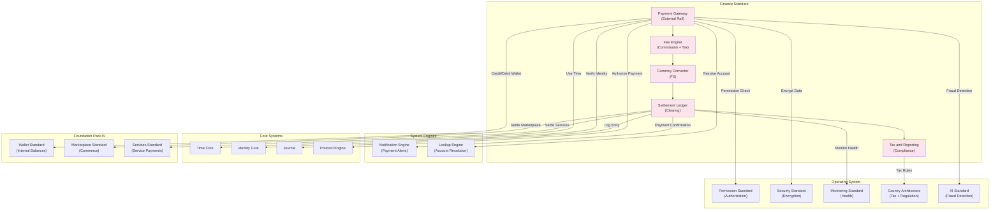

# 56. FINANCE STANDARD

**Version:** 1.0  
**Status:** ✓ APPROVED  
**Date:** 2026-07-04  
**Type:** Business Platform Foundation Pack IV  
**Classification:** Constitutional Standard

## PURPOSE

The Finance Standard establishes the immutable laws, architectural contracts, and governance procedures for the SO8FI Finance module. Finance is the **external monetary bridge**: it connects the internal Wallet ledger to external payment networks (card processors, bank transfers, crypto rails), applies fee structures, converts currencies, and generates the financial reporting required for accounting, compliance, and taxation. While the Wallet manages internal balances, Finance manages **everything that crosses the platform boundary**.

Finance is **payment execution with regulatory compliance**.

## ARCHITECTURE



## RESPONSIBILITIES

### Payment Gateway
- Integrate with external payment rails (card networks, bank transfers, digital wallets, crypto)
- Validate and authorize inbound and outbound payment requests
- Handle payment provider responses, retries, and timeout resolution
- Translate external payment events to internal Wallet credits/debits
- Support 3DS, PSD2, and regional payment authentication requirements
- Maintain provider configuration and fallback routing
- Record every gateway event through Journal

### Fee Engine
- Calculate platform commission fees per transaction type and business module
- Apply tiered fee structures per seller/provider level
- Calculate taxes and VAT per country per Country Architecture Standard
- Apply promotional fee overrides approved by governance
- Distribute fees to correct destination wallets automatically
- Produce fee breakdown for every transaction (transparent billing)
- Record all fee calculations and distributions through Journal

### Currency Converter
- Obtain and cache live exchange rates from authorized FX providers
- Execute currency conversions at locked-in rates for active transactions
- Apply spread margins per currency pair per policy
- Record every conversion with timestamp, rate, provider, and result
- Alert on stale rates (beyond configured threshold)
- Support multi-hop conversions (A→USD→B) with full audit
- Record all FX operations through Journal

### Settlement Ledger
- Perform end-of-cycle settlement between buyer, seller, platform, and fees
- Run intra-day, daily, and on-demand settlement cycles
- Reconcile settlement outputs with Wallet balances
- Generate settlement reports for each business module
- Support deferred settlement for regulatory hold periods
- Initiate payout instructions to external bank accounts
- Record all settlement events through Journal

### Tax and Reporting
- Calculate applicable taxes per transaction per jurisdiction
- Generate compliant tax invoices and receipts
- Produce financial reports (monthly, quarterly, annual) per entity and country
- Support VAT and GST reclaim documentation
- Export data in formats required by tax authorities per country
- Maintain tax calculation rule versions for historical accuracy
- Record all tax calculations and reports through Journal

## IMMUTABLE LAWS

1. **Law of External Boundary Recording:** Every monetary flow crossing the platform boundary (in or out) must be recorded in Journal before being credited or debited to any wallet. Unrecorded external flows are forbidden.

2. **Law of Fee Transparency:** All fees charged must be calculated and disclosed to the payer before transaction execution. Hidden or post-hoc fee application is forbidden.

3. **Law of Exchange Rate Lock:** The exchange rate used for any conversion must be locked at the moment of transaction initiation. Rate changes during execution are forbidden.

4. **Law of Settlement Completeness:** Every settlement cycle must account for 100% of transactions in the period. Partial or skipped settlements are forbidden.

5. **Law of Tax Accuracy:** All tax calculations must use the current rules for the jurisdiction and transaction date. Retroactive tax rule changes without restatement are forbidden.

6. **Law of Payout Authorization:** All outbound payments to external accounts must be authorized by both Protocol Engine and a verified identity. Unauthorized payouts are forbidden.

7. **Law of Provider Failover:** No payment attempt may silently fail without logging the failure and attempting configured fallback routes. Silent payment loss is forbidden.

8. **Law of Regulatory Compliance:** All payment processing must comply with the regulations of both payer and payee jurisdictions per Country Architecture Standard. Non-compliant payment execution is forbidden.

9. **Law of Reconciliation Supremacy:** Finance settlement must reconcile with Wallet balances. Any discrepancy between Finance records and Wallet records is a critical incident.

10. **Law of Audit Trail:** All Finance operations (payments, fees, FX, settlements, taxes) must be auditable at any point in time. Audit trail gaps are forbidden.

## INTERFACE CONTRACTS

### Interface 1: PaymentGateway

```typescript
interface PaymentGateway {
  // Payment initiation
  initiateDeposit(
    walletId: WalletId,
    amount: MonetaryAmount,
    paymentMethod: PaymentMethod,
    payer: Identity
  ): Promise<PaymentIntentId>;

  initiateWithdrawal(
    walletId: WalletId,
    amount: MonetaryAmount,
    destinationAccount: ExternalAccount,
    authorizer: Identity
  ): Promise<PaymentIntentId>;

  // Payment execution
  executePayment(
    intentId: PaymentIntentId,
    confirmation: PaymentConfirmation
  ): Promise<PaymentResult>;

  // Gateway events
  handleProviderWebhook(
    provider: PaymentProvider,
    event: ProviderEvent
  ): Promise<void>;

  // Retry and fallback
  retryPayment(
    intentId: PaymentIntentId,
    fallbackRoute: PaymentRoute
  ): Promise<PaymentResult>;

  // Queries
  getPaymentStatus(intentId: PaymentIntentId): Promise<PaymentStatus>;

  getPaymentHistory(
    walletId: WalletId,
    timeRange: TimeRange
  ): Promise<PaymentRecord[]>;
}
```

### Interface 2: FeeEngine

```typescript
interface FeeEngine {
  // Fee calculation
  calculateFees(
    transactionType: TransactionType,
    amount: MonetaryAmount,
    sellerProfile: SellerProfile,
    country: CountryCode
  ): Promise<FeeBreakdown>;

  // Fee application
  applyFees(
    transactionId: TransactionId,
    feeBreakdown: FeeBreakdown
  ): Promise<FeeApplicationId>;

  // Fee distribution
  distributeFees(
    feeApplicationId: FeeApplicationId
  ): Promise<FeeDistributionResult>;

  // Fee management
  getFeeRules(
    transactionType: TransactionType,
    country: CountryCode
  ): Promise<FeeRule[]>;

  updateFeeRule(
    ruleId: FeeRuleId,
    update: FeeRuleUpdate,
    authority: Identity
  ): Promise<void>;

  // Analytics
  getFeeAnalytics(timeRange: TimeRange): Promise<FeeAnalytics>;
}
```

### Interface 3: CurrencyConverter

```typescript
interface CurrencyConverter {
  // Rate management
  getCurrentRate(
    fromCurrency: CurrencyCode,
    toCurrency: CurrencyCode
  ): Promise<ExchangeRate>;

  lockRate(
    fromCurrency: CurrencyCode,
    toCurrency: CurrencyCode,
    transactionId: TransactionId,
    validFor: Duration
  ): Promise<LockedRate>;

  // Conversion execution
  executeConversion(
    amount: MonetaryAmount,
    lockedRateId: LockedRateId,
    sourceWallet: WalletId,
    targetWallet: WalletId
  ): Promise<ConversionResult>;

  // Rate queries
  getRateHistory(
    fromCurrency: CurrencyCode,
    toCurrency: CurrencyCode,
    timeRange: TimeRange
  ): Promise<ExchangeRate[]>;

  // Alerts
  getRateStalenessStatus(): Promise<RateStalenessReport>;
}
```

### Interface 4: SettlementLedger

```typescript
interface SettlementLedger {
  // Settlement cycles
  runSettlementCycle(
    cycleType: SettlementCycleType,
    upTo: DateTime
  ): Promise<SettlementReport>;

  // Transaction settlement
  settleSingleTransaction(
    transactionId: TransactionId
  ): Promise<SettlementResult>;

  // Deferred settlement
  createDeferredSettlement(
    transactionId: TransactionId,
    releaseAfter: DateTime,
    reason: DeferralReason
  ): Promise<DeferredSettlementId>;

  releaseDeferredSettlement(
    deferredId: DeferredSettlementId,
    authority: Identity
  ): Promise<SettlementResult>;

  // Payout
  initiatePayout(
    walletId: WalletId,
    externalAccount: ExternalAccount,
    amount: MonetaryAmount,
    authorizer: Identity
  ): Promise<PayoutId>;

  // Reports
  getSettlementReport(cycleId: SettlementCycleId): Promise<SettlementReport>;

  reconcileWithWallet(
    walletId: WalletId,
    asOf: DateTime
  ): Promise<ReconciliationResult>;
}
```

### Interface 5: TaxAndReporting

```typescript
interface TaxAndReporting {
  // Tax calculation
  calculateTax(
    transactionId: TransactionId,
    amount: MonetaryAmount,
    taxContext: TaxContext
  ): Promise<TaxCalculation>;

  // Invoice generation
  generateInvoice(
    transactionId: TransactionId,
    buyer: Identity,
    seller: Identity
  ): Promise<InvoiceId>;

  generateReceipt(
    transactionId: TransactionId,
    recipient: Identity
  ): Promise<ReceiptId>;

  // Financial reports
  generateFinancialReport(
    entity: Identity,
    period: ReportingPeriod,
    currency: CurrencyCode
  ): Promise<FinancialReport>;

  generateTaxReport(
    entity: Identity,
    jurisdiction: CountryCode,
    period: ReportingPeriod
  ): Promise<TaxReport>;

  // Tax authority export
  exportForTaxAuthority(
    jurisdiction: CountryCode,
    period: ReportingPeriod,
    format: TaxExportFormat
  ): Promise<TaxExportFile>;

  // Queries
  getTaxRules(jurisdiction: CountryCode): Promise<TaxRule[]>;
}
```

## SECURITY RULES

### Forbidden Operations

- **NO unrecorded external flows** — All platform-boundary payments logged before wallet update
- **NO hidden fees** — Full fee breakdown required before execution
- **NO mid-transaction rate change** — FX rates locked at initiation
- **NO partial settlement cycles** — 100% settlement coverage required
- **NO inaccurate tax calculations** — Current jurisdiction rules always applied
- **NO unauthorized payouts** — Protocol Engine + verified identity mandatory
- **NO silent payment failure** — All failures logged and fallback attempted
- **NO non-compliant payment execution** — Regulatory compliance verified first
- **NO finance/wallet discrepancy** — Reconciliation mismatch = critical incident
- **NO audit trail gaps** — Complete trail mandatory

### Security Contracts

- All payment intents authorized by Protocol Engine
- All sensitive payment data encrypted by Security Standard
- All external account data stored with PCI-compliant security controls
- All FX operations auditable with rate provider records
- All tax data subject to country-specific retention requirements
- Fraud detection active on all payment flows via AI Standard

## DEPENDENCIES

### Required Foundation Pack IV Standards
- **Wallet Standard:** Credit/debit wallet balances for all payments
- **Marketplace Standard:** Commerce transaction settlement
- **Services Standard:** Service session payment settlement
- **Catalog Standard:** Financial documents (invoices, receipts) as Catalog objects

### Required Operating System Standards
- **Permission Standard:** Payment authorization controls
- **Security Standard:** Payment data encryption and PCI compliance
- **AI Standard:** Fraud detection and anomaly scoring
- **Monitoring Standard:** Payment health, failure rates, settlement latency
- **Country Architecture:** Tax rules, payment regulations, data residency per country

### Required System Engines
- **Notification Engine:** Payment confirmations, settlement notices, tax alerts
- **Lookup Engine:** Account and identity resolution for payouts

### Required Core Systems
- **Time Core:** Immutable payment timestamps, settlement cycle timing
- **Identity Core:** Payer/payee identity verification
- **Journal:** Immutable record of every payment, fee, FX, and settlement event
- **Protocol Engine:** Payment and payout authorization

## RECOVERY

### Payment Provider Failure Recovery
1. Detect provider failure or timeout
2. Log failure event through Journal
3. Attempt configured fallback payment route
4. Notify payer of payment status
5. If all routes exhausted: mark payment as failed, notify payer
6. No silent loss — all outcomes recorded
7. Trigger incident investigation

### Settlement Discrepancy Recovery
1. Detect Finance/Wallet reconciliation mismatch
2. Lock affected accounts (read-only)
3. Alert Governance Council immediately
4. Trace Journal to identify root cause
5. Create correcting entries with full justification
6. Verify restored consistency
7. Unlock accounts, document incident

### FX Rate Staleness Recovery
1. Detect rate data beyond staleness threshold
2. Suspend all new currency conversions
3. Alert active transactions using affected currencies
4. Attempt rate provider reconnection
5. Fall back to secondary rate provider if available
6. Resume conversions once fresh rates confirmed
7. Record interruption in Journal

## VALIDATION

### Immutable Law Verification
- All external flows recorded before wallet update ✓
- All fees transparent and disclosed upfront ✓
- All FX rates locked at transaction initiation ✓
- 100% settlement cycle coverage enforced ✓
- Tax rules applied per jurisdiction date ✓
- All payouts require Protocol Engine authorization ✓
- All payment failures logged with fallback attempted ✓
- Country regulatory compliance verified before execution ✓
- Finance/Wallet reconciliation enforced continuously ✓
- Complete audit trail enforced ✓

### Compliance Targets

| Metric | Target |
|--------|--------|
| Payment recording before wallet update | 100% |
| Fee transparency | 100% |
| Settlement coverage per cycle | 100% |
| Finance/Wallet discrepancies | 0 |
| Audit trail completeness | 100% |

## GOVERNANCE

### Finance Governance Council

**Members:**
- Chief Financial Officer
- Chief Architecture Officer
- Head of Compliance and Legal
- Country Finance Lead (per region)
- Security Lead

**Responsibilities:**
- Approve fee structure changes
- Authorize new payment providers and FX sources
- Review settlement reports and reconciliation audits
- Ensure regulatory compliance per jurisdiction
- Quarterly financial audit and reporting review

### Change Management
- Fee structure changes require CFO + compliance approval
- New payment provider integrations require security audit
- Tax rule updates require legal review per jurisdiction
- Exchange rate provider changes require failover testing

### Monitoring
- Real-time: payment failure rate, settlement latency, FX rate staleness
- Hourly: settlement cycle completion and discrepancy alerts
- Daily: tax calculation accuracy review
- Quarterly: council financial compliance audit

---

**Document ID:** 56_FINANCE_STANDARD  
**Classification:** Business Platform Constitutional Standard  
**Approved by:** SO8FI Governance Council  
**Effective Date:** 2026-07-04
