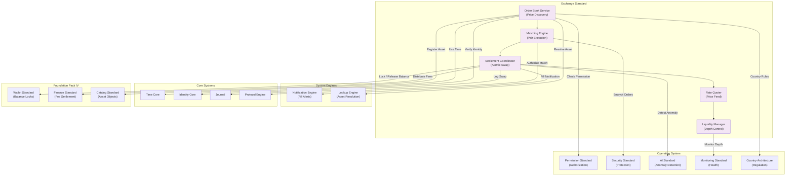

# 57. EXCHANGE STANDARD

**Version:** 1.0  
**Status:** ✓ APPROVED  
**Date:** 2026-07-04  
**Type:** Business Platform Foundation Pack V  
**Classification:** Constitutional Standard

## PURPOSE

The Exchange Standard establishes the immutable laws, architectural contracts, and governance procedures for the SO8FI Exchange module. The Exchange enables asset conversion between any two value types held on the platform: currencies, digital assets, credits, vouchers, and commodity tokens. Every exchange is an atomic swap — both legs settle simultaneously or neither settles. The Exchange is a **governed conversion engine**, not a speculative trading platform.

Exchange is **atomic asset conversion with price integrity**.

## ARCHITECTURE



## RESPONSIBILITIES

### Order Book Service
- Accept and validate limit, market, and stop orders
- Maintain time-priority ordered book per asset pair
- Support order cancellation and modification within policy
- Expose real-time order book depth to authorized consumers
- Enforce minimum order sizes and pair restrictions per country
- Register each tradable asset as a Catalog object
- Record all order events through Journal

### Matching Engine
- Match buy and sell orders at best available price
- Execute partial fills for large orders when depth permits
- Apply price-time priority (FIFO) matching algorithm
- Prevent self-matching between orders of the same identity
- Enforce circuit breakers on abnormal price movements
- Produce match records for every execution
- Record all match events through Journal

### Settlement Coordinator
- Execute atomic two-leg settlement: both wallets update or neither does
- Lock source assets in Wallet escrow before matching
- Release destination assets only upon confirmed Journal entry
- Handle partial settlement rollback without loss
- Produce settlement receipts for both counterparties
- Reconcile all open positions with Wallet Standard
- Record every settlement event through Journal

### Rate Quoter
- Aggregate live rates from authorized external FX and data providers
- Compute mid-market, bid, and ask prices per pair
- Apply spread margin per pair per governance policy
- Cache rates with TTL and detect staleness
- Serve indicative quotes to UI and API consumers
- Record all rate snapshots through Journal for auditability

### Liquidity Manager
- Monitor order book depth and spread health per pair
- Define and enforce minimum liquidity thresholds
- Alert governance when liquidity falls below threshold
- Support liquidity provider (LP) programs if authorized
- Pause trading for a pair when depth is insufficient
- Coordinate with Finance Standard for LP fee distribution
- Record all liquidity events through Journal

## IMMUTABLE LAWS

1. **Law of Atomic Settlement:** Both legs of every exchange must settle simultaneously. Partial settlement leaving one party exposed is forbidden.

2. **Law of Price Integrity:** Order matching must follow strict price-time priority. Preferential matching outside queue order is forbidden.

3. **Law of Pre-Settlement Lock:** Source assets must be locked in Wallet escrow before an order is eligible for matching. Matching against unlocked funds is forbidden.

4. **Law of Self-Match Prevention:** An identity may not match against its own orders on the same pair. Self-matching is forbidden.

5. **Law of Circuit Breaker:** Trading must be halted for a pair when price moves exceed the configured threshold within the circuit breaker window. Unchecked runaway pricing is forbidden.

6. **Law of Rate Transparency:** All quoted rates must disclose spread and any applicable fees before order confirmation. Hidden rate markups are forbidden.

7. **Law of Regulatory Compliance:** All exchange operations must comply with the asset trading regulations of both counterparties' jurisdictions. Non-compliant pair trading is forbidden.

8. **Law of Minimum Liquidity:** No pair may be active for trading without meeting the defined minimum depth threshold. Trading on an illiquid pair without governance approval is forbidden.

9. **Law of Immutable Order Record:** All orders (placed, modified, cancelled, filled) must be recorded through Journal. Order record gaps are forbidden.

10. **Law of Audit Trail:** All exchange operations (orders, matches, settlements, rates, liquidity) must be auditable at any point in time. Audit trail gaps are forbidden.

## INTERFACE CONTRACTS

### Interface 1: OrderBookService

```typescript
interface OrderBookService {
  placeOrder(
    owner: Identity,
    pair: AssetPair,
    side: OrderSide,
    type: OrderType,
    quantity: Quantity,
    price?: Price
  ): Promise<OrderId>;

  cancelOrder(
    orderId: OrderId,
    owner: Identity
  ): Promise<void>;

  modifyOrder(
    orderId: OrderId,
    modifications: OrderModification,
    owner: Identity
  ): Promise<OrderId>;

  getOrderBook(
    pair: AssetPair,
    depth: number
  ): Promise<OrderBookSnapshot>;

  getOrder(orderId: OrderId): Promise<OrderData>;

  getOpenOrders(owner: Identity): Promise<OrderId[]>;
}
```

### Interface 2: MatchingEngine

```typescript
interface MatchingEngine {
  runMatchingCycle(pair: AssetPair): Promise<MatchResult[]>;

  getLastMatchedPrice(pair: AssetPair): Promise<Price>;

  getPriceHistory(
    pair: AssetPair,
    timeRange: TimeRange,
    resolution: CandleResolution
  ): Promise<OHLCV[]>;

  setCircuitBreaker(
    pair: AssetPair,
    config: CircuitBreakerConfig
  ): Promise<void>;

  getMatchHistory(
    pair: AssetPair,
    timeRange: TimeRange
  ): Promise<MatchRecord[]>;
}
```

### Interface 3: SettlementCoordinator

```typescript
interface SettlementCoordinator {
  settleMatch(
    matchRecord: MatchRecord
  ): Promise<SettlementResult>;

  rollbackSettlement(
    settlementId: SettlementId,
    reason: RollbackReason
  ): Promise<void>;

  getSettlement(
    settlementId: SettlementId
  ): Promise<SettlementData>;

  reconcileOpenPositions(
    asOf: DateTime
  ): Promise<PositionReconciliationReport>;

  getSettlementHistory(
    owner: Identity,
    timeRange: TimeRange
  ): Promise<SettlementData[]>;
}
```

### Interface 4: RateQuoter

```typescript
interface RateQuoter {
  getQuote(
    pair: AssetPair,
    quantity: Quantity,
    side: OrderSide
  ): Promise<PriceQuote>;

  getLiveRate(pair: AssetPair): Promise<MarketRate>;

  getRateHistory(
    pair: AssetPair,
    timeRange: TimeRange
  ): Promise<MarketRate[]>;

  getRateStalenessStatus(): Promise<RateStalenessReport>;

  getSupportedPairs(): Promise<AssetPair[]>;
}
```

### Interface 5: LiquidityManager

```typescript
interface LiquidityManager {
  getLiquidityStatus(pair: AssetPair): Promise<LiquidityStatus>;

  setLiquidityThreshold(
    pair: AssetPair,
    threshold: LiquidityThreshold,
    authority: Identity
  ): Promise<void>;

  pauseTrading(
    pair: AssetPair,
    reason: PauseReason,
    authority: Identity
  ): Promise<void>;

  resumeTrading(
    pair: AssetPair,
    authority: Identity
  ): Promise<void>;

  getLiquidityHistory(
    pair: AssetPair,
    timeRange: TimeRange
  ): Promise<LiquiditySnapshot[]>;
}
```

## SECURITY RULES

### Forbidden Operations

- **NO partial settlement** — Atomic swap mandatory; one-leg exposure forbidden
- **NO priority bypass** — Price-time FIFO strictly enforced
- **NO matching on unlocked funds** — Wallet escrow lock required before matching
- **NO self-matching** — Same identity cannot be both counterparties
- **NO unchecked price runaway** — Circuit breakers mandatory
- **NO hidden rate markup** — Spread and fees disclosed before confirmation
- **NO non-compliant pair trading** — Jurisdictional compliance verified first
- **NO illiquid pair trading** — Minimum depth enforced
- **NO order record gaps** — All orders recorded through Journal
- **NO audit trail gaps** — Complete trail mandatory

### Security Contracts

- All orders authorized by Protocol Engine
- All pre-settlement locks managed by Wallet Standard
- All price feed sources authorized and monitored
- All settlement events cryptographically recorded in Journal
- Fraud and wash-trading detection active via AI Standard

## DEPENDENCIES

### Required Foundation Pack IV Standards
- **Wallet Standard:** Pre-settlement asset locking and post-settlement balance updates
- **Finance Standard:** Exchange fee distribution and settlement
- **Catalog Standard:** Tradable assets registered as Catalog objects

### Required Operating System Standards
- **Permission Standard:** Order placement and cancellation authorization
- **Security Standard:** Order data encryption
- **AI Standard:** Anomaly and wash-trading detection
- **Monitoring Standard:** Order book depth, fill rates, circuit breaker events
- **Country Architecture:** Tradable asset restrictions per jurisdiction

### Required Core Systems
- **Time Core:** Order timestamps, circuit breaker windows
- **Identity Core:** Counterparty verification
- **Journal:** Immutable order and settlement record
- **Protocol Engine:** Order and settlement authorization

## RECOVERY

### Settlement Failure Recovery
1. Detect atomic settlement failure
2. Roll back all partial wallet mutations
3. Log failure through Journal
4. Release pre-settlement locks
5. Cancel matched orders and return to book or notify owners
6. Alert governance council
7. Record incident with root cause

### Circuit Breaker Recovery
1. Detect price threshold breach
2. Halt matching for affected pair
3. Log halt through Journal with price snapshot
4. Notify all open order owners
5. Governance reviews market conditions
6. Resume trading when conditions normalize
7. Record resumption decision

### Rate Feed Staleness Recovery
1. Detect stale rate beyond TTL
2. Suspend new order placement for affected pairs
3. Alert existing open orders
4. Attempt secondary rate provider
5. Resume when fresh rates confirmed
6. Record interruption in Journal

## GOVERNANCE

### Exchange Governance Council

**Members:**
- Chief Architecture Officer
- Chief Financial Officer
- Head of Compliance
- Country Regulatory Lead
- Security Lead

**Responsibilities:**
- Approve new tradable asset pairs
- Set circuit breaker thresholds
- Review anomaly and wash-trading reports
- Quarterly regulatory compliance audit

### Monitoring
- Real-time: circuit breaker triggers, settlement failures, rate staleness
- Hourly: order book depth health per pair
- Daily: wash-trading and anomaly review
- Quarterly: council regulatory audit

---

**Document ID:** 57_EXCHANGE_STANDARD  
**Classification:** Business Platform Constitutional Standard  
**Approved by:** SO8FI Governance Council  
**Effective Date:** 2026-07-04
