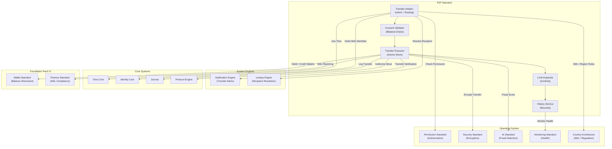

# 58. P2P STANDARD

**Version:** 1.0  
**Status:** ✓ APPROVED  
**Date:** 2026-07-04  
**Type:** Business Platform Foundation Pack V  
**Classification:** Constitutional Standard

## PURPOSE

The P2P Standard establishes the immutable laws, architectural contracts, and governance procedures for the SO8FI Peer-to-Peer Transfer module. P2P enables direct value transfer between any two verified identities on the platform — individuals, organizations, or merchants — without requiring a commerce context (no listing, no booking, no exchange). Every P2P transfer is a declared intent, mutually ledgered, and fully auditable. The P2P module is the **platform's direct-transfer primitive**.

P2P is **declared direct transfer with bilateral consent**.

## ARCHITECTURE



## RESPONSIBILITIES

### Transfer Initiator
- Accept transfer requests from verified identities
- Resolve recipient by handle, numeric ID, phone, or email alias
- Validate currency and amount against Wallet balances
- Apply country-specific transfer routing rules
- Generate a Transfer Intent with declared purpose
- Support scheduled and recurring transfers
- Record all transfer intents through Journal

### Consent Validator
- Enforce consent model per transfer type:
  - **Push transfer:** sender consent only (receiver auto-accepts)
  - **Pull request:** receiver initiates, sender must approve
  - **Mutual transfer:** both parties must confirm before execution
- Apply configurable consent expiry windows
- Notify both parties at consent request and confirmation events
- Record all consent events through Journal

### Transfer Executor
- Execute confirmed transfers atomically via Wallet Standard
- Guarantee both debit and credit complete or both roll back
- Apply real-time AML scoring via AI Standard before execution
- Block and escalate transfers exceeding AML risk thresholds
- Produce transfer receipts for both sender and receiver
- Record every execution event through Journal with cryptographic linkage

### Limit Inspector
- Enforce per-identity daily, weekly, and monthly transfer limits
- Apply country-specific regulatory caps (AML thresholds)
- Support limit escalation workflows with documented justification
- Detect and block velocity abuse (many small transfers)
- Apply different limit tiers per identity verification level
- Record all limit checks and enforcements through Journal

### History Service
- Provide complete transfer history for both sender and receiver
- Support filtering by date, amount, currency, counterparty
- Generate transfer statements for compliance and tax purposes
- Support data export in formats required by tax authorities
- Maintain history indefinitely (soft-archived, never deleted)
- Record every history query for audit purposes through Journal

## IMMUTABLE LAWS

1. **Law of Identity Verification:** Both sender and receiver must have verified identities through Identity Core before any transfer is executed. Transfers involving unverified identities are forbidden.

2. **Law of Bilateral Record:** Every transfer must be recorded in the ledgers of both the sender and receiver. Single-sided ledger entries are forbidden.

3. **Law of Declared Purpose:** Every transfer must carry a declared purpose or reference. Transfers with no stated purpose are forbidden.

4. **Law of Consent Enforcement:** The configured consent model for each transfer type must be enforced. Unconsented deductions are forbidden.

5. **Law of Atomic Execution:** Both the debit and credit of a transfer must complete or both must be rolled back. Partial transfers leaving an imbalance are forbidden.

6. **Law of AML Compliance:** Every transfer must pass AML scoring before execution. High-risk transfers must be blocked and escalated. Bypassing AML checks is forbidden.

7. **Law of Limit Enforcement:** All per-identity and country transfer limits must be enforced. Limit bypass without authorized escalation is forbidden.

8. **Law of Irrevocability:** Executed transfers are final. Reversals require a new offsetting transfer with explicit authorization from the original sender. Unilateral reversal of an executed transfer is forbidden.

9. **Law of Receipt Issuance:** A transfer receipt must be generated and delivered to both parties upon successful execution. Transfers without receipts are forbidden.

10. **Law of Audit Trail:** All P2P operations (intents, consents, executions, limits, history) must be auditable at any point in time. Audit trail gaps are forbidden.

## INTERFACE CONTRACTS

### Interface 1: TransferInitiator

```typescript
interface TransferInitiator {
  initiateTransfer(
    sender: Identity,
    recipient: RecipientIdentifier,
    amount: MonetaryAmount,
    purpose: TransferPurpose,
    transferType: TransferType
  ): Promise<TransferIntentId>;

  scheduleTransfer(
    sender: Identity,
    recipient: RecipientIdentifier,
    amount: MonetaryAmount,
    purpose: TransferPurpose,
    scheduledAt: DateTime
  ): Promise<ScheduledTransferId>;

  cancelScheduledTransfer(
    scheduledTransferId: ScheduledTransferId,
    canceller: Identity
  ): Promise<void>;

  initiateRecurringTransfer(
    sender: Identity,
    recipient: RecipientIdentifier,
    amount: MonetaryAmount,
    purpose: TransferPurpose,
    recurrenceRule: RecurrenceRule
  ): Promise<RecurringTransferId>;
}
```

### Interface 2: ConsentValidator

```typescript
interface ConsentValidator {
  requestConsent(
    intentId: TransferIntentId,
    requiredFrom: Identity[]
  ): Promise<ConsentRequestId>;

  grantConsent(
    consentRequestId: ConsentRequestId,
    granter: Identity
  ): Promise<void>;

  denyConsent(
    consentRequestId: ConsentRequestId,
    denier: Identity,
    reason: string
  ): Promise<void>;

  getConsentStatus(
    intentId: TransferIntentId
  ): Promise<ConsentStatus>;

  expireConsentRequest(
    consentRequestId: ConsentRequestId
  ): Promise<void>;
}
```

### Interface 3: TransferExecutor

```typescript
interface TransferExecutor {
  executeTransfer(
    intentId: TransferIntentId
  ): Promise<TransferResult>;

  rollbackTransfer(
    transferId: TransferId,
    reason: RollbackReason,
    authority: Identity
  ): Promise<void>;

  getTransferStatus(
    transferId: TransferId
  ): Promise<TransferStatus>;

  getTransferReceipt(
    transferId: TransferId
  ): Promise<TransferReceipt>;

  initiateReversal(
    transferId: TransferId,
    requester: Identity,
    authorization: ReversalAuthorization
  ): Promise<TransferId>;
}
```

### Interface 4: LimitInspector

```typescript
interface LimitInspector {
  checkTransferAllowed(
    sender: Identity,
    amount: MonetaryAmount,
    transferType: TransferType
  ): Promise<LimitCheckResult>;

  getIdentityLimits(
    identity: Identity
  ): Promise<TransferLimits>;

  requestLimitEscalation(
    identity: Identity,
    requestedLimits: TransferLimits,
    justification: string
  ): Promise<EscalationId>;

  approveLimitEscalation(
    escalationId: EscalationId,
    approver: Identity
  ): Promise<void>;

  getLimitHistory(identity: Identity): Promise<LimitEvent[]>;
}
```

### Interface 5: HistoryService

```typescript
interface HistoryService {
  getTransferHistory(
    identity: Identity,
    filters: TransferFilters,
    pagination: Pagination
  ): Promise<TransferRecord[]>;

  getTransferStatement(
    identity: Identity,
    period: StatementPeriod,
    currency: CurrencyCode
  ): Promise<TransferStatement>;

  exportHistory(
    identity: Identity,
    period: StatementPeriod,
    format: ExportFormat
  ): Promise<ExportFile>;

  getTransferSummary(
    identity: Identity,
    timeRange: TimeRange
  ): Promise<TransferSummary>;
}
```

## SECURITY RULES

### Forbidden Operations

- **NO unverified identity transfers** — Both parties must be verified
- **NO single-sided ledger entries** — Bilateral recording mandatory
- **NO purposeless transfers** — Declared purpose required
- **NO unconsented deductions** — Consent model strictly enforced
- **NO partial execution** — Atomic debit + credit mandatory
- **NO AML bypass** — AML scoring required before execution
- **NO limit bypass** — All limits enforced; escalation required for exceptions
- **NO unilateral reversal** — Reversals require authorization
- **NO receipt-less transfers** — Receipt mandatory for both parties
- **NO audit trail gaps** — Complete trail mandatory

### Security Contracts

- All transfers authorized by Protocol Engine
- All transfer data encrypted by Security Standard
- AML scoring applied to every transfer via AI Standard
- Country-specific regulatory caps enforced via Country Architecture
- Suspicious velocity patterns flagged and investigated
- All high-risk transfers escalated to governance

## DEPENDENCIES

### Required Foundation Pack IV Standards
- **Wallet Standard:** Debit/credit balance movements
- **Finance Standard:** AML reporting and regulatory compliance

### Required Operating System Standards
- **Permission Standard:** Transfer authorization
- **Security Standard:** Transfer data encryption
- **AI Standard:** AML scoring and fraud detection
- **Monitoring Standard:** Transfer health, velocity anomalies
- **Country Architecture:** AML thresholds, transfer regulations

### Required System Engines
- **Notification Engine:** Transfer request, confirmation, receipt alerts
- **Lookup Engine:** Recipient resolution by handle, phone, email

### Required Core Systems
- **Time Core:** Transfer timestamps, scheduled transfer execution
- **Identity Core:** Sender and receiver verification
- **Journal:** Immutable bilateral transfer record
- **Protocol Engine:** Transfer authorization

## RECOVERY

### Transfer Rollback Recovery
1. Detect execution failure mid-transfer
2. Immediately reverse any applied wallet mutations
3. Log failure through Journal
4. Notify both parties of failed transfer
5. Release any pre-transfer locks
6. Mark intent as failed with root cause
7. Allow sender to retry

### AML Escalation Recovery
1. Transfer flagged as high-risk by AI Standard
2. Block transfer execution
3. Log flag through Journal
4. Notify compliance team
5. Suspend identity for further transfers pending review
6. Compliance team reviews within defined SLA
7. Approve or permanently block, record decision

### Velocity Abuse Recovery
1. Limit Inspector detects velocity abuse pattern
2. Block all further transfers from offending identity
3. Log through Journal
4. Alert governance and compliance
5. Investigate transaction history
6. Apply sanctions or clear false positive
7. Record outcome in Journal

## GOVERNANCE

### P2P Governance Council

**Members:**
- Chief Compliance Officer
- Chief Architecture Officer
- Head of Financial Crime Prevention
- Country AML Lead (per region)

**Responsibilities:**
- Approve transfer limit policies
- Review AML escalation reports
- Enforce regulatory compliance per jurisdiction
- Quarterly AML and fraud pattern review

### Monitoring
- Real-time: AML blocks, limit enforcement, transfer failures
- Hourly: velocity pattern analysis
- Daily: AML escalation review
- Quarterly: council compliance audit

---

**Document ID:** 58_P2P_STANDARD  
**Classification:** Business Platform Constitutional Standard  
**Approved by:** SO8FI Governance Council  
**Effective Date:** 2026-07-04
