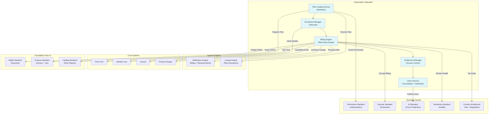

# 59. SUBSCRIPTION STANDARD

**Version:** 1.0  
**Status:** ✓ APPROVED  
**Date:** 2026-07-04  
**Type:** Business Platform Foundation Pack V  
**Classification:** Constitutional Standard

## PURPOSE

The Subscription Standard establishes the immutable laws, architectural contracts, and governance procedures for the SO8FI Subscription module. Subscriptions govern any recurring value exchange: software plans, memberships, content access, service retainers, and platform tiers. The Subscription module manages the full lifecycle — plan definition, enrollment, trial periods, billing cycles, upgrades, downgrades, pauses, and cancellations — as a first-class platform capability. The Subscription module is the **platform's recurring commerce engine**.

Subscription is **governed recurring value exchange with transparent lifecycle**.

## ARCHITECTURE



## RESPONSIBILITIES

### Plan Catalog Service
- Define subscription plans with pricing, billing intervals, features, and limits
- Support plan versioning: new subscribers get new version, existing subscribers grandfathered
- Publish plans as Catalog objects with full localization support
- Manage plan lifecycle (draft, active, deprecated, archived)
- Support add-ons and bundled plan compositions
- Define trial period rules per plan
- Record all plan changes through Journal

### Enrollment Manager
- Process subscriber enrollment with plan selection and payment method
- Manage trial-to-paid conversion events
- Handle upgrades and downgrades with proration calculation
- Support enrollment pausing (access suspended, billing paused)
- Track enrollment state machine: trial → active → paused → cancelled → expired
- Maintain enrollment history with all transitions
- Record all enrollment events through Journal

### Billing Engine
- Execute billing cycles at configured intervals (daily, weekly, monthly, annually)
- Calculate prorations for mid-cycle plan changes
- Apply tax calculations per Finance and Country Architecture standards
- Retry failed billing attempts per configured retry schedule
- Enter dunning workflow when billing fails after all retries
- Generate invoices and receipts via Finance Standard
- Record all billing attempts (successful and failed) through Journal

### Entitlement Manager
- Grant and revoke feature access based on active subscription state
- Evaluate entitlements in real time: no cached stale access grants
- Support usage-based entitlements (API calls, storage, seats)
- Enforce feature limits defined in the plan definition
- Revoke access immediately upon cancellation or dunning suspension
- Emit entitlement change events to dependent modules
- Record all entitlement changes through Journal

### Churn Service
- Detect cancellation requests and apply retention policy
- Support cancellation reasons collection for analytics
- Execute grace periods and downgrade offers before hard cancellation
- Manage win-back campaigns for recently churned subscribers (governed)
- Calculate churn metrics and lifetime value per cohort
- Use AI Standard to predict at-risk subscriptions proactively
- Record all cancellation and retention events through Journal

## IMMUTABLE LAWS

1. **Law of Plan Transparency:** All subscription plan features, limitations, billing intervals, and cancellation terms must be fully disclosed before enrollment. Hidden terms are forbidden.

2. **Law of Trial Honesty:** Trial periods must not charge the subscriber until explicitly converted to paid. Silent trial-to-paid conversion without consent is forbidden.

3. **Law of Proration Accuracy:** All mid-cycle plan changes must apply mathematically accurate proration. Billing more than owed due to plan change is forbidden.

4. **Law of Enrollment Consent:** Subscriptions may only be created with explicit subscriber consent. Auto-enrollment without confirmed consent is forbidden.

5. **Law of Billing Notification:** Subscribers must be notified before every billing event with sufficient lead time. Silent billing without advance notice is forbidden.

6. **Law of Immediate Entitlement Revocation:** Feature access must be revoked immediately upon cancellation, dunning suspension, or expiry. Access after termination is forbidden.

7. **Law of Cancellation Freedom:** Subscribers must be able to cancel at any time through a clearly accessible process. Obstructed or hidden cancellation flows are forbidden.

8. **Law of Grandfathering:** Existing subscribers may not be moved to a higher price on an existing plan without consent. Forced price increases without opt-out are forbidden.

9. **Law of Dunning Transparency:** All dunning stages, retry schedules, and suspension timelines must be disclosed to the subscriber. Silent dunning without communication is forbidden.

10. **Law of Audit Trail:** All subscription operations (plans, enrollments, billing, entitlements, cancellations) must be auditable at any point in time. Audit trail gaps are forbidden.

## INTERFACE CONTRACTS

### Interface 1: PlanCatalogService

```typescript
interface PlanCatalogService {
  createPlan(
    plan: PlanDefinition,
    author: Identity
  ): Promise<PlanId>;

  updatePlan(
    planId: PlanId,
    updates: PlanUpdates,
    updater: Identity
  ): Promise<PlanVersion>;

  deprecatePlan(
    planId: PlanId,
    deprecator: Identity,
    migrationPlan: MigrationPlan
  ): Promise<void>;

  getPlan(planId: PlanId): Promise<PlanDefinition>;

  getPlanVersion(
    planId: PlanId,
    version: number
  ): Promise<PlanDefinition>;

  listActivePlans(
    filters: PlanFilters
  ): Promise<PlanId[]>;
}
```

### Interface 2: EnrollmentManager

```typescript
interface EnrollmentManager {
  enroll(
    subscriber: Identity,
    planId: PlanId,
    paymentMethod: PaymentMethodRef,
    startTrial: boolean
  ): Promise<EnrollmentId>;

  convertTrialToPaid(
    enrollmentId: EnrollmentId,
    subscriber: Identity
  ): Promise<void>;

  changePlan(
    enrollmentId: EnrollmentId,
    newPlanId: PlanId,
    subscriber: Identity
  ): Promise<ProrationPreview>;

  pauseEnrollment(
    enrollmentId: EnrollmentId,
    subscriber: Identity,
    pauseUntil?: DateTime
  ): Promise<void>;

  resumeEnrollment(
    enrollmentId: EnrollmentId,
    subscriber: Identity
  ): Promise<void>;

  getEnrollment(
    enrollmentId: EnrollmentId
  ): Promise<EnrollmentData>;
}
```

### Interface 3: BillingEngine

```typescript
interface BillingEngine {
  runBillingCycle(
    enrollmentId: EnrollmentId
  ): Promise<BillingResult>;

  previewNextBillingAmount(
    enrollmentId: EnrollmentId
  ): Promise<BillingPreview>;

  calculateProration(
    enrollmentId: EnrollmentId,
    newPlanId: PlanId,
    changeDate: DateTime
  ): Promise<ProrationCalculation>;

  retryFailedBilling(
    billingAttemptId: BillingAttemptId
  ): Promise<BillingResult>;

  getBillingHistory(
    enrollmentId: EnrollmentId,
    timeRange: TimeRange
  ): Promise<BillingRecord[]>;
}
```

### Interface 4: EntitlementManager

```typescript
interface EntitlementManager {
  getEntitlements(
    subscriber: Identity,
    planId: PlanId
  ): Promise<Entitlement[]>;

  checkEntitlement(
    subscriber: Identity,
    feature: FeatureKey
  ): Promise<EntitlementCheckResult>;

  recordUsage(
    subscriber: Identity,
    feature: FeatureKey,
    quantity: number
  ): Promise<void>;

  getRemainingQuota(
    subscriber: Identity,
    feature: FeatureKey
  ): Promise<QuotaStatus>;

  revokeAllEntitlements(
    enrollmentId: EnrollmentId,
    reason: RevocationReason
  ): Promise<void>;
}
```

### Interface 5: ChurnService

```typescript
interface ChurnService {
  initiateCancellation(
    enrollmentId: EnrollmentId,
    subscriber: Identity,
    reason: CancellationReason
  ): Promise<CancellationPreview>;

  confirmCancellation(
    enrollmentId: EnrollmentId,
    subscriber: Identity
  ): Promise<void>;

  applyRetentionOffer(
    enrollmentId: EnrollmentId,
    offer: RetentionOffer
  ): Promise<void>;

  getChurnAnalytics(
    timeRange: TimeRange,
    cohort?: CohortFilter
  ): Promise<ChurnAnalytics>;

  getAtRiskSubscribers(): Promise<AtRiskSubscriber[]>;
}
```

## SECURITY RULES

### Forbidden Operations

- **NO hidden subscription terms** — Full disclosure before enrollment
- **NO silent trial conversion** — Explicit consent required for paid conversion
- **NO overbilling on plan change** — Accurate proration mandatory
- **NO auto-enrollment without consent** — Explicit subscriber consent required
- **NO silent billing** — Advance notification mandatory
- **NO access after termination** — Immediate revocation enforced
- **NO obstructed cancellation** — Clear cancellation path mandatory
- **NO forced price increase** — Grandfathering protected
- **NO silent dunning** — All dunning stages communicated
- **NO audit trail gaps** — Complete trail mandatory

### Security Contracts

- All billing operations authorized by Protocol Engine
- All subscription data encrypted by Security Standard
- Churn prediction models governed by AI Standard fairness rules
- Country-specific billing and cancellation regulations enforced
- Dunning schedules approved by governance council

## DEPENDENCIES

### Required Foundation Pack IV Standards
- **Wallet Standard:** Subscriber payment deduction
- **Finance Standard:** Invoice generation and tax calculation
- **Catalog Standard:** Subscription plans registered as Catalog objects

### Required Operating System Standards
- **Permission Standard:** Subscription management authorization
- **Security Standard:** Subscription and billing data encryption
- **AI Standard:** Churn prediction and retention scoring
- **Monitoring Standard:** Billing failure rates, churn velocity
- **Country Architecture:** Country-specific billing rules and consumer protection

### Required System Engines
- **Notification Engine:** Renewal reminders, billing alerts, dunning notices
- **Lookup Engine:** Plan resolution

### Required Core Systems
- **Time Core:** Billing cycle timing, trial period tracking
- **Identity Core:** Subscriber verification
- **Journal:** Immutable billing and enrollment record
- **Protocol Engine:** Billing and plan change authorization

## RECOVERY

### Billing Retry Recovery
1. Detect billing failure
2. Log attempt through Journal
3. Notify subscriber of payment issue
4. Execute dunning retry schedule
5. Suspend entitlements after all retries exhausted
6. Continue notifying subscriber during dunning
7. Cancel and record if dunning period expires

### Plan Deprecation Recovery
1. Mark plan as deprecated
2. Identify all active enrollments on deprecated plan
3. Notify affected subscribers of migration options
4. Apply grandfathering for existing terms
5. Migrate subscribers who consent to new plan
6. Archive subscribers who don't respond per policy
7. Record all migration events through Journal

### Entitlement Sync Recovery
1. Detect entitlement state mismatch
2. Lock subscriber entitlements (safe state)
3. Replay Journal events to reconstruct correct state
4. Apply correct entitlements
5. Notify subscriber if access was incorrectly revoked or granted
6. Record recovery in Journal

## GOVERNANCE

### Subscription Governance Council

**Members:**
- Chief Product Officer
- Chief Financial Officer
- Head of Compliance
- Country Consumer Protection Lead

**Responsibilities:**
- Approve new plan definitions and pricing changes
- Review dunning and cancellation policy
- Enforce consumer protection rules per jurisdiction
- Quarterly churn and retention review

### Monitoring
- Real-time: billing failures, entitlement mismatches, dunning entries
- Daily: trial conversion rate, churn velocity
- Weekly: at-risk subscriber review
- Quarterly: council product and compliance review

---

**Document ID:** 59_SUBSCRIPTION_STANDARD  
**Classification:** Business Platform Constitutional Standard  
**Approved by:** SO8FI Governance Council  
**Effective Date:** 2026-07-04
