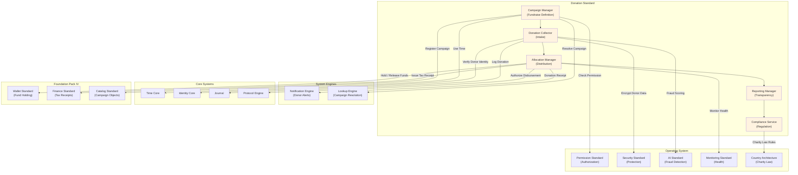

# 60. DONATION STANDARD

**Version:** 1.0  
**Status:** ✓ APPROVED  
**Date:** 2026-07-04  
**Type:** Business Platform Foundation Pack V  
**Classification:** Constitutional Standard

## PURPOSE

The Donation Standard establishes the immutable laws, architectural contracts, and governance procedures for the SO8FI Donation module. The Donation module enables voluntary value transfers from donors to beneficiaries without an expectation of commercial reciprocity: charitable giving, crowdfunding campaigns, tips, platform support, and community funding. Donations are **unconditional by default but may carry declared conditions** (goal-based, milestone-based, matching). The Donation module ensures every donation is verified, transparently allocated, and fully auditable.

Donation is **voluntary verified giving with transparent allocation**.

## ARCHITECTURE



## RESPONSIBILITIES

### Campaign Manager
- Create and govern fundraising campaigns with defined goals, timelines, and beneficiaries
- Support campaign types: one-time, recurring, goal-based, milestone-based, matched
- Manage campaign lifecycle: draft → active → funded → closed → completed/failed
- Publish campaigns as Catalog objects with full localization
- Enforce beneficiary verification before campaign activation
- Support campaign updates and extensions within governance rules
- Record all campaign events through Journal

### Donation Collector
- Accept donations from verified and anonymous donors (within country rules)
- Validate donation amounts against minimum/maximum policy
- Apply AML scoring for large donations via AI Standard
- Hold donated funds in designated campaign wallet via Wallet Standard
- Issue donation acknowledgement to donor immediately
- Support recurring donation enrollment
- Record every donation event through Journal

### Allocation Manager
- Execute fund disbursement to beneficiaries per campaign rules
- Support conditional disbursement: release only when goal met, milestone reached, or date arrived
- Enforce platform fee deduction per governance-approved fee structure
- Apply tax withholding per country regulations
- Manage partial disbursement for milestone-based campaigns
- Return funds to donors when campaigns fail or are cancelled (full refund)
- Record all allocation events through Journal

### Reporting Manager
- Provide real-time campaign progress to public and donors
- Generate donor statements and tax receipts via Finance Standard
- Produce beneficiary disbursement reports
- Publish platform-level donation statistics (aggregated, anonymized)
- Support mandatory regulatory reporting per country
- Maintain complete campaign history indefinitely
- Record all reporting activity through Journal

### Compliance Service
- Verify that campaigns and beneficiaries meet country-specific charity and fundraising laws
- Enforce donor identity requirements per jurisdiction (anonymous limits)
- Apply AML thresholds for large single donations
- Detect and block suspicious donation patterns
- Produce regulatory reports for tax authorities
- Manage sanctions screening for beneficiaries
- Record all compliance checks through Journal

## IMMUTABLE LAWS

1. **Law of Beneficiary Verification:** All campaign beneficiaries must be verified through Identity Core before a campaign may accept donations. Unverified beneficiaries cannot receive funds.

2. **Law of Fund Segregation:** Donated funds must be held in a dedicated campaign wallet and may not be commingled with platform operating funds or other campaigns. Commingling is forbidden.

3. **Law of Declared Goal:** Every campaign must declare its funding goal, timeline, and intended use of funds. Campaigns with undefined use of funds are forbidden.

4. **Law of Refund Guarantee:** If a campaign fails to meet its goal within its declared timeline (for goal-based campaigns), all donations must be refunded to donors in full. Retaining funds from a failed campaign is forbidden.

5. **Law of Transparent Fees:** All platform fees deducted from donations must be disclosed to donors at the point of donation. Hidden fee deduction is forbidden.

6. **Law of AML Compliance:** All donations above the defined AML threshold must be screened. Accepting donations from sanctioned sources is forbidden.

7. **Law of Disbursement Authorization:** All fund disbursements to beneficiaries must be authorized by Protocol Engine with evidence of condition fulfillment. Unauthorized disbursements are forbidden.

8. **Law of Donor Receipt:** Every donation must generate a receipt delivered to the donor. Donations without receipts are forbidden.

9. **Law of Anonymous Donation Limits:** Anonymous donations are permitted only up to the country-specific anonymous threshold. Anonymous donations exceeding the threshold require identity disclosure.

10. **Law of Audit Trail:** All donation operations (campaigns, donations, allocations, reports, compliance) must be auditable at any point in time. Audit trail gaps are forbidden.

## INTERFACE CONTRACTS

### Interface 1: CampaignManager

```typescript
interface CampaignManager {
  createCampaign(
    creator: Identity,
    beneficiary: Identity,
    campaignDefinition: CampaignDefinition
  ): Promise<CampaignId>;

  updateCampaign(
    campaignId: CampaignId,
    updates: CampaignUpdates,
    updater: Identity
  ): Promise<void>;

  closeCampaign(
    campaignId: CampaignId,
    authority: Identity,
    reason: CampaignCloseReason
  ): Promise<void>;

  getCampaign(campaignId: CampaignId): Promise<CampaignData>;

  getCampaignProgress(
    campaignId: CampaignId
  ): Promise<CampaignProgress>;

  listActiveCampaigns(
    filters: CampaignFilters
  ): Promise<CampaignId[]>;
}
```

### Interface 2: DonationCollector

```typescript
interface DonationCollector {
  donate(
    campaignId: CampaignId,
    donor: Identity | AnonymousDonor,
    amount: MonetaryAmount,
    message?: string
  ): Promise<DonationId>;

  enrollRecurringDonation(
    campaignId: CampaignId,
    donor: Identity,
    amount: MonetaryAmount,
    recurrenceRule: RecurrenceRule
  ): Promise<RecurringDonationId>;

  cancelRecurringDonation(
    recurringDonationId: RecurringDonationId,
    donor: Identity
  ): Promise<void>;

  getDonation(donationId: DonationId): Promise<DonationData>;

  getDonorHistory(
    donor: Identity,
    pagination: Pagination
  ): Promise<DonationRecord[]>;
}
```

### Interface 3: AllocationManager

```typescript
interface AllocationManager {
  disburseFunds(
    campaignId: CampaignId,
    milestone: DisbursementMilestone,
    authority: Identity
  ): Promise<DisbursementResult>;

  previewDisbursement(
    campaignId: CampaignId,
    amount: MonetaryAmount
  ): Promise<DisbursementBreakdown>;

  refundAllDonors(
    campaignId: CampaignId,
    reason: RefundReason,
    authority: Identity
  ): Promise<RefundSummary>;

  refundSingleDonor(
    donationId: DonationId,
    reason: RefundReason,
    authority: Identity
  ): Promise<void>;

  getAllocationHistory(
    campaignId: CampaignId
  ): Promise<AllocationRecord[]>;
}
```

### Interface 4: ReportingManager

```typescript
interface ReportingManager {
  getDonorStatement(
    donor: Identity,
    period: ReportingPeriod
  ): Promise<DonorStatement>;

  getTaxReceipt(
    donationId: DonationId
  ): Promise<TaxReceipt>;

  getBeneficiaryReport(
    campaignId: CampaignId
  ): Promise<BeneficiaryReport>;

  getPlatformDonationStats(
    timeRange: TimeRange
  ): Promise<PlatformDonationStats>;

  exportForTaxAuthority(
    jurisdiction: CountryCode,
    period: ReportingPeriod,
    format: TaxExportFormat
  ): Promise<TaxExportFile>;
}
```

### Interface 5: ComplianceService

```typescript
interface ComplianceService {
  verifyCampaignCompliance(
    campaignId: CampaignId
  ): Promise<ComplianceResult>;

  screenBeneficiary(
    beneficiary: Identity
  ): Promise<SanctionsScreeningResult>;

  screenDonation(
    donation: DonationData
  ): Promise<AMLScreeningResult>;

  getComplianceReport(
    jurisdiction: CountryCode,
    period: ReportingPeriod
  ): Promise<ComplianceReport>;

  flagSuspiciousDonation(
    donationId: DonationId,
    reason: FlagReason,
    flaggedBy: Identity
  ): Promise<void>;
}
```

## SECURITY RULES

### Forbidden Operations

- **NO unverified beneficiaries** — Beneficiary verification required before accepting donations
- **NO fund commingling** — Dedicated campaign wallet mandatory
- **NO undefined fund use** — Declared goal and intended use required
- **NO retention of failed campaign funds** — Full donor refund mandatory
- **NO hidden fees** — All platform fee deductions disclosed upfront
- **NO AML bypass** — All large donations screened
- **NO unauthorized disbursements** — Protocol Engine authorization mandatory
- **NO receipt-less donations** — Donor receipt mandatory
- **NO anonymous donations above threshold** — Identity required above country limit
- **NO audit trail gaps** — Complete trail mandatory

### Security Contracts

- All campaign activations authorized by Protocol Engine
- All donor data encrypted by Security Standard
- All donations above AML threshold screened via AI Standard
- Beneficiary sanctions screening enforced before any disbursement
- Country-specific charity regulations enforced via Country Architecture
- All suspicious donations reported to compliance team

## DEPENDENCIES

### Required Foundation Pack IV Standards
- **Wallet Standard:** Campaign fund holding in dedicated wallets and disbursement
- **Finance Standard:** Tax receipt generation and regulatory reporting
- **Catalog Standard:** Campaigns registered as Catalog objects

### Required Operating System Standards
- **Permission Standard:** Campaign creation and disbursement authorization
- **Security Standard:** Donor data protection
- **AI Standard:** Donation fraud scoring and suspicious pattern detection
- **Monitoring Standard:** Campaign health, goal progress, disbursement status
- **Country Architecture:** Charity law compliance per jurisdiction

### Required System Engines
- **Notification Engine:** Donation receipts, campaign milestones, disbursement alerts
- **Lookup Engine:** Campaign and beneficiary resolution

### Required Core Systems
- **Time Core:** Campaign deadlines, goal evaluation timing
- **Identity Core:** Beneficiary and donor identity verification
- **Journal:** Immutable donation and disbursement record
- **Protocol Engine:** Campaign activation and disbursement authorization

## RECOVERY

### Campaign Goal Failure Recovery
1. Detect campaign timeline expiry without goal met
2. Lock campaign wallet (no new donations)
3. Log outcome through Journal
4. Notify beneficiary and all donors
5. Execute full refund to each donor
6. Verify all refunds completed
7. Close campaign with failed status in Journal

### Disbursement Failure Recovery
1. Detect disbursement failure (Protocol denial or wallet error)
2. Hold funds — do not attempt partial disbursement
3. Log failure through Journal
4. Alert governance council
5. Resolve root cause (identity issue, wallet issue)
6. Re-authorize and re-execute disbursement
7. Record resolution in Journal

### Suspicious Donation Pattern Recovery
1. AI Standard flags donation pattern
2. Flag affected donations for compliance review
3. Hold disbursement for affected campaign pending review
4. Compliance team investigates within defined SLA
5. Approve disbursement or refund flagged donations
6. Record decision and outcome in Journal

## GOVERNANCE

### Donation Governance Council

**Members:**
- Chief Compliance Officer
- Chief Architecture Officer
- Head of Financial Crime Prevention
- Country Charity Regulation Lead

**Responsibilities:**
- Approve campaign activation policies
- Review AML thresholds for donations
- Enforce charity law per jurisdiction
- Quarterly donation compliance audit

### Monitoring
- Real-time: AML flags, disbursement failures, campaign goal progress
- Daily: suspicious donation pattern review
- Weekly: beneficiary sanctions screening refresh
- Quarterly: council compliance and charity law audit

---

**Document ID:** 60_DONATION_STANDARD  
**Classification:** Business Platform Constitutional Standard  
**Approved by:** SO8FI Governance Council  
**Effective Date:** 2026-07-04
