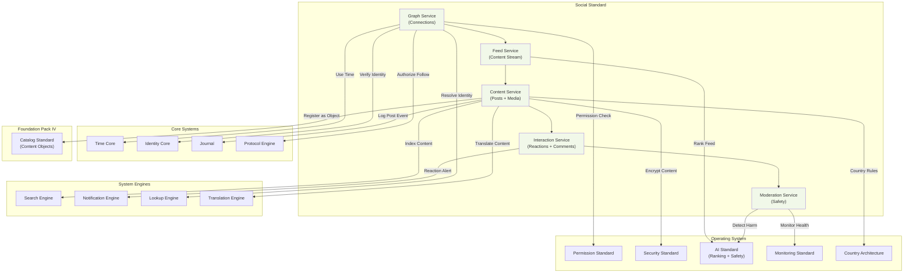

# 61. SOCIAL STANDARD

**Version:** 1.0  
**Status:** ✓ APPROVED  
**Date:** 2026-07-04  
**Type:** Business Platform Foundation Pack VI  
**Classification:** Constitutional Standard

## PURPOSE

The Social Standard establishes the immutable laws, architectural contracts, and governance procedures for the SO8FI Social module. Social enables identity-based connections, content publishing, community formation, and social interactions between platform participants. Every social action — follow, post, react, comment, share — is a platform event governed by identity, permission, and moderation policies. The Social module is the **platform's relationship and expression layer**.

Social is **governed expression with identity-anchored relationships**.

## ARCHITECTURE



## RESPONSIBILITIES

### Graph Service
- Manage directed and undirected identity relationships (follow, connect, friend, block)
- Enforce privacy settings on relationship visibility
- Calculate connection degrees and mutual connections
- Support community and group formation with governance
- Enforce relationship limits per identity tier
- Propagate relationship change events to Feed Service
- Record all relationship events through Journal

### Feed Service
- Compose personalized content feeds per identity
- Apply ranking algorithms via AI Standard
- Support feed types: home, explore, profile, community, hashtag
- Apply content filters per user preferences and country regulations
- Support pagination and infinite scroll patterns
- Enforce feed freshness (no stale content serving)
- Record all feed generation events through Journal

### Content Service
- Accept and validate content submissions (text, images, video, links)
- Apply content size and format limits per policy
- Register published content as Catalog objects
- Manage content lifecycle: draft → published → archived → removed
- Support content scheduling and recurring posts
- Enforce country-specific content restrictions
- Record all content events through Journal

### Interaction Service
- Accept reactions, comments, shares, and saves on content
- Enforce interaction eligibility (blocked users cannot interact)
- Count and aggregate interaction metrics per content
- Support threaded comment hierarchies
- Apply interaction rate limits to prevent spam
- Propagate interactions to content owners via Notification Engine
- Record all interaction events through Journal

### Moderation Service
- Screen all content submissions against safety policies
- Apply AI-powered harmful content detection (AI Standard)
- Support community reporting of content and profiles
- Manage moderation queue, review, and decision workflow
- Enforce takedown procedures and appeal processes
- Maintain moderation records per country compliance requirements
- Record all moderation decisions through Journal

## IMMUTABLE LAWS

1. **Law of Identity Anchoring:** Every social action (post, follow, react, comment) must be anchored to a verified identity. Anonymous social actions are forbidden.

2. **Law of Consent-Based Connections:** Bidirectional relationships (friend, connect) require mutual consent. Forced bidirectional connections without consent are forbidden.

3. **Law of Content Ownership:** Every piece of content has a declared owner. Ownership transfer without explicit consent is forbidden.

4. **Law of Block Supremacy:** When a user blocks another, all interaction between them must cease immediately. Blocked user interactions are forbidden.

5. **Law of Moderation Authority:** Platform moderation decisions supersede user preferences. Users may not override moderation takedowns. Circumventing moderation is forbidden.

6. **Law of Safe Reach:** Content identified as harmful must be restricted before reaching additional audiences. Distribution of confirmed harmful content is forbidden.

7. **Law of Country Compliance:** Content that violates local law must be restricted in that jurisdiction. Distribution of jurisdiction-illegal content is forbidden.

8. **Law of Interaction Authenticity:** Automated bulk interactions (bot likes, fake follows) must be detected and blocked. Artificial engagement manipulation is forbidden.

9. **Law of Data Minimization:** Social graph data collected must be limited to what is necessary for platform functionality. Excess social data collection is forbidden.

10. **Law of Audit Trail:** All social operations (connections, posts, interactions, moderation) must be auditable. Audit trail gaps are forbidden.

## INTERFACE CONTRACTS

### Interface 1: GraphService

```typescript
interface GraphService {
  follow(
    follower: Identity,
    target: Identity
  ): Promise<void>;

  unfollow(
    follower: Identity,
    target: Identity
  ): Promise<void>;

  requestConnection(
    requester: Identity,
    target: Identity
  ): Promise<ConnectionRequestId>;

  acceptConnection(
    requestId: ConnectionRequestId,
    acceptor: Identity
  ): Promise<void>;

  block(
    blocker: Identity,
    target: Identity
  ): Promise<void>;

  getConnections(
    identity: Identity,
    type: ConnectionType,
    pagination: Pagination
  ): Promise<Identity[]>;
}
```

### Interface 2: FeedService

```typescript
interface FeedService {
  getHomeFeed(
    identity: Identity,
    cursor: FeedCursor
  ): Promise<FeedPage>;

  getProfileFeed(
    profileId: Identity,
    viewer: Identity,
    cursor: FeedCursor
  ): Promise<FeedPage>;

  getExploreFeed(
    identity: Identity,
    cursor: FeedCursor
  ): Promise<FeedPage>;

  getCommunityFeed(
    communityId: CommunityId,
    viewer: Identity,
    cursor: FeedCursor
  ): Promise<FeedPage>;

  markSeen(
    identity: Identity,
    contentIds: ContentId[]
  ): Promise<void>;
}
```

### Interface 3: ContentService

```typescript
interface ContentService {
  createContent(
    author: Identity,
    content: ContentData,
    visibility: VisibilityLevel
  ): Promise<ContentId>;

  updateContent(
    contentId: ContentId,
    updates: ContentUpdates,
    editor: Identity
  ): Promise<void>;

  deleteContent(
    contentId: ContentId,
    requester: Identity
  ): Promise<void>;

  getContent(
    contentId: ContentId,
    viewer: Identity
  ): Promise<ContentData>;

  scheduleContent(
    author: Identity,
    content: ContentData,
    publishAt: DateTime
  ): Promise<ScheduledContentId>;
}
```

### Interface 4: InteractionService

```typescript
interface InteractionService {
  react(
    actor: Identity,
    contentId: ContentId,
    reaction: ReactionType
  ): Promise<void>;

  unreact(
    actor: Identity,
    contentId: ContentId,
    reaction: ReactionType
  ): Promise<void>;

  comment(
    author: Identity,
    contentId: ContentId,
    comment: CommentData,
    parentCommentId?: CommentId
  ): Promise<CommentId>;

  share(
    actor: Identity,
    contentId: ContentId,
    shareContext: ShareContext
  ): Promise<ContentId>;

  getInteractionCounts(
    contentId: ContentId
  ): Promise<InteractionCounts>;

  getComments(
    contentId: ContentId,
    pagination: Pagination
  ): Promise<Comment[]>;
}
```

### Interface 5: ModerationService

```typescript
interface ModerationService {
  reportContent(
    reporter: Identity,
    contentId: ContentId,
    reason: ReportReason
  ): Promise<ReportId>;

  reportProfile(
    reporter: Identity,
    profileId: Identity,
    reason: ReportReason
  ): Promise<ReportId>;

  reviewReport(
    reportId: ReportId,
    moderator: Identity,
    decision: ModerationDecision
  ): Promise<void>;

  takedownContent(
    contentId: ContentId,
    authority: Identity,
    reason: TakedownReason
  ): Promise<void>;

  appealDecision(
    contentId: ContentId,
    appellant: Identity,
    appeal: AppealData
  ): Promise<AppealId>;
}
```

## SECURITY RULES

### Forbidden Operations
- **NO anonymous social actions** — Identity anchoring mandatory
- **NO forced bidirectional connections** — Mutual consent required
- **NO ownership transfer without consent** — Content ownership protected
- **NO blocked-user interactions** — Block supremacy enforced immediately
- **NO circumventing moderation** — Moderation decisions final
- **NO distribution of confirmed harmful content** — Safe reach enforced
- **NO jurisdiction-illegal content distribution** — Country compliance mandatory
- **NO artificial engagement** — Bot detection and blocking enforced
- **NO excess social data collection** — Data minimization enforced
- **NO audit trail gaps** — Complete trail mandatory

## DEPENDENCIES

### Required Foundation Pack IV–V Standards
- **Catalog Standard:** Content registered as Catalog objects

### Required Operating System Standards
- **Permission Standard:** Social action authorization
- **Security Standard:** Content encryption and privacy
- **AI Standard:** Feed ranking, harmful content detection, bot detection
- **Monitoring Standard:** Feed health, moderation queue metrics
- **Country Architecture:** Jurisdiction-specific content restrictions

### Required System Engines
- **Search Engine:** Content and profile discovery
- **Notification Engine:** Reaction, comment, follow alerts
- **Lookup Engine:** Identity resolution
- **Translation Engine:** Multi-language content support

### Required Core Systems
- **Time Core:** Post timestamps, feed freshness
- **Identity Core:** Author and actor verification
- **Journal:** Immutable social event record
- **Protocol Engine:** Follow and connection authorization

## RECOVERY

### Harmful Content Recovery
1. AI Standard flags content as harmful
2. Immediately restrict content reach (quarantine)
3. Log restriction through Journal
4. Queue for human moderation review
5. Confirm takedown or restore with annotation
6. Notify affected parties of outcome
7. Record final decision in Journal

### Block Enforcement Recovery
1. Detect block relationship event
2. Immediately suppress all interactions between parties
3. Remove blocker from blocked user's feed
4. Log enforcement through Journal
5. Verify no residual interactions visible
6. Record enforcement completion

## GOVERNANCE

### Social Governance Council
**Members:** Chief Product Officer · Head of Trust and Safety · Legal Lead · Country Compliance Lead  
**Responsibilities:** Content policy, moderation standards, country restriction approvals  
**Monitoring:** Real-time harmful content flags; daily moderation queue; weekly bot detection review

---

**Document ID:** 61_SOCIAL_STANDARD  
**Classification:** Business Platform Constitutional Standard  
**Approved by:** SO8FI Governance Council  
**Effective Date:** 2026-07-04
