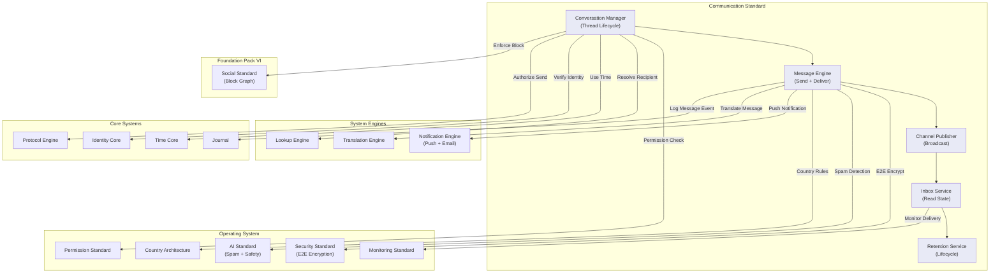

# 62. COMMUNICATION STANDARD

**Version:** 1.0  
**Status:** ✓ APPROVED  
**Date:** 2026-07-04  
**Type:** Business Platform Foundation Pack VI  
**Classification:** Constitutional Standard

## PURPOSE

The Communication Standard establishes the immutable laws, architectural contracts, and governance procedures for the SO8FI Communication module. Communication governs all structured messaging between identities on the platform: direct messages, group conversations, channel broadcasts, and transactional communication (receipts, alerts, system messages). Every message is a platform event with declared sender, declared recipient, declared intent, and full auditability. The Communication module is the **platform's secure messaging fabric**.

Communication is **declared intent messaging with delivery guarantee**.

## ARCHITECTURE



## RESPONSIBILITIES

### Conversation Manager
- Create and manage conversation threads (1-to-1, group, channel)
- Manage participant membership with explicit join/leave events
- Enforce conversation policies: who can create, join, and invite
- Support conversation archiving and deletion (soft)
- Integrate with Social Standard block graph to prevent blocked-identity messaging
- Provide conversation metadata (member count, last active, unread count)
- Record all conversation lifecycle events through Journal

### Message Engine
- Accept, validate, and deliver messages within conversations
- Apply end-to-end encryption for private conversations (Security Standard)
- Enforce message size and media attachment limits
- Apply spam and abuse detection via AI Standard
- Support message editing within the edit window policy
- Support message deletion with tombstone (soft delete, content removed, event preserved)
- Record all message send/edit/delete events through Journal

### Channel Publisher
- Support one-to-many broadcast channels (platform announcements, topic channels)
- Enforce publisher authorization per channel
- Support scheduled broadcasts and recurring announcements
- Manage subscriber lists and notification delivery
- Apply country-specific content restrictions per Country Architecture
- Rate-limit channel publishing to prevent abuse
- Record all channel publication events through Journal

### Inbox Service
- Maintain per-identity unread message state
- Track read receipts per conversation and message
- Deliver inbox summary (unread counts per conversation)
- Support inbox filtering, archiving, and muting
- Sync read state across multiple devices
- Notify conversation participants of read events when permitted
- Record all inbox state changes through Journal

### Retention Service
- Apply message retention policies per conversation type and country
- Execute scheduled message expiry (ephemeral messaging)
- Enforce legal hold overrides on specific conversations or identities
- Produce data export packages for identity data requests (GDPR, etc.)
- Enforce data residency requirements per Country Architecture
- Record all retention actions through Journal

## IMMUTABLE LAWS

1. **Law of Sender Identity:** Every message must have a declared and verified sender. Anonymous or spoofed sender identity is forbidden.

2. **Law of Recipient Consent:** Messages may only be sent to recipients who have not blocked the sender. Sending to blocked identities is forbidden.

3. **Law of Delivery Guarantee:** Every message accepted by the platform must be delivered or its non-delivery logged with cause. Silent message loss is forbidden.

4. **Law of Encryption in Transit:** All messages in transit must be encrypted. Plaintext message transmission is forbidden.

5. **Law of Soft Deletion:** Deleted messages must be tombstoned — the event preserved, the content removed. Physical deletion of message records is forbidden.

6. **Law of Edit Transparency:** Message edits must be recorded with the original version and edit timestamp visible to recipients. Silent edit without audit is forbidden.

7. **Law of Spam Prevention:** Mass unsolicited messaging must be detected and blocked. Bulk unsolicited communication is forbidden.

8. **Law of Retention Compliance:** Messages must be retained for the minimum period required by applicable law, and no longer than the maximum period permitted. Non-compliant retention is forbidden.

9. **Law of Legal Hold Supremacy:** Legal hold orders must override all retention and deletion policies. Deleting a held message is forbidden.

10. **Law of Audit Trail:** All communication operations (conversations, messages, deliveries, retention) must be auditable. Audit trail gaps are forbidden.

## INTERFACE CONTRACTS

### Interface 1: ConversationManager

```typescript
interface ConversationManager {
  createConversation(
    creator: Identity,
    participants: Identity[],
    type: ConversationType,
    config: ConversationConfig
  ): Promise<ConversationId>;

  addParticipant(
    conversationId: ConversationId,
    adder: Identity,
    newParticipant: Identity
  ): Promise<void>;

  removeParticipant(
    conversationId: ConversationId,
    remover: Identity,
    participant: Identity
  ): Promise<void>;

  archiveConversation(
    conversationId: ConversationId,
    requester: Identity
  ): Promise<void>;

  getConversation(
    conversationId: ConversationId,
    viewer: Identity
  ): Promise<ConversationData>;

  listConversations(
    identity: Identity,
    pagination: Pagination
  ): Promise<ConversationSummary[]>;
}
```

### Interface 2: MessageEngine

```typescript
interface MessageEngine {
  sendMessage(
    sender: Identity,
    conversationId: ConversationId,
    content: MessageContent
  ): Promise<MessageId>;

  editMessage(
    messageId: MessageId,
    editor: Identity,
    newContent: MessageContent
  ): Promise<void>;

  deleteMessage(
    messageId: MessageId,
    requester: Identity
  ): Promise<void>;

  getMessage(
    messageId: MessageId,
    viewer: Identity
  ): Promise<MessageData>;

  getMessages(
    conversationId: ConversationId,
    viewer: Identity,
    cursor: MessageCursor
  ): Promise<MessagePage>;

  forwardMessage(
    messageId: MessageId,
    forwarder: Identity,
    targetConversationId: ConversationId
  ): Promise<MessageId>;
}
```

### Interface 3: ChannelPublisher

```typescript
interface ChannelPublisher {
  createChannel(
    creator: Identity,
    channelDefinition: ChannelDefinition
  ): Promise<ChannelId>;

  publishToChannel(
    publisher: Identity,
    channelId: ChannelId,
    content: MessageContent
  ): Promise<BroadcastId>;

  scheduleChannelBroadcast(
    publisher: Identity,
    channelId: ChannelId,
    content: MessageContent,
    publishAt: DateTime
  ): Promise<ScheduledBroadcastId>;

  subscribeToChannel(
    subscriber: Identity,
    channelId: ChannelId
  ): Promise<void>;

  unsubscribeFromChannel(
    subscriber: Identity,
    channelId: ChannelId
  ): Promise<void>;
}
```

### Interface 4: InboxService

```typescript
interface InboxService {
  getInboxSummary(identity: Identity): Promise<InboxSummary>;

  markRead(
    identity: Identity,
    conversationId: ConversationId,
    upToMessageId: MessageId
  ): Promise<void>;

  muteConversation(
    identity: Identity,
    conversationId: ConversationId,
    until?: DateTime
  ): Promise<void>;

  getUnreadCount(identity: Identity): Promise<number>;

  searchMessages(
    identity: Identity,
    query: MessageSearchQuery
  ): Promise<MessageSearchResult[]>;
}
```

### Interface 5: RetentionService

```typescript
interface RetentionService {
  applyRetentionPolicy(
    conversationId: ConversationId,
    policy: RetentionPolicy
  ): Promise<void>;

  placeOnLegalHold(
    target: ConversationId | Identity,
    holdOrder: LegalHoldOrder,
    authority: Identity
  ): Promise<LegalHoldId>;

  releaseFromLegalHold(
    holdId: LegalHoldId,
    authority: Identity
  ): Promise<void>;

  exportConversationData(
    identity: Identity,
    request: DataExportRequest
  ): Promise<DataExportFile>;

  getRetentionStatus(
    conversationId: ConversationId
  ): Promise<RetentionStatus>;
}
```

## SECURITY RULES

### Forbidden Operations
- **NO anonymous messages** — Sender identity verified and declared
- **NO messaging to blocked identities** — Block graph enforced
- **NO silent message loss** — All failures logged
- **NO plaintext transmission** — Encryption in transit mandatory
- **NO physical message deletion** — Tombstone model only
- **NO silent edits** — Edit history preserved
- **NO bulk unsolicited messaging** — Spam prevention enforced
- **NO non-compliant retention** — Retention laws respected
- **NO deletion of held messages** — Legal hold supersedes all
- **NO audit trail gaps** — Complete trail mandatory

## DEPENDENCIES

### Required Foundation Pack VI Standards
- **Social Standard:** Block graph enforcement

### Required Operating System Standards
- **Permission Standard:** Conversation and channel authorization
- **Security Standard:** End-to-end message encryption
- **AI Standard:** Spam and harmful content detection
- **Monitoring Standard:** Delivery health, unread backlogs
- **Country Architecture:** Retention laws, data residency

### Required System Engines
- **Notification Engine:** Push and email delivery for messages
- **Lookup Engine:** Recipient identity resolution
- **Translation Engine:** Inline message translation

### Required Core Systems
- **Time Core:** Message timestamps, retention scheduling
- **Identity Core:** Sender and recipient verification
- **Journal:** Immutable message event record
- **Protocol Engine:** Send and channel publish authorization

## RECOVERY

### Message Delivery Failure Recovery
1. Detect delivery failure
2. Log failure through Journal with cause
3. Queue for retry per retry policy
4. Notify sender if all retries exhausted
5. Mark message as undeliverable
6. Record final state in Journal

### Legal Hold Conflict Recovery
1. Detect deletion attempt on held message
2. Block deletion immediately
3. Log attempt through Journal
4. Alert legal team
5. Enforce hold until released by authority
6. Record all events in Journal

## GOVERNANCE

### Communication Governance Council
**Members:** Chief Legal Officer · Head of Engineering · Compliance Lead · Country Data Lead  
**Responsibilities:** Retention policy, legal hold procedures, encryption standards  
**Monitoring:** Real-time delivery failures; daily retention compliance check; weekly legal hold review

---

**Document ID:** 62_COMMUNICATION_STANDARD  
**Classification:** Business Platform Constitutional Standard  
**Approved by:** SO8FI Governance Council  
**Effective Date:** 2026-07-04
