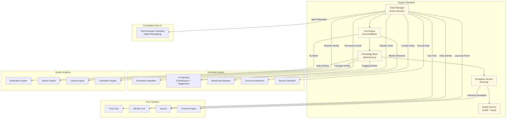

# 63. SUPPORT STANDARD

**Version:** 1.0  
**Status:** ✓ APPROVED  
**Date:** 2026-07-04  
**Type:** Business Platform Foundation Pack VI  
**Classification:** Constitutional Standard

## PURPOSE

The Support Standard establishes the immutable laws, architectural contracts, and governance procedures for the SO8FI Support module. Support governs all structured interactions where a platform participant requires assistance: incident reporting, question resolution, complaint handling, escalations, and service recovery. Every support interaction is a tracked case with a declared SLA, assigned owner, and auditable resolution path. The Support module is the **platform's resolution fabric**.

Support is **governed case resolution with SLA accountability**.

## ARCHITECTURE



## RESPONSIBILITIES

### Ticket Manager
- Accept support requests from any platform identity (user, merchant, provider)
- Classify tickets by category, priority, and affected module via AI Standard
- Assign tickets to appropriate support queue or agent
- Manage ticket lifecycle: open → assigned → in-progress → pending → resolved → closed
- Link tickets to related entities (orders, transactions, sessions) via Catalog references
- Support ticket merging for duplicate reports
- Record all ticket events through Journal

### SLA Engine
- Define and enforce SLA tiers per ticket priority and identity tier
- Track time-to-first-response and time-to-resolution per ticket
- Alert support agents and managers on SLA breach risk (pre-breach warning)
- Escalate SLA breaches automatically to the next tier
- Generate SLA compliance reports per agent, queue, and category
- Apply country-specific consumer protection response time requirements
- Record all SLA events through Journal

### Knowledge Base
- Maintain structured self-service articles organized by topic and platform module
- Index articles via Search Engine for fast discovery
- Suggest relevant articles to users before ticket submission via AI Standard
- Support article versioning, review, and approval workflow
- Measure article effectiveness (deflection rate, helpfulness ratings)
- Enforce article lifecycle (draft → approved → published → deprecated)
- Record all article changes through Journal

### Escalation Service
- Define and enforce escalation rules per ticket category and SLA breach state
- Route escalations to specialized teams (legal, financial, technical, executive)
- Support manual escalation by agent or customer
- Track escalation chain and prevent infinite loops
- Enforce maximum escalation depth per ticket
- Notify all escalation participants at each step
- Record all escalation events through Journal

### Quality Service
- Collect customer satisfaction (CSAT) surveys post-resolution
- Track agent quality metrics: CSAT, resolution time, reopen rate
- Support quality audit of resolved tickets by QA team
- Generate quality reports per agent, team, and period
- Detect quality outliers for coaching or investigation
- Use AI Standard to flag low-quality resolutions for review
- Record all quality events through Journal

## IMMUTABLE LAWS

1. **Law of Case Identity:** Every support ticket must be bound to a verified identity. Anonymous tickets must still carry a session or device identifier for traceability. Completely untracked tickets are forbidden.

2. **Law of SLA Declaration:** Every ticket must have a declared SLA at creation time. Tickets without SLA are forbidden.

3. **Law of Response Guarantee:** Every open ticket must receive a first response within its declared SLA window. Tickets with no response beyond SLA must be auto-escalated. Silent unresponded tickets are forbidden.

4. **Law of Audit Trail Continuity:** Every ticket state transition, agent action, and communication must be recorded. Case history gaps are forbidden.

5. **Law of Escalation Path:** Every ticket must have a defined escalation path. Dead-end tickets with no escalation route are forbidden.

6. **Law of Resolution Record:** Every closed ticket must carry a documented resolution. Closing without resolution documentation is forbidden.

7. **Law of CSAT Collection:** Every resolved ticket must trigger a satisfaction survey to the requester. Resolution without CSAT opportunity is forbidden.

8. **Law of Knowledge Capture:** Recurring issues resolved more than a threshold number of times must generate a Knowledge Base article. Repeated manual resolution of documentable issues is forbidden.

9. **Law of Data Privacy:** Support tickets must not expose sensitive data of one customer to another agent or customer. Cross-customer data leakage in support is forbidden.

10. **Law of Audit Trail:** All support operations (tickets, SLAs, escalations, KB, quality) must be auditable. Audit trail gaps are forbidden.

## INTERFACE CONTRACTS

### Interface 1: TicketManager

```typescript
interface TicketManager {
  createTicket(
    requester: Identity,
    issue: TicketIssueData,
    attachments: TicketAttachment[]
  ): Promise<TicketId>;

  updateTicket(
    ticketId: TicketId,
    updates: TicketUpdates,
    updater: Identity
  ): Promise<void>;

  assignTicket(
    ticketId: TicketId,
    assignee: Identity,
    assigner: Identity
  ): Promise<void>;

  resolveTicket(
    ticketId: TicketId,
    resolver: Identity,
    resolution: ResolutionData
  ): Promise<void>;

  reopenTicket(
    ticketId: TicketId,
    requester: Identity,
    reason: string
  ): Promise<void>;

  getTicket(ticketId: TicketId): Promise<TicketData>;

  searchTickets(
    query: TicketSearchQuery,
    requester: Identity
  ): Promise<TicketId[]>;
}
```

### Interface 2: SLAEngine

```typescript
interface SLAEngine {
  getSLAStatus(ticketId: TicketId): Promise<SLAStatus>;

  setSLATier(
    ticketId: TicketId,
    tier: SLATier,
    authority: Identity
  ): Promise<void>;

  checkSLABreach(ticketId: TicketId): Promise<SLABreachCheck>;

  getSLAReport(
    scope: SLAReportScope,
    timeRange: TimeRange
  ): Promise<SLAReport>;

  getSLABreachHistory(
    timeRange: TimeRange
  ): Promise<SLABreach[]>;
}
```

### Interface 3: KnowledgeBase

```typescript
interface KnowledgeBase {
  createArticle(
    author: Identity,
    article: ArticleData
  ): Promise<ArticleId>;

  publishArticle(
    articleId: ArticleId,
    approver: Identity
  ): Promise<void>;

  updateArticle(
    articleId: ArticleId,
    updates: ArticleUpdates,
    editor: Identity
  ): Promise<ArticleVersion>;

  searchArticles(
    query: string,
    context?: ArticleSearchContext
  ): Promise<ArticleId[]>;

  suggestArticles(
    ticketData: TicketIssueData
  ): Promise<ArticleId[]>;

  recordArticleHelpfulness(
    articleId: ArticleId,
    viewer: Identity,
    helpful: boolean
  ): Promise<void>;
}
```

### Interface 4: EscalationService

```typescript
interface EscalationService {
  escalateTicket(
    ticketId: TicketId,
    reason: EscalationReason,
    escalator: Identity
  ): Promise<EscalationId>;

  acknowledgeEscalation(
    escalationId: EscalationId,
    acknowledger: Identity
  ): Promise<void>;

  resolveEscalation(
    escalationId: EscalationId,
    resolver: Identity,
    outcome: EscalationOutcome
  ): Promise<void>;

  getEscalationChain(
    ticketId: TicketId
  ): Promise<EscalationEvent[]>;

  getActiveEscalations(
    scope: EscalationScope
  ): Promise<EscalationId[]>;
}
```

### Interface 5: QualityService

```typescript
interface QualityService {
  triggerCSATSurvey(
    ticketId: TicketId,
    requester: Identity
  ): Promise<SurveyId>;

  submitCSATResponse(
    surveyId: SurveyId,
    response: CSATResponse
  ): Promise<void>;

  getAgentQualityMetrics(
    agentId: Identity,
    timeRange: TimeRange
  ): Promise<AgentQualityReport>;

  flagTicketForQAReview(
    ticketId: TicketId,
    flagger: Identity,
    reason: QAFlagReason
  ): Promise<void>;

  getQualityReport(
    scope: QualityScope,
    timeRange: TimeRange
  ): Promise<QualityReport>;
}
```

## SECURITY RULES

### Forbidden Operations
- **NO completely untracked tickets** — Identity or session binding mandatory
- **NO tickets without SLA** — SLA declaration at creation required
- **NO silent unresponded tickets** — Auto-escalation on SLA breach
- **NO case history gaps** — Every state change recorded
- **NO dead-end escalation** — Escalation path always defined
- **NO closure without documentation** — Resolution record mandatory
- **NO resolution without CSAT opportunity** — Survey always triggered
- **NO repeated resolution without KB capture** — Knowledge must be captured
- **NO cross-customer data leakage** — Strict ticket data isolation
- **NO audit trail gaps** — Complete trail mandatory

## DEPENDENCIES

### Required Foundation Pack VI Standards
- **Communication Standard:** Agent-to-customer messaging within tickets

### Required Operating System Standards
- **Permission Standard:** Ticket access and escalation authorization
- **Security Standard:** Ticket data encryption and privacy
- **AI Standard:** Ticket classification, KB suggestion, quality flagging
- **Monitoring Standard:** SLA breach rates, queue health
- **Country Architecture:** Consumer protection response SLAs

### Required System Engines
- **Notification Engine:** SLA alerts, resolution notices, CSAT surveys
- **Search Engine:** Ticket and KB article search
- **Lookup Engine:** Customer and agent identity resolution
- **Translation Engine:** Multi-language KB articles and ticket responses

### Required Core Systems
- **Time Core:** SLA timing, response window tracking
- **Identity Core:** Requester and agent verification
- **Journal:** Immutable case event record
- **Protocol Engine:** Escalation authorization

## RECOVERY

### SLA Breach Recovery
1. SLA Engine detects breach threshold crossed
2. Auto-escalate ticket to next tier
3. Log escalation through Journal
4. Alert agent manager and ticket owner
5. Apply breach remediation (priority boost, reassign)
6. Record breach and remediation outcome

### Knowledge Base Staleness Recovery
1. Detect article beyond review cycle threshold
2. Flag article as needing review
3. Notify article owner
4. Suspend article from AI suggestions pending review
5. Update or deprecate article
6. Record lifecycle change in Journal

## GOVERNANCE

### Support Governance Council
**Members:** Head of Customer Experience · Chief Operations Officer · Legal Lead · Country Operations Lead  
**Responsibilities:** SLA policy, escalation path design, KB quality standards  
**Monitoring:** Real-time SLA breach alerts; daily CSAT summary; weekly quality review

---

**Document ID:** 63_SUPPORT_STANDARD  
**Classification:** Business Platform Constitutional Standard  
**Approved by:** SO8FI Governance Council  
**Effective Date:** 2026-07-04
