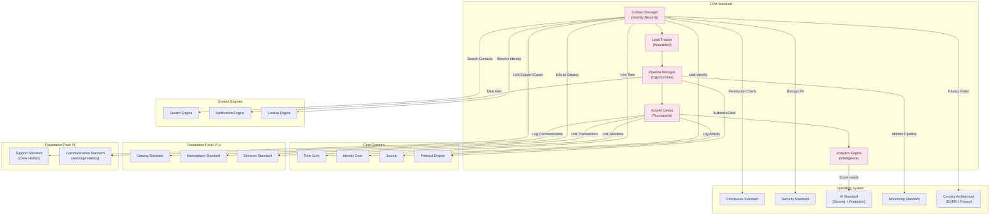

# 64. CRM STANDARD

**Version:** 1.0  
**Status:** ✓ APPROVED  
**Date:** 2026-07-04  
**Type:** Business Platform Foundation Pack VI  
**Classification:** Constitutional Standard

## PURPOSE

The CRM Standard establishes the immutable laws, architectural contracts, and governance procedures for the SO8FI Customer Relationship Management module. CRM governs the structured lifecycle of platform relationships from a business perspective: contact management, lead tracking, opportunity pipelines, deal execution, and customer lifecycle analytics. CRM surfaces the full relationship history of every identity and makes it actionable for merchants, service providers, and platform operators. The CRM module is the **platform's relationship intelligence layer**.

CRM is **structured relationship intelligence with pipeline governance**.

## ARCHITECTURE



## RESPONSIBILITIES

### Contact Manager
- Maintain a unified contact profile for every relevant identity
- Merge duplicate contacts with full history preservation
- Enforce data accuracy and completeness requirements
- Apply GDPR and privacy laws per Country Architecture (right to erasure, portability)
- Register contacts as Catalog objects for unified discoverability
- Support contact segmentation by tags, lists, and custom attributes
- Record all contact changes through Journal

### Lead Tracker
- Capture and qualify inbound leads from all platform acquisition channels
- Score leads via AI Standard (propensity, value, urgency)
- Support lead assignment and routing to the appropriate owner
- Track lead source attribution for analytics
- Manage lead lifecycle: new → contacted → qualified → converted → disqualified
- Enforce lead follow-up SLAs per configuration
- Record all lead events through Journal

### Pipeline Manager
- Define and manage sales/service pipelines with configurable stages
- Manage opportunities through configurable stage progressions
- Track deal value, probability, and expected close date
- Enforce deal stage entry and exit criteria
- Support multiple concurrent pipelines per organization
- Generate pipeline forecasting reports
- Record all pipeline and deal events through Journal

### Activity Center
- Log all customer touchpoints: calls, messages, meetings, emails, transactions
- Link activities to contacts, leads, and opportunities
- Surface complete interaction timeline per contact
- Import activity history from Communication, Support, Marketplace, and Services modules
- Support manual activity logging by agents
- Enforce activity attribution to declared agent identity
- Record all activity events through Journal

### Analytics Engine
- Generate contact lifecycle analytics (acquisition, engagement, churn)
- Produce pipeline performance reports (conversion rates, velocity, win/loss)
- Use AI Standard for lead scoring, churn prediction, and next-best-action
- Support cohort analysis by acquisition channel, segment, and period
- Generate revenue attribution per contact and channel
- Export analytics in compliance-approved formats
- Record all analytics requests through Journal

## IMMUTABLE LAWS

1. **Law of Identity Linkage:** Every CRM contact must be linked to a verified platform identity where one exists. Orphan contacts without identity linkage must be periodically reviewed and resolved.

2. **Law of Data Accuracy:** All contact data must be sourced from verified events or explicit declarations. Inferred PII stored as fact without source attribution is forbidden.

3. **Law of Privacy Compliance:** All contact data must comply with applicable privacy regulations. Storing, processing, or sharing contact data in violation of GDPR or equivalent laws is forbidden.

4. **Law of Activity Attribution:** Every logged activity must be attributed to a declared actor identity. Unattributed activities are forbidden.

5. **Law of Pipeline Integrity:** Deal stage progressions must follow defined stage criteria. Skipping mandatory stages without governance approval is forbidden.

6. **Law of Lead Attribution:** Every lead must carry a source attribution. Unattributed leads are forbidden.

7. **Law of Erasure Compliance:** Contact erasure requests (right to be forgotten) must be honored within the legally required window. Retaining data beyond the erasure deadline is forbidden.

8. **Law of Forecast Honesty:** Pipeline forecasts must be based on objective stage criteria and probability rules. Manipulated forecast figures without evidence are forbidden.

9. **Law of Minimal Data Collection:** CRM must collect only data necessary for relationship management. Excess PII collection beyond declared purpose is forbidden.

10. **Law of Audit Trail:** All CRM operations (contacts, leads, deals, activities, analytics) must be auditable. Audit trail gaps are forbidden.

## INTERFACE CONTRACTS

### Interface 1: ContactManager

```typescript
interface ContactManager {
  createContact(
    owner: Identity,
    contactData: ContactData
  ): Promise<ContactId>;

  updateContact(
    contactId: ContactId,
    updates: ContactUpdates,
    updater: Identity
  ): Promise<void>;

  mergeContacts(
    primaryId: ContactId,
    duplicateId: ContactId,
    authority: Identity
  ): Promise<ContactId>;

  requestErasure(
    contactId: ContactId,
    requester: Identity
  ): Promise<ErasureRequestId>;

  exportContactData(
    contactId: ContactId,
    requester: Identity
  ): Promise<ContactExportFile>;

  searchContacts(
    query: ContactSearchQuery,
    requester: Identity
  ): Promise<ContactId[]>;

  getContact(contactId: ContactId): Promise<ContactData>;
}
```

### Interface 2: LeadTracker

```typescript
interface LeadTracker {
  createLead(
    source: LeadSource,
    data: LeadData,
    assignTo: Identity
  ): Promise<LeadId>;

  qualifyLead(
    leadId: LeadId,
    qualifier: Identity,
    qualificationData: QualificationData
  ): Promise<void>;

  convertLead(
    leadId: LeadId,
    converter: Identity,
    conversionTarget: ConversionTarget
  ): Promise<void>;

  disqualifyLead(
    leadId: LeadId,
    qualifier: Identity,
    reason: DisqualificationReason
  ): Promise<void>;

  getLead(leadId: LeadId): Promise<LeadData>;

  getLeadScore(leadId: LeadId): Promise<LeadScore>;
}
```

### Interface 3: PipelineManager

```typescript
interface PipelineManager {
  createPipeline(
    owner: Identity,
    definition: PipelineDefinition
  ): Promise<PipelineId>;

  createOpportunity(
    pipelineId: PipelineId,
    opportunityData: OpportunityData,
    owner: Identity
  ): Promise<OpportunityId>;

  advanceStage(
    opportunityId: OpportunityId,
    advancer: Identity,
    stageEvidence: StageEvidence
  ): Promise<void>;

  closeOpportunity(
    opportunityId: OpportunityId,
    closer: Identity,
    outcome: DealOutcome
  ): Promise<void>;

  getForecast(
    pipelineId: PipelineId,
    period: ForecastPeriod
  ): Promise<PipelineForecast>;

  getPipelineReport(
    pipelineId: PipelineId,
    timeRange: TimeRange
  ): Promise<PipelineReport>;
}
```

### Interface 4: ActivityCenter

```typescript
interface ActivityCenter {
  logActivity(
    actor: Identity,
    contactId: ContactId,
    activity: ActivityData
  ): Promise<ActivityId>;

  getContactTimeline(
    contactId: ContactId,
    pagination: Pagination
  ): Promise<ActivityRecord[]>;

  linkActivityToOpportunity(
    activityId: ActivityId,
    opportunityId: OpportunityId
  ): Promise<void>;

  getActivitySummary(
    contactId: ContactId,
    timeRange: TimeRange
  ): Promise<ActivitySummary>;
}
```

### Interface 5: AnalyticsEngine

```typescript
interface AnalyticsEngine {
  getContactLifecycleReport(
    segment: ContactSegment,
    timeRange: TimeRange
  ): Promise<LifecycleReport>;

  getPipelinePerformanceReport(
    pipelineId: PipelineId,
    timeRange: TimeRange
  ): Promise<PerformanceReport>;

  getLeadScoringModel(): Promise<LeadScoringModel>;

  predictChurn(
    contactIds: ContactId[]
  ): Promise<ChurnPrediction[]>;

  getRevenueAttribution(
    contactId: ContactId,
    timeRange: TimeRange
  ): Promise<RevenueAttribution>;
}
```

## SECURITY RULES

### Forbidden Operations
- **NO orphan contacts beyond review period** — Identity linkage required
- **NO inferred PII stored as fact** — Source attribution mandatory
- **NO privacy law violations** — GDPR/equivalent compliance enforced
- **NO unattributed activities** — Actor identity mandatory
- **NO stage skipping** — Pipeline integrity enforced
- **NO unattributed leads** — Source required at creation
- **NO erasure deadline violations** — Right to erasure honored in time
- **NO manipulated forecasts** — Objective criteria only
- **NO excess PII collection** — Data minimization enforced
- **NO audit trail gaps** — Complete trail mandatory

## DEPENDENCIES

### Required Foundation Pack IV–V Standards
- **Catalog Standard:** Contacts as Catalog objects
- **Marketplace Standard:** Transaction activity linkage
- **Services Standard:** Session activity linkage

### Required Foundation Pack VI Standards
- **Support Standard:** Support case history in contact timeline
- **Communication Standard:** Message history in contact timeline

### Required Operating System Standards
- **Permission Standard:** Contact and pipeline access control
- **Security Standard:** PII encryption
- **AI Standard:** Lead scoring, churn prediction, next-best-action
- **Monitoring Standard:** Pipeline health and lead velocity metrics
- **Country Architecture:** GDPR and privacy regulation enforcement

### Required Core Systems
- **Time Core:** Activity timestamps, follow-up SLA tracking
- **Identity Core:** Contact identity verification and linking
- **Journal:** Immutable activity and deal record
- **Protocol Engine:** Deal stage and erasure authorization

## RECOVERY

### Duplicate Contact Recovery
1. Detect potential duplicate contacts
2. Flag both records for review
3. Present merge candidate to authorized agent
4. Merge with full history preservation
5. Retire duplicate record (soft delete)
6. Record merge event in Journal

### Erasure Request Recovery
1. Receive verified erasure request
2. Log request through Journal with timestamp
3. Identify all data stores holding contact data
4. Execute erasure across all stores
5. Verify completion within legal deadline
6. Generate erasure certificate
7. Record in Journal

## GOVERNANCE

### CRM Governance Council
**Members:** Chief Revenue Officer · Chief Privacy Officer · Head of Compliance · Country Data Lead  
**Responsibilities:** Data retention policies, GDPR compliance, pipeline stage standards, lead scoring models  
**Monitoring:** Daily erasure request queue; weekly pipeline health; monthly privacy compliance audit

---

**Document ID:** 64_CRM_STANDARD  
**Classification:** Business Platform Constitutional Standard  
**Approved by:** SO8FI Governance Council  
**Effective Date:** 2026-07-04
