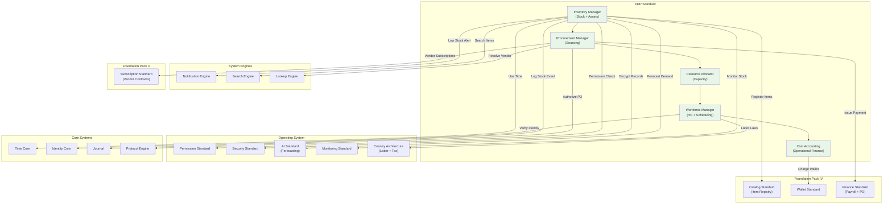

# 65. ERP STANDARD

**Version:** 1.0  
**Status:** ✓ APPROVED  
**Date:** 2026-07-04  
**Type:** Business Platform Foundation Pack VI  
**Classification:** Constitutional Standard

## PURPOSE

The ERP Standard establishes the immutable laws, architectural contracts, and governance procedures for the SO8FI Enterprise Resource Planning module. ERP governs the operational backbone of platform organizations: inventory management, procurement, resource allocation, workforce management, and operational cost accounting. Where Finance governs monetary flows and CRM governs relationships, ERP governs **operational resources and processes**. The ERP module is the **platform's operational resource fabric**.

ERP is **operational resource governance with process integrity**.

## ARCHITECTURE



## RESPONSIBILITIES

### Inventory Manager
- Maintain stock levels for all physical and digital inventory items
- Register all inventory items as Catalog objects with full metadata
- Track stock movements: receipt, issue, transfer, adjustment, write-off
- Support multi-location inventory across warehouses and virtual stores
- Apply reorder point rules and generate replenishment alerts
- Perform periodic stock counts and reconcile against system records
- Record every stock movement event through Journal

### Procurement Manager
- Manage vendor master data and qualification status
- Support purchase requisition, approval, and purchase order lifecycle
- Track purchase order fulfillment: ordered → partially received → fully received
- Apply multi-level approval workflows per purchase value threshold
- Enforce vendor compliance checks before order placement
- Manage returns and credit notes
- Record all procurement events through Journal

### Resource Allocator
- Manage organizational capacity: people, equipment, spaces, licenses
- Schedule resource allocation to projects, campaigns, and operational tasks
- Detect and resolve resource conflicts and overbookings
- Track resource utilization rates per period
- Support resource reservation and advance booking
- Generate capacity forecasts via AI Standard
- Record all allocation events through Journal

### Workforce Manager
- Maintain employee and contractor records within the platform context
- Manage work schedules, shift assignments, and time-off requests
- Track time and attendance for payroll calculation
- Enforce labor law compliance per Country Architecture (working hours, overtime, leave)
- Support onboarding and offboarding workflows
- Integrate with Cost Accounting for payroll cost allocation
- Record all workforce events through Journal

### Cost Accounting
- Track all operational costs: inventory, procurement, labor, overhead
- Allocate costs to cost centers, projects, and products
- Generate profit and loss reports per business unit
- Support budget management and variance analysis
- Integrate with Finance Standard for payment execution and tax
- Enforce cost center hierarchy and allocation rules
- Record all cost accounting events through Journal

## IMMUTABLE LAWS

1. **Law of Stock Accuracy:** Every inventory movement must be recorded before the physical or logical movement is considered complete. Unrecorded stock movements are forbidden.

2. **Law of Purchase Authorization:** All purchase orders above the defined threshold must have an approved purchase requisition. Unauthorized purchase execution is forbidden.

3. **Law of Vendor Compliance:** Purchase orders may only be placed with qualified and compliant vendors. Procurement from disqualified or sanctioned vendors is forbidden.

4. **Law of Resource Non-Overcommitment:** Resources may not be allocated beyond their confirmed available capacity. Silent overbooking is forbidden.

5. **Law of Labor Compliance:** All workforce scheduling must comply with applicable labor laws per Country Architecture. Scheduling in violation of labor law is forbidden.

6. **Law of Cost Attribution:** Every operational cost must be attributed to a declared cost center. Unattributed costs are forbidden.

7. **Law of Inventory Reconciliation:** Physical inventory counts must reconcile with system records within the defined tolerance. Unresolved reconciliation discrepancies beyond tolerance are forbidden.

8. **Law of Procurement Traceability:** Every purchased item must be traceable from purchase order to receipt to inventory to use. Procurement chain breaks are forbidden.

9. **Law of Budget Compliance:** Expenditures must not exceed approved budget without governance approval. Over-budget spending without approval is forbidden.

10. **Law of Audit Trail:** All ERP operations (inventory, procurement, resources, workforce, cost) must be auditable. Audit trail gaps are forbidden.

## INTERFACE CONTRACTS

### Interface 1: InventoryManager

```typescript
interface InventoryManager {
  registerItem(
    owner: Identity,
    itemData: InventoryItemData
  ): Promise<ItemId>;

  recordReceipt(
    itemId: ItemId,
    quantity: Quantity,
    location: LocationId,
    reference: ReceiptReference
  ): Promise<void>;

  recordIssue(
    itemId: ItemId,
    quantity: Quantity,
    location: LocationId,
    reference: IssueReference
  ): Promise<void>;

  transferStock(
    itemId: ItemId,
    fromLocation: LocationId,
    toLocation: LocationId,
    quantity: Quantity
  ): Promise<void>;

  getCurrentStock(
    itemId: ItemId,
    location?: LocationId
  ): Promise<StockLevel>;

  runStockCount(
    location: LocationId,
    counter: Identity
  ): Promise<StockCountId>;

  reconcileStockCount(
    stockCountId: StockCountId,
    authority: Identity
  ): Promise<ReconciliationResult>;
}
```

### Interface 2: ProcurementManager

```typescript
interface ProcurementManager {
  createRequisition(
    requester: Identity,
    items: RequisitionItem[],
    justification: string
  ): Promise<RequisitionId>;

  approveRequisition(
    requisitionId: RequisitionId,
    approver: Identity
  ): Promise<void>;

  createPurchaseOrder(
    requisitionId: RequisitionId,
    vendor: VendorId,
    terms: POTerms,
    creator: Identity
  ): Promise<PurchaseOrderId>;

  receiveGoods(
    poId: PurchaseOrderId,
    receipt: GoodsReceiptData,
    receiver: Identity
  ): Promise<void>;

  returnToVendor(
    poId: PurchaseOrderId,
    returnData: ReturnData,
    returner: Identity
  ): Promise<void>;

  getPurchaseOrder(poId: PurchaseOrderId): Promise<PurchaseOrderData>;
}
```

### Interface 3: ResourceAllocator

```typescript
interface ResourceAllocator {
  registerResource(
    resource: ResourceDefinition,
    owner: Identity
  ): Promise<ResourceId>;

  allocateResource(
    resourceId: ResourceId,
    allocation: AllocationRequest,
    requester: Identity
  ): Promise<AllocationId>;

  releaseAllocation(
    allocationId: AllocationId,
    releaser: Identity
  ): Promise<void>;

  checkAvailability(
    resourceId: ResourceId,
    timeRange: TimeRange
  ): Promise<AvailabilityStatus>;

  getUtilizationReport(
    resourceId: ResourceId,
    timeRange: TimeRange
  ): Promise<UtilizationReport>;

  forecastCapacity(
    scope: CapacityForecastScope,
    horizon: Duration
  ): Promise<CapacityForecast>;
}
```

### Interface 4: WorkforceManager

```typescript
interface WorkforceManager {
  enrollWorker(
    worker: Identity,
    workerData: WorkerData,
    authority: Identity
  ): Promise<WorkerId>;

  assignShift(
    workerId: WorkerId,
    shift: ShiftData,
    assigner: Identity
  ): Promise<ShiftId>;

  recordAttendance(
    workerId: WorkerId,
    attendance: AttendanceRecord
  ): Promise<void>;

  requestTimeOff(
    workerId: WorkerId,
    request: TimeOffRequest
  ): Promise<TimeOffRequestId>;

  approveTimeOff(
    requestId: TimeOffRequestId,
    approver: Identity
  ): Promise<void>;

  getWorkforceReport(
    scope: WorkforceScope,
    timeRange: TimeRange
  ): Promise<WorkforceReport>;
}
```

### Interface 5: CostAccounting

```typescript
interface CostAccounting {
  createCostCenter(
    definition: CostCenterDefinition,
    authority: Identity
  ): Promise<CostCenterId>;

  allocateCost(
    amount: MonetaryAmount,
    costCenter: CostCenterId,
    reference: CostReference
  ): Promise<CostAllocationId>;

  setBudget(
    costCenter: CostCenterId,
    budget: Budget,
    authority: Identity
  ): Promise<void>;

  checkBudgetCompliance(
    costCenter: CostCenterId,
    proposedSpend: MonetaryAmount
  ): Promise<BudgetComplianceResult>;

  getProfitLossReport(
    scope: PLReportScope,
    period: ReportingPeriod
  ): Promise<PLReport>;

  getVarianceAnalysis(
    costCenter: CostCenterId,
    period: ReportingPeriod
  ): Promise<VarianceReport>;
}
```

## SECURITY RULES

### Forbidden Operations
- **NO unrecorded stock movements** — Every movement logged before completion
- **NO unauthorized purchase execution** — Approved requisition required
- **NO procurement from disqualified vendors** — Compliance check mandatory
- **NO resource overbooking** — Capacity limits strictly enforced
- **NO labor law violations** — Country-specific rules enforced
- **NO unattributed costs** — Cost center attribution mandatory
- **NO unresolved reconciliation discrepancies** — Beyond tolerance requires escalation
- **NO procurement chain breaks** — Full traceability required
- **NO over-budget spending without approval** — Budget compliance enforced
- **NO audit trail gaps** — Complete trail mandatory

## DEPENDENCIES

### Required Foundation Pack IV Standards
- **Catalog Standard:** Inventory items as Catalog objects
- **Wallet Standard:** Petty cash and operational fund management
- **Finance Standard:** Purchase order payment and payroll execution

### Required Foundation Pack V Standards
- **Subscription Standard:** Recurring vendor contracts

### Required Operating System Standards
- **Permission Standard:** Procurement and cost center authorization
- **Security Standard:** Operational data encryption
- **AI Standard:** Demand forecasting, capacity planning
- **Monitoring Standard:** Stock health, procurement lead times
- **Country Architecture:** Labor law compliance per jurisdiction

### Required System Engines
- **Notification Engine:** Reorder alerts, PO approvals, budget warnings
- **Search Engine:** Item and vendor search
- **Lookup Engine:** Vendor and resource resolution

### Required Core Systems
- **Time Core:** Stock movement timestamps, shift scheduling
- **Identity Core:** Worker and approver verification
- **Journal:** Immutable operational event record
- **Protocol Engine:** PO and cost allocation authorization

## RECOVERY

### Stock Discrepancy Recovery
1. Reconciliation detects discrepancy beyond tolerance
2. Lock affected stock location (no movements)
3. Log discrepancy through Journal
4. Alert inventory manager
5. Conduct investigation (compare Journal to physical)
6. Apply adjustment with documented justification
7. Record resolution in Journal, unlock location

### Procurement Chain Break Recovery
1. Detect gap in PO-to-receipt traceability
2. Log gap through Journal
3. Alert procurement manager
4. Investigate: locate missing receipt event
5. Reconstruct missing events from evidence
6. Record corrective entries with authority sign-off
7. Document root cause and corrective action

### Budget Overrun Prevention
1. Cost Accounting detects approaching budget limit (80% threshold)
2. Alert cost center owner and approver
3. Block new cost allocations at 100% unless approved exception
4. Log all block events through Journal
5. Escalate to governance for budget increase approval
6. Record approval or rejection in Journal

## GOVERNANCE

### ERP Governance Council
**Members:** Chief Operations Officer · Chief Financial Officer · Head of HR · Country Operations Lead  
**Responsibilities:** Procurement threshold policies, inventory tolerance standards, labor law compliance  
**Monitoring:** Daily stock alerts and PO status; weekly workforce compliance; monthly cost variance review

---

**Document ID:** 65_ERP_STANDARD  
**Classification:** Business Platform Constitutional Standard  
**Approved by:** SO8FI Governance Council  
**Effective Date:** 2026-07-04
