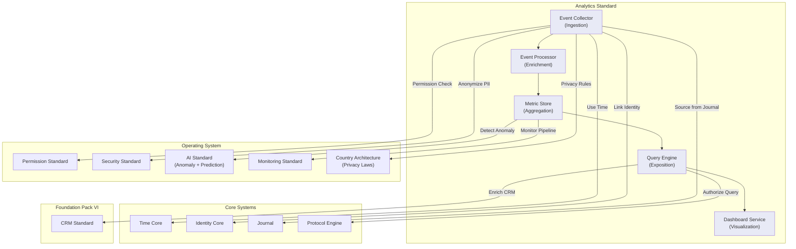

# 66. ANALYTICS STANDARD

**Version:** 1.0  
**Status:** ✓ APPROVED  
**Date:** 2026-07-04  
**Type:** Business Platform Foundation Pack VII  
**Classification:** Constitutional Standard

## PURPOSE

The Analytics Standard establishes the immutable laws, architectural contracts, and governance procedures for the SO8FI Analytics module. Analytics governs the collection, processing, storage, and exposition of all platform events as structured intelligence: usage metrics, business KPIs, funnel analysis, cohort reporting, and real-time dashboards. Every analytics event traces back to a verified identity action recorded through Journal. The Analytics module is the **platform's intelligence and measurement layer**.

Analytics is **event-sourced intelligence with privacy-governed exposition**.

## ARCHITECTURE



## RESPONSIBILITIES

### Event Collector
- Ingest platform events from all modules via Journal-sourced event stream
- Support client-side event submission (SDK) and server-side event emission
- Validate event schema before acceptance
- Apply PII anonymization and pseudonymization at ingestion per Country Architecture
- Enforce event sampling rates for high-volume streams
- Deduplicate events within the deduplication window
- Record all collection errors through Journal

### Event Processor
- Enrich raw events with contextual dimensions (country, platform, cohort)
- Apply session stitching for user journey reconstruction
- Execute real-time and micro-batch processing pipelines
- Apply event filtering and routing per configuration
- Handle late-arriving events with defined watermark policy
- Produce enriched event streams for Metric Store
- Record processing errors and late-arrival discards through Journal

### Metric Store
- Compute and persist aggregated metrics at configurable granularities (minute, hour, day)
- Support pre-aggregated rollups for fast dashboard queries
- Apply data retention policies per metric category and country
- Support metric versioning when computation logic changes
- Provide time-series access to historical metrics
- Enforce access controls per metric sensitivity classification
- Record all metric computation events through Journal

### Query Engine
- Accept structured analytics queries with authorization enforcement
- Support OLAP-style queries: dimensions, measures, filters, time ranges
- Apply row-level privacy filters (suppress small populations per privacy law)
- Support cross-module metric federation
- Enforce query rate limits and cost budgets per consumer
- Cache frequently accessed query results with TTL
- Record all query executions through Journal

### Dashboard Service
- Build and serve configurable dashboards for platform stakeholders
- Support real-time and scheduled dashboard refresh
- Enforce dashboard access controls per role
- Export reports in PDF, CSV, and JSON formats
- Alert on metric threshold breaches via Notification Engine
- Support annotation of metric events (product launches, incidents)
- Record all dashboard access through Journal

## IMMUTABLE LAWS

1. **Law of Event Traceability:** Every analytics event must trace back to a Journal entry or a verified platform action. Invented or fabricated analytics events are forbidden.

2. **Law of PII Anonymization:** Personal Identifiable Information must be anonymized or pseudonymized at collection before storage in analytics systems. Raw PII in analytics storage is forbidden.

3. **Law of Privacy Suppression:** Aggregated metrics exposing fewer than the minimum population threshold must be suppressed. Small-population data exposure is forbidden.

4. **Law of Metric Immutability:** Historical metric values may not be retroactively modified. Corrections must be made as forward-looking recalculations with documentation. Silent backdating is forbidden.

5. **Law of Access Control:** All analytics queries must be authorized per the requester's role and data access level. Unrestricted analytics access is forbidden.

6. **Law of Retention Compliance:** Analytics data must be purged per the applicable retention schedule. Retaining analytics data beyond the permitted period is forbidden.

7. **Law of Sampling Transparency:** When event sampling is applied, the sampling rate must be disclosed in all metrics derived from sampled data. Undisclosed sampling is forbidden.

8. **Law of Schema Governance:** Analytics event schemas must be versioned and approved before deployment. Unversioned schema changes are forbidden.

9. **Law of Cross-Border Data Restriction:** Analytics data must respect data residency requirements per Country Architecture. Cross-border analytics data transfer without authorization is forbidden.

10. **Law of Audit Trail:** All analytics operations (collection, processing, queries, exports) must be auditable. Audit trail gaps are forbidden.

## INTERFACE CONTRACTS

### Interface 1: EventCollector
```typescript
interface EventCollector {
  submitEvent(event: AnalyticsEvent, source: EventSource): Promise<EventId>;
  submitBatch(events: AnalyticsEvent[], source: EventSource): Promise<BatchResult>;
  registerSchema(schema: EventSchema, authority: Identity): Promise<SchemaId>;
  getSchema(schemaId: SchemaId): Promise<EventSchema>;
  getSamplingConfig(eventType: EventType): Promise<SamplingConfig>;
}
```

### Interface 2: EventProcessor
```typescript
interface EventProcessor {
  processEvent(eventId: EventId): Promise<EnrichedEvent>;
  getProcessingStatus(eventId: EventId): Promise<ProcessingStatus>;
  configureEnrichment(rule: EnrichmentRule, authority: Identity): Promise<void>;
  getLateArrivalStats(timeRange: TimeRange): Promise<LateArrivalReport>;
}
```

### Interface 3: MetricStore
```typescript
interface MetricStore {
  getMetric(metricId: MetricId, timeRange: TimeRange, granularity: Granularity): Promise<TimeSeries>;
  computeRollup(metricId: MetricId, granularity: Granularity): Promise<void>;
  listMetrics(filter: MetricFilter): Promise<MetricDefinition[]>;
  setRetentionPolicy(metricId: MetricId, policy: RetentionPolicy, authority: Identity): Promise<void>;
  getMetricVersion(metricId: MetricId, version: number): Promise<MetricDefinition>;
}
```

### Interface 4: QueryEngine
```typescript
interface QueryEngine {
  executeQuery(query: AnalyticsQuery, requester: Identity): Promise<QueryResult>;
  explainQuery(query: AnalyticsQuery): Promise<QueryPlan>;
  getQueryHistory(requester: Identity, pagination: Pagination): Promise<QueryRecord[]>;
  setQueryBudget(requester: Identity, budget: QueryBudget, authority: Identity): Promise<void>;
}
```

### Interface 5: DashboardService
```typescript
interface DashboardService {
  createDashboard(definition: DashboardDefinition, creator: Identity): Promise<DashboardId>;
  updateDashboard(dashboardId: DashboardId, updates: DashboardUpdates, updater: Identity): Promise<void>;
  getDashboard(dashboardId: DashboardId, viewer: Identity): Promise<DashboardData>;
  exportReport(dashboardId: DashboardId, format: ExportFormat, requester: Identity): Promise<ExportFile>;
  setMetricAlert(metricId: MetricId, threshold: AlertThreshold, notifyTo: Identity[]): Promise<AlertId>;
}
```

## SECURITY RULES

- **NO fabricated events** — Journal traceability mandatory
- **NO raw PII in analytics storage** — Anonymization at ingestion
- **NO small-population exposure** — Suppression threshold enforced
- **NO silent backdating** — Historical immutability protected
- **NO unrestricted queries** — Role-based access enforced
- **NO over-retained data** — Retention schedules enforced
- **NO undisclosed sampling** — Sampling rates always disclosed
- **NO unversioned schema changes** — Schema governance required
- **NO unauthorized cross-border transfer** — Data residency enforced
- **NO audit trail gaps** — Complete trail mandatory

## DEPENDENCIES
- **Core Systems:** Time Core (event timestamps), Identity Core (actor linking), Journal (event source), Protocol Engine (query authorization)
- **OS Standards:** Permission Standard, Security Standard (PII anonymization), AI Standard (anomaly detection), Monitoring Standard, Country Architecture (privacy laws)
- **Foundation Pack VI:** CRM Standard (contact enrichment)

## GOVERNANCE

### Analytics Governance Council
**Members:** Chief Data Officer · Chief Privacy Officer · Head of Engineering · Country Data Lead  
**Responsibilities:** Schema approval, retention policy, privacy suppression thresholds  
**Monitoring:** Daily PII scan; weekly retention compliance; monthly privacy audit

---

**Document ID:** 66_ANALYTICS_STANDARD | **Effective Date:** 2026-07-04
