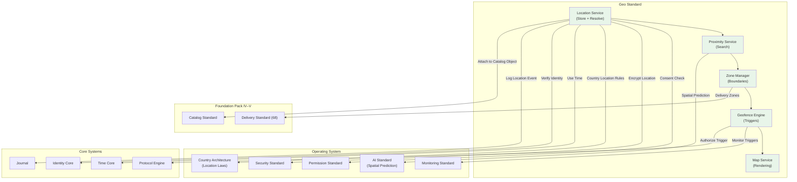

# 67. GEO STANDARD

**Version:** 1.0  
**Status:** ✓ APPROVED  
**Date:** 2026-07-04  
**Type:** Business Platform Foundation Pack VII  
**Classification:** Constitutional Standard

## PURPOSE

The Geo Standard establishes the immutable laws, architectural contracts, and governance procedures for the SO8FI Geo module. Geo governs all spatial operations on the platform: location storage, proximity search, delivery zone management, map rendering, and geofencing. Location data is among the most privacy-sensitive data on the platform. Every location event must be consensual, purpose-limited, and handled with strict data minimization. The Geo module is the **platform's spatial intelligence and location governance layer**.

Geo is **consensual spatial intelligence with location privacy enforcement**.

## ARCHITECTURE



## RESPONSIBILITIES

### Location Service
- Store and manage location data for identities, assets, and catalog objects
- Enforce explicit consent before storing any identity location
- Apply purpose limitation: location stored only for declared use cases
- Support location precision levels (exact, city, region, country)
- Implement location expiry: auto-delete location beyond retention window
- Resolve addresses to coordinates and coordinates to addresses (geocoding)
- Record all location store/access events through Journal

### Proximity Service
- Execute spatial queries: find entities within radius or bounding box
- Apply privacy-preserving fuzzy proximity (prevent exact location inference of individuals)
- Enforce query authorization per location sensitivity level
- Support nearest-N and within-range query patterns
- Cache proximity results with spatial TTL
- Apply country-specific proximity sharing restrictions
- Record all proximity query events through Journal

### Zone Manager
- Define and manage geographic zones: delivery zones, service areas, exclusion zones
- Support polygon, circle, and administrative boundary zone types
- Manage zone lifecycle (active, suspended, archived)
- Apply country-specific zone restrictions (no-fly zones, restricted areas)
- Provide zone membership checks (is point in zone?)
- Register zones as Catalog objects
- Record all zone changes through Journal

### Geofence Engine
- Monitor identity or asset positions against defined geofences
- Trigger configured actions on geofence enter/exit events
- Support time-windowed geofences (active only during configured periods)
- Enforce event debounce to prevent rapid-fire triggers on boundary crossings
- Route geofence events to relevant platform modules via Protocol Engine
- Maintain geofence trigger history per identity
- Record all geofence events through Journal

### Map Service
- Render static and interactive maps for platform UIs
- Support tile-based rendering with zoom level control
- Overlay platform data (zones, assets, delivery routes) on maps
- Enforce what data is visible per viewer permissions
- Support offline tile caching for mobile clients
- Apply country-specific map restrictions (sensitive area masking)
- Record all map render requests through Journal

## IMMUTABLE LAWS

1. **Law of Location Consent:** Location data for any identity may only be collected and stored with explicit, informed consent for a declared purpose. Unconsented location collection is forbidden.

2. **Law of Purpose Limitation:** Location data must only be used for the purpose declared at consent time. Using location data for undeclared purposes is forbidden.

3. **Law of Precision Minimization:** Location precision must be limited to the minimum required for the declared purpose. Storing higher-precision location than necessary is forbidden.

4. **Law of Location Expiry:** Location data must be automatically purged after the declared retention window. Retaining location data beyond consent expiry is forbidden.

5. **Law of Fuzzy Proximity:** Individual location data must never be exposed in proximity results in a way that reveals exact position. Exact individual location inference through proximity queries is forbidden.

6. **Law of Zone Accuracy:** Delivery and service zones must accurately reflect actual coverage. Fraudulent zone boundaries that mislead users are forbidden.

7. **Law of Geofence Authorization:** Geofence triggers must be authorized by Protocol Engine before executing any platform action. Unauthorized geofence-triggered actions are forbidden.

8. **Law of Cross-Border Restriction:** Location data must not cross jurisdictional boundaries without authorization per Country Architecture. Unauthorized cross-border location transfer is forbidden.

9. **Law of Sensitive Area Protection:** Certain geographic areas (as defined per country) must be masked or excluded from map rendering and proximity results. Exposing sensitive area data is forbidden.

10. **Law of Audit Trail:** All geo operations (location storage, proximity queries, zone changes, geofence events) must be auditable. Audit trail gaps are forbidden.

## INTERFACE CONTRACTS

### Interface 1: LocationService
```typescript
interface LocationService {
  storeLocation(owner: Identity, location: LocationData, consent: LocationConsent): Promise<LocationId>;
  getLocation(locationId: LocationId, requester: Identity): Promise<LocationData>;
  updateLocation(owner: Identity, locationId: LocationId, location: LocationData): Promise<void>;
  revokeLocationConsent(owner: Identity, purpose: LocationPurpose): Promise<void>;
  geocode(address: AddressData): Promise<Coordinates>;
  reverseGeocode(coordinates: Coordinates, precision: PrecisionLevel): Promise<AddressData>;
}
```

### Interface 2: ProximityService
```typescript
interface ProximityService {
  findWithinRadius(center: Coordinates, radiusMeters: number, entityType: EntityType, requester: Identity): Promise<ProximityResult[]>;
  findNearestN(center: Coordinates, n: number, entityType: EntityType, requester: Identity): Promise<ProximityResult[]>;
  findWithinBoundingBox(bbox: BoundingBox, entityType: EntityType, requester: Identity): Promise<ProximityResult[]>;
  getDistanceBetween(a: Coordinates, b: Coordinates): Promise<DistanceResult>;
}
```

### Interface 3: ZoneManager
```typescript
interface ZoneManager {
  createZone(definition: ZoneDefinition, creator: Identity): Promise<ZoneId>;
  updateZone(zoneId: ZoneId, updates: ZoneUpdates, updater: Identity): Promise<void>;
  deactivateZone(zoneId: ZoneId, authority: Identity): Promise<void>;
  isPointInZone(coordinates: Coordinates, zoneId: ZoneId): Promise<boolean>;
  getZonesForPoint(coordinates: Coordinates, zoneType: ZoneType): Promise<ZoneId[]>;
  listZones(filter: ZoneFilter): Promise<ZoneDefinition[]>;
}
```

### Interface 4: GeofenceEngine
```typescript
interface GeofenceEngine {
  createGeofence(definition: GeofenceDefinition, creator: Identity): Promise<GeofenceId>;
  registerTrackedEntity(entityId: string, entityType: EntityType, geofenceId: GeofenceId): Promise<void>;
  reportPosition(entityId: string, coordinates: Coordinates, timestamp: DateTime): Promise<GeofenceEventId[]>;
  getGeofenceHistory(entityId: string, timeRange: TimeRange): Promise<GeofenceEvent[]>;
  deactivateGeofence(geofenceId: GeofenceId, authority: Identity): Promise<void>;
}
```

### Interface 5: MapService
```typescript
interface MapService {
  renderStaticMap(center: Coordinates, zoom: number, overlays: MapOverlay[], viewer: Identity): Promise<MapImage>;
  getMapTiles(bbox: BoundingBox, zoom: number, viewer: Identity): Promise<TileSet>;
  overlayZones(mapId: string, zoneIds: ZoneId[], viewer: Identity): Promise<MapLayer>;
  overlayAssets(mapId: string, assetIds: string[], viewer: Identity): Promise<MapLayer>;
  getSupportedZoomLevels(country: CountryCode): Promise<ZoomRange>;
}
```

## SECURITY RULES

- **NO unconsented location collection** — Explicit consent with purpose required
- **NO purpose misuse** — Location used only for declared purpose
- **NO excess precision** — Minimum required precision only
- **NO over-retained location** — Auto-expiry mandatory
- **NO exact individual location in proximity** — Fuzzy results only
- **NO fraudulent zone boundaries** — Zone accuracy required
- **NO unauthorized geofence triggers** — Protocol Engine authorization
- **NO unauthorized cross-border transfer** — Data residency enforced
- **NO sensitive area exposure** — Masking enforced per country
- **NO audit trail gaps** — Complete trail mandatory

## DEPENDENCIES
- **Core Systems:** Time Core, Identity Core (consent binding), Journal, Protocol Engine
- **OS Standards:** Permission Standard (location consent), Security Standard (encryption), AI Standard (spatial prediction), Country Architecture (location laws)
- **Foundation Pack IV:** Catalog Standard (location-attached objects)
- **Foundation Pack VII:** Delivery Standard (zone integration)

## GOVERNANCE

### Geo Governance Council
**Members:** Chief Privacy Officer · Head of Engineering · Country Data Lead · Legal Lead  
**Responsibilities:** Consent policy, precision standards, sensitive area definitions  
**Monitoring:** Daily consent expiry; weekly zone accuracy review; monthly privacy audit

---

**Document ID:** 67_GEO_STANDARD | **Effective Date:** 2026-07-04
