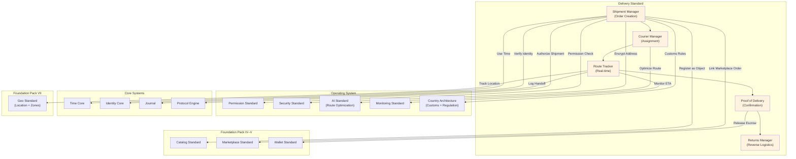

# 68. DELIVERY STANDARD

**Version:** 1.0  
**Status:** ✓ APPROVED  
**Date:** 2026-07-04  
**Type:** Business Platform Foundation Pack VII  
**Classification:** Constitutional Standard

## PURPOSE

The Delivery Standard establishes the immutable laws, architectural contracts, and governance procedures for the SO8FI Delivery module. Delivery governs the physical movement of goods from origin to recipient: shipment creation, courier assignment, route planning, real-time tracking, proof of delivery, and returns management. Every delivery is a tracked chain of custody with declared origin, declared destination, declared contents, and immutable handoff records. The Delivery module is the **platform's physical fulfillment governance layer**.

Delivery is **chain-of-custody fulfillment with verified handoffs**.

## ARCHITECTURE



## RESPONSIBILITIES

### Shipment Manager
- Create shipments from commerce orders (Marketplace, Services)
- Validate shipment data: origin, destination, dimensions, weight, declared value
- Apply customs declarations for cross-border shipments
- Select carrier and service level per shipment requirements and country
- Generate shipping labels and tracking numbers
- Register shipments as Catalog objects
- Record all shipment events through Journal

### Courier Manager
- Maintain courier and carrier profiles with capability data
- Assign shipments to couriers based on availability, route, and capacity
- Manage courier schedules and pickup windows
- Track courier performance metrics (on-time rate, damage rate)
- Enforce courier compliance requirements per country
- Support multi-carrier routing and fallback
- Record all assignment events through Journal

### Route Tracker
- Receive and process real-time location updates from couriers (via Geo Standard)
- Compute and update ETA based on current position and route
- Detect route deviations and alert dispatcher
- Maintain chain-of-custody events at each scan/handoff point
- Broadcast tracking status to recipients and senders
- Flag late shipments for proactive intervention
- Record all tracking events through Journal

### Proof of Delivery
- Collect delivery confirmation: signature, photo, recipient identity, timestamp
- Validate delivery proof meets the declared proof requirements for the shipment
- Trigger payment escrow release (Wallet Standard) on verified delivery
- Handle failed delivery attempts with reattempt scheduling
- Manage delivery instructions and access codes securely
- Generate delivery certificates for high-value or regulated shipments
- Record all delivery proof events through Journal

### Returns Manager
- Process return requests linked to original shipments
- Validate return eligibility per merchant return policy
- Generate return labels and arrange reverse logistics
- Track returned items from recipient back to origin
- Process return-triggered refunds via Wallet Standard
- Manage return inspection and disposition workflow
- Record all return events through Journal

## IMMUTABLE LAWS

1. **Law of Chain of Custody:** Every physical handoff of a shipment must be recorded with timestamp, location, and responsible party identity. Unrecorded handoffs are forbidden.

2. **Law of Proof Requirement:** Every delivered shipment must carry a verified proof of delivery before payment release. Payment release without delivery proof is forbidden.

3. **Law of Address Privacy:** Recipient addresses must be stored encrypted and shared only with authorized courier parties for the minimum time needed. Broad address exposure is forbidden.

4. **Law of Declared Contents:** Shipment contents must be accurately declared. Fraudulent customs declarations or misrepresented contents are forbidden.

5. **Law of Carrier Compliance:** All carriers must meet the compliance requirements for the shipment's origin and destination jurisdictions. Using non-compliant carriers is forbidden.

6. **Law of Tracking Continuity:** Every shipment must have continuous tracking coverage from pickup to delivery. Tracking gaps beyond the allowed window must be escalated. Silent tracking loss is forbidden.

7. **Law of Return Policy Disclosure:** Return policies must be declared at the point of commerce and cannot be modified retroactively after purchase. Post-purchase policy tightening is forbidden.

8. **Law of ETA Accuracy:** Estimated delivery times must be computed from real data. Fabricated or deliberately inflated ETAs are forbidden.

9. **Law of Failed Delivery Notification:** Failed delivery attempts must be immediately communicated to both sender and recipient. Silent failed attempts are forbidden.

10. **Law of Audit Trail:** All delivery operations (shipments, assignments, tracking, proof, returns) must be auditable. Audit trail gaps are forbidden.

## INTERFACE CONTRACTS

### Interface 1: ShipmentManager
```typescript
interface ShipmentManager {
  createShipment(order: OrderReference, shipmentData: ShipmentData, creator: Identity): Promise<ShipmentId>;
  updateShipment(shipmentId: ShipmentId, updates: ShipmentUpdates, updater: Identity): Promise<void>;
  cancelShipment(shipmentId: ShipmentId, requester: Identity, reason: CancellationReason): Promise<void>;
  getShipment(shipmentId: ShipmentId): Promise<ShipmentData>;
  generateLabel(shipmentId: ShipmentId): Promise<ShippingLabel>;
  getCarrierOptions(shipmentData: ShipmentData): Promise<CarrierOption[]>;
}
```

### Interface 2: CourierManager
```typescript
interface CourierManager {
  registerCourier(courierData: CourierData, authority: Identity): Promise<CourierId>;
  assignShipment(shipmentId: ShipmentId, courierId: CourierId, assigner: Identity): Promise<void>;
  getCourierSchedule(courierId: CourierId, date: DateTime): Promise<CourierSchedule>;
  getCourierMetrics(courierId: CourierId, timeRange: TimeRange): Promise<CourierMetrics>;
  suspendCourier(courierId: CourierId, reason: SuspensionReason, authority: Identity): Promise<void>;
}
```

### Interface 3: RouteTracker
```typescript
interface RouteTracker {
  reportPosition(courierId: CourierId, coordinates: Coordinates, timestamp: DateTime): Promise<void>;
  recordHandoff(shipmentId: ShipmentId, handoffData: HandoffData): Promise<HandoffId>;
  getTrackingHistory(shipmentId: ShipmentId): Promise<TrackingEvent[]>;
  getCurrentETA(shipmentId: ShipmentId): Promise<ETAResult>;
  getShipmentsAtRisk(threshold: LatencyThreshold): Promise<ShipmentId[]>;
}
```

### Interface 4: ProofOfDelivery
```typescript
interface ProofOfDelivery {
  recordDelivery(shipmentId: ShipmentId, proof: DeliveryProof): Promise<DeliveryConfirmationId>;
  recordFailedAttempt(shipmentId: ShipmentId, attempt: FailedAttemptData): Promise<void>;
  getDeliveryProof(shipmentId: ShipmentId): Promise<DeliveryProof>;
  scheduleReattempt(shipmentId: ShipmentId, reattemptTime: DateTime): Promise<void>;
  generateDeliveryCertificate(shipmentId: ShipmentId): Promise<DeliveryCertificate>;
}
```

### Interface 5: ReturnsManager
```typescript
interface ReturnsManager {
  initiateReturn(shipmentId: ShipmentId, requester: Identity, reason: ReturnReason): Promise<ReturnId>;
  approveReturn(returnId: ReturnId, authority: Identity): Promise<ReturnLabel>;
  trackReturn(returnId: ReturnId): Promise<ReturnTrackingData>;
  recordReturnReceipt(returnId: ReturnId, inspection: ReturnInspection): Promise<void>;
  processReturnRefund(returnId: ReturnId, authority: Identity): Promise<void>;
}
```

## SECURITY RULES

- **NO unrecorded handoffs** — Chain of custody mandatory
- **NO payment release without delivery proof** — Proof required
- **NO broad address exposure** — Encrypted, minimum exposure
- **NO fraudulent customs declarations** — Accurate declaration required
- **NO non-compliant carriers** — Compliance verified before assignment
- **NO silent tracking loss** — Escalation on gap
- **NO retroactive return policy changes** — Policy locked at purchase
- **NO fabricated ETAs** — Data-based computation only
- **NO silent failed delivery** — Immediate notification required
- **NO audit trail gaps** — Complete trail mandatory

## DEPENDENCIES
- **Core Systems:** Time Core, Identity Core, Journal, Protocol Engine
- **OS Standards:** Permission Standard, Security Standard (address encryption), AI Standard (route optimization), Monitoring Standard, Country Architecture (customs rules)
- **Foundation Pack IV:** Catalog Standard (shipments as objects), Marketplace Standard (order linkage), Wallet Standard (escrow release)
- **Foundation Pack VII:** Geo Standard (location tracking, zone management)

## GOVERNANCE

### Delivery Governance Council
**Members:** Chief Operations Officer · Head of Logistics · Country Compliance Lead · Security Lead  
**Responsibilities:** Carrier compliance standards, proof requirements, customs policy  
**Monitoring:** Real-time tracking gaps; daily on-time rate; weekly carrier compliance

---

**Document ID:** 68_DELIVERY_STANDARD | **Effective Date:** 2026-07-04
