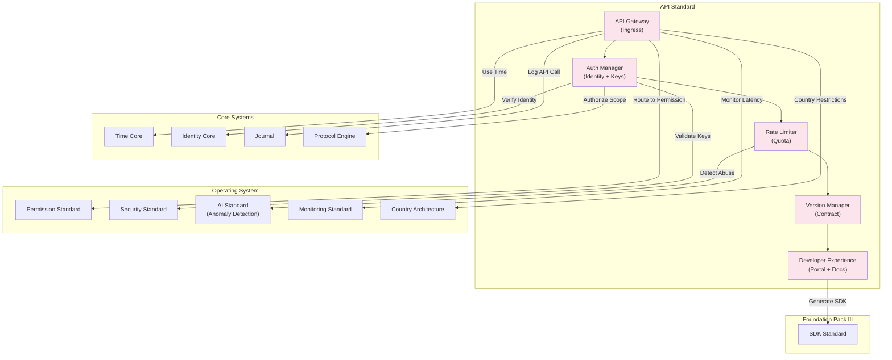

# 69. API STANDARD

**Version:** 1.0  
**Status:** ✓ APPROVED  
**Date:** 2026-07-04  
**Type:** Business Platform Foundation Pack VII  
**Classification:** Constitutional Standard

## PURPOSE

The API Standard establishes the immutable laws, architectural contracts, and governance procedures for the SO8FI external API module. The API module governs all programmatic access to platform capabilities by third-party developers, partner integrations, and platform-owned clients: authentication, authorization, rate limiting, versioning, deprecation, and developer experience. Every API call is an authorized platform action subject to the same constitutional laws as native platform interactions. The API module is the **platform's programmable interface layer**.

API is **governed programmable access with contract stability**.

## ARCHITECTURE



## RESPONSIBILITIES

### API Gateway
- Accept and route all inbound API requests to platform services
- Validate request structure, headers, and authentication tokens before routing
- Enforce TLS on all connections; reject plaintext API calls
- Apply request/response transformation for version compatibility
- Aggregate latency and error metrics per endpoint
- Enforce geographic API access restrictions per Country Architecture
- Record all API requests through Journal

### Auth Manager
- Issue, rotate, and revoke API keys and OAuth tokens for developer applications
- Enforce token scope: each token limited to declared permission set
- Support multiple authentication modes: API key, OAuth 2.0, JWT
- Detect and revoke compromised credentials
- Enforce key expiry and rotation schedules
- Maintain developer application registry with approval workflow
- Record all auth events through Journal

### Rate Limiter
- Enforce per-application and per-endpoint rate limits (requests/second, requests/day)
- Support tiered rate limits per developer plan
- Apply burst allowances with token bucket algorithm
- Return standard rate limit headers with every response
- Queue or shed excess requests per configuration
- Detect and block automated abuse patterns via AI Standard
- Record all rate limit enforcement events through Journal

### Version Manager
- Maintain multiple concurrent API versions with defined lifecycle
- Enforce version deprecation policy: minimum notice period before sunset
- Route requests to correct version handler based on request headers or path
- Apply backward-compatible transformations for cross-version requests
- Block requests to sunsetted versions with informative error
- Generate changelogs per version transition
- Record all version lifecycle events through Journal

### Developer Experience
- Serve interactive API documentation (OpenAPI spec)
- Provide API sandbox environment for testing without affecting production data
- Issue and manage sandbox credentials separately from production
- Generate SDK packages via SDK Standard for supported languages
- Track developer onboarding metrics and support queue
- Publish API status page with real-time health information
- Record all developer portal activity through Journal

## IMMUTABLE LAWS

1. **Law of Authentication Supremacy:** Every API call must carry a valid, unexpired authentication credential. Unauthenticated API access is forbidden.

2. **Law of Scope Enforcement:** API tokens may only access resources within their declared scope. Scope escalation through API calls is forbidden.

3. **Law of TLS Requirement:** All API traffic must use TLS 1.2 or higher. Plaintext API communication is forbidden.

4. **Law of Rate Limit Transparency:** All API responses must include standard rate limit headers showing current usage and limits. Opaque rate limiting is forbidden.

5. **Law of Deprecation Notice:** API versions must receive a minimum notice period before sunset. Immediate version removal without notice is forbidden.

6. **Law of Version Stability:** Published API contracts may not be broken within a major version. Breaking changes require a new major version. Silent breaking changes are forbidden.

7. **Law of Request Logging:** Every API request and response (excluding sensitive payload content) must be logged. API audit trail gaps are forbidden.

8. **Law of Credential Isolation:** Production and sandbox API credentials must be separate and non-interchangeable. Using sandbox credentials in production is forbidden.

9. **Law of Abuse Prevention:** Automated abuse patterns must be detected and blocked. API abuse causing platform degradation is forbidden.

10. **Law of Audit Trail:** All API operations (auth, requests, rate limits, versions, developer actions) must be auditable. Audit trail gaps are forbidden.

## INTERFACE CONTRACTS

### Interface 1: APIGateway
```typescript
interface APIGateway {
  routeRequest(request: APIRequest): Promise<APIResponse>;
  getEndpointMetrics(endpoint: EndpointId, timeRange: TimeRange): Promise<EndpointMetrics>;
  setGeoRestriction(endpoint: EndpointId, restriction: GeoRestriction, authority: Identity): Promise<void>;
  getGatewayHealth(): Promise<GatewayHealth>;
}
```

### Interface 2: AuthManager
```typescript
interface AuthManager {
  issueAPIKey(application: ApplicationId, scope: APIScope[], issuer: Identity): Promise<APIKey>;
  revokeAPIKey(keyId: APIKeyId, revoker: Identity, reason: string): Promise<void>;
  validateToken(token: string): Promise<TokenValidationResult>;
  registerApplication(appData: ApplicationData, developer: Identity): Promise<ApplicationId>;
  rotateAPIKey(keyId: APIKeyId, owner: Identity): Promise<APIKey>;
  listApplicationKeys(applicationId: ApplicationId, owner: Identity): Promise<APIKeyId[]>;
}
```

### Interface 3: RateLimiter
```typescript
interface RateLimiter {
  checkRateLimit(keyId: APIKeyId, endpoint: EndpointId): Promise<RateLimitResult>;
  setRateLimitTier(applicationId: ApplicationId, tier: RateLimitTier, authority: Identity): Promise<void>;
  getRateLimitStatus(keyId: APIKeyId): Promise<RateLimitStatus>;
  getRateLimitHistory(applicationId: ApplicationId, timeRange: TimeRange): Promise<RateLimitEvent[]>;
}
```

### Interface 4: VersionManager
```typescript
interface VersionManager {
  publishVersion(version: APIVersion, definition: APIDefinition, authority: Identity): Promise<void>;
  deprecateVersion(version: APIVersion, sunsetDate: DateTime, authority: Identity): Promise<void>;
  sunsetVersion(version: APIVersion, authority: Identity): Promise<void>;
  getActiveVersions(): Promise<APIVersion[]>;
  getVersionChangelog(fromVersion: APIVersion, toVersion: APIVersion): Promise<Changelog>;
  getCurrentVersion(): Promise<APIVersion>;
}
```

### Interface 5: DeveloperExperience
```typescript
interface DeveloperExperience {
  getAPISpec(version: APIVersion): Promise<OpenAPISpec>;
  issueSandboxCredentials(developer: Identity): Promise<SandboxCredentials>;
  getAPIStatus(): Promise<APIStatusPage>;
  submitSupportRequest(developer: Identity, request: DeveloperSupportRequest): Promise<SupportTicketId>;
  getOnboardingGuide(language: LanguageCode): Promise<OnboardingGuide>;
}
```

## SECURITY RULES

- **NO unauthenticated access** — Valid credentials required
- **NO scope escalation** — Token scope strictly enforced
- **NO plaintext API traffic** — TLS 1.2+ mandatory
- **NO opaque rate limiting** — Headers always returned
- **NO surprise version removal** — Deprecation notice period required
- **NO silent breaking changes** — New major version required
- **NO API audit gaps** — All requests logged
- **NO production/sandbox credential mixing** — Isolation enforced
- **NO API abuse** — Detection and blocking enforced
- **NO audit trail gaps** — Complete trail mandatory

## DEPENDENCIES
- **Core Systems:** Time Core, Identity Core (token binding), Journal (request logging), Protocol Engine (scope authorization)
- **OS Standards:** Permission Standard, Security Standard (TLS + key management), AI Standard (abuse detection), Monitoring Standard (latency/error metrics), Country Architecture (API geo-restrictions)
- **Foundation Pack III:** SDK Standard (SDK generation)

## GOVERNANCE

### API Governance Council
**Members:** Chief Architecture Officer · Head of Engineering · Head of Developer Relations · Security Lead  
**Responsibilities:** Version lifecycle policy, rate limit tiers, deprecation notice standards  
**Monitoring:** Real-time latency and error rates; daily abuse pattern review; monthly version usage analysis

---

**Document ID:** 69_API_STANDARD | **Effective Date:** 2026-07-04
