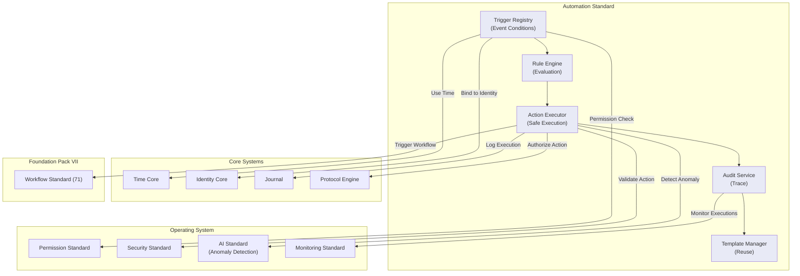

# 70. AUTOMATION STANDARD

**Version:** 1.0  
**Status:** ✓ APPROVED  
**Date:** 2026-07-04  
**Type:** Business Platform Foundation Pack VII  
**Classification:** Constitutional Standard

## PURPOSE

The Automation Standard establishes the immutable laws, architectural contracts, and governance procedures for the SO8FI Automation module. Automation governs trigger-based rule execution: when a defined condition is met on the platform, a configured action is executed automatically. Automations are declared, versioned, authorized, and fully auditable. No automation may perform an action that a human actor could not perform manually. The Automation module is the **platform's declared conditional action layer**.

Automation is **governed rule execution with human-equivalent authority limits**.

## ARCHITECTURE



## RESPONSIBILITIES

### Trigger Registry
- Register and manage automation triggers: event-based, schedule-based, and condition-based
- Validate trigger definitions against platform event schema
- Support trigger chaining (output of one automation triggers another, with cycle detection)
- Manage trigger lifecycle (draft, active, paused, archived)
- Enforce trigger ownership and scope per identity
- Apply country-specific automation restrictions
- Record all trigger events through Journal

### Rule Engine
- Evaluate incoming platform events against active trigger conditions
- Support complex rule conditions: AND, OR, NOT, threshold, time-window
- Apply rule priority ordering for conflicting rules
- Handle rule timeouts gracefully (evaluate next rule, log timeout)
- Support dry-run mode for testing rules without executing actions
- Cache rule evaluation results within defined TTL
- Record all rule evaluations through Journal

### Action Executor
- Execute configured actions with the declared automation owner's authority
- Enforce that automations cannot exceed the authority of the owning identity
- Apply action sandboxing: automations execute in isolated context
- Support action retries with configurable backoff
- Enforce action execution rate limits per automation
- Roll back actions atomically on partial failure
- Record every action execution and outcome through Journal

### Audit Service
- Maintain complete automation execution history per trigger
- Support execution replay for debugging (dry-run replay, not re-execution)
- Generate automation health reports (success rate, failure patterns)
- Alert on automation anomalies via AI Standard
- Provide root cause analysis tooling for failed executions
- Support automation forensics for security investigations
- Record all audit queries through Journal

### Template Manager
- Provide pre-built automation templates for common platform use cases
- Support template versioning and fork-from-template
- Enforce template approval workflow before publishing as platform template
- Track template usage metrics
- Deprecate templates with notice period
- Record all template operations through Journal

## IMMUTABLE LAWS

1. **Law of Declared Authority:** Automations may only perform actions that the owning identity is authorized to perform manually. Authority escalation through automation is forbidden.

2. **Law of Explicit Declaration:** Every automation must be explicitly declared, versioned, and approved. Implicit or hidden automations are forbidden.

3. **Law of Cycle Prevention:** Automation trigger chains must be validated for cycles before activation. Infinite automation loops are forbidden.

4. **Law of Execution Audit:** Every automation execution must be logged with trigger, rule evaluation, action taken, and outcome. Unlogged automation executions are forbidden.

5. **Law of Dry-Run Availability:** Every automation must support dry-run testing before activation. Activating untestable automations is forbidden.

6. **Law of Rate Limit:** Automations must not exceed defined execution rate limits. Runaway automations consuming unbounded platform resources are forbidden.

7. **Law of Atomic Rollback:** On partial action failure, all completed action steps must be rolled back. Leaving the platform in a partial automation state is forbidden.

8. **Law of Human Override:** Any automation may be paused or overridden by an authorized human at any time. Automation that cannot be stopped by human authority is forbidden.

9. **Law of Scope Isolation:** Automations must only access and modify data within the scope declared in their definition. Out-of-scope data access by automations is forbidden.

10. **Law of Audit Trail:** All automation operations (triggers, evaluations, executions, audits) must be auditable. Audit trail gaps are forbidden.

## INTERFACE CONTRACTS

### Interface 1: TriggerRegistry
```typescript
interface TriggerRegistry {
  registerTrigger(definition: TriggerDefinition, owner: Identity): Promise<TriggerId>;
  activateTrigger(triggerId: TriggerId, activator: Identity): Promise<void>;
  pauseTrigger(triggerId: TriggerId, authority: Identity): Promise<void>;
  updateTrigger(triggerId: TriggerId, updates: TriggerUpdates, updater: Identity): Promise<void>;
  listTriggers(owner: Identity): Promise<TriggerDefinition[]>;
  validateTrigger(definition: TriggerDefinition): Promise<ValidationResult>;
}
```

### Interface 2: RuleEngine
```typescript
interface RuleEngine {
  evaluateEvent(event: PlatformEvent, context: EvaluationContext): Promise<RuleMatch[]>;
  dryRunRule(ruleId: RuleId, testEvent: PlatformEvent): Promise<DryRunResult>;
  getRuleEvaluationHistory(ruleId: RuleId, timeRange: TimeRange): Promise<EvaluationRecord[]>;
  setRulePriority(ruleId: RuleId, priority: number, authority: Identity): Promise<void>;
}
```

### Interface 3: ActionExecutor
```typescript
interface ActionExecutor {
  executeAction(actionDefinition: ActionDefinition, context: ExecutionContext): Promise<ExecutionResult>;
  rollbackExecution(executionId: ExecutionId): Promise<void>;
  getExecutionStatus(executionId: ExecutionId): Promise<ExecutionStatus>;
  retryExecution(executionId: ExecutionId, authority: Identity): Promise<ExecutionResult>;
  setExecutionRateLimit(automationId: AutomationId, limit: RateLimit, authority: Identity): Promise<void>;
}
```

### Interface 4: AuditService
```typescript
interface AuditService {
  getExecutionHistory(automationId: AutomationId, timeRange: TimeRange): Promise<ExecutionRecord[]>;
  replayExecution(executionId: ExecutionId, mode: 'dry-run'): Promise<DryRunResult>;
  getAutomationHealthReport(automationId: AutomationId): Promise<HealthReport>;
  flagAnomalousExecution(executionId: ExecutionId, reason: AnomalyReason): Promise<void>;
}
```

### Interface 5: TemplateManager
```typescript
interface TemplateManager {
  createTemplate(template: AutomationTemplate, creator: Identity): Promise<TemplateId>;
  publishTemplate(templateId: TemplateId, authority: Identity): Promise<void>;
  instantiateFromTemplate(templateId: TemplateId, config: TemplateConfig, owner: Identity): Promise<AutomationId>;
  deprecateTemplate(templateId: TemplateId, authority: Identity, notice: DeprecationNotice): Promise<void>;
  listPublishedTemplates(filter: TemplateFilter): Promise<AutomationTemplate[]>;
}
```

## SECURITY RULES

- **NO authority escalation** — Automation authority capped at owner's permissions
- **NO implicit automations** — Explicit declaration required
- **NO automation cycles** — Cycle detection before activation
- **NO unlogged executions** — Every execution audited
- **NO untestable automations** — Dry-run required before activation
- **NO runaway automations** — Rate limits enforced
- **NO partial state left on failure** — Atomic rollback required
- **NO unstoppable automations** — Human override always possible
- **NO out-of-scope data access** — Scope isolation enforced
- **NO audit trail gaps** — Complete trail mandatory

## DEPENDENCIES
- **Core Systems:** Time Core, Identity Core, Journal, Protocol Engine (action authorization)
- **OS Standards:** Permission Standard, Security Standard, AI Standard (anomaly detection), Monitoring Standard
- **Foundation Pack VII:** Workflow Standard (workflow-triggered automations)

## RECOVERY

### Automation Cycle Detection Recovery
1. Detect cycle in automation trigger chain (during validation)
2. Log cycle detection event through Journal
3. Block activation of cyclic automations
4. Alert automation owner with cycle details
5. Provide repair suggestion to user
6. Record prevention in audit trail
7. Alert governance council if patterns detected

### Runaway Automation Recovery
1. Detect rate limit exceedance or anomalous execution count
2. Pause automation immediately
3. Log pause event through Journal
4. Alert automation owner and governance
5. Capture execution pattern for analysis
6. Investigate root cause via Audit Service
7. Resume only after manual approval

### Partial Action Failure Recovery
1. Detect incomplete action execution
2. Initiate atomic rollback of all completed steps
3. Log rollback event through Journal
4. Alert automation owner of failure
5. Restore pre-action state via Journal replay
6. Retry or manual resolution based on automation policy
7. Record outcome in audit trail

### Rule Timeout Recovery
1. Detect rule evaluation timeout
2. Log timeout event through Journal
3. Evaluate next rule in priority order
4. Alert on repeated timeouts (possible infinite loops)
5. Escalate to engineering if pattern detected
6. Provide visibility in automation health dashboard
7. Optionally disable problematic rules

### Audit Trail Repair
1. Detect audit trail gaps or corruption
2. Reconstruct events from Journal replay
3. Generate repair audit report
4. Alert governance council
5. Update audit records with repair metadata
6. Record repair operation itself
7. Escalate for post-mortem if data was lost

## VALIDATION

### Immutable Law Verification
- All automations execute with owner's authority level ✓
- Every automation explicitly declared and approved ✓
- Automation chains validated for cycles before activation ✓
- All executions logged through Journal ✓
- Dry-run testing available before activation ✓
- Rate limits enforced per automation ✓
- Partial failures rolled back atomically ✓
- Human override always possible ✓
- Data access scope isolated to declared scope ✓
- Audit trail maintained and complete ✓

### Compliance Targets

| Metric | Target | Current |
|--------|--------|---------|
| Automation cycle detection | 100% | ✓ |
| Pre-activation dry-run testing | 100% | ✓ |
| Authorization boundary enforcement | 100% | ✓ |
| Execution audit coverage | 100% | ✓ |
| Rate limit compliance | 100% | ✓ |
| Automation pause-on-request SLA | <5s | ✓ |
| Audit trail completeness | 100% | ✓ |
| Recovery SLA (rollback) | <2s | ✓ |

### Automation Health Metrics
- **Execution Success Rate:** Target ≥99% (excluding intentional skips)
- **Average Evaluation Latency:** Target <100ms (P95 <500ms)
- **Cycle Detection Time:** Target <1s (before activation)
- **Dry-Run Accuracy:** Target ≥98% (matches production execution)
- **Rollback Atomicity:** Target 100% (zero partial states)
- **Audit Retrieval Latency:** Target <500ms (P95 <2s)

## ENGINEERING NOTES

### Architecture Decisions
1. **Cycle Detection at Activation:** Cycles detected upfront rather than at runtime to prevent runaway conditions
2. **Dry-Run as Gate:** All automations must pass dry-run before production activation to catch configuration errors early
3. **Rate Limiting per Automation:** Each automation has independent rate limits rather than per-user global limits to prevent one automation from affecting others
4. **Atomic Rollback Requirement:** All-or-nothing action execution eliminates partial state problems that could corrupt platform state

### Implementation Considerations
- Cycle detection algorithm must handle both direct cycles (A→A) and indirect cycles (A→B→C→A)
- Dry-run mode should execute identical code path as production execution to ensure accuracy
- Rate limit bucket should be time-window based (not token bucket) for simplicity
- Rollback must be idempotent: rolling back a rollback must be safe

### Known Limitations
- Automations cannot currently trigger other automations in sub-second time windows (avoids runaway cascades)
- Dry-run results accurate only for deterministic operations (non-deterministic operations like random or time-sensitive ops will differ)
- Rate limits currently per-automation; future work needed for per-user aggregate limits
- Template templates currently not versioned with automations (breaking changes in templates may affect instantiated automations)

### Security Considerations
- Authority escalation must be rejected at Protocol Engine layer, not just Automation layer (defense in depth)
- Scope validation should be re-checked at execution time, not just at registration time (prevents scope drift)
- Audit logging must be append-only; never allow retroactive audit record modification

## FUTURE EVOLUTION

### Near-term Enhancements (6-12 months)
1. **Automation Scheduling:** Support time-based automation triggers (e.g., "every Monday at 9 AM")
2. **Conditional Branching:** Add IF-THEN-ELSE logic to automation rules
3. **Sub-automations:** Enable automation templates to be instantiated by other automations
4. **Rollback Versioning:** Track automation versions for rollback to specific previous versions

### Medium-term Evolution (1-2 years)
1. **AI Automation Suggestions:** Platform detects repeated user actions and suggests automations
2. **Automation Marketplace:** Share automation templates across organizations
3. **Real-time Analytics:** Dashboard showing live automation performance metrics
4. **Graphical Automation Builder:** UI for building automations without code

### Long-term Vision (2+ years)
1. **Self-Healing Automations:** Automations that detect failures and auto-correct
2. **Cross-organization Automations:** Automations that coordinate across business boundaries
3. **Predictive Automation Triggers:** Machine learning to predict when automations should run
4. **Closed-loop Automation:** Automations that measure outcomes and self-optimize

---

**Document ID:** 70_AUTOMATION_STANDARD | **Effective Date:** 2026-07-04
