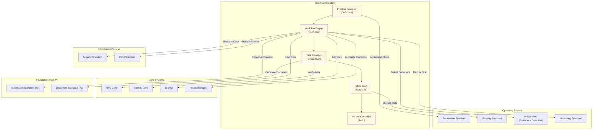

# 71. WORKFLOW STANDARD

**Version:** 1.0  
**Status:** ✓ APPROVED  
**Date:** 2026-07-04  
**Type:** Business Platform Foundation Pack VII  
**Classification:** Constitutional Standard

## PURPOSE

The Workflow Standard establishes the immutable laws, architectural contracts, and governance procedures for the SO8FI Workflow module. Workflows govern multi-step business processes that require sequential or parallel execution, human approvals, conditional branching, and durable state across long time horizons. Where Automation handles single-trigger-single-action rules, Workflows handle complex multi-actor, multi-step business processes. The Workflow module is the **platform's durable process orchestration layer**.

Workflow is **durable multi-step process orchestration with state integrity**.

## ARCHITECTURE



## RESPONSIBILITIES

### Process Designer
- Define workflow processes as directed graphs of steps, conditions, and transitions
- Support step types: automated, human task, approval, parallel branch, sub-workflow
- Validate process definitions for logical consistency before activation
- Manage process versioning with backward-compatible evolution
- Support process templates and reusable sub-processes
- Enforce governance approval for process publication
- Record all process definition events through Journal

### Workflow Engine
- Instantiate and execute workflow processes for declared triggers
- Advance workflow state through transitions based on completed steps and conditions
- Support parallel branch execution with synchronization points
- Handle timeouts at step and process level with configurable escalation
- Support workflow suspension and resumption (long-running processes)
- Apply retry policies for failed automated steps
- Record all workflow state transitions through Journal

### Task Manager
- Assign human task steps to declared actors with deadline enforcement
- Notify task assignees via Notification Engine at assignment and reminder intervals
- Support task delegation, reassignment, and escalation
- Collect task completion data (decisions, forms, approvals)
- Enforce task SLAs and auto-escalate on breach
- Maintain per-task history including all actor interactions
- Record all task events through Journal

### State Vault
- Persist durable workflow state across long time horizons (days, weeks, months)
- Encrypt sensitive workflow state at rest
- Support point-in-time state snapshots for debugging and audit
- Manage state schema migrations for active workflow instances
- Enforce data retention policies per workflow category
- Provide state consistency guarantees: no partial writes
- Record all state mutations through Journal

### History Controller
- Maintain complete workflow execution history: every step, decision, actor, and timestamp
- Support process replay (simulation, not re-execution) for audit and debugging
- Generate workflow compliance reports (SLA adherence, step duration, bottlenecks)
- Detect SLA breach patterns via AI Standard analysis
- Support forensic investigation of disputed process outcomes
- Record all history query events through Journal

## IMMUTABLE LAWS

1. **Law of Process Declaration:** Every workflow must be declared as a versioned process definition before any instance may be started. Ad hoc undeclared workflow execution is forbidden.

2. **Law of State Durability:** Workflow state must survive system restarts, failures, and upgrades. In-memory-only workflow state is forbidden.

3. **Law of Step Attribution:** Every workflow step completion must be attributed to a declared actor (human identity or authorized automation). Unattributed step completions are forbidden.

4. **Law of Transition Authorization:** Every workflow state transition must be authorized by Protocol Engine. Unauthorized state transitions are forbidden.

5. **Law of Timeout Enforcement:** Every workflow step and process must have a defined timeout with configured escalation. Timeoutless workflows are forbidden.

6. **Law of Human Override:** Any workflow instance may be intervened by an authorized human actor. Workflows that cannot be interrupted by governance authority are forbidden.

7. **Law of Rollback Record:** When a workflow is cancelled or rolled back, all completed steps must be recorded with the rollback reason. Silent cancellation without record is forbidden.

8. **Law of SLA Visibility:** Every workflow instance must expose its current SLA status at all times. Opaque workflow SLA is forbidden.

9. **Law of Schema Migration Safety:** Active workflow instances must not be broken by process version upgrades. Schema migrations must support all active instance versions. Breaking schema migration is forbidden.

10. **Law of Audit Trail:** All workflow operations (definitions, instances, steps, tasks, state) must be auditable. Audit trail gaps are forbidden.

## INTERFACE CONTRACTS

### Interface 1: ProcessDesigner
```typescript
interface ProcessDesigner {
  createProcess(definition: ProcessDefinition, creator: Identity): Promise<ProcessId>;
  publishProcess(processId: ProcessId, authority: Identity): Promise<ProcessVersion>;
  deprecateProcess(processId: ProcessId, authority: Identity, sunset: DateTime): Promise<void>;
  getProcess(processId: ProcessId, version?: number): Promise<ProcessDefinition>;
  validateProcess(definition: ProcessDefinition): Promise<ValidationResult>;
  listProcesses(filter: ProcessFilter): Promise<ProcessSummary[]>;
}
```

### Interface 2: WorkflowEngine
```typescript
interface WorkflowEngine {
  startWorkflow(processId: ProcessId, input: WorkflowInput, initiator: Identity): Promise<WorkflowInstanceId>;
  getWorkflowStatus(instanceId: WorkflowInstanceId): Promise<WorkflowStatus>;
  suspendWorkflow(instanceId: WorkflowInstanceId, authority: Identity): Promise<void>;
  resumeWorkflow(instanceId: WorkflowInstanceId, authority: Identity): Promise<void>;
  cancelWorkflow(instanceId: WorkflowInstanceId, authority: Identity, reason: string): Promise<void>;
  getActiveInstances(processId: ProcessId): Promise<WorkflowInstanceId[]>;
}
```

### Interface 3: TaskManager
```typescript
interface TaskManager {
  getMyTasks(actor: Identity): Promise<TaskSummary[]>;
  completeTask(taskId: TaskId, actor: Identity, completion: TaskCompletion): Promise<void>;
  delegateTask(taskId: TaskId, delegator: Identity, delegate: Identity): Promise<void>;
  escalateTask(taskId: TaskId, escalator: Identity, reason: string): Promise<void>;
  getTaskHistory(taskId: TaskId): Promise<TaskEvent[]>;
  getTaskSLAStatus(taskId: TaskId): Promise<SLAStatus>;
}
```

### Interface 4: StateVault
```typescript
interface StateVault {
  getWorkflowState(instanceId: WorkflowInstanceId): Promise<WorkflowState>;
  getStateSnapshot(instanceId: WorkflowInstanceId, asOf: DateTime): Promise<WorkflowState>;
  listStateHistory(instanceId: WorkflowInstanceId): Promise<StateChange[]>;
}
```

### Interface 5: HistoryController
```typescript
interface HistoryController {
  getWorkflowHistory(instanceId: WorkflowInstanceId): Promise<WorkflowHistory>;
  simulateReplay(instanceId: WorkflowInstanceId): Promise<ReplayResult>;
  getProcessAnalytics(processId: ProcessId, timeRange: TimeRange): Promise<ProcessAnalytics>;
  getSLABreaches(processId: ProcessId, timeRange: TimeRange): Promise<SLABreach[]>;
  exportComplianceReport(processId: ProcessId, period: ReportingPeriod): Promise<ComplianceReport>;
}
```

## SECURITY RULES

- **NO undeclared workflows** — Process declaration required
- **NO in-memory-only state** — Durable state mandatory
- **NO unattributed step completions** — Actor identity required
- **NO unauthorized transitions** — Protocol Engine authorization
- **NO timeoutless workflows** — Timeout + escalation required
- **NO unstoppable workflows** — Human override always possible
- **NO silent cancellation** — Rollback record required
- **NO opaque SLA** — SLA status always visible
- **NO breaking schema migrations** — Active instances protected
- **NO audit trail gaps** — Complete trail mandatory

## DEPENDENCIES
- **Core Systems:** Time Core, Identity Core, Journal, Protocol Engine
- **OS Standards:** Permission Standard, Security Standard (state encryption), AI Standard (bottleneck detection), Monitoring Standard
- **Foundation Pack VI:** Support Standard (case escalation), CRM Standard (pipeline updates)
- **Foundation Pack VII:** Automation Standard (automation-triggered workflows), Document Standard (document generation steps)

## GOVERNANCE

### Workflow Governance Council
**Members:** Chief Operations Officer · Chief Architecture Officer · Head of Product · Compliance Lead  
**Responsibilities:** Process approval, SLA standards, schema migration policy  
**Monitoring:** Real-time SLA breach alerts; daily bottleneck analysis; weekly process health review

---

**Document ID:** 71_WORKFLOW_STANDARD | **Effective Date:** 2026-07-04
