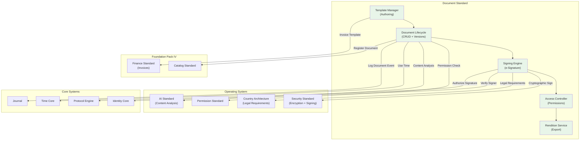

# 72. DOCUMENT STANDARD

**Version:** 1.0  
**Status:** ✓ APPROVED  
**Date:** 2026-07-04  
**Type:** Business Platform Foundation Pack VII  
**Classification:** Constitutional Standard

## PURPOSE

The Document Standard establishes the immutable laws, architectural contracts, and governance procedures for the SO8FI Document module. Documents govern the full lifecycle of structured platform documents: contracts, invoices, agreements, certificates, reports, and compliance filings. Every document has a declared author, declared purpose, version history, and an immutable record of every signature, approval, and change. The Document module is the **platform's structured record and signature layer**.

Document is **immutable structured record with verified authorship**.

## ARCHITECTURE



## RESPONSIBILITIES

### Template Manager
- Maintain versioned document templates for contracts, invoices, certificates, reports
- Support template variables and data binding from platform entities
- Enforce template approval workflow before production use
- Manage template lifecycle (draft, approved, deprecated)
- Support localized templates per language and jurisdiction
- Generate document instances from templates with populated data
- Record all template events through Journal

### Document Lifecycle
- Manage document instances from creation through archival
- Support document states: draft → review → approved → signed → filed → archived
- Enforce version control: every edit creates a new version, previous version immutable
- Support document linking (amendment links to original, addendum links to base)
- Apply document retention policies per category and country
- Register all documents as Catalog objects
- Record all lifecycle events through Journal

### Signing Engine
- Collect cryptographic e-signatures from declared signatories
- Enforce signatory order and dependency (signer B cannot sign before signer A)
- Verify signer identity through Identity Core at signing time
- Embed signature metadata into document payload cryptographically
- Support multi-party signing with configurable completion thresholds
- Detect and reject signature tampering
- Record all signing events through Journal

### Access Controller
- Enforce document access permissions: view, comment, edit, sign, admin
- Support time-limited access grants (for external parties)
- Maintain access log per document
- Enforce document confidentiality classifications (public, internal, confidential, restricted)
- Revoke access on document status change
- Support shared access links with expiry
- Record all access events through Journal

### Rendition Service
- Render documents to PDF, DOCX, and HTML formats
- Apply digital watermarks to exported renditions
- Produce certified PDF renditions with embedded cryptographic proof
- Support redaction of sensitive fields for specific audiences
- Enforce export permissions per document classification
- Cache rendered outputs with version-linked TTL
- Record all rendition requests through Journal

## IMMUTABLE LAWS

1. **Law of Version Immutability:** Once a document version is finalized (approved or signed), its content is immutable. Modifying a finalized document version is forbidden.

2. **Law of Authorship Record:** Every document must have a declared author identity. Anonymous document creation is forbidden.

3. **Law of Signature Integrity:** Signed documents must carry a cryptographic proof linking the content hash to the signer's identity at signing time. Signatures without cryptographic binding are forbidden.

4. **Law of Signatory Verification:** Document signatories must be verified through Identity Core at the moment of signing. Signing with unverified identity is forbidden.

5. **Law of Retention Compliance:** Documents must be retained for the minimum period required by law and no longer than the maximum permitted. Non-compliant document retention is forbidden.

6. **Law of Confidentiality Classification:** Every document must carry a declared confidentiality classification. Unclassified documents are forbidden.

7. **Law of Access Logging:** Every access to a document (view, edit, export, sign) must be recorded. Silent document access is forbidden.

8. **Law of Tamper Evidence:** Any alteration to a signed or finalized document must be detectable. Documents lacking tamper-evidence mechanisms are forbidden.

9. **Law of Legal Compliance:** Documents with legal effect (contracts, certificates) must comply with the e-signature and document laws of the applicable jurisdiction. Non-compliant legally binding documents are forbidden.

10. **Law of Audit Trail:** All document operations (templates, lifecycle, signatures, access, renditions) must be auditable. Audit trail gaps are forbidden.

## INTERFACE CONTRACTS

### Interface 1: TemplateManager
```typescript
interface TemplateManager {
  createTemplate(definition: TemplateDefinition, creator: Identity): Promise<TemplateId>;
  approveTemplate(templateId: TemplateId, approver: Identity): Promise<void>;
  instantiateDocument(templateId: TemplateId, data: DocumentData, author: Identity): Promise<DocumentId>;
  updateTemplate(templateId: TemplateId, updates: TemplateUpdates, updater: Identity): Promise<TemplateVersion>;
  getTemplate(templateId: TemplateId, version?: number): Promise<TemplateDefinition>;
  listTemplates(filter: TemplateFilter): Promise<TemplateSummary[]>;
}
```

### Interface 2: DocumentLifecycle
```typescript
interface DocumentLifecycle {
  createDocument(data: DocumentData, author: Identity): Promise<DocumentId>;
  updateDocument(documentId: DocumentId, changes: DocumentChanges, editor: Identity): Promise<DocumentVersion>;
  submitForReview(documentId: DocumentId, submitter: Identity): Promise<void>;
  approveDocument(documentId: DocumentId, approver: Identity): Promise<void>;
  archiveDocument(documentId: DocumentId, authority: Identity): Promise<void>;
  getDocument(documentId: DocumentId, viewer: Identity): Promise<DocumentData>;
  getDocumentHistory(documentId: DocumentId): Promise<DocumentVersion[]>;
}
```

### Interface 3: SigningEngine
```typescript
interface SigningEngine {
  initiateSigningProcess(documentId: DocumentId, signatories: SignatoryConfig[], initiator: Identity): Promise<SigningProcessId>;
  signDocument(signingProcessId: SigningProcessId, signer: Identity, signature: DigitalSignature): Promise<void>;
  getSigningStatus(signingProcessId: SigningProcessId): Promise<SigningStatus>;
  verifySignatures(documentId: DocumentId): Promise<SignatureVerificationResult>;
  cancelSigningProcess(signingProcessId: SigningProcessId, authority: Identity, reason: string): Promise<void>;
}
```

### Interface 4: AccessController
```typescript
interface AccessController {
  grantAccess(documentId: DocumentId, grantee: Identity, level: AccessLevel, expiry?: DateTime): Promise<void>;
  revokeAccess(documentId: DocumentId, grantee: Identity, authority: Identity): Promise<void>;
  checkAccess(documentId: DocumentId, requester: Identity, operation: DocumentOperation): Promise<boolean>;
  getAccessLog(documentId: DocumentId, timeRange: TimeRange): Promise<AccessEvent[]>;
  createShareLink(documentId: DocumentId, creator: Identity, expiry: DateTime): Promise<ShareLink>;
}
```

### Interface 5: RenditionService
```typescript
interface RenditionService {
  renderToPDF(documentId: DocumentId, options: RenderOptions, requester: Identity): Promise<RenditionId>;
  renderToDocx(documentId: DocumentId, requester: Identity): Promise<RenditionId>;
  getRendition(renditionId: RenditionId, requester: Identity): Promise<RenditionFile>;
  generateCertifiedCopy(documentId: DocumentId, requester: Identity): Promise<CertifiedCopy>;
  redactDocument(documentId: DocumentId, redactions: RedactionSpec, requester: Identity): Promise<RenditionId>;
}
```

## SECURITY RULES

- **NO modification of finalized versions** — Immutability enforced
- **NO anonymous document creation** — Authorship mandatory
- **NO signatures without cryptographic binding** — Crypto proof required
- **NO signing with unverified identity** — Identity Core verification at signing
- **NO non-compliant retention** — Retention laws respected
- **NO unclassified documents** — Classification required
- **NO silent document access** — Every access logged
- **NO untamper-evidenced signed documents** — Tamper detection required
- **NO non-compliant legally binding documents** — Jurisdiction compliance checked
- **NO audit trail gaps** — Complete trail mandatory

## DEPENDENCIES
- **Core Systems:** Time Core, Identity Core (signer verification), Journal, Protocol Engine (signature authorization)
- **OS Standards:** Permission Standard, Security Standard (encryption + cryptographic signing), AI Standard (content analysis), Country Architecture (e-signature laws)
- **Foundation Pack IV:** Catalog Standard (documents as objects), Finance Standard (invoice document templates)

## GOVERNANCE

### Document Governance Council
**Members:** Chief Legal Officer · Head of Compliance · Head of Engineering · Country Legal Lead  
**Responsibilities:** Template approval, e-signature compliance, retention schedules  
**Monitoring:** Daily signing completion rate; weekly retention compliance; monthly legal audit

---

**Document ID:** 72_DOCUMENT_STANDARD | **Effective Date:** 2026-07-04
