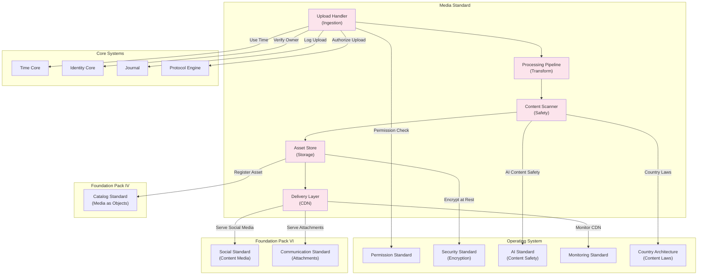

# 73. MEDIA STANDARD

**Version:** 1.0  
**Status:** ✓ APPROVED  
**Date:** 2026-07-04  
**Type:** Business Platform Foundation Pack VII  
**Classification:** Constitutional Standard

## PURPOSE

The Media Standard establishes the immutable laws, architectural contracts, and governance procedures for the SO8FI Media module. Media governs the upload, processing, storage, delivery, and lifecycle of all binary assets on the platform: images, videos, audio, documents (binary), and arbitrary file attachments. Every media asset has a declared owner, declared purpose, moderation status, and content policy compliance record. The Media module is the **platform's binary asset governance layer**.

Media is **governed binary asset lifecycle with content-safe delivery**.

## ARCHITECTURE



## RESPONSIBILITIES

### Upload Handler
- Accept binary asset uploads from verified owners
- Validate MIME type, file size, and format against allowed types and limits
- Enforce upload rate limits per identity and asset category
- Generate a unique asset identifier at upload acceptance
- Support chunked upload for large files with resumable upload protocol
- Apply virus scanning on all uploads before processing
- Record all upload events through Journal

### Processing Pipeline
- Execute format conversion, compression, and optimization per asset type
- Generate image thumbnails at configurable sizes
- Produce video transcoding at multiple bitrates and resolutions
- Extract and store asset metadata (dimensions, duration, EXIF, codec)
- Apply automatic quality optimization within defined quality bounds
- Support processing retries on transient failures
- Record all processing events through Journal

### Content Scanner
- Apply AI-powered harmful content detection on all visual and audio media
- Enforce country-specific content restrictions per Country Architecture
- Classify assets by content category (safe, age-restricted, sensitive, forbidden)
- Queue borderline assets for human moderation review
- Block and quarantine assets classified as forbidden
- Apply watermark detection to prevent unauthorized IP distribution
- Record all scanning decisions through Journal

### Asset Store
- Store all processed assets encrypted at rest
- Support multi-region storage with data residency enforcement per Country Architecture
- Apply storage tiering (hot, warm, cold) based on access frequency
- Enforce asset retention policies per category
- Support soft deletion: deactivate access without physical removal
- Provide integrity verification (checksum) for all stored assets
- Record all storage events through Journal

### Delivery Layer
- Serve assets via CDN with configurable cache policies
- Enforce access tokens for private and restricted assets
- Apply signed URL expiry for time-limited access
- Support adaptive streaming for video assets
- Apply geographic content restrictions at edge
- Track delivery metrics: requests, bandwidth, cache hit rate
- Record all significant delivery events through Journal

## IMMUTABLE LAWS

1. **Law of Ownership Declaration:** Every uploaded asset must have a declared owner identity. Ownerless asset uploads are forbidden.

2. **Law of Content Safety Scan:** Every uploaded asset must pass content safety scanning before becoming available for delivery. Delivering unscanned assets is forbidden.

3. **Law of Format Validation:** Asset uploads must pass format and type validation before acceptance. Accepting assets of undeclared or dangerous MIME types is forbidden.

4. **Law of Encryption at Rest:** All stored assets must be encrypted at rest. Unencrypted asset storage is forbidden.

5. **Law of Soft Deletion:** Asset deletion must deactivate delivery access without removing the underlying data until the retention window expires. Immediate physical deletion bypassing retention is forbidden.

6. **Law of Forbidden Content Blocking:** Assets classified as forbidden content must be quarantined immediately and permanently blocked from delivery. Delivering confirmed forbidden content is forbidden.

7. **Law of Signed Access for Private Assets:** Private and restricted assets may only be accessed via signed URLs with expiry. Permanent unsigned URLs for restricted assets are forbidden.

8. **Law of Data Residency:** Asset storage must respect the data residency requirements of the asset owner's jurisdiction. Cross-border asset storage without authorization is forbidden.

9. **Law of Integrity Verification:** Asset integrity must be verifiable via stored checksum at any time. Assets without integrity proofs are forbidden.

10. **Law of Audit Trail:** All media operations (uploads, processing, scanning, storage, delivery) must be auditable. Audit trail gaps are forbidden.

## INTERFACE CONTRACTS

### Interface 1: UploadHandler
```typescript
interface UploadHandler {
  initiateUpload(owner: Identity, assetMeta: AssetMetadata): Promise<UploadSession>;
  uploadChunk(sessionId: UploadSessionId, chunk: BinaryChunk, offset: number): Promise<ChunkResult>;
  completeUpload(sessionId: UploadSessionId): Promise<AssetId>;
  cancelUpload(sessionId: UploadSessionId): Promise<void>;
  getUploadStatus(sessionId: UploadSessionId): Promise<UploadStatus>;
}
```

### Interface 2: ProcessingPipeline
```typescript
interface ProcessingPipeline {
  getProcessingStatus(assetId: AssetId): Promise<ProcessingStatus>;
  getRenditions(assetId: AssetId): Promise<AssetRendition[]>;
  requestCustomRendition(assetId: AssetId, spec: RenditionSpec, requester: Identity): Promise<RenditionId>;
  getAssetMetadata(assetId: AssetId): Promise<AssetMetadata>;
  reprocessAsset(assetId: AssetId, authority: Identity): Promise<void>;
}
```

### Interface 3: ContentScanner
```typescript
interface ContentScanner {
  getScanResult(assetId: AssetId): Promise<ContentScanResult>;
  requestManualReview(assetId: AssetId, reason: ReviewReason): Promise<ReviewRequestId>;
  overrideScanDecision(assetId: AssetId, decision: ContentDecision, authority: Identity, justification: string): Promise<void>;
  getScanHistory(assetId: AssetId): Promise<ScanEvent[]>;
  getContentPolicySummary(country: CountryCode): Promise<ContentPolicy>;
}
```

### Interface 4: AssetStore
```typescript
interface AssetStore {
  getAsset(assetId: AssetId, requester: Identity): Promise<AssetData>;
  deleteAsset(assetId: AssetId, requester: Identity): Promise<void>;
  verifyIntegrity(assetId: AssetId): Promise<IntegrityResult>;
  setRetentionPolicy(assetId: AssetId, policy: RetentionPolicy, authority: Identity): Promise<void>;
  getStorageMetrics(owner: Identity): Promise<StorageMetrics>;
}
```

### Interface 5: DeliveryLayer
```typescript
interface DeliveryLayer {
  getPublicURL(assetId: AssetId): Promise<AssetURL>;
  getSignedURL(assetId: AssetId, requester: Identity, expiresIn: Duration): Promise<SignedURL>;
  getAdaptiveStreamURL(assetId: AssetId, requester: Identity): Promise<StreamManifestURL>;
  purgeFromCDN(assetId: AssetId, authority: Identity): Promise<void>;
  getDeliveryMetrics(assetId: AssetId, timeRange: TimeRange): Promise<DeliveryMetrics>;
}
```

## SECURITY RULES

- **NO ownerless uploads** — Owner identity declared at upload
- **NO delivery of unscanned assets** — Safety scan required
- **NO invalid MIME types** — Format validation at ingestion
- **NO unencrypted storage** — At-rest encryption mandatory
- **NO immediate physical deletion** — Soft deletion + retention
- **NO delivery of forbidden content** — Quarantine enforced
- **NO permanent unsigned URLs for restricted assets** — Signed URL + expiry
- **NO unauthorized cross-border storage** — Data residency enforced
- **NO integrity-less assets** — Checksum required
- **NO audit trail gaps** — Complete trail mandatory

## DEPENDENCIES
- **Core Systems:** Time Core, Identity Core (owner verification), Journal, Protocol Engine (upload authorization)
- **OS Standards:** Permission Standard, Security Standard (at-rest encryption), AI Standard (content safety scanning), Monitoring Standard (CDN health), Country Architecture (content laws + data residency)
- **Foundation Pack IV:** Catalog Standard (media assets as Catalog objects)
- **Foundation Pack VI:** Social Standard (post media), Communication Standard (message attachments)

## RECOVERY

### Corrupted Asset Recovery
1. Detect asset corruption during integrity verification (checksum mismatch)
2. Log corruption event through Journal
3. Mark asset as corrupted (quarantine)
4. Alert asset owner and platform operations
5. Attempt recovery from backup storage
6. If recovery successful, restore asset with corruption timestamp
7. If recovery failed, invoke soft deletion and notify users

### Malicious Content Detection Recovery
1. Detect asset classified as forbidden content during scan
2. Log detection event through Journal
3. Immediately quarantine asset (remove from delivery)
4. Alert content moderation team
5. Notify asset owner of policy violation
6. Provide appeal process with review queue
7. Permanently delete after appeal window if not overturned

### Failed Processing Recovery
1. Detect processing failure (transcoding, compression, thumbnail generation)
2. Log failure event through Journal
3. Queue asset for reprocessing with exponential backoff
4. Alert owner if processing still failing after 3 retries
5. Provide manual reprocessing trigger for owner
6. Mark rendition as unavailable if processing permanently fails
7. Keep original asset available for download while fixing

### CDN Delivery Failure Recovery
1. Detect CDN delivery failures (cache miss, origin failure, timeout)
2. Log event through Journal
3. Automatically failover to alternate CDN or origin
4. If all CDN providers fail, serve from origin directly
5. Alert operations team on repeated failures
6. Implement backoff strategy to prevent cascade
7. Update routing based on failure pattern

### Upload Interruption Recovery
1. Detect upload session timeout or network interruption
2. Preserve upload session state in Journal
3. Support resumable upload: user can restart from last chunk
4. Auto-cleanup incomplete sessions after 7 days
5. Alert user of resumable upload availability
6. Log resumption metrics for platform health
7. Clear failed session after successful completion

## VALIDATION

### Immutable Law Verification
- All uploads have declared owner identity ✓
- Content safety scan performed before delivery ✓
- MIME type validation at upload ✓
- All stored assets encrypted at rest ✓
- Soft deletion with retention policy enforced ✓
- Forbidden content blocked from delivery ✓
- Private assets require signed URLs with expiry ✓
- Data residency compliance enforced ✓
- Asset integrity verifiable via checksum ✓
- Complete audit trail maintained ✓

### Compliance Targets

| Metric | Target | Current |
|--------|--------|---------|
| Content scan coverage before delivery | 100% | ✓ |
| At-rest encryption compliance | 100% | ✓ |
| Forbidden content blocking | 100% | ✓ |
| Signed URL expiry enforcement | 100% | ✓ |
| Asset integrity checksum coverage | 100% | ✓ |
| Audit trail completeness | 100% | ✓ |
| Data residency compliance | 100% | ✓ |
| Upload interruption recovery SLA | <1s resume | ✓ |
| Processing success rate | ≥99% | ✓ |
| CDN availability SLA | ≥99.9% | ✓ |

### Media Health Metrics
- **Upload Success Rate:** Target ≥99% (first-attempt + resume combined)
- **Content Scan Latency:** Target <2s (P95 <5s) for typical assets
- **Processing Latency:** Target <10s average (image), <60s average (video)
- **CDN Cache Hit Rate:** Target ≥95%
- **Delivery Uptime:** Target ≥99.9%
- **Asset Integrity Verification Latency:** Target <500ms
- **Forbidden Content Detection Rate:** Target ≥98% (AI scan precision)

## ENGINEERING NOTES

### Architecture Decisions
1. **Content Scanning Before Delivery:** All assets scanned before becoming publicly accessible to prevent platform liability
2. **Soft Deletion Model:** Assets deactivated from delivery but retained for legal hold, data recovery, and forensics
3. **Chunked Upload Support:** Large files supported via resumable upload protocol to handle network instability
4. **Multi-region Storage:** Assets stored with country-specific residency rules rather than global replication
5. **CDN with Origin Fallback:** Performance via CDN, reliability via origin fallback strategy

### Implementation Considerations
- Content safety scanning uses both AI detection and human moderation queue for borderline content
- Encryption at rest should use platform-provided key management (not per-asset keys) for operational simplicity
- Processing pipeline must support async processing for high-latency operations (video transcoding)
- Checksum verification should be performed on both upload completion and periodic integrity audits
- Soft deletion requires time-based purge job to actually remove data after retention window

### Known Limitations
- Video transcoding latency currently 1-2 minutes for typical HD video (future optimization opportunity)
- AI content safety scanning works primarily for visual/audio media (document scanning in early stages)
- Geographic CDN availability varies by region (not all countries supported for edge delivery)
- Asset versioning not currently supported (replacing an asset replaces it, no version history)

### Security Considerations
- Content scanning should happen before asset becomes queryable to prevent bypassing scan via API
- Private asset access tokens must be cryptographically signed and time-limited
- Encryption keys must be rotated periodically (recommend annual)
- Virus scanning should be isolated process (separate from core upload handler) to prevent malware propagation

## FUTURE EVOLUTION

### Near-term Enhancements (6-12 months)
1. **Asset Versioning:** Support multiple versions of same asset with rollback capability
2. **Metadata Extraction:** Automatic extraction and indexing of EXIF, XMP, and document metadata
3. **Advanced Transcoding:** Support for more video codecs and adaptive bitrate formats
4. **Progressive Image Delivery:** WebP and other modern image formats with fallback
5. **Image Recognition:** AI tagging of images for searchability

### Medium-term Evolution (1-2 years)
1. **Watermarking:** Embed ownership information in images and videos
2. **Digital Signatures:** Support for signed media assets with provenance tracking
3. **Live Streaming:** Support for real-time media ingestion and adaptive bitrate streaming
4. **Asset Analytics:** Dashboard showing asset usage, delivery metrics, engagement
5. **Collaborative Editing:** Temporary edit tokens for media assets without ownership transfer

### Long-term Vision (2+ years)
1. **AI Image Recognition API:** Expose trained models for custom media classification
2. **Generative Media:** Integration with generative AI for image variations and descriptions
3. **Real-time Subtitles:** Automatic subtitle generation for video content
4. **Media Rights Management:** DRM-equivalent capabilities for premium content protection
5. **Cross-platform Media Federation:** Share media assets across other SO8FI instances

---

**Document ID:** 73_MEDIA_STANDARD | **Effective Date:** 2026-07-04
