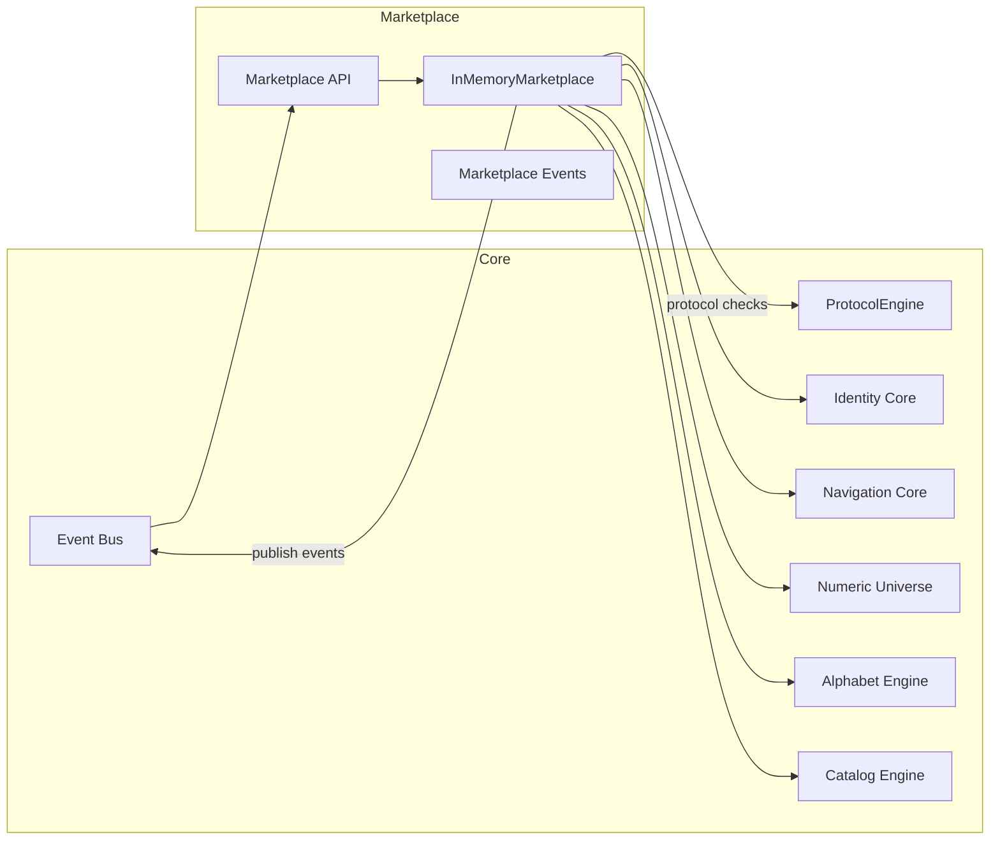
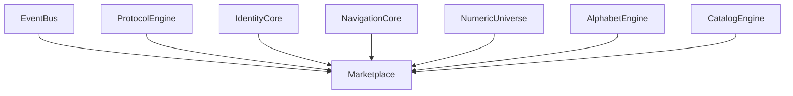
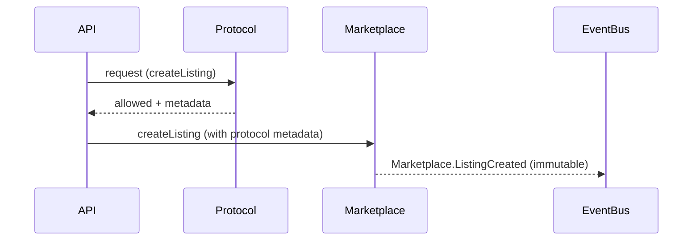

# Marketplace Architecture (TOM8)

**Overview**

```mermaid
flowchart LR
  subgraph Core
    EB[Event Bus]
    Protocol[ProtocolEngine]
    Identity[Identity Core]
    Navigation[Navigation Core]
    Numeric[Numeric Universe]
    Alphabet[Alphabet Engine]
    Catalog[Catalog Engine]
  end

  subgraph Marketplace
    M[InMemoryMarketplace]
    API[Marketplace API]
    Events[Marketplace Events]
  end

  API --> M
  M -->|publish events| EB
  M -->|protocol checks| Protocol
  M --> Identity
  M --> Navigation
  M --> Numeric
  M --> Alphabet
  M --> Catalog
  EB --> API
```

**Dependency Diagram**

```mermaid
graph TD
  EventBus --> Marketplace
  ProtocolEngine --> Marketplace
  IdentityCore --> Marketplace
  NavigationCore --> Marketplace
  NumericUniverse --> Marketplace
  AlphabetEngine --> Marketplace
  CatalogEngine --> Marketplace
```

**Data Flow (create listing)**

```mermaid
sequenceDiagram
  participant API
  participant Protocol
  participant Marketplace
  participant EventBus

  API->>Protocol: request (createListing)
  Protocol-->>API: allowed + metadata
  API->>Marketplace: createListing (with protocol metadata)
  Marketplace-->>EventBus: Marketplace.ListingCreated (immutable)
```
