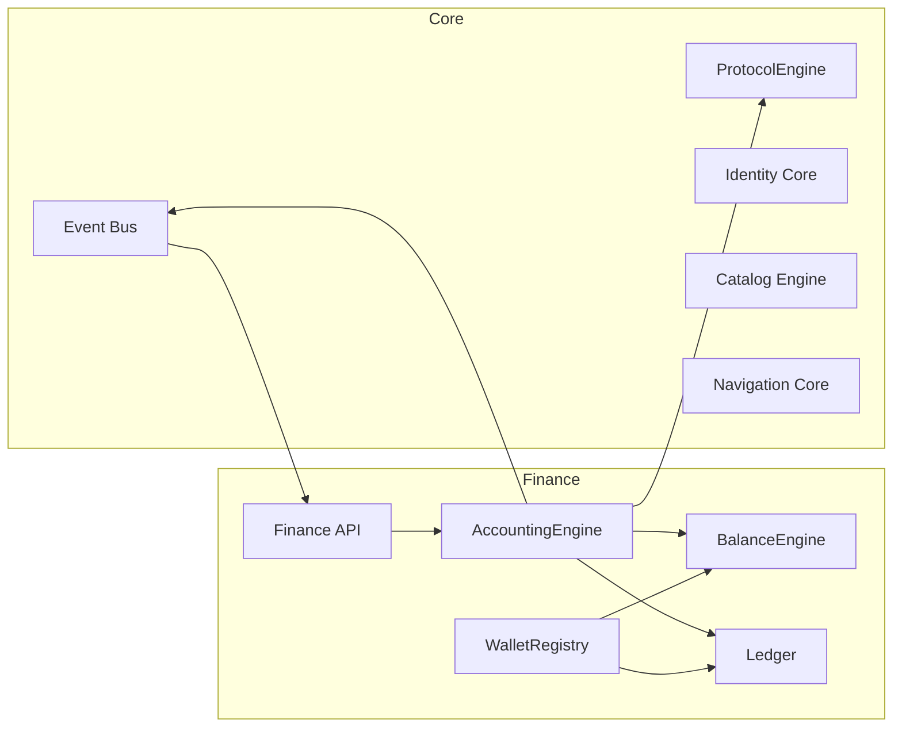
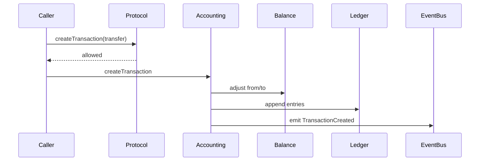

# Finance Architecture (TOM9)

```mermaid
flowchart LR
  subgraph Core
    EB[Event Bus]
    Protocol[ProtocolEngine]
    Identity[Identity Core]
    Catalog[Catalog Engine]
    Navigation[Navigation Core]
  end

  subgraph Finance
    W[WalletRegistry]
    B[BalanceEngine]
    L[Ledger]
    A[AccountingEngine]
    API[Finance API]
  end

  API --> A
  A --> B
  A --> L
  A --> EB
  A --> Protocol
  W --> B
  W --> L
  EB --> API
```

Data flow (transfer):

```mermaid
sequenceDiagram
  participant Caller
  participant Protocol
  participant Accounting
  participant Balance
  participant Ledger
  participant EventBus

  Caller->>Protocol: createTransaction(transfer)
  Protocol-->>Caller: allowed
  Caller->>Accounting: createTransaction
  Accounting->>Balance: adjust from/to
  Accounting->>Ledger: append entries
  Accounting->>EventBus: emit TransactionCreated
```
