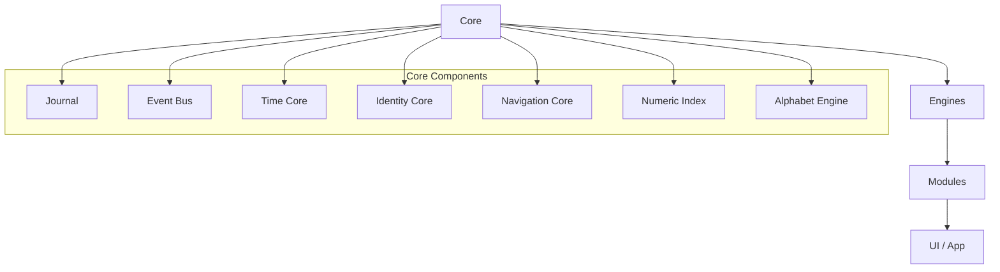
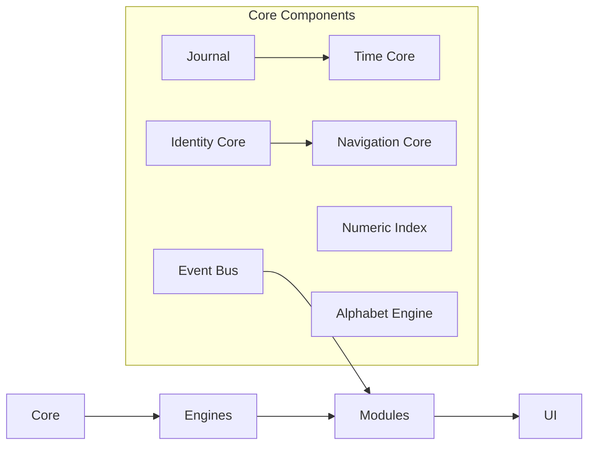

# SO8FI Architecture Foundation

## Purpose

This document captures the foundational architecture created in TOM 1. It defines the immutable Core, the engine contracts, the repository structure, and the rules governing future expansion.

## Immutable Core Components

- `Identity Core`
- `Time Core`
- `Journal`
- `Event Bus`
- `Navigation Core`
- `Numeric Index`
- `Alphabet Engine`

### Core Principles

- Core is immutable and may not import business modules.
- Business modules may depend on Core and Engines only.
- Modules may never communicate directly; all communication passes through the Event Bus.
- Only Time Core may append to Journal.
- Journal is append-only and immutable.
- Every object uses a single immutable Numeric ID.
- Alphabet Engine converts language input to Numeric IDs.
- Navigation works using Numeric IDs.
- Search works using Numeric IDs.
- Text is only an input method.

## Dependency Graph

## Folder Structure

- `app/`: existing Next.js application entry points and routing.
- `components/`: reusable UI components.
- `core/`: immutable foundational contracts and primitives.
- `engines/`: engine contracts that depend on Core.
- `modules/`: replaceable business and domain modules.
- `shared/`: shared contracts, helpers, and cross-cutting abstractions.
- `infrastructure/`: adapters, wiring, environment integration.
- `api/`: API boundary and service definitions.
- `src/`: shared integration entrypoint for future implementation.
- `tests/`: architecture validation guidance and contract tests.
- `scripts/`: repository tooling and automation helpers.
- `docs/`: architecture documentation and standards.
- `types/`: shared type declarations and platform schemas.

## Core Component Responsibilities

### Journal
- Append-only event store.
- Immutable records.
- Query-only reads outside Time Core.
- No business logic.

### Event Bus
- Decouples modules and engines.
- Publishes events across the platform.
- No direct module-to-module calls.

### Time Core
- Provides consistent timestamps.
- The only writer to Journal.
- Converts and validates temporal values.

### Identity Core
- Resolves entity identity by numeric and textual references.
- Registers identity profiles.
- Preserves continuity of platform identities.

### Navigation Core
- Builds navigation targets from Numeric IDs.
- Maps entity kinds to route paths.
- Keeps navigation independent from business logic.

### Numeric Index
- Generates and validates platform Numeric IDs.
- Ensures every object receives a stable unique identifier.

### Alphabet Engine
- Normalizes supported languages.
- Converts text into Numeric ID tokens.
- Provides language-aware identity and search primitives.

## Developer Rules

1. Core may not import business or module code.
2. Business modules may depend on Core and Engines only.
3. Modules must communicate only via Event Bus.
4. No direct Journal writes outside Time Core.
5. No deletions or edits of Journal records.
6. Every entity must use Numeric IDs, not text as source of truth.
7. Use dependency injection when wiring engines or modules.
8. Follow strict TypeScript and no `any` in Core contracts.

## Coding Standards

- Strict TypeScript mode.
- No `any`.
- Reusable, composable interfaces.
- SOLID principles.
- Dependency injection for runtime composition.
- Clear separation between Core, engines, modules, and UI.

## Repository Standards

- One responsibility per folder.
- Avoid duplicate logic and duplicate structure.
- Preserve stable core boundaries.
- Place new domain functionality inside `modules/`.
- Keep core contracts in `core/`.
- Engines may live in `engines/` only.
- Infrastructure belongs in `infrastructure/`.

## Architecture Diagrams

### Core Dependency

