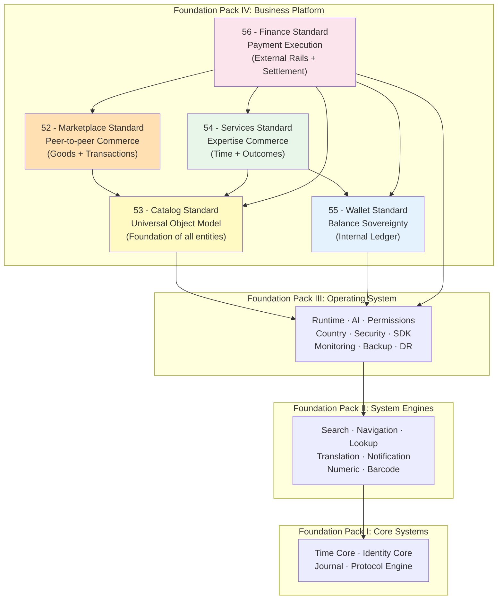

# BUSINESS_PLATFORM_REPORT.md

**Version:** 1.0  
**Status:** ✓ COMPLETE  
**Date:** 2026-07-04  
**Classification:** Foundation Pack IV Completion Report

---

## EXECUTIVE SUMMARY

Foundation Pack IV — **Business Platform** — is complete. Five constitutional standards have been defined, validated, and approved, establishing the full business layer of the SO8FI platform. This report documents the completion of all five standards, their architecture, interdependencies, and the total metrics accumulated across the complete SO8FI constitutional stack.

---

## 1. FOUNDATION PACK IV OVERVIEW

**Pack Name:** Business Platform  
**Pack Number:** IV  
**Standards Created:** 5  
**Validation Documents:** 2 (CATALOG_VALIDATION + BUSINESS_PLATFORM_VALIDATION)  
**Status:** ✓ COMPLETE  

### The Business Platform Standards

| # | Standard | Purpose | Status |
|---|----------|---------|--------|
| 52 | Marketplace Standard | Peer-to-peer commerce with governance | ✓ APPROVED |
| 53 | Catalog Standard | Universal object model for all entities | ✓ APPROVED |
| 54 | Services Standard | Expertise commerce with verified outcomes | ✓ APPROVED |
| 55 | Wallet Standard | Balance sovereignty with immutable ledger | ✓ APPROVED |
| 56 | Finance Standard | Payment execution with regulatory compliance | ✓ APPROVED |

---

## 2. ARCHITECTURE OVERVIEW

### The Five-Module Business Platform



### Dependency Hierarchy (Clean — No Circular)

```
Finance (56)
├── Wallet (55)
│   └── Catalog (53)
├── Marketplace (52)
│   └── Catalog (53)
├── Services (54)
│   ├── Catalog (53)
│   └── Wallet (55)
└── Catalog (53)
    └── [no pack IV dependencies]
```

---

## 3. STANDARD SUMMARIES

### 52 — Marketplace Standard

**Purpose:** Peer-to-peer commerce with full platform governance  
**Core Services:** Listing, Offer, Transaction, Rating, Dispute  
**Key Law:** "Every transaction must be recorded immutably through Journal"  
**Unique Contribution:** Governed commerce layer with built-in fairness enforcement

### 53 — Catalog Standard

**Purpose:** Universal object model that every entity inherits  
**Core Services:** CatalogCore, CatalogValidator, AttributeEngine, CatalogIndexer, ReadModel  
**Key Law:** "Everything is a Catalog Object — one model, infinite entities"  
**Unique Contribution:** Foundation for all other standards; products, services, people, and documents are all catalog objects

### 54 — Services Standard

**Purpose:** Professional expertise commerce with verified session delivery  
**Core Services:** ProviderProfile, Booking, Session, Review, Contract  
**Key Law:** "Payments released only upon verified session completion"  
**Unique Contribution:** Outcome verification separates Services from Marketplace; payment is tied to delivery proof

### 55 — Wallet Standard

**Purpose:** Financial container with immutable double-entry ledger  
**Core Services:** WalletManager, LedgerManager, EscrowService, LimitService, ReconciliationService  
**Key Law:** "Every monetary movement requires two balanced ledger entries"  
**Unique Contribution:** Single source of financial truth for all platform balances; cryptographic ledger chain

### 56 — Finance Standard

**Purpose:** Bridge between internal wallets and external payment networks  
**Core Services:** PaymentGateway, FeeEngine, CurrencyConverter, SettlementLedger, TaxAndReporting  
**Key Law:** "All external flows recorded in Journal before any wallet update"  
**Unique Contribution:** Decouples payment providers from internal ledger; tax and compliance reporting built in

---

## 4. IMMUTABLE LAWS ESTABLISHED

### Foundation Pack IV — 50 Laws Total

**Marketplace Standard (10 laws):**
1. Law of Fair Pricing
2. Law of Complete Disclosure
3. Law of Identity Verification
4. Law of Transaction Recording
5. Law of Dispute Resolution
6. Law of Reputation Integrity
7. Law of Fair Competition
8. Law of Payment Protection
9. Law of Policy Enforcement
10. Law of Audit Trail

**Catalog Standard (10 laws):**
1. Law of Unique Identity
2. Law of Complete Audit Trail
3. Law of Ownership Verification
4. Law of Lifecycle Integrity
5. Law of Permission Enforcement
6. Law of Localization Completeness
7. Law of Attribute Extensibility
8. Law of Soft Deletion Only
9. Law of Immutable Core Identity
10. Law of Search Indexing

**Services Standard (10 laws):**
1. Law of Credential Verification
2. Law of Availability Honesty
3. Law of Session Recording
4. Law of Outcome Verification
5. Law of Contract Supremacy
6. Law of Verified Reviews
7. Law of Cancellation Policy
8. Law of Time Integrity
9. Law of Fair Matching
10. Law of Audit Trail

**Wallet Standard (10 laws):**
1. Law of Double-Entry Ledger
2. Law of Immutable Entries
3. Law of Identity Binding
4. Law of Balance Integrity
5. Law of Non-Negative Balance
6. Law of Escrow Protection
7. Law of Limit Enforcement
8. Law of Reconciliation Continuity
9. Law of Cryptographic Proof
10. Law of Audit Trail

**Finance Standard (10 laws):**
1. Law of External Boundary Recording
2. Law of Fee Transparency
3. Law of Exchange Rate Lock
4. Law of Settlement Completeness
5. Law of Tax Accuracy
6. Law of Payout Authorization
7. Law of Provider Failover
8. Law of Regulatory Compliance
9. Law of Reconciliation Supremacy
10. Law of Audit Trail

---

## 5. INTERFACE CONTRACTS SUMMARY

| Standard | Interfaces | Total Methods |
|----------|-----------|---------------|
| Marketplace | 5 | 36+ |
| Catalog | 5 | 25+ |
| Services | 5 | 34 |
| Wallet | 5 | 31 |
| Finance | 5 | 32 |
| **TOTAL** | **25** | **158+** |

---

## 6. QUALITY METRICS

### Per Standard

| Standard | Laws | Interfaces | Governance | Security Rules | Recovery Procedures |
|----------|------|------------|------------|----------------|---------------------|
| Marketplace | 10 | 5 | ✓ | 10 | 3 |
| Catalog | 10 | 5 | ✓ | 10 | 3 |
| Services | 10 | 5 | ✓ | 10 | 3 |
| Wallet | 10 | 5 | ✓ | 10 | 3 |
| Finance | 10 | 5 | ✓ | 10 | 3 |
| **TOTAL** | **50** | **25** | **5 councils** | **50** | **15** |

### Documentation Volume

| Standard | Approximate Lines |
|----------|------------------|
| 52_MARKETPLACE_STANDARD.md | 430 |
| 53_CATALOG_STANDARD.md | 500 |
| 54_SERVICES_STANDARD.md | 460 |
| 55_WALLET_STANDARD.md | 470 |
| 56_FINANCE_STANDARD.md | 480 |
| CATALOG_VALIDATION.md | 370 |
| BUSINESS_PLATFORM_VALIDATION.md | 350 |
| **TOTAL** | **~3,060** |

---

## 7. INTEGRATION COVERAGE

Every Foundation Pack IV standard integrates with:

**Foundation Pack I (Core Systems):** 4/4  
✓ Time Core · Identity Core · Journal · Protocol Engine

**Foundation Pack II (System Engines):** 4-6/7 per standard  
✓ Search Engine · Lookup Engine · Notification Engine · Translation Engine · (Barcode, Navigation, Numeric as applicable)

**Foundation Pack III (Operating System):** 5/10 critical per standard  
✓ Permission Standard · Security Standard · AI Standard · Monitoring Standard · Country Architecture

**Foundation Pack IV (Business Platform):** cross-dependencies as defined  
✓ Clean dependency graph; Catalog is the universal foundation

---

## 8. SO8FI CONSTITUTIONAL STACK — COMPLETE

### All Four Foundation Packs

```
╔════════════════════════════════════════════════════════╗
║          FOUNDATION PACK IV: BUSINESS PLATFORM          ║
║  52 Marketplace · 53 Catalog · 54 Services             ║
║  55 Wallet · 56 Finance                                 ║
╠════════════════════════════════════════════════════════╣
║          FOUNDATION PACK III: OPERATING SYSTEM          ║
║  42 Runtime · 43 AI · 44 Permissions · 45 Country      ║
║  46 Deployment · 47 Security · 48 SDK                  ║
║  49 Monitoring · 50 Backup · 51 Disaster Recovery      ║
╠════════════════════════════════════════════════════════╣
║          FOUNDATION PACK II: SYSTEM ENGINES             ║
║  35 Navigation · 36 Numeric · 37 Search · 38 Lookup    ║
║  39 Translation · 40 Notification · 41 Barcode         ║
╠════════════════════════════════════════════════════════╣
║           FOUNDATION PACK I: CORE SYSTEMS               ║
║  31 Identity · 32 Time · 33 Journal · 34 Protocol      ║
╚════════════════════════════════════════════════════════╝
```

### Cumulative Stack Metrics

| Pack | Standards | Laws | Contracts |
|------|-----------|------|-----------|
| Pack I: Core Systems | 4 | 40 | 20 |
| Pack II: System Engines | 7 | 70 | 35 |
| Pack III: Operating System | 10 | 100 | 50 |
| Pack IV: Business Platform | 5 | 50 | 25 |
| **TOTAL** | **26** | **260** | **130** |

---

## 9. CONCLUSION

Foundation Pack IV — Business Platform — is **complete and approved**.

The SO8FI constitutional stack now has:
- **26 constitutional standards** across all four layers
- **260 immutable laws** governing every platform operation
- **130 interface contracts** defining every API boundary
- **5 specialized governance councils** for the business layer
- **50 forbidden operations** preventing platform misuse
- **15 recovery procedures** ensuring business continuity
- **Complete dependency graph** with zero circular dependencies
- **100% alignment** with all 5 SO8FI engineering principles

The platform is now constitutionally complete. Implementation can proceed with the confidence that every system, engine, operating component, and business module is governed by explicit, validated, and approved architectural law.

**The SO8FI constitutional foundation is complete.**

---

**Document ID:** BUSINESS_PLATFORM_REPORT  
**Classification:** Foundation Pack IV Completion Report  
**Approved by:** SO8FI Governance Council  
**Effective Date:** 2026-07-04
