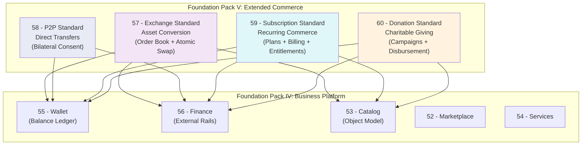

# EXTENDED_COMMERCE_REPORT.md

**Version:** 1.0  
**Status:** ✓ COMPLETE  
**Date:** 2026-07-04  
**Classification:** Foundation Pack V Completion Report

---

## EXECUTIVE SUMMARY

Foundation Pack V — **Extended Commerce** — is complete. Four constitutional standards have been defined, validated, and approved, extending the SO8FI business platform with advanced monetary primitives. These four standards — Exchange, P2P, Subscription, and Donation — complete the commerce layer of the SO8FI platform alongside Foundation Pack IV's Marketplace, Catalog, Services, Wallet, and Finance.

---

## 1. FOUNDATION PACK V OVERVIEW

**Pack Name:** Extended Commerce  
**Pack Number:** V  
**Standards Created:** 4  
**Validation Document:** EXTENDED_COMMERCE_VALIDATION.md  
**Status:** ✓ COMPLETE

### The Extended Commerce Standards

| # | Standard | Core Concept | Status |
|---|----------|-------------|--------|
| 57 | Exchange Standard | Atomic asset conversion with price integrity | ✓ APPROVED |
| 58 | P2P Standard | Declared direct transfer with bilateral consent | ✓ APPROVED |
| 59 | Subscription Standard | Governed recurring value exchange | ✓ APPROVED |
| 60 | Donation Standard | Voluntary verified giving with transparent allocation | ✓ APPROVED |

---

## 2. ARCHITECTURE OVERVIEW

### How Pack V Extends the Business Platform



### Dependency Correctness

All Pack V standards depend only on:
- **Foundation Pack IV:** Wallet, Finance, Catalog (as required)
- **Foundation Pack III:** OS standards (permissions, security, AI, monitoring, country)
- **Foundation Pack II:** System Engines (notification, lookup)
- **Foundation Pack I:** Core Systems (time, identity, journal, protocol)

**Zero circular dependencies. Zero cross-Pack V dependencies.**

---

## 3. STANDARD SUMMARIES

### 57 — Exchange Standard

**Purpose:** Enable governed conversion between any two value types  
**Core Services:** OrderBook, MatchingEngine, SettlementCoordinator, RateQuoter, LiquidityManager  
**Key Law:** "Both legs of every exchange settle simultaneously or neither settles"  
**Unique Contribution:** Atomic settlement with price-time priority, circuit breakers, and wash-trading prevention. No speculative instruments — pure conversion governance.

### 58 — P2P Standard

**Purpose:** Direct value transfer between verified identities  
**Core Services:** TransferInitiator, ConsentValidator, TransferExecutor, LimitInspector, HistoryService  
**Key Law:** "Every transfer must carry a declared purpose; unconsented deductions are forbidden"  
**Unique Contribution:** Three consent models (push/pull/mutual), AML-mandatory execution, irrevocable transfers with authorized reversal path. The platform's direct-transfer primitive.

### 59 — Subscription Standard

**Purpose:** Recurring value exchange with full lifecycle governance  
**Core Services:** PlanCatalog, EnrollmentManager, BillingEngine, EntitlementManager, ChurnService  
**Key Law:** "Subscribers must be able to cancel at any time through a clearly accessible process"  
**Unique Contribution:** Grandfathering law protects existing subscribers; trial honesty prevents silent conversion; immediate entitlement revocation on cancellation. Consumer protection built in.

### 60 — Donation Standard

**Purpose:** Voluntary charitable giving with transparent fund allocation  
**Core Services:** CampaignManager, DonationCollector, AllocationManager, ReportingManager, ComplianceService  
**Key Law:** "If a campaign fails its goal, all donations must be refunded in full"  
**Unique Contribution:** Fund segregation law prevents commingling; beneficiary verification before activation; full charity law compliance per jurisdiction; refund guarantee for failed campaigns.

---

## 4. IMMUTABLE LAWS ESTABLISHED

### Foundation Pack V — 40 Laws Total

**Exchange Standard (10 laws):**
1. Law of Atomic Settlement
2. Law of Price Integrity
3. Law of Pre-Settlement Lock
4. Law of Self-Match Prevention
5. Law of Circuit Breaker
6. Law of Rate Transparency
7. Law of Regulatory Compliance
8. Law of Minimum Liquidity
9. Law of Immutable Order Record
10. Law of Audit Trail

**P2P Standard (10 laws):**
1. Law of Identity Verification
2. Law of Bilateral Record
3. Law of Declared Purpose
4. Law of Consent Enforcement
5. Law of Atomic Execution
6. Law of AML Compliance
7. Law of Limit Enforcement
8. Law of Irrevocability
9. Law of Receipt Issuance
10. Law of Audit Trail

**Subscription Standard (10 laws):**
1. Law of Plan Transparency
2. Law of Trial Honesty
3. Law of Proration Accuracy
4. Law of Enrollment Consent
5. Law of Billing Notification
6. Law of Immediate Entitlement Revocation
7. Law of Cancellation Freedom
8. Law of Grandfathering
9. Law of Dunning Transparency
10. Law of Audit Trail

**Donation Standard (10 laws):**
1. Law of Beneficiary Verification
2. Law of Fund Segregation
3. Law of Declared Goal
4. Law of Refund Guarantee
5. Law of Transparent Fees
6. Law of AML Compliance
7. Law of Disbursement Authorization
8. Law of Donor Receipt
9. Law of Anonymous Donation Limits
10. Law of Audit Trail

---

## 5. INTERFACE CONTRACTS SUMMARY

| Standard | Interfaces | Methods |
|----------|-----------|---------|
| Exchange | 5 | 26 |
| P2P | 5 | 23 |
| Subscription | 5 | 27 |
| Donation | 5 | 26 |
| **TOTAL** | **20** | **102** |

---

## 6. FULL SO8FI CONSTITUTIONAL STACK — CURRENT STATE

### All Five Foundation Packs

```
╔═══════════════════════════════════════════════════════════════╗
║          FOUNDATION PACK V: EXTENDED COMMERCE                  ║
║  57 Exchange · 58 P2P · 59 Subscription · 60 Donation         ║
╠═══════════════════════════════════════════════════════════════╣
║          FOUNDATION PACK IV: BUSINESS PLATFORM                 ║
║  52 Marketplace · 53 Catalog · 54 Services                    ║
║  55 Wallet · 56 Finance                                        ║
╠═══════════════════════════════════════════════════════════════╣
║          FOUNDATION PACK III: OPERATING SYSTEM                 ║
║  42 Runtime · 43 AI · 44 Permissions · 45 Country             ║
║  46 Deployment · 47 Security · 48 SDK                         ║
║  49 Monitoring · 50 Backup · 51 Disaster Recovery             ║
╠═══════════════════════════════════════════════════════════════╣
║          FOUNDATION PACK II: SYSTEM ENGINES                    ║
║  35 Navigation · 36 Numeric · 37 Search · 38 Lookup           ║
║  39 Translation · 40 Notification · 41 Barcode                ║
╠═══════════════════════════════════════════════════════════════╣
║           FOUNDATION PACK I: CORE SYSTEMS                      ║
║  31 Identity · 32 Time · 33 Journal · 34 Protocol Engine      ║
╚═══════════════════════════════════════════════════════════════╝
```

### Cumulative Metrics Across All Five Packs

| Pack | Standards | Laws | Contracts | Governance Councils |
|------|-----------|------|-----------|---------------------|
| Pack I: Core Systems | 4 | 40 | 20 | 4 |
| Pack II: System Engines | 7 | 70 | 35 | 7 |
| Pack III: Operating System | 10 | 100 | 50 | 10 |
| Pack IV: Business Platform | 5 | 50 | 25 | 5 |
| Pack V: Extended Commerce | 4 | 40 | 20 | 4 |
| **TOTAL** | **30** | **300** | **150** | **30** |

### The Business Commerce Layer (Packs IV + V Combined)

Nine business module standards covering every major commerce pattern on the platform:

| Standard | Commerce Pattern |
|----------|-----------------|
| Marketplace | Goods and listing-based commerce |
| Services | Time and expertise commerce |
| Catalog | Universal entity model |
| Wallet | Internal balance management |
| Finance | External payment and settlement |
| Exchange | Asset-to-asset conversion |
| P2P | Direct identity-to-identity transfer |
| Subscription | Recurring plan-based commerce |
| Donation | Voluntary charitable giving |

---

## 7. QUALITY METRICS

| Standard | Laws | Interfaces | Security Rules | Recovery Procedures | Governance |
|----------|------|------------|----------------|---------------------|------------|
| Exchange | 10 | 5 | 10 | 3 | ✓ |
| P2P | 10 | 5 | 10 | 3 | ✓ |
| Subscription | 10 | 5 | 10 | 3 | ✓ |
| Donation | 10 | 5 | 10 | 3 | ✓ |
| **TOTAL** | **40** | **20** | **40** | **12** | **4 councils** |

---

## 8. CONCLUSION

Foundation Pack V — Extended Commerce — is **complete and approved**.

The SO8FI constitutional stack now has:
- **30 constitutional standards** across all five layers
- **300 immutable laws** governing every platform operation
- **150 interface contracts** defining every API boundary
- **30 specialized governance councils**
- **300 forbidden operations**
- **5 principles, 100% aligned across all 30 standards**
- **Zero circular dependencies** across the entire stack

**The SO8FI constitutional stack is now comprehensive.** All major commerce patterns — goods, services, exchange, direct transfer, recurring billing, and charitable giving — are governed by explicit, validated, and approved architectural law.

Implementation may now proceed with complete constitutional clarity for every business module on the platform.

---

**Document ID:** EXTENDED_COMMERCE_REPORT  
**Classification:** Foundation Pack V Completion Report  
**Approved by:** SO8FI Governance Council  
**Effective Date:** 2026-07-04
