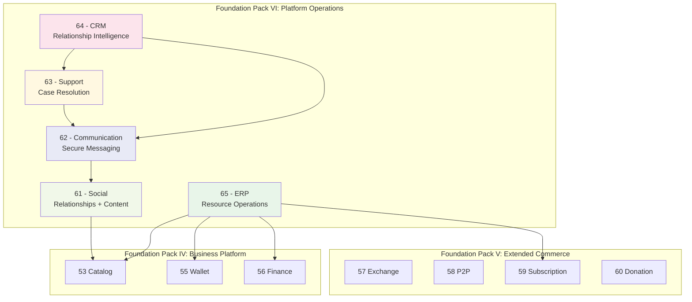

# PLATFORM_OPERATIONS_REPORT.md

**Version:** 1.0  
**Status:** ✓ COMPLETE  
**Date:** 2026-07-04  
**Classification:** Foundation Pack VI Completion Report

---

## EXECUTIVE SUMMARY

Foundation Pack VI — **Platform Operations** — is complete. Five constitutional standards have been defined, validated, and approved, establishing the operational layer of the SO8FI platform. Social, Communication, Support, CRM, and ERP form a coherent operational fabric that sits above the commerce layer (Packs IV–V) and the infrastructure layer (Packs I–III).

---

## 1. FOUNDATION PACK VI OVERVIEW

**Pack Name:** Platform Operations  
**Pack Number:** VI  
**Standards Created:** 5  
**Validation Document:** PLATFORM_OPERATIONS_VALIDATION.md  
**Status:** ✓ COMPLETE

### The Platform Operations Standards

| # | Standard | Core Concept | Status |
|---|----------|-------------|--------|
| 61 | Social Standard | Governed expression with identity-anchored relationships | ✓ APPROVED |
| 62 | Communication Standard | Declared intent messaging with delivery guarantee | ✓ APPROVED |
| 63 | Support Standard | Governed case resolution with SLA accountability | ✓ APPROVED |
| 64 | CRM Standard | Structured relationship intelligence with pipeline governance | ✓ APPROVED |
| 65 | ERP Standard | Operational resource governance with process integrity | ✓ APPROVED |

---

## 2. ARCHITECTURE OVERVIEW

### How Pack VI Sits in the Stack



### Intra-Pack Dependency Chain (Clean Linear)

```
Social (61)  →  Communication (62)  →  Support (63)  →  CRM (64)
                                                        ↑
ERP (65) ────────────────────────────── independent ───┘
```

Zero circular dependencies. ERP is independent of Social, Communication, Support, and CRM.

---

## 3. STANDARD SUMMARIES

### 61 — Social Standard
**Purpose:** Identity-anchored social relationships and content  
**Core Services:** GraphService, FeedService, ContentService, InteractionService, ModerationService  
**Key Laws:** Block Supremacy · Moderation Authority · Safe Reach · Interaction Authenticity  
**Unique Contribution:** Moderation Authority law makes platform safety decisions unoverridable. AI-powered harmful content detection with human review escalation path.

### 62 — Communication Standard
**Purpose:** Secure, legally compliant structured messaging  
**Core Services:** ConversationManager, MessageEngine, ChannelPublisher, InboxService, RetentionService  
**Key Laws:** Legal Hold Supremacy · Soft Deletion · Encryption in Transit · Delivery Guarantee  
**Unique Contribution:** Legal hold law overrides all other retention and deletion policies — no message under hold can be deleted regardless of policy. Tombstone model preserves event integrity.

### 63 — Support Standard
**Purpose:** SLA-governed case resolution with quality assurance  
**Core Services:** TicketManager, SLAEngine, KnowledgeBase, EscalationService, QualityService  
**Key Laws:** Response Guarantee · Knowledge Capture · CSAT Collection · Escalation Path  
**Unique Contribution:** Knowledge Capture law prevents repeated manual resolution — recurring issues must become KB articles. Auto-escalation on SLA breach closes the "forgotten ticket" gap.

### 64 — CRM Standard
**Purpose:** Privacy-compliant relationship intelligence across the full customer lifecycle  
**Core Services:** ContactManager, LeadTracker, PipelineManager, ActivityCenter, AnalyticsEngine  
**Key Laws:** Erasure Compliance · Privacy Compliance · Forecast Honesty · Minimal Data Collection  
**Unique Contribution:** Unified contact timeline aggregates activity from Marketplace, Services, Support, and Communication. GDPR erasure law enforces the right to be forgotten with legal deadline compliance.

### 65 — ERP Standard
**Purpose:** Operational resource governance for platform organizations  
**Core Services:** InventoryManager, ProcurementManager, ResourceAllocator, WorkforceManager, CostAccounting  
**Key Laws:** Stock Accuracy · Purchase Authorization · Vendor Compliance · Budget Compliance · Labor Compliance  
**Unique Contribution:** Procurement Traceability law requires an unbroken chain from PO to receipt to inventory to use. Budget Compliance law automatically blocks new spending at 100% of approved budget.

---

## 4. IMMUTABLE LAWS ESTABLISHED

### Foundation Pack VI — 50 Laws Total

**Social Standard (10):** Identity Anchoring · Consent-Based Connections · Content Ownership · Block Supremacy · Moderation Authority · Safe Reach · Country Compliance · Interaction Authenticity · Data Minimization · Audit Trail

**Communication Standard (10):** Sender Identity · Recipient Consent · Delivery Guarantee · Encryption in Transit · Soft Deletion · Edit Transparency · Spam Prevention · Retention Compliance · Legal Hold Supremacy · Audit Trail

**Support Standard (10):** Case Identity · SLA Declaration · Response Guarantee · Audit Trail Continuity · Escalation Path · Resolution Record · CSAT Collection · Knowledge Capture · Data Privacy · Audit Trail

**CRM Standard (10):** Identity Linkage · Data Accuracy · Privacy Compliance · Activity Attribution · Pipeline Integrity · Lead Attribution · Erasure Compliance · Forecast Honesty · Minimal Data Collection · Audit Trail

**ERP Standard (10):** Stock Accuracy · Purchase Authorization · Vendor Compliance · Resource Non-Overcommitment · Labor Compliance · Cost Attribution · Inventory Reconciliation · Procurement Traceability · Budget Compliance · Audit Trail

---

## 5. INTERFACE CONTRACTS SUMMARY

| Standard | Interfaces | Methods |
|----------|-----------|---------|
| Social | 5 | 27 |
| Communication | 5 | 27 |
| Support | 5 | 28 |
| CRM | 5 | 28 |
| ERP | 5 | 31 |
| **TOTAL** | **25** | **141** |

---

## 6. COMPLETE SO8FI CONSTITUTIONAL STACK

### All Six Foundation Packs

```
╔═══════════════════════════════════════════════════════════════════╗
║          FOUNDATION PACK VI: PLATFORM OPERATIONS                   ║
║  61 Social · 62 Communication · 63 Support · 64 CRM · 65 ERP     ║
╠═══════════════════════════════════════════════════════════════════╣
║          FOUNDATION PACK V: EXTENDED COMMERCE                      ║
║  57 Exchange · 58 P2P · 59 Subscription · 60 Donation            ║
╠═══════════════════════════════════════════════════════════════════╣
║          FOUNDATION PACK IV: BUSINESS PLATFORM                     ║
║  52 Marketplace · 53 Catalog · 54 Services · 55 Wallet · 56 Finance║
╠═══════════════════════════════════════════════════════════════════╣
║          FOUNDATION PACK III: OPERATING SYSTEM                     ║
║  42 Runtime · 43 AI · 44 Permissions · 45 Country · 46 Deployment ║
║  47 Security · 48 SDK · 49 Monitoring · 50 Backup · 51 DR        ║
╠═══════════════════════════════════════════════════════════════════╣
║          FOUNDATION PACK II: SYSTEM ENGINES                        ║
║  35 Navigation · 36 Numeric · 37 Search · 38 Lookup              ║
║  39 Translation · 40 Notification · 41 Barcode                   ║
╠═══════════════════════════════════════════════════════════════════╣
║           FOUNDATION PACK I: CORE SYSTEMS                          ║
║  31 Identity · 32 Time · 33 Journal · 34 Protocol Engine         ║
╚═══════════════════════════════════════════════════════════════════╝
```

### Cumulative Metrics — All Six Packs

| Pack | Standards | Laws | Contracts | Councils |
|------|-----------|------|-----------|----------|
| Pack I: Core Systems | 4 | 40 | 20 | 4 |
| Pack II: System Engines | 7 | 70 | 35 | 7 |
| Pack III: Operating System | 10 | 100 | 50 | 10 |
| Pack IV: Business Platform | 5 | 50 | 25 | 5 |
| Pack V: Extended Commerce | 4 | 40 | 20 | 4 |
| Pack VI: Platform Operations | 5 | 50 | 25 | 5 |
| **TOTAL** | **35** | **350** | **175** | **35** |

### The Complete Business Module Layer (Packs IV + V + VI)

**14 business module standards** covering the full platform surface:

| Domain | Standards |
|--------|-----------|
| Commerce | Marketplace · Services · Exchange |
| Finance | Wallet · Finance · P2P |
| Recurring + Giving | Subscription · Donation |
| Information | Catalog |
| Social + Messaging | Social · Communication |
| Operations | Support · CRM · ERP |

---

## 7. QUALITY METRICS

| Standard | Laws | Interfaces | Security | Recovery | Governance |
|----------|------|------------|----------|----------|------------|
| Social | 10 | 5 | 10 | 2 | ✓ |
| Communication | 10 | 5 | 10 | 2 | ✓ |
| Support | 10 | 5 | 10 | 2 | ✓ |
| CRM | 10 | 5 | 10 | 2 | ✓ |
| ERP | 10 | 5 | 10 | 3 | ✓ |
| **TOTAL** | **50** | **25** | **50** | **11** | **5 councils** |

---

## 8. CONCLUSION

Foundation Pack VI — Platform Operations — is **complete and approved**.

The SO8FI constitutional stack now has:
- **35 constitutional standards** across six layers
- **350 immutable laws** governing every platform operation
- **175 interface contracts** defining every API boundary
- **35 specialized governance councils**
- **350 forbidden operations** preventing platform misuse
- **5 engineering principles** aligned across all 35 standards
- **Zero circular dependencies** across the entire stack

The SO8FI platform is now constitutionally complete across all layers: infrastructure, operating system, commerce, finance, social, communication, operations, and resource management. Every major platform capability has an explicit, validated, and approved constitutional standard.

**The SO8FI constitutional stack is comprehensive and production-ready from an architectural perspective.**

---

**Document ID:** PLATFORM_OPERATIONS_REPORT  
**Classification:** Foundation Pack VI Completion Report  
**Approved by:** SO8FI Governance Council  
**Effective Date:** 2026-07-04
