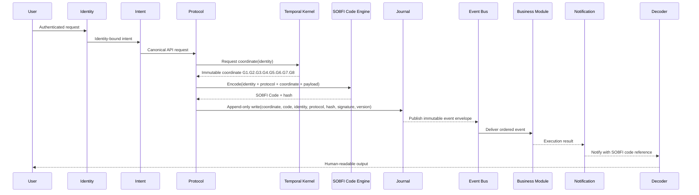

# SAS-TIME-100 v1.0 - Universal Sequence

```mermaid
sequenceDiagram
    participant U as User
    participant I as Identity
    participant N as Intent
    participant P as Protocol
    participant TK as Temporal Kernel
    participant C as SO8FI Code Engine
    participant J as Journal
    participant EB as Event Bus
    participant BM as Business Module
    participant NO as Notification
    participant D as Decoder

    U->>I: Authenticated request
    I->>N: Identity-bound intent
    N->>P: Canonical API request
    P->>TK: Request coordinate(identity)
    TK-->>P: Immutable coordinate G1.G2.G3.G4.G5.G6.G7.G8
    P->>C: Encode(identity + protocol + coordinate + payload)
    C-->>P: SO8FI Code + hash
    P->>J: Append-only write(coordinate, code, identity, protocol, hash, signature, version)
    J-->>EB: Publish immutable event envelope
    EB->>BM: Deliver ordered event
    BM-->>NO: Execution result
    NO-->>D: Notify with SO8FI code reference
    D-->>U: Human-readable output
```
