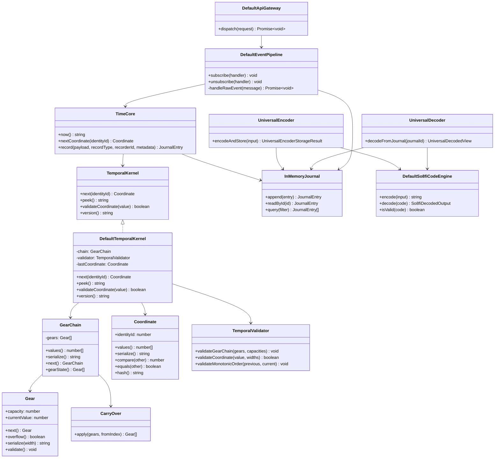

# SAS-TIME-100 v1.0 - UML

```mermaid
classDiagram
    class TemporalKernel {
      +next(identityId) Coordinate
      +peek() string
      +validateCoordinate(value) boolean
      +version() string
    }

    class DefaultTemporalKernel {
      -chain: GearChain
      -validator: TemporalValidator
      -lastCoordinate: Coordinate
      +next(identityId) Coordinate
      +peek() string
      +validateCoordinate(value) boolean
      +version() string
    }

    class Gear {
      +capacity: number
      +currentValue: number
      +next() Gear
      +overflow() boolean
      +serialize(width) string
      +validate() void
    }

    class GearChain {
      -gears: Gear[]
      +values() number[]
      +serialize() string
      +next() GearChain
      +gearState() Gear[]
    }

    class CarryOver {
      +apply(gears, fromIndex) Gear[]
    }

    class Coordinate {
      +identityId: number
      +values() number[]
      +serialize() string
      +compare(other) number
      +equals(other) boolean
      +hash() string
    }

    class TemporalValidator {
      +validateGearChain(gears, capacities) void
      +validateCoordinate(value, widths) boolean
      +validateMonotonicOrder(previous, current) void
    }

    class TimeCore {
      +now() string
      +nextCoordinate(identityId) Coordinate
      +record(payload, recordType, recorderId, metadata) JournalEntry
    }

    class InMemoryJournal {
      +append(entry) JournalEntry
      +readById(id) JournalEntry
      +query(filter) JournalEntry[]
    }

    class DefaultSo8fiCodeEngine {
      +encode(input) string
      +decode(code) So8fiDecodedOutput
      +isValid(code) boolean
    }

    class UniversalEncoder {
      +encodeAndStore(input) UniversalEncoderStorageResult
    }

    class UniversalDecoder {
      +decodeFromJournal(journalId) UniversalDecodedView
    }

    class DefaultApiGateway {
      +dispatch(request) Promise~void~
    }

    class DefaultEventPipeline {
      +subscribe(handler) void
      +unsubscribe(handler) void
      -handleRawEvent(message) Promise~void~
    }

    TemporalKernel <|.. DefaultTemporalKernel
    DefaultTemporalKernel --> GearChain
    GearChain --> Gear
    GearChain --> CarryOver
    DefaultTemporalKernel --> Coordinate
    DefaultTemporalKernel --> TemporalValidator

    TimeCore --> TemporalKernel
    TimeCore --> InMemoryJournal
    UniversalEncoder --> DefaultSo8fiCodeEngine
    UniversalEncoder --> InMemoryJournal
    UniversalDecoder --> DefaultSo8fiCodeEngine
    UniversalDecoder --> InMemoryJournal

    DefaultApiGateway --> DefaultEventPipeline
    DefaultEventPipeline --> TimeCore
    DefaultEventPipeline --> InMemoryJournal
```
